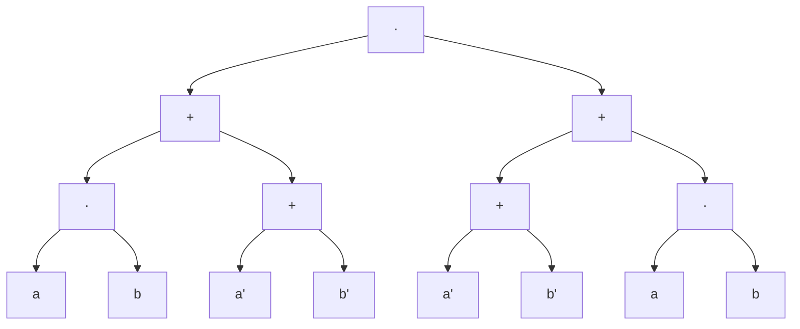
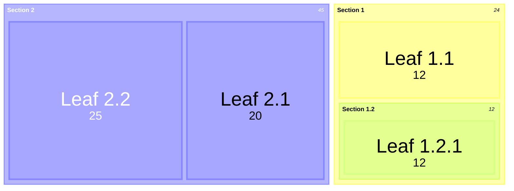

### Booleans $\mathbb{B}$

$\mathbb{B} = \{0, 1\}$

$': \mathbb{B} \to \mathbb{B}$

$0' = 1$

$1' = 0$

$+,\cdot: \mathbb{B} \times \mathbb{B} \to \mathbb{B}$

| $v_0$ | $v_1$ | $v_0 + v_1$ |                                                                          
|:-----:|:-----:|:-----------:|                                                                          
|  $0$  |  $0$  |     $0$     |                                                                            
|  $0$  |  $1$  |     $1$     |                                                                            
|  $1$  |  $0$  |     $1$     |                                                                            
|  $1$  |  $1$  |     $1$     |      

| $v_0$ | $v_1$ | $v_0 \times v_1$ |                                                                          
|:-----:|:-----:|:----------------:|                                                                          
|  $0$  |  $0$  |       $0$        |                                                                            
|  $0$  |  $1$  |       $0$        |                                                                            
|  $1$  |  $0$  |       $0$        |                                                                            
|  $1$  |  $1$  |       $1$        |      

$a \Rightarrow b = a' + b$

$a \otimes b = a \iff b = a \equiv b = a \cdot b + a' \cdot b'$

$a \oplus b = a \cdot b' + a' \cdot b$

$b'' = b$

$b + b = b \cdot b = b$

($a + b)' = a' \cdot b'$

($a \cdot b)' = a' + b'$

### Variables $\mathbb{V}$
$\mathbb{V} = \{v_i : 0 \leq i < n\}$

$v \big|_{v=b} = b : v \in \mathbb{V}, b \in \mathbb{B}$ is a *substitution* of $b$ for $v$.  

### Formulas $\mathbb{F}$

$\mathbb{F} = \begin{cases} 0, 1 \\ v & \text{if } v \in \mathbb{V} \\ f' & \text{if } f \in \mathbb{F} \\ f + g, f\cdot g  & \text{if } f, g \in \mathbb{F} \end{cases}$

### Literals $\mathbb{L} \subset \mathbb{F}$
$\mathbb{L} = \{v_i,v_i' : 0 \leq i < n\}$

$(v, v')$ are a *complementary* pair of literals and 
each is the other's *compliment*.  $v$ is a *positive* literal
and $v'$ is a *negative* literal.

### Matrix $\mathbb{M} \subset \mathbb{F}$

$\mathbb{M} = \begin{cases} v, v' & \text{if } v \in \mathbb{V} \\ \sum\varnothing = 0 \\ \sum(m \cup M) = m + \sum M  & \text{if } m \in \mathbb{M}, M \subset \mathbb{M} \\ \prod\varnothing = 1 \\ \prod(m \cup M) = m \cdot \prod M  & \text{if } m \in \mathbb{M}, M \subset \mathbb{M} \end{cases}$

### Clause $\mathbb{C} \subset \mathbb{M}$ 

$\mathbb{C} = \{\sum L, \prod L : L \subset \mathbb{L} \}$

$\sum L$ is a *disjunctive* clause and $\prod L$ is a *conjunctive* clause.  

### Normal forms $\mathbb{NNF} = \mathbb{M}$ and $\mathbb{DNF},\mathbb{CNF} \subset \mathbb{M}$
$\mathbb{M}$ is also known as *negation normal form* $\mathbb{NNF}$.

$\mathbb{DNF} = \{ \sum_{0 \leq i < p}{\prod L_i} : L_i \subset \mathbb{L}\}$ is the set of *disjunctive normal form* matrices.  

$\mathbb{CNF} = \{ \prod_{0 \leq i < p}{\sum L_i} : L_i \subset \mathbb{L}\}$ is the set of *conjunctive normal form* matrices.  

### Paths $\rho$

$\rho : \mathbb{M} \to 2^{2^\mathbb{L}}$

$
\begin{cases}                                                                                                   
  \rho(\{\{l\}\}) & \text{if } l \in \mathbb{L} \\                                                              
  \rho(\sum\{M_1,\ldots, M_d\}) = \\                                                                            
    \quad \{P_1 \cup\ldots\cup P_d : P_1 \in \rho(M_1),\ldots, P_d \in \rho(M_d))\} \\                            
  \rho(\prod\{M_1,\ldots, M_d\}) = \rho(M_1) \cup \ldots \cup \rho(M_d)                                         
\end{cases}
$

