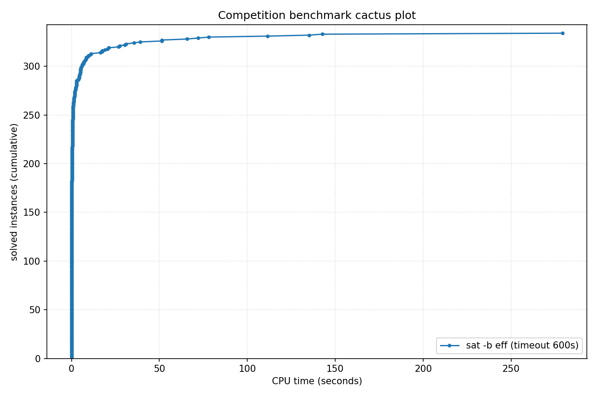

# Competition Benchmark Results (timeout=600s, backend=eff, parallel=1)

## Summary

| Result | Count | % |
|--------|-------|---|
| UNSAT | 334 | 83.5% |
| TIMEOUT | 2 | 0.5% |
| UNKNOWN | 64 | 16.0% |
| **Total** | 400 | 100% |

## Cactus plot

## Per-problem results

| Problem | Result | Time |
|---------|--------|------|
| st_890_86_9_572.normalised | UNSAT | 0.1405s |
| 2.normalised | UNKNOWN | n/a |
| bp4_CSO_AM_IXA_LP.normalised | UNSAT | 0.9372s |
| GP_216_290_40 | UNKNOWN | n/a |
| gm24sparrc | UNSAT | 111.5793s |
| ramsey_3_6_19.normalised | UNSAT | 0.0515s |
| goldcrest-and-11 | UNKNOWN | n/a |
| oisc-subrv-and-nested-15 | UNKNOWN | n/a |
| rook-51-0-0 | UNSAT | 0.4197s |
| clqcl_100_6_5.normalised | UNSAT | 0.1619s |
| pj2013_k9 | UNKNOWN | n/a |
| Break_triple_04_06.xml | UNKNOWN | n/a |
| mp1-klieber2017s-0500-023-t12 | UNSAT | 0.0743s |
| cliquecoloring_n26_k7_c6 | UNSAT | 0.0148s |
| GP_300_140_20 | UNKNOWN | n/a |
| s38417 | UNSAT | 0.1538s |
| b19_1 | UNSAT | 0.4934s |
| sum_of_three_cubes_42_known_representation | UNSAT | 6.7893s |
| sudoku-N30-12 | UNSAT | 2.9967s |
| dislog_a14_x14_n24 | UNSAT | 0.0948s |
| oddball_53_5_tto_zp.normalised | UNSAT | 18.954s |
| par32-2.shuffled-as.sat03-1534 | UNSAT | 0.0103s |
| SCPC-500-12 | UNSAT | 0.0436s |
| pj2016_k100 | UNKNOWN | n/a |
| pj2002_k500 | UNKNOWN | n/a |
| Break_12_50.xml | UNSAT | 0.032s |
| 6s268r_Iter94 | UNSAT | 1.2099s |
| oddball_54_5_tto_zp.normalised | UNSAT | 21.2686s |
| cfi-rigid-s2-0064-04-or_2_shuffle_all | UNSAT | 10.7151s |
| bp4_BC012_CSO_AM_IXA.normalised | UNSAT | 0.8744s |
| clqcl_30_7_6.normalised | UNSAT | 0.0196s |
| oisc-subrv-sll-nested-8 | UNKNOWN | n/a |
| Circuit_multiplier24 | UNSAT | 0.0233s |
| RoundRobin_n16_d14 | UNSAT | 0.0179s |
| 6s299b685_Iter22 | UNSAT | 0.7308s |
| ER_400_20_7.apx_2_DS-ST | UNSAT | 0.1164s |
| aaai10-planning-ipc5-pathways-17-step20 | UNSAT | 0.1987s |
| sqrt-mitern170 | UNSAT | 0.0688s |
| GP_190_225_30 | UNKNOWN | n/a |
| homer11.shuffled | UNSAT | 0.0028s |
| spg_300_300 | UNSAT | 27.4245s |
| oddball_80_5_tto_zp.normalised | UNSAT | 51.3008s |
| BubbleVsPancakeSort_8_4 | UNSAT | 0.2398s |
| arles_thres10_p10_r8185 | UNSAT | 0.0109s |
| linked_list_swap_contents_safety_unwind50 | TIMEOUT | 600s |
| rook-56-0-0 | UNSAT | 0.5205s |
| ramsey_4_4_18.normalised | UNSAT | 0.0062s |
| oddball_52_5_tto_zp.normalised | UNSAT | 17.5319s |
| bp4_BC012_AM_FPBEQ_ZR.normalised | UNSAT | 0.4533s |
| 9.normalised | UNKNOWN | n/a |
| oddball_26_5_ttf.normalised | UNSAT | 0.6947s |
| SC25_Timetable_C_392_E_45_Cl_25_D_7_T_50.normalised | UNSAT | 0.4047s |
| multiplier_16bits__miter_22 | UNSAT | 0.3732s |
| QG7-gensys-icl006.sat05-3132.reshuffled-07 | UNSAT | 0.0175s |
| crusti_g2io_175_0.2_511_32.normalised | UNKNOWN | n/a |
| hhyp_cec_multi_2 | UNSAT | 4.9259s |
| clqcl_50_6_5.normalised | UNSAT | 0.0388s |
| shuffling-1-s1769330284-of-bench-sat04-422.used-as.sat04-561 | UNSAT | 0.0141s |
| crusti_g2io_225_0.1_31_25.normalised | UNSAT | 1.8523s |
| xor_op_n40_d3 | UNSAT | 0.396s |
| x9-10070.sat.sanitized | UNSAT | 0.0076s |
| UR-15-10p0 | UNSAT | 2.4985s |
| arles_thres20_p10_r7340 | UNSAT | 0.0054s |
| SC25_Timetable_C_481_E_49_Cl_32_D_7_T_58.normalised | UNSAT | 0.5224s |
| ITC2021_Late_10.xml | UNSAT | 1.088s |
| reconf10_22_queen20_3_8667 | UNSAT | 0.4699s |
| bp4_AM_IXA_FPBLE.normalised | UNSAT | 0.539s |
| oski15a01b40s_opt | UNKNOWN | n/a |
| at-least-two-ibm-2004-23-k100 | UNSAT | 5.157s |
| cliquecoloring_n32_k5_c4 | UNSAT | 0.0104s |
| oddball_24_5_ttf.normalised | UNSAT | 0.6426s |
| b18 | UNSAT | 0.3216s |
| Kakuro-easy-132-ext.xml.hg_8 | UNSAT | 77.9972s |
| oddball_69_5_tto_zp.normalised | UNSAT | 35.4734s |
| 1-ET-256-K-65.sanitized | UNSAT | 3.9376s |
| oski15a01b45s_opt | UNKNOWN | n/a |
| 170223547 | UNSAT | 0.0055s |
| case11.normalised | UNSAT | 0.0283s |
| blocks-blocks-36-0.150-NOTKNOWN | UNKNOWN | n/a |
| lockchart-group1-L200-K289-p8d4j1.normalised | UNSAT | 7.0066s |
| b20_1 | UNSAT | 0.1658s |
| sqrt-mitern171 | UNSAT | 0.0475s |
| 16_16_booth_wallace_mapped_and_default_origin_bit28 | UNSAT | 0.0349s |
| HCP-446-105 | UNSAT | 0.1699s |
| oski15a01b39s_opt | UNKNOWN | n/a |
| bp4_TCO_CSO_ZR.normalised | UNSAT | 0.7159s |
| MVRoundRobin_n14_d10_v2 | UNSAT | 0.0562s |
| arles_thres20_p10_r7475 | UNSAT | 0.0064s |
| Carry_Bits_Fast_19.cnf | UNSAT | 9.3128s |
| connm-ue-csp-sat-n1200-d-0.02-s405595518.shuffled-as.sat05-531 | UNSAT | 0.0076s |
| 6s299b685_Iter30 | UNSAT | 5.3613s |
| BubbleVsPancakeSort_7_6 | UNSAT | 0.9117s |
| lockchart-group2-rnd0.3-L19-K38-P8D4J1_1.normalised | UNSAT | 0.2149s |
| MVRoundRobin_n16_d10_v3 | UNSAT | 0.1693s |
| nla-digbench-scaling_dijkstra-u_valuebound1_transition | UNSAT | 0.8992s |
| case6.normalised | UNSAT | 0.0091s |
| rook-52-0-1 | UNSAT | 1.347s |
| oski15a01b09s_opt | UNKNOWN | n/a |
| lockchart-group2-rnd0.3-L19-K38-P8D4J1_3 | UNSAT | 0.1465s |
| gm16spctrc | UNSAT | 8.3449s |
| grs-64-48 | UNSAT | 0.2075s |
| gto_p60c238-sc2018 | UNSAT | 0.007s |
| case10 | UNSAT | 0.0134s |
| 16_16_booth_wallace_origin_and_and_dadda_mapped_bit28 | UNSAT | 0.0074s |
| oddball_51_5_tto_zp.normalised | UNSAT | 17.4038s |
| tseitin_d3_n100000 | UNSAT | 0.9025s |
| 1-ET-512-K-120.sanitized | UNKNOWN | n/a |
| tseitin_n188_d3 | UNSAT | 0.0028s |
| GP_100_1000_10 | UNKNOWN | n/a |
| manthey_single-ordered-initialized-w42-b8 | UNSAT | 0.0541s |
| oddball_67_5_tto_zp.normalised | UNSAT | 39.0268s |
| ER_400_20_7.apx_1_DS-ST | UNSAT | 0.1052s |
| mchess_20 | UNSAT | 0.0039s |
| REGRandom-K4-L1-Seed40.sanitized | UNSAT | 2.299s |
| VanDerWaerden_pd_2-3-27_663 | UNSAT | 0.0763s |
| crusti_g2io_175_0.2_511_10.normalised | UNSAT | 135.0574s |
| case8.normalised | UNSAT | 0.0244s |
| fsf-300-354-2-2-3-2.35.opt | UNSAT | 0.0059s |
| arles_thres10_p10_r8188 | UNSAT | 0.0108s |
| b17 | UNSAT | 0.0871s |
| myciel6-cn.used-as.sat04-319 | UNSAT | 0.007s |
| at-least-two-vmpc_28 | UNSAT | 0.2043s |
| lockchart-group2-rnd0.3-L18-K36-P8D4J1 | UNSAT | 0.1163s |
| fsf-300-354-2-2-3-2.9.opt | UNSAT | 0.006s |
| Ptn-7824-b19 | UNSAT | 0.0086s |
| oddball_26_4_ttf.normalised | UNSAT | 0.2301s |
| GP_100_951_33 | UNKNOWN | n/a |
| case1.normalised | UNSAT | 0.2121s |
| xor_op_n38_d3 | UNSAT | 0.3442s |
| arles_thres10_p10_r8142 | UNSAT | 0.0112s |
| bob12s09-opt | UNSAT | 0.0859s |
| b15 | UNSAT | 0.0289s |
| ramsey_3_7_23.normalised | UNSAT | 0.9416s |
| oski15a01b15s_opt | UNKNOWN | n/a |
| baseballcover12with25_and5positions | UNSAT | 9.6089s |
| multiplier_15bits__miter_23 | UNSAT | 0.26s |
| maximum_constrained_partition_14_bits_n200 | UNSAT | 0.1597s |
| RoundRobin_n17_d15 | UNSAT | 0.0234s |
| intel047_Iter78 | UNSAT | 0.6849s |
| hwmcc17miters-xits-iso-6s163.sanitized | UNSAT | 0s |
| mp1-Nb7T46 | UNSAT | 0.2823s |
| grs-32-64 | UNSAT | 0.2024s |
| VanDerWaerden_pd_2-3-22_462 | UNSAT | 0.0337s |
| s38584 | UNSAT | 0.048s |
| oski15a01b06s_opt | UNKNOWN | n/a |
| hcp_CP18_18 | UNSAT | 0.3368s |
| jgiraldezlevy.2200.9086.08.40.149-sr2015 | UNSAT | 0.0055s |
| oisc-subrv-and-nested-12 | UNKNOWN | n/a |
| c7552 | UNSAT | 0.0107s |
| SGI_30_60_20_50_3-dir.shuffled-as.sat03-114 | UNSAT | 0.0364s |
| oski15a01b20s_opt | UNKNOWN | n/a |
| case7.normalised | UNSAT | 0.0057s |
| pj2009_k80 | UNSAT | 6.0852s |
| lockchart-group2-rnd0.3-L19-K38-P8D4J1_2 | UNSAT | 0.1849s |
| 16_16_booth_wallace_origin_and_default_mapped_bit29 | UNSAT | 0.0065s |
| bp4_CSO_IXA_ZR.normalised | UNSAT | 0.7004s |
| Kakuro-easy-112-ext.xml.hg_7 | UNSAT | 51.525s |
| b21 | UNSAT | 0.2326s |
| Break_12_30.xml | UNSAT | 0.0291s |
| 16_16_booth_dadda_mapped_and_and_wallace_mapped_bit28 | UNSAT | 0.0353s |
| hid-uns-enc-6-1-0-0-0-0-14492 | UNSAT | 0.013s |
| 20.normalised | UNKNOWN | n/a |
| 18.normalised | UNKNOWN | n/a |
| em_8_4_5_cmp | UNSAT | 0.0342s |
| test_v7_r12_vr10_c1_s18160.smt2-stp212 | UNSAT | 0.8818s |
| SCPC-500-13 | UNSAT | 0.0722s |
| crusti_g2io_250_0.2_255_18.normalised | UNKNOWN | n/a |
| jkkk-one-one-10-34-sat | UNSAT | 0.0555s |
| velev-pipe-sat-1.0-b7 | UNKNOWN | n/a |
| arles_thres10_p10_r8180 | UNSAT | 0.0112s |
| x9-07092.sat.sanitized | UNSAT | 0.009s |
| BubbleVsPancakeSort_9_4 | UNSAT | 0.4362s |
| crusti_g2io_250_0.2_255_31.normalised | UNKNOWN | n/a |
| Break_04_04.xml | UNKNOWN | n/a |
| RoundRobin_n16_d13 | UNSAT | 0.0156s |
| sted1_0x24204-330 | UNSAT | 0.2324s |
| contest04-lksat-n1100-m7545-k4-l4-s310659001.sat05-524.reshuffled-07 | UNSAT | 0.0049s |
| x9-06068.sat.sanitized | UNSAT | 0.0054s |
| 17.normalised | TIMEOUT | 600s |
| summle_X8638_steps7_I1-2-2-4-4-8-25-100 | UNSAT | 0.1546s |
| bp4_CSO_LP_FPBLE_ZR_YS.normalised | UNSAT | 0.3019s |
| harder-fphp-016-015.sat05-1230.reshuffled-07 | UNSAT | 0.0058s |
| RoundRobin_n18_d15 | UNSAT | 0.026s |
| case13.normalised | UNSAT | 0.0971s |
| stb_664_50.apx_2_DC-ST | UNSAT | 0.0174s |
| crafted_n10_d6_c4_num9 | UNSAT | 6.0953s |
| x-epic_a19-p15_transition | UNSAT | 0.1093s |
| frb80-14-1.used-as.sat04-879 | UNSAT | 0.0209s |
| bp4_LPI_FPBEQ_ZR.normalised | UNSAT | 0.5189s |
| 16.normalised | UNKNOWN | n/a |
| oski15a01b01s_opt | UNKNOWN | n/a |
| SCPC-500-14 | UNSAT | 0.0791s |
| bp4_CB_CSO_LP_FPBEQ_FPBLE.normalised | UNSAT | 0.5125s |
| tseitin_grid_n12_m12 | UNSAT | 0.0035s |
| case19.normalised | UNSAT | 4.5201s |
| SC25_Timetable_C_495_E_43_Cl_35_D_7_T_58.normalised | UNSAT | 0.552s |
| rbsat-v1375c111739gyes10 | UNSAT | 0.0546s |
| RoundRobin_n17_d14 | UNSAT | 0.0222s |
| sum_of_3_cubes_37_bits_87 | UNSAT | 0.6185s |
| oddball_56_5_tto_zp.normalised | UNSAT | 20.4475s |
| Break_triple_12_20.xml | UNSAT | 0.0305s |
| cfi-rigid-t2-0048-04-or_3_shuffle_all | UNSAT | 7.6943s |
| bv_ILA_Piccolo_BEQ_sanity_transition | UNSAT | 0.2545s |
| GP_105_308_40 | UNKNOWN | n/a |
| mp1-Nb7T45 | UNSAT | 0.3076s |
| clqcl_30_11_10.normalised | UNSAT | 0.0538s |
| g2-hwmcc15deep-oski15a10b10s-k20 | UNSAT | 0.7496s |
| RoundRobin_n15_d13 | UNSAT | 0.0138s |
| REGRandom-K3-L3-Seed30.sanitized | UNSAT | 1.924s |
| 1.normalised | UNKNOWN | n/a |
| simon-r20-1.sanitized | UNSAT | 1.6985s |
| ramsey_4_4_19.normalised | UNSAT | 0.0076s |
| valves-gates-1-k617-unsat.shuffled-as.sat03-412 | UNSAT | 5.4862s |
| circuit_48in64out_with_800gates_4in4out_dist128_seed3.sanitized | UNSAT | 0.2184s |
| sted2_0x1e3-216 | UNSAT | 0.1067s |
| ktf_TF-7.tf_3_0.06_113 | UNSAT | 0.1702s |
| clqcl_40_6_5.normalised | UNSAT | 0.028s |
| reconf10_70_queen14_2 | UNSAT | 1.5051s |
| hwmcc17miters-xits-iso-6s299b685.sanitized | UNSAT | 0s |
| 1-ET-512-K-102.sanitized | UNKNOWN | n/a |
| ncc_none_2_18_8_3_1_0_435991723 | UNKNOWN | n/a |
| lockchart-group1-L210-K303-p8d4j1.normalised | UNSAT | 7.3662s |
| arles_thres10_p10_r7466 | UNSAT | 0.0108s |
| GP_300_180_30 | UNKNOWN | n/a |
| simon-r23-0.sanitized | UNSAT | 4.2786s |
| PancakeVsSelectionSort_6_7 | UNSAT | 0.6503s |
| ER_500_20_4.apx_1_DC-AD | UNSAT | 0.1798s |
| PancakeVsSelectionSort_6_8 | UNSAT | 1.11s |
| SC25_Timetable_C_393_E_45_Cl_26_D_7_T_50.normalised | UNSAT | 0.4254s |
| 16_16_booth_dadda_origin_and_and_dadda_origin_bit28 | UNSAT | 0.0081s |
| oddball_20_5_ttf.normalised | UNSAT | 0.4967s |
| SC25_Timetable_C_492_E_48_Cl_33_D_7_T_58.normalised | UNSAT | 0.5588s |
| MVRoundRobin_n20_d10_v2 | UNSAT | 0.217s |
| Wallace_Bits_Fast_8.cnf | UNSAT | 30.2488s |
| ramsey_3_6_18.normalised | UNSAT | 0.0393s |
| SCPC-500-1 | UNSAT | 0.0404s |
| 16_16_booth_wallace_mapped_and_and_wallace_origin_bit28 | UNSAT | 0.0344s |
| bp4_BC012_CSO_FPBEQ_FPBLE_ZR.normalised | UNSAT | 0.4755s |
| DLTM_twitter845_79_19 | UNSAT | 1.7971s |
| b14 | UNSAT | 0.0323s |
| SC25_Timetable_C_496_E_48_Cl_33_D_7_T_50.normalised | UNSAT | 0.487s |
| reconf10_68_queen14_1 | UNSAT | 1.4786s |
| SCPC-500-5 | UNSAT | 0.0723s |
| dubois50.cnf.mis-99.debugged | UNSAT | 0.0535s |
| lockchart-group3-L13-K26-p4d3j1.normalised | UNSAT | 0.0144s |
| crusti_g2io_175_0.2_511_48.normalised | UNSAT | 142.6099s |
| bv_ILA_Piccolo_JALR_sanity_transition | UNSAT | 0.2552s |
| stb_792_333.apx_0 | UNSAT | 0.1625s |
| tseitin_grid_n250_m250 | UNKNOWN | n/a |
| 16_16_booth_dadda_mapped_and_booth_wallace_mapped | UNSAT | 0.1437s |
| bp4_BC012_IXA_LPI_FPBLE.normalised | UNSAT | 0.5927s |
| 16_16_booth_dadda_origin_and_and_dadda_mapped_bit28 | UNSAT | 0.0083s |
| bp4_TCO_CSO_IXA_LP_ZR.normalised | UNSAT | 0.7388s |
| bivium-39-200-0s0-0xdcfb6ab71951500b8e460045bd45afee15c87e08b0072eb174-43 | UNSAT | 0.0076s |
| ramsey_3_7_24.normalised | UNSAT | 1.2316s |
| anbul-dated-5-15-u | UNSAT | 2.2557s |
| brocard_problem_large | UNSAT | 4.7155s |
| 5.normalised | UNKNOWN | n/a |
| uniqinv40prop | UNSAT | 0.0243s |
| frb35-17-5_ext | UNSAT | 0.0217s |
| ncc_none_21015_5_3_3_0_0_11 | UNSAT | 5.0285s |
| HCP-529-420 | UNSAT | 0.2297s |
| EDP3-11000 | UNKNOWN | n/a |
| sqrt-mitern169 | UNSAT | 0.0757s |
| Circuit_multiplier29 | UNSAT | 0.0234s |
| SC25_Timetable_C_495_E_48_Cl_33_D_7_T_50.normalised | UNSAT | 0.5562s |
| simon-r21-1.sanitized | UNSAT | 2.4777s |
| RoundRobin_n18_d16 | UNSAT | 0.0303s |
| arles_thres10_p10_r8186 | UNSAT | 0.0112s |
| oddball_22_5_ttf.normalised | UNKNOWN | n/a |
| pj2008_k200 | UNKNOWN | n/a |
| 58-134003 | UNSAT | 0.4526s |
| mp1-blockpuzzle_9x9_s1_free9 | UNSAT | 0.8286s |
| x9-06099.sat.sanitized | UNSAT | 0.0057s |
| grs-32-128 | UNSAT | 0.6241s |
| gm28sparrc | UNSAT | 279.2261s |
| b22_1 | UNSAT | 0.3507s |
| rbsat-v945c61409g3 | UNSAT | 0.031s |
| 16_16_booth_dadda_origin_and_and_dadda_origin_bit29 | UNSAT | 0.0082s |
| st_815_74_9_2860.normalised | UNSAT | 0.1294s |
| sum_of_three_cubes_906_known_representation | UNSAT | 4.5106s |
| arles_thres10_p20_r4305 | UNSAT | 0.0196s |
| pj2008_k80 | UNKNOWN | n/a |
| WS_500_16_90_70.apx_1_DC-ST | UNSAT | 0.0144s |
| BubbleVsPancakeSort_8_6 | UNSAT | 2.0054s |
| g2-T49.2.0 | UNSAT | 11.2308s |
| AProVE07-21 | UNSAT | 0.0938s |
| 16_16_and_wallace_origin_and_default_mapped_ultra_bit27 | UNSAT | 0.0114s |
| SC25_Timetable_C_498_E_46_Cl_34_D_7_T_50.normalised | UNSAT | 0.4808s |
| div_miter_lec__2 | UNSAT | 0.1321s |
| cliquecolouring_n15_k7_c6.sanitized | UNSAT | 0.0059s |
| SAT_dat.k100-24_1_rule_2 | UNKNOWN | n/a |
| b22 | UNSAT | 0.3253s |
| case20.normalised | UNSAT | 0.0289s |
| mod2c-rand3bip-sat-250-3.shuffled-as.sat05-2535 | UNSAT | 0.002s |
| fixedbandwidth-eq-37_shuffled | UNSAT | 0.001s |
| Kakuro-easy-126-ext.xml.hg_7 | UNSAT | 71.9835s |
| Kakuro-easy-115-ext.xml.hg_5 | UNSAT | 65.7117s |
| lockchart-group3-L15-K29-p4d3j1.normalised | UNSAT | 0.0219s |
| n320p5q2_n.apx_16 | UNSAT | 0.0724s |
| ITC2021_Early_12.xml | UNSAT | 0.9624s |
| 4.normalised | UNKNOWN | n/a |
| xor_op_n36_d3 | UNSAT | 0.313s |
| st_659_37_25_686.normalised | UNSAT | 0.0866s |
| reconf10_73_queen13_2 | UNSAT | 1.562s |
| MVRoundRobin_n16_d10_v2 | UNSAT | 0.0928s |
| goldcrest-and-14 | UNKNOWN | n/a |
| lec_mult_CvW_11x10.sanitized | UNSAT | 0.1791s |
| case17.normalised | UNSAT | 0.008s |
| oddball_13_5_ttf.normalised | UNSAT | 0.2478s |
| bp4_IXA_FPBEQ_ZR.normalised | UNSAT | 0.535s |
| SC25_Timetable_C_481_E_48_Cl_32_D_7_T_58.normalised | UNSAT | 0.5447s |
| ITC2021_Middle_9.xml | UNSAT | 0.5033s |
| bp5_CSO.normalised | UNSAT | 5.1084s |
| cliquecoloring_n14_k7_c6 | UNSAT | 0.0053s |
| case16.normalised | UNSAT | 0.009s |
| oddball_17_5_ttf.normalised | UNSAT | 0.3s |
| RoundRobin_n17_d13 | UNSAT | 0.018s |
| rphp5_050_shuffled | UNSAT | 0.014s |
| em_11_3_4_cmp | UNSAT | 0.1097s |
| VanDerWaerden_pd_2-3-23_505 | UNSAT | 0.0421s |
| 6g_6color_366_050_04 | UNKNOWN | n/a |
| sted2_0x0_n219-342 | UNSAT | 0.1419s |
| at-least-two-traffic_kkb_unknown | UNSAT | 1.355s |
| Break_triple_16_70.xml | UNSAT | 0.0717s |
| 544707209399nc.shuffled-as.sat03-1670 | UNSAT | 0.0101s |
| arles_thres10_p10_r8175 | UNSAT | 0.0108s |
| lockchart-group1-L190-K276-p8d4j1.normalised | UNSAT | 8.0788s |
| 16_2 | UNSAT | 0.7123s |
| bp4_BC012_AM_IXA_LPI.normalised | UNSAT | 0.8349s |
| snw_16_8_preOpt_pre | UNSAT | 1.7834s |
| PancakeVsSelectionSort_6_6 | UNSAT | 0.3306s |
| oski15a01b42s_opt | UNKNOWN | n/a |
| oisc-subrv-and-nested-11 | UNKNOWN | n/a |
| velev-pipe-o-uns-1.1-6 | UNSAT | 0.8976s |
| grs-160-48 | UNSAT | 0.4015s |
| oski15a01b19s_opt | UNKNOWN | n/a |
| 7.normalised | UNKNOWN | n/a |
| bp4_BC012_CSO_IXA_LP.normalised | UNSAT | 0.9156s |
| battleship-13-13-unsat | UNSAT | 0.0027s |
| SC25_Timetable_C_395_E_47_Cl_27_D_7_T_50.normalised | UNSAT | 0.4138s |
| mod4block_3vars_7gates | UNSAT | 0.1215s |
| arles_thres20_p10_r7532 | UNSAT | 0.0065s |
| oski15a01b02s_opt | UNKNOWN | n/a |
| lockchart-group3-L11-K23-p4d3j1.normalised | UNSAT | 0.02s |
| bp4_BC012_CSO_AM_FPBEQ_FPBLE_ZR.normalised | UNSAT | 0.5832s |
| ncc_none_2_17_4_3_0_0_435991723 | UNKNOWN | n/a |
| oddball_57_5_tto_zp.normalised | UNSAT | 26.8757s |
| sudoku-N30-16 | UNSAT | 2.9503s |
| 16_16_booth_dadda_mapped_and_and_wallace_origin_bit28 | UNSAT | 0.033s |
| veer_axi_yosyshq_appnote_123_veer_axi-p06_transition | UNKNOWN | n/a |
| nla-digbench-scaling_dijkstra-u_valuebound1_step | UNKNOWN | n/a |
| rphp5_085_shuffled | UNSAT | 0.0333s |
| fermat-834855329100173267 | UNSAT | 0.1907s |
| 14.normalised | UNKNOWN | n/a |
| 59-129706 | UNSAT | 0.4521s |
| 544707209399nw.shuffled-as.sat03-1671 | UNSAT | 0.0105s |
| crusti_g2io_250_0.2_255_43.normalised | UNKNOWN | n/a |
| rphp_p25_r25 | UNSAT | 0.0299s |
| sudoku-N30-23 | UNSAT | 2.8565s |
| 2013113162201nw.shuffled-as.sat03-1668 | UNSAT | 0.0107s |
| Break_triple_14_48.xml | UNSAT | 0.0498s |
| mp1-klieber2017s-0300-032-t12 | UNSAT | 0.0373s |
| circuit_32in32out_with_64gates_7in7out_dist128_seed2.sanitized | UNSAT | 4.9496s |
| crusti_g2io_250_0.2_255_12.normalised | UNKNOWN | n/a |
| clqcl_30_9_8.normalised | UNSAT | 0.0351s |
| sudoku-N30-15 | UNSAT | 2.5709s |
| 2018D_VexRiscv-regch0-20-p1_step | UNKNOWN | n/a |
| battleship-16-31-sat | UNSAT | 0.0131s |
| ITC2021_Early_9.xml | UNSAT | 0.1188s |
| 11.normalised | UNKNOWN | n/a |
| oddball_19_4_ttf.normalised | UNSAT | 0.2663s |
| Nb54T6 | UNSAT | 31.1186s |
| div-mitern172 | UNSAT | 0.0101s |
| SC25_Timetable_C_406_E_45_Cl_26_D_7_T_50.normalised | UNSAT | 0.3905s |
| lockchart-group2-rnd0.3-L19-K38-P8D4J1_4 | UNSAT | 0.2222s |
| oddball_24_4_ttf.normalised | UNSAT | 0.23s |
| 1-TC-256-K-63.sanitized | UNSAT | 3.8821s |
| DLTM_twitter774_83_17 | UNSAT | 0.8703s |
| simon-r17-1.sanitized | UNSAT | 0.2156s |
| WS_500_16_90_70.apx_1_DS-ST | UNSAT | 0.0131s |
| bp4_TCO_IXA_FPBLE_ZR.normalised | UNSAT | 0.5088s |
| tseitin_grid_n400_m400 | UNKNOWN | n/a |
| oddball_112_5_ttf.normalised | UNKNOWN | n/a |
| TT7F-33-24B | UNSAT | 2.9757s |
| crusti_g2io_200_0.1_127_19.normalised | UNSAT | 16.3559s |
| bp4_BC012_CSO_IXA_LP_FPBLE.normalised | UNSAT | 0.5607s |
| oski15a01b41s_opt | UNKNOWN | n/a |
| crafted_n10_d6_c4_num8 | UNSAT | 5.9576s |
| arles_thres10_p20_r4514 | UNSAT | 0.0187s |
| case9 | UNSAT | 0.0076s |
| SC25_Timetable_C_495_E_50_Cl_33_D_7_T_50.normalised | UNSAT | 0.474s |
| gm16sparrc | UNSAT | 5.2759s |
| sudoku-N30-28 | UNSAT | 2.9937s |
| x-epic_a19-p16_step | UNSAT | 2.8606s |
| bp4_CB_LP_FPBLE.normalised | UNSAT | 0.5103s |
| oddball_29_4_ttf.normalised | UNSAT | 0.3662s |
| grs-256-64 | UNSAT | 0.8078s |
| lockchart-group1-L220-K317-p8d4j1.normalised | UNSAT | 8.444s |
| 16_16_default_mapped_ultra_and_and_dadda_mapped_bit28 | UNSAT | 0.0097s |
