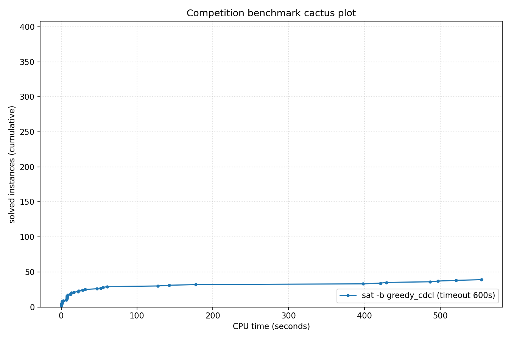

# Competition Benchmark Results (timeout=600s, backend=greedy_cdcl, parallel=5)

## Summary

| Result | Count | % |
|--------|-------|---|
| SAT | 1 | 0.2% |
| UNSAT | 38 | 9.5% |
| TIMEOUT | 361 | 90.2% |
| **Total** | 400 | 100% |

## Cactus plot

## Per-problem results

| Problem | Result | Time |
|---------|--------|------|
| st_890_86_9_572.normalised | TIMEOUT | 600s |
| gm24sparrc | TIMEOUT | 600s |
| bp4_CSO_AM_IXA_LP.normalised | TIMEOUT | 600s |
| GP_216_290_40 | TIMEOUT | 600s |
| 2.normalised | TIMEOUT | 600s |
| ramsey_3_6_19.normalised | TIMEOUT | 600s |
| goldcrest-and-11 | TIMEOUT | 600s |
| rook-51-0-0 | TIMEOUT | 600s |
| oisc-subrv-and-nested-15 | TIMEOUT | 600s |
| clqcl_100_6_5.normalised | TIMEOUT | 600s |
| mp1-klieber2017s-0500-023-t12 | UNSAT | 520.8865s |
| Break_triple_04_06.xml | TIMEOUT | 600s |
| pj2013_k9 | TIMEOUT | 600s |
| cliquecoloring_n26_k7_c6 | TIMEOUT | 600s |
| GP_300_140_20 | TIMEOUT | 600s |
| dislog_a14_x14_n24 | UNSAT | 496.8882s |
| s38417 | TIMEOUT | 600s |
| b19_1 | TIMEOUT | 600s |
| sum_of_three_cubes_42_known_representation | TIMEOUT | 600s |
| sudoku-N30-12 | TIMEOUT | 600s |
| oddball_53_5_tto_zp.normalised | TIMEOUT | 600s |
| par32-2.shuffled-as.sat03-1534 | TIMEOUT | 600s |
| SCPC-500-12 | TIMEOUT | 600s |
| pj2016_k100 | TIMEOUT | 600s |
| pj2002_k500 | TIMEOUT | 600s |
| Break_12_50.xml | TIMEOUT | 600s |
| 6s268r_Iter94 | TIMEOUT | 600s |
| oddball_54_5_tto_zp.normalised | TIMEOUT | 600s |
| cfi-rigid-s2-0064-04-or_2_shuffle_all | TIMEOUT | 600s |
| bp4_BC012_CSO_AM_IXA.normalised | TIMEOUT | 600s |
| RoundRobin_n16_d14 | UNSAT | 55.2678s |
| clqcl_30_7_6.normalised | TIMEOUT | 600s |
| oisc-subrv-sll-nested-8 | TIMEOUT | 600s |
| Circuit_multiplier24 | TIMEOUT | 600s |
| 6s299b685_Iter22 | TIMEOUT | 600s |
| ER_400_20_7.apx_2_DS-ST | TIMEOUT | 600s |
| aaai10-planning-ipc5-pathways-17-step20 | TIMEOUT | 600s |
| sqrt-mitern170 | TIMEOUT | 600s |
| GP_190_225_30 | TIMEOUT | 600s |
| arles_thres10_p10_r8185 | UNSAT | 8.4888s |
| homer11.shuffled | TIMEOUT | 600s |
| spg_300_300 | TIMEOUT | 600s |
| BubbleVsPancakeSort_8_4 | TIMEOUT | 600s |
| oddball_80_5_tto_zp.normalised | TIMEOUT | 600s |
| linked_list_swap_contents_safety_unwind50 | TIMEOUT | 600s |
| rook-56-0-0 | TIMEOUT | 600s |
| ramsey_4_4_18.normalised | TIMEOUT | 600s |
| bp4_BC012_AM_FPBEQ_ZR.normalised | TIMEOUT | 600s |
| oddball_52_5_tto_zp.normalised | TIMEOUT | 600s |
| oddball_26_5_ttf.normalised | TIMEOUT | 600s |
| 9.normalised | TIMEOUT | 600s |
| SC25_Timetable_C_392_E_45_Cl_25_D_7_T_50.normalised | TIMEOUT | 600s |
| multiplier_16bits__miter_22 | TIMEOUT | 600s |
| QG7-gensys-icl006.sat05-3132.reshuffled-07 | TIMEOUT | 600s |
| crusti_g2io_175_0.2_511_32.normalised | TIMEOUT | 600s |
| hhyp_cec_multi_2 | TIMEOUT | 600s |
| clqcl_50_6_5.normalised | TIMEOUT | 600s |
| shuffling-1-s1769330284-of-bench-sat04-422.used-as.sat04-561 | TIMEOUT | 600s |
| arles_thres20_p10_r7340 | UNSAT | 1.4355s |
| crusti_g2io_225_0.1_31_25.normalised | TIMEOUT | 600s |
| xor_op_n40_d3 | TIMEOUT | 600s |
| x9-10070.sat.sanitized | TIMEOUT | 600s |
| UR-15-10p0 | TIMEOUT | 600s |
| SC25_Timetable_C_481_E_49_Cl_32_D_7_T_58.normalised | TIMEOUT | 600s |
| ITC2021_Late_10.xml | TIMEOUT | 600s |
| reconf10_22_queen20_3_8667 | TIMEOUT | 600s |
| bp4_AM_IXA_FPBLE.normalised | TIMEOUT | 600s |
| oski15a01b40s_opt | TIMEOUT | 600s |
| cliquecoloring_n32_k5_c4 | TIMEOUT | 600s |
| at-least-two-ibm-2004-23-k100 | TIMEOUT | 600s |
| oddball_24_5_ttf.normalised | TIMEOUT | 600s |
| b18 | TIMEOUT | 600s |
| Kakuro-easy-132-ext.xml.hg_8 | TIMEOUT | 600s |
| 1-ET-256-K-65.sanitized | TIMEOUT | 600s |
| oddball_69_5_tto_zp.normalised | TIMEOUT | 600s |
| oski15a01b45s_opt | TIMEOUT | 600s |
| 170223547 | TIMEOUT | 600s |
| case11.normalised | TIMEOUT | 600s |
| blocks-blocks-36-0.150-NOTKNOWN | TIMEOUT | 600s |
| lockchart-group1-L200-K289-p8d4j1.normalised | TIMEOUT | 600s |
| b20_1 | TIMEOUT | 600s |
| sqrt-mitern171 | TIMEOUT | 600s |
| 16_16_booth_wallace_mapped_and_default_origin_bit28 | TIMEOUT | 600s |
| arles_thres20_p10_r7475 | UNSAT | 1.3203s |
| MVRoundRobin_n14_d10_v2 | UNSAT | 47.103s |
| HCP-446-105 | TIMEOUT | 600s |
| oski15a01b39s_opt | TIMEOUT | 600s |
| bp4_TCO_CSO_ZR.normalised | TIMEOUT | 600s |
| Carry_Bits_Fast_19.cnf | TIMEOUT | 600s |
| connm-ue-csp-sat-n1200-d-0.02-s405595518.shuffled-as.sat05-531 | TIMEOUT | 600s |
| MVRoundRobin_n16_d10_v3 | UNSAT | 397.8948s |
| 6s299b685_Iter30 | TIMEOUT | 600s |
| BubbleVsPancakeSort_7_6 | TIMEOUT | 600s |
| lockchart-group2-rnd0.3-L19-K38-P8D4J1_1.normalised | TIMEOUT | 600s |
| nla-digbench-scaling_dijkstra-u_valuebound1_transition | TIMEOUT | 600s |
| case6.normalised | TIMEOUT | 600s |
| rook-52-0-1 | TIMEOUT | 600s |
| oski15a01b09s_opt | TIMEOUT | 600s |
| lockchart-group2-rnd0.3-L19-K38-P8D4J1_3 | TIMEOUT | 600s |
| gm16spctrc | TIMEOUT | 600s |
| grs-64-48 | UNSAT | 554.3157s |
| gto_p60c238-sc2018 | TIMEOUT | 600s |
| case10 | TIMEOUT | 600s |
| 16_16_booth_wallace_origin_and_and_dadda_mapped_bit28 | TIMEOUT | 600s |
| oddball_51_5_tto_zp.normalised | TIMEOUT | 600s |
| tseitin_d3_n100000 | TIMEOUT | 600s |
| 1-ET-512-K-120.sanitized | TIMEOUT | 600s |
| tseitin_n188_d3 | TIMEOUT | 600s |
| mchess_20 | UNSAT | 0.0332s |
| GP_100_1000_10 | TIMEOUT | 600s |
| manthey_single-ordered-initialized-w42-b8 | TIMEOUT | 600s |
| oddball_67_5_tto_zp.normalised | TIMEOUT | 600s |
| ER_400_20_7.apx_1_DS-ST | TIMEOUT | 600s |
| REGRandom-K4-L1-Seed40.sanitized | TIMEOUT | 600s |
| arles_thres10_p10_r8188 | UNSAT | 7.7468s |
| VanDerWaerden_pd_2-3-27_663 | TIMEOUT | 600s |
| myciel6-cn.used-as.sat04-319 | UNSAT | 2.9192s |
| crusti_g2io_175_0.2_511_10.normalised | TIMEOUT | 600s |
| case8.normalised | TIMEOUT | 600s |
| fsf-300-354-2-2-3-2.35.opt | TIMEOUT | 600s |
| b17 | TIMEOUT | 600s |
| at-least-two-vmpc_28 | TIMEOUT | 600s |
| lockchart-group2-rnd0.3-L18-K36-P8D4J1 | TIMEOUT | 600s |
| fsf-300-354-2-2-3-2.9.opt | TIMEOUT | 600s |
| Ptn-7824-b19 | TIMEOUT | 600s |
| arles_thres10_p10_r8142 | UNSAT | 7.7356s |
| oddball_26_4_ttf.normalised | TIMEOUT | 600s |
| GP_100_951_33 | TIMEOUT | 600s |
| case1.normalised | TIMEOUT | 600s |
| xor_op_n38_d3 | TIMEOUT | 600s |
| bob12s09-opt | TIMEOUT | 600s |
| b15 | TIMEOUT | 600s |
| ramsey_3_7_23.normalised | TIMEOUT | 600s |
| oski15a01b15s_opt | TIMEOUT | 600s |
| baseballcover12with25_and5positions | TIMEOUT | 600s |
| hwmcc17miters-xits-iso-6s163.sanitized | UNSAT | 0s |
| RoundRobin_n17_d15 | UNSAT | 429.1483s |
| multiplier_15bits__miter_23 | TIMEOUT | 600s |
| maximum_constrained_partition_14_bits_n200 | TIMEOUT | 600s |
| intel047_Iter78 | TIMEOUT | 600s |
| mp1-Nb7T46 | TIMEOUT | 600s |
| grs-32-64 | TIMEOUT | 600s |
| VanDerWaerden_pd_2-3-22_462 | TIMEOUT | 600s |
| s38584 | TIMEOUT | 600s |
| oski15a01b06s_opt | TIMEOUT | 600s |
| hcp_CP18_18 | TIMEOUT | 600s |
| jgiraldezlevy.2200.9086.08.40.149-sr2015 | TIMEOUT | 600s |
| oisc-subrv-and-nested-12 | TIMEOUT | 600s |
| c7552 | TIMEOUT | 600s |
| SGI_30_60_20_50_3-dir.shuffled-as.sat03-114 | TIMEOUT | 600s |
| oski15a01b20s_opt | TIMEOUT | 600s |
| case7.normalised | TIMEOUT | 600s |
| lockchart-group2-rnd0.3-L19-K38-P8D4J1_2 | TIMEOUT | 600s |
| pj2009_k80 | TIMEOUT | 600s |
| 16_16_booth_wallace_origin_and_default_mapped_bit29 | TIMEOUT | 600s |
| bp4_CSO_IXA_ZR.normalised | TIMEOUT | 600s |
| Kakuro-easy-112-ext.xml.hg_7 | TIMEOUT | 600s |
| b21 | TIMEOUT | 600s |
| Break_12_30.xml | TIMEOUT | 600s |
| 16_16_booth_dadda_mapped_and_and_wallace_mapped_bit28 | TIMEOUT | 600s |
| hid-uns-enc-6-1-0-0-0-0-14492 | TIMEOUT | 600s |
| 20.normalised | TIMEOUT | 600s |
| em_8_4_5_cmp | TIMEOUT | 600s |
| 18.normalised | TIMEOUT | 600s |
| test_v7_r12_vr10_c1_s18160.smt2-stp212 | TIMEOUT | 600s |
| arles_thres10_p10_r8180 | UNSAT | 7.8464s |
| jkkk-one-one-10-34-sat | UNSAT | 420.8484s |
| SCPC-500-13 | TIMEOUT | 600s |
| crusti_g2io_250_0.2_255_18.normalised | TIMEOUT | 600s |
| velev-pipe-sat-1.0-b7 | TIMEOUT | 600s |
| RoundRobin_n16_d13 | UNSAT | 12.7628s |
| x9-07092.sat.sanitized | TIMEOUT | 600s |
| BubbleVsPancakeSort_9_4 | TIMEOUT | 600s |
| x9-06068.sat.sanitized | UNSAT | 16.5043s |
| crusti_g2io_250_0.2_255_31.normalised | TIMEOUT | 600s |
| Break_04_04.xml | TIMEOUT | 600s |
| sted1_0x24204-330 | TIMEOUT | 600s |
| contest04-lksat-n1100-m7545-k4-l4-s310659001.sat05-524.reshuffled-07 | TIMEOUT | 600s |
| summle_X8638_steps7_I1-2-2-4-4-8-25-100 | TIMEOUT | 600s |
| 17.normalised | TIMEOUT | 600s |
| case13.normalised | UNSAT | 31.4652s |
| bp4_CSO_LP_FPBLE_ZR_YS.normalised | TIMEOUT | 600s |
| harder-fphp-016-015.sat05-1230.reshuffled-07 | TIMEOUT | 600s |
| RoundRobin_n18_d15 | UNSAT | 486.5767s |
| stb_664_50.apx_2_DC-ST | TIMEOUT | 600s |
| crafted_n10_d6_c4_num9 | TIMEOUT | 600s |
| x-epic_a19-p15_transition | TIMEOUT | 600s |
| frb80-14-1.used-as.sat04-879 | TIMEOUT | 600s |
| bp4_LPI_FPBEQ_ZR.normalised | TIMEOUT | 600s |
| oski15a01b01s_opt | TIMEOUT | 600s |
| 16.normalised | TIMEOUT | 600s |
| SCPC-500-14 | TIMEOUT | 600s |
| bp4_CB_CSO_LP_FPBEQ_FPBLE.normalised | TIMEOUT | 600s |
| tseitin_grid_n12_m12 | TIMEOUT | 600s |
| RoundRobin_n17_d14 | UNSAT | 52.0409s |
| case19.normalised | TIMEOUT | 600s |
| SC25_Timetable_C_495_E_43_Cl_35_D_7_T_58.normalised | TIMEOUT | 600s |
| rbsat-v1375c111739gyes10 | TIMEOUT | 600s |
| sum_of_3_cubes_37_bits_87 | TIMEOUT | 600s |
| oddball_56_5_tto_zp.normalised | TIMEOUT | 600s |
| Break_triple_12_20.xml | TIMEOUT | 600s |
| cfi-rigid-t2-0048-04-or_3_shuffle_all | TIMEOUT | 600s |
| bv_ILA_Piccolo_BEQ_sanity_transition | TIMEOUT | 600s |
| RoundRobin_n15_d13 | UNSAT | 12.0552s |
| GP_105_308_40 | TIMEOUT | 600s |
| mp1-Nb7T45 | TIMEOUT | 600s |
| clqcl_30_11_10.normalised | TIMEOUT | 600s |
| g2-hwmcc15deep-oski15a10b10s-k20 | TIMEOUT | 600s |
| REGRandom-K3-L3-Seed30.sanitized | TIMEOUT | 600s |
| simon-r20-1.sanitized | TIMEOUT | 600s |
| 1.normalised | TIMEOUT | 600s |
| ramsey_4_4_19.normalised | TIMEOUT | 600s |
| valves-gates-1-k617-unsat.shuffled-as.sat03-412 | TIMEOUT | 600s |
| circuit_48in64out_with_800gates_4in4out_dist128_seed3.sanitized | TIMEOUT | 600s |
| hwmcc17miters-xits-iso-6s299b685.sanitized | UNSAT | 0s |
| sted2_0x1e3-216 | TIMEOUT | 600s |
| ktf_TF-7.tf_3_0.06_113 | TIMEOUT | 600s |
| clqcl_40_6_5.normalised | TIMEOUT | 600s |
| arles_thres10_p10_r7466 | UNSAT | 7.176s |
| reconf10_70_queen14_2 | TIMEOUT | 600s |
| 1-ET-512-K-102.sanitized | TIMEOUT | 600s |
| PancakeVsSelectionSort_6_7 | UNSAT | 28.1414s |
| ncc_none_2_18_8_3_1_0_435991723 | TIMEOUT | 600s |
| lockchart-group1-L210-K303-p8d4j1.normalised | TIMEOUT | 600s |
| PancakeVsSelectionSort_6_8 | UNSAT | 177.5634s |
| simon-r23-0.sanitized | TIMEOUT | 600s |
| GP_300_180_30 | TIMEOUT | 600s |
| ER_500_20_4.apx_1_DC-AD | TIMEOUT | 600s |
| SC25_Timetable_C_393_E_45_Cl_26_D_7_T_50.normalised | TIMEOUT | 600s |
| 16_16_booth_dadda_origin_and_and_dadda_origin_bit28 | TIMEOUT | 600s |
| oddball_20_5_ttf.normalised | TIMEOUT | 600s |
| SC25_Timetable_C_492_E_48_Cl_33_D_7_T_58.normalised | TIMEOUT | 600s |
| MVRoundRobin_n20_d10_v2 | TIMEOUT | 600s |
| Wallace_Bits_Fast_8.cnf | TIMEOUT | 600s |
| ramsey_3_6_18.normalised | TIMEOUT | 600s |
| SCPC-500-1 | TIMEOUT | 600s |
| 16_16_booth_wallace_mapped_and_and_wallace_origin_bit28 | TIMEOUT | 600s |
| bp4_BC012_CSO_FPBEQ_FPBLE_ZR.normalised | TIMEOUT | 600s |
| DLTM_twitter845_79_19 | TIMEOUT | 600s |
| b14 | TIMEOUT | 600s |
| SC25_Timetable_C_496_E_48_Cl_33_D_7_T_50.normalised | TIMEOUT | 600s |
| reconf10_68_queen14_1 | TIMEOUT | 600s |
| SCPC-500-5 | TIMEOUT | 600s |
| dubois50.cnf.mis-99.debugged | TIMEOUT | 600s |
| lockchart-group3-L13-K26-p4d3j1.normalised | TIMEOUT | 600s |
| bv_ILA_Piccolo_JALR_sanity_transition | TIMEOUT | 600s |
| crusti_g2io_175_0.2_511_48.normalised | TIMEOUT | 600s |
| stb_792_333.apx_0 | TIMEOUT | 600s |
| tseitin_grid_n250_m250 | TIMEOUT | 600s |
| 16_16_booth_dadda_mapped_and_booth_wallace_mapped | TIMEOUT | 600s |
| bp4_BC012_IXA_LPI_FPBLE.normalised | TIMEOUT | 600s |
| 16_16_booth_dadda_origin_and_and_dadda_mapped_bit28 | TIMEOUT | 600s |
| bp4_TCO_CSO_IXA_LP_ZR.normalised | TIMEOUT | 600s |
| bivium-39-200-0s0-0xdcfb6ab71951500b8e460045bd45afee15c87e08b0072eb174-43 | TIMEOUT | 600s |
| ramsey_3_7_24.normalised | TIMEOUT | 600s |
| anbul-dated-5-15-u | TIMEOUT | 600s |
| brocard_problem_large | TIMEOUT | 600s |
| 5.normalised | TIMEOUT | 600s |
| uniqinv40prop | TIMEOUT | 600s |
| frb35-17-5_ext | TIMEOUT | 600s |
| HCP-529-420 | TIMEOUT | 600s |
| ncc_none_21015_5_3_3_0_0_11 | TIMEOUT | 600s |
| EDP3-11000 | TIMEOUT | 600s |
| sqrt-mitern169 | TIMEOUT | 600s |
| arles_thres10_p10_r8186 | UNSAT | 7.5626s |
| Circuit_multiplier29 | TIMEOUT | 600s |
| SC25_Timetable_C_495_E_48_Cl_33_D_7_T_50.normalised | TIMEOUT | 600s |
| simon-r21-1.sanitized | TIMEOUT | 600s |
| RoundRobin_n18_d16 | TIMEOUT | 600s |
| x9-06099.sat.sanitized | SAT | 60.8296s |
| oddball_22_5_ttf.normalised | TIMEOUT | 600s |
| pj2008_k200 | TIMEOUT | 600s |
| 58-134003 | TIMEOUT | 600s |
| mp1-blockpuzzle_9x9_s1_free9 | TIMEOUT | 600s |
| grs-32-128 | TIMEOUT | 600s |
| gm28sparrc | TIMEOUT | 600s |
| b22_1 | TIMEOUT | 600s |
| arles_thres10_p20_r4305 | UNSAT | 22.1436s |
| rbsat-v945c61409g3 | TIMEOUT | 600s |
| 16_16_booth_dadda_origin_and_and_dadda_origin_bit29 | TIMEOUT | 600s |
| st_815_74_9_2860.normalised | TIMEOUT | 600s |
| sum_of_three_cubes_906_known_representation | TIMEOUT | 600s |
| AProVE07-21 | UNSAT | 1.1184s |
| pj2008_k80 | TIMEOUT | 600s |
| WS_500_16_90_70.apx_1_DC-ST | TIMEOUT | 600s |
| BubbleVsPancakeSort_8_6 | TIMEOUT | 600s |
| g2-T49.2.0 | TIMEOUT | 600s |
| 16_16_and_wallace_origin_and_default_mapped_ultra_bit27 | TIMEOUT | 600s |
| SC25_Timetable_C_498_E_46_Cl_34_D_7_T_50.normalised | TIMEOUT | 600s |
| cliquecolouring_n15_k7_c6.sanitized | TIMEOUT | 600s |
| div_miter_lec__2 | TIMEOUT | 600s |
| SAT_dat.k100-24_1_rule_2 | TIMEOUT | 600s |
| b22 | TIMEOUT | 600s |
| case20.normalised | TIMEOUT | 600s |
| mod2c-rand3bip-sat-250-3.shuffled-as.sat05-2535 | TIMEOUT | 600s |
| fixedbandwidth-eq-37_shuffled | TIMEOUT | 600s |
| Kakuro-easy-126-ext.xml.hg_7 | TIMEOUT | 600s |
| Kakuro-easy-115-ext.xml.hg_5 | TIMEOUT | 600s |
| lockchart-group3-L15-K29-p4d3j1.normalised | TIMEOUT | 600s |
| n320p5q2_n.apx_16 | TIMEOUT | 600s |
| ITC2021_Early_12.xml | TIMEOUT | 600s |
| MVRoundRobin_n16_d10_v2 | UNSAT | 127.4641s |
| 4.normalised | TIMEOUT | 600s |
| xor_op_n36_d3 | TIMEOUT | 600s |
| st_659_37_25_686.normalised | TIMEOUT | 600s |
| reconf10_73_queen13_2 | TIMEOUT | 600s |
| goldcrest-and-14 | TIMEOUT | 600s |
| lec_mult_CvW_11x10.sanitized | TIMEOUT | 600s |
| case17.normalised | TIMEOUT | 600s |
| oddball_13_5_ttf.normalised | TIMEOUT | 600s |
| cliquecoloring_n14_k7_c6 | UNSAT | 0.2424s |
| bp4_IXA_FPBEQ_ZR.normalised | TIMEOUT | 600s |
| SC25_Timetable_C_481_E_48_Cl_32_D_7_T_58.normalised | TIMEOUT | 600s |
| RoundRobin_n17_d13 | UNSAT | 13.9005s |
| ITC2021_Middle_9.xml | TIMEOUT | 600s |
| bp5_CSO.normalised | TIMEOUT | 600s |
| case16.normalised | TIMEOUT | 600s |
| oddball_17_5_ttf.normalised | TIMEOUT | 600s |
| rphp5_050_shuffled | TIMEOUT | 600s |
| em_11_3_4_cmp | TIMEOUT | 600s |
| VanDerWaerden_pd_2-3-23_505 | TIMEOUT | 600s |
| 6g_6color_366_050_04 | TIMEOUT | 600s |
| arles_thres10_p10_r8175 | UNSAT | 7.5166s |
| sted2_0x0_n219-342 | TIMEOUT | 600s |
| at-least-two-traffic_kkb_unknown | TIMEOUT | 600s |
| Break_triple_16_70.xml | TIMEOUT | 600s |
| 544707209399nc.shuffled-as.sat03-1670 | TIMEOUT | 600s |
| PancakeVsSelectionSort_6_6 | UNSAT | 6.5935s |
| lockchart-group1-L190-K276-p8d4j1.normalised | TIMEOUT | 600s |
| 16_2 | TIMEOUT | 600s |
| bp4_BC012_AM_IXA_LPI.normalised | TIMEOUT | 600s |
| snw_16_8_preOpt_pre | TIMEOUT | 600s |
| oski15a01b42s_opt | TIMEOUT | 600s |
| oisc-subrv-and-nested-11 | TIMEOUT | 600s |
| velev-pipe-o-uns-1.1-6 | TIMEOUT | 600s |
| grs-160-48 | TIMEOUT | 600s |
| oski15a01b19s_opt | TIMEOUT | 600s |
| 7.normalised | TIMEOUT | 600s |
| arles_thres20_p10_r7532 | UNSAT | 1.3171s |
| bp4_BC012_CSO_IXA_LP.normalised | TIMEOUT | 600s |
| battleship-13-13-unsat | TIMEOUT | 600s |
| SC25_Timetable_C_395_E_47_Cl_27_D_7_T_50.normalised | TIMEOUT | 600s |
| mod4block_3vars_7gates | TIMEOUT | 600s |
| oski15a01b02s_opt | TIMEOUT | 600s |
| lockchart-group3-L11-K23-p4d3j1.normalised | TIMEOUT | 600s |
| bp4_BC012_CSO_AM_FPBEQ_FPBLE_ZR.normalised | TIMEOUT | 600s |
| ncc_none_2_17_4_3_0_0_435991723 | TIMEOUT | 600s |
| oddball_57_5_tto_zp.normalised | TIMEOUT | 600s |
| sudoku-N30-16 | TIMEOUT | 600s |
| 16_16_booth_dadda_mapped_and_and_wallace_origin_bit28 | TIMEOUT | 600s |
| veer_axi_yosyshq_appnote_123_veer_axi-p06_transition | TIMEOUT | 600s |
| nla-digbench-scaling_dijkstra-u_valuebound1_step | TIMEOUT | 600s |
| rphp5_085_shuffled | TIMEOUT | 600s |
| fermat-834855329100173267 | TIMEOUT | 600s |
| 14.normalised | TIMEOUT | 600s |
| 59-129706 | TIMEOUT | 600s |
| 544707209399nw.shuffled-as.sat03-1671 | TIMEOUT | 600s |
| crusti_g2io_250_0.2_255_43.normalised | TIMEOUT | 600s |
| rphp_p25_r25 | TIMEOUT | 600s |
| mp1-klieber2017s-0300-032-t12 | UNSAT | 142.2655s |
| sudoku-N30-23 | TIMEOUT | 600s |
| 2013113162201nw.shuffled-as.sat03-1668 | TIMEOUT | 600s |
| Break_triple_14_48.xml | TIMEOUT | 600s |
| circuit_32in32out_with_64gates_7in7out_dist128_seed2.sanitized | TIMEOUT | 600s |
| crusti_g2io_250_0.2_255_12.normalised | TIMEOUT | 600s |
| clqcl_30_9_8.normalised | TIMEOUT | 600s |
| sudoku-N30-15 | TIMEOUT | 600s |
| 2018D_VexRiscv-regch0-20-p1_step | TIMEOUT | 600s |
| battleship-16-31-sat | TIMEOUT | 600s |
| ITC2021_Early_9.xml | TIMEOUT | 600s |
| 11.normalised | TIMEOUT | 600s |
| oddball_19_4_ttf.normalised | TIMEOUT | 600s |
| Nb54T6 | TIMEOUT | 600s |
| div-mitern172 | TIMEOUT | 600s |
| SC25_Timetable_C_406_E_45_Cl_26_D_7_T_50.normalised | TIMEOUT | 600s |
| lockchart-group2-rnd0.3-L19-K38-P8D4J1_4 | TIMEOUT | 600s |
| oddball_24_4_ttf.normalised | TIMEOUT | 600s |
| 1-TC-256-K-63.sanitized | TIMEOUT | 600s |
| DLTM_twitter774_83_17 | TIMEOUT | 600s |
| simon-r17-1.sanitized | TIMEOUT | 600s |
| WS_500_16_90_70.apx_1_DS-ST | TIMEOUT | 600s |
| bp4_TCO_IXA_FPBLE_ZR.normalised | TIMEOUT | 600s |
| tseitin_grid_n400_m400 | TIMEOUT | 600s |
| oddball_112_5_ttf.normalised | TIMEOUT | 600s |
| TT7F-33-24B | TIMEOUT | 600s |
| arles_thres10_p20_r4514 | UNSAT | 23.2117s |
| crusti_g2io_200_0.1_127_19.normalised | TIMEOUT | 600s |
| bp4_BC012_CSO_IXA_LP_FPBLE.normalised | TIMEOUT | 600s |
| oski15a01b41s_opt | TIMEOUT | 600s |
| crafted_n10_d6_c4_num8 | TIMEOUT | 600s |
| case9 | TIMEOUT | 600s |
| SC25_Timetable_C_495_E_50_Cl_33_D_7_T_50.normalised | TIMEOUT | 600s |
| gm16sparrc | TIMEOUT | 600s |
| sudoku-N30-28 | TIMEOUT | 600s |
| x-epic_a19-p16_step | TIMEOUT | 600s |
| bp4_CB_LP_FPBLE.normalised | TIMEOUT | 600s |
| oddball_29_4_ttf.normalised | TIMEOUT | 600s |
| grs-256-64 | TIMEOUT | 600s |
| lockchart-group1-L220-K317-p8d4j1.normalised | TIMEOUT | 600s |
| 16_16_default_mapped_ultra_and_and_dadda_mapped_bit28 | TIMEOUT | 600s |
