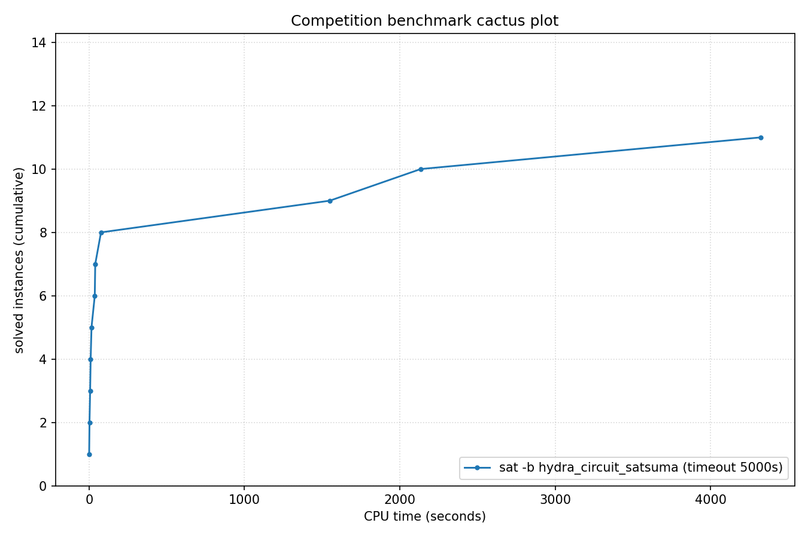

# Competition Benchmark Results (index=circuit14.jsonl, timeout=5000s, backend=hydra_circuit_satsuma, parallel=10)

## Summary

| Result | Count | % |
|--------|-------|---|
| SAT | 1 | 7.1% |
| UNSAT | 10 | 71.4% |
| TIMEOUT | 3 | 21.4% |
| **Total** | 14 | 100% |

### Solver effort (mean (min-max))

| Group | N | Paths covered | Conflicts | Conf/s | Restarts | Rst/s |
|-------|---|---------------|-----------|--------|----------|-------|
| SAT | 1 | — | — | — | — | — |
| UNSAT | 10 | — | — | — | — | — |
| TIMEOUT | 3 | — | — | — | — | — |
| Total | 14 | — | — | — | — | — |

## Cactus plot

## Per-problem results

| Problem | Result | Solve time | UNSAT proof time | Paths | Total | Conf | Rst |
|---------|--------|------------|------------------|-------|-------|------|-----|
| gm24sparrc | UNSAT | 2.902s | 0.3s | — | — | — | — |
| gm20sparrc | UNSAT | 0.7505s | 0.1s | — | — | — | — |
| gm32sparrc | UNSAT | 6.9297s | 0.6s | — | — | — | — |
| gm28sparrc | UNSAT | 10.3713s | 0.7s | — | — | — | — |
| gm36sparrc | UNSAT | 15.7432s | 0.9s | — | — | — | — |
| PRP_40_40 | SAT | 36.8462s | — | — | — | — | — |
| gm16spctrc | UNSAT | 76.8835s | 8.2s | — | — | — | — |
| x-epic_a10-p53_transition | UNSAT | 39.8495s | 171.7s | — | — | — | — |
| gm16spwtrc | UNSAT | 1548.8187s | 547.7s | — | — | — | — |
| gm20spctrc | UNSAT | 2134.7542s | 179.1s | — | — | — | — |
| gm24spctbk | TIMEOUT | 4998.8277s | — | — | — | — | — |
| gm24spctrc | TIMEOUT | 4998.9081s | — | — | — | — | — |
| gm32spctlf | TIMEOUT | 5007.7668s | — | — | — | — | — |
| gm16spwtcl | UNSAT | 4323.8494s | 953.7s | — | — | — | — |
