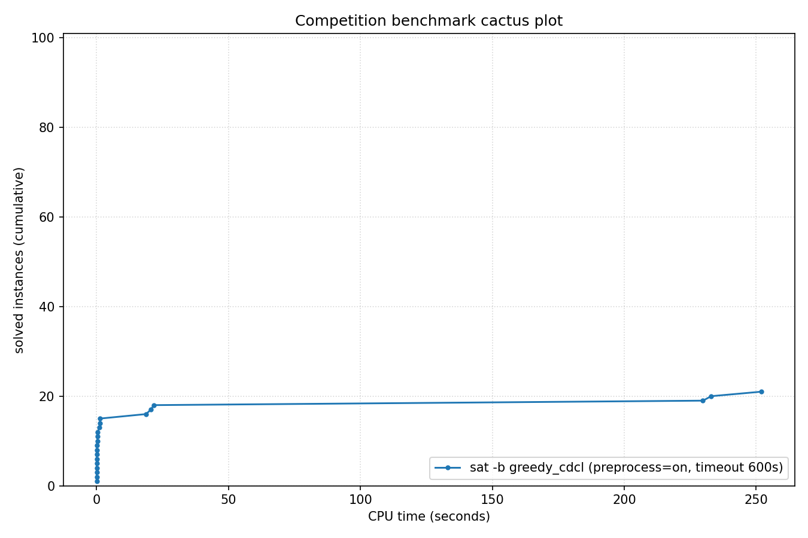

# Competition Benchmark Results (index=evo_fitness.jsonl, timeout=600s, backend=greedy_cdcl, parallel=10, preprocess=on)

## Summary

| Result | Count | % |
|--------|-------|---|
| SAT | 12 | 12.1% |
| UNSAT | 9 | 9.1% |
| TIMEOUT | 78 | 78.8% |
| **Total** | 99 | 100% |

## Cactus plot

## Per-problem results

| Problem | Result | Time |
|---------|--------|------|
| Steiner-9-5-bce | UNSAT | 0.0024s |
| Steiner-15-7-bce | UNSAT | 0.0143s |
| Break_triple_04_06.xml | SAT | 0.0809s |
| Break_04_04.xml | SAT | 0.2859s |
| x9-07092.sat.sanitized | SAT | 1.0795s |
| Steiner-27-10-bce | UNSAT | 18.6988s |
| x9-06099.sat.sanitized | SAT | 251.9526s |
| x9-06068.sat.sanitized | TIMEOUT | 600s |
| 170055892 | TIMEOUT | 600s |
| Steiner-45-16-bce | TIMEOUT | 600s |
| 170059081 | TIMEOUT | 600s |
| combined-crypto1-wff-seed-107-wffvars-500-cryptocplx-31-overlap-2 | TIMEOUT | 600s |
| combined-crypto1-wff-seed-132-wffvars-500-cryptocplx-31-overlap-2 | TIMEOUT | 600s |
| frb35-17-5_ext | TIMEOUT | 600s |
| Steiner-9-5-bce | UNSAT | 0.0023s |
| Break_triple_04_06.xml | SAT | 0.1017s |
| WS_500_16_90_70.apx_1_DC-ST | TIMEOUT | 600s |
| n320p5q2_n.apx_16 | TIMEOUT | 600s |
| 170153306 | TIMEOUT | 600s |
| 170055892 | TIMEOUT | 600s |
| battleship-16-31-sat | TIMEOUT | 600s |
| x9-10070.sat.sanitized | TIMEOUT | 600s |
| SCPC-500-12 | TIMEOUT | 600s |
| 170059081 | TIMEOUT | 600s |
| combined-crypto1-wff-seed-115-wffvars-500-cryptocplx-31-overlap-2 | TIMEOUT | 600s |
| combined-crypto1-wff-seed-132-wffvars-500-cryptocplx-31-overlap-2 | TIMEOUT | 600s |
| Steiner-15-7-bce | UNSAT | 0.017s |
| combined-crypto1-wff-seed-107-wffvars-500-cryptocplx-31-overlap-2 | TIMEOUT | 600s |
| Break_04_04.xml | SAT | 0.3258s |
| x9-07092.sat.sanitized | SAT | 1.2521s |
| 170058440 | TIMEOUT | 600s |
| 170222843 | TIMEOUT | 600s |
| x9-06068.sat.sanitized | TIMEOUT | 600s |
| 170225812 | TIMEOUT | 600s |
| SCPC-500-13 | TIMEOUT | 600s |
| SCPC-500-14 | TIMEOUT | 600s |
| combined-crypto1-wff-seed-3-wffvars-450-cryptocplx-40-overlap-2 | TIMEOUT | 600s |
| stable-300-0.1-20-98765432130020 | TIMEOUT | 600s |
| combined-crypto1-wff-seed-101-wffvars-500-cryptocplx-31-overlap-2 | TIMEOUT | 600s |
| combined-crypto1-wff-seed-102-wffvars-500-cryptocplx-31-overlap-2 | TIMEOUT | 600s |
| SCPC-500-5 | TIMEOUT | 600s |
| Steiner-27-10-bce | UNSAT | 20.5701s |
| x9-06099.sat.sanitized | SAT | 232.9776s |
| frb35-17-5_ext | TIMEOUT | 600s |
| SCPC-500-1 | TIMEOUT | 600s |
| WS_500_16_90_70.apx_1_DC-ST | TIMEOUT | 600s |
| case20.normalised | TIMEOUT | 600s |
| case17.normalised | TIMEOUT | 600s |
| n320p5q2_n.apx_16 | TIMEOUT | 600s |
| Steiner-9-5-bce | UNSAT | 0.002s |
| Break_triple_04_06.xml | SAT | 0.0877s |
| 170153306 | TIMEOUT | 600s |
| combined-crypto1-wff-seed-115-wffvars-500-cryptocplx-31-overlap-2 | TIMEOUT | 600s |
| battleship-16-31-sat | TIMEOUT | 600s |
| Steiner-45-16-bce | TIMEOUT | 600s |
| battleship-24-47-sat | TIMEOUT | 600s |
| Steiner-15-7-bce | UNSAT | 0.016s |
| x9-10070.sat.sanitized | TIMEOUT | 600s |
| 170055892 | TIMEOUT | 600s |
| SCPC-500-12 | TIMEOUT | 600s |
| 170059081 | TIMEOUT | 600s |
| 170223547 | TIMEOUT | 600s |
| combined-crypto1-wff-seed-107-wffvars-500-cryptocplx-31-overlap-2 | TIMEOUT | 600s |
| Break_04_04.xml | SAT | 0.3521s |
| x9-07092.sat.sanitized | SAT | 1.2585s |
| combined-crypto1-wff-seed-132-wffvars-500-cryptocplx-31-overlap-2 | TIMEOUT | 600s |
| 170058440 | TIMEOUT | 600s |
| 170222843 | TIMEOUT | 600s |
| VanDerWaerden_pd_2-3-22_462 | TIMEOUT | 600s |
| gto_p60c241 | TIMEOUT | 600s |
| x9-06068.sat.sanitized | TIMEOUT | 600s |
| SCPC-500-13 | TIMEOUT | 600s |
| combined-crypto1-wff-seed-3-wffvars-450-cryptocplx-40-overlap-2 | TIMEOUT | 600s |
| hid-uns-enc-6-1-0-0-0-0-14492 | TIMEOUT | 600s |
| SCPC-500-14 | TIMEOUT | 600s |
| 170225812 | TIMEOUT | 600s |
| stable-300-0.1-20-98765432130020 | TIMEOUT | 600s |
| Steiner-27-10-bce | UNSAT | 21.6395s |
| x9-06099.sat.sanitized | SAT | 229.834s |
| combined-crypto1-wff-seed-102-wffvars-500-cryptocplx-31-overlap-2 | TIMEOUT | 600s |
| combined-crypto1-wff-seed-101-wffvars-500-cryptocplx-31-overlap-2 | TIMEOUT | 600s |
| hid-uns-enc-6-1-0-0-0-0-27601 | TIMEOUT | 600s |
| hid-uns-enc-6-1-0-0-0-0-3251 | TIMEOUT | 600s |
| SCPC-500-5 | TIMEOUT | 600s |
| SCPC-500-1 | TIMEOUT | 600s |
| frb35-17-5_ext | TIMEOUT | 600s |
| WS_500_16_90_70.apx_1_DC-ST | TIMEOUT | 600s |
| rbsat-v760c43649g8 | TIMEOUT | 600s |
| n320p5q2_n.apx_16 | TIMEOUT | 600s |
| case20.normalised | TIMEOUT | 600s |
| case17.normalised | TIMEOUT | 600s |
| Steiner-45-16-bce | TIMEOUT | 600s |
| 170153306 | TIMEOUT | 600s |
| case16.normalised | TIMEOUT | 600s |
| battleship-16-31-sat | TIMEOUT | 600s |
| combined-crypto1-wff-seed-115-wffvars-500-cryptocplx-31-overlap-2 | TIMEOUT | 600s |
| battleship-24-47-sat | TIMEOUT | 600s |
| contest03-SGI_30_50_30_20_3-dir.sat05-440.reshuffled-07 | TIMEOUT | 600s |
| case9 | TIMEOUT | 600s |
