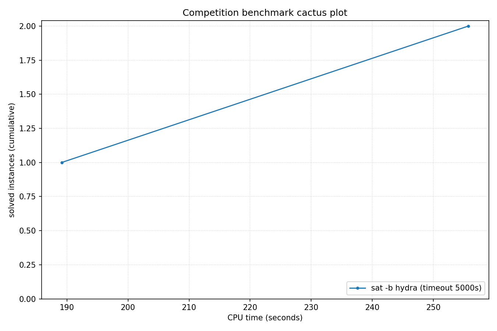

# Competition Benchmark Results (index=hydra_memout2.jsonl, timeout=5000s, backend=hydra, parallel=1)

## Summary

| Result | Count | % |
|--------|-------|---|
| UNSAT | 2 | 100.0% |
| **Total** | 2 | 100% |

### Solver effort (mean (min-max))

| Group | N | Paths covered | Conflicts | Conf/s | Restarts | Rst/s |
|-------|---|---------------|-----------|--------|----------|-------|
| UNSAT | 2 | — | 49.5K (12.3K-86.7K) | 202 (65-339) | 1.5K (45-2.9K) | 6 (0-11) |
| Total | 2 | — | 49.5K (12.3K-86.7K) | 202 (65-339) | 1.5K (45-2.9K) | 6 (0-11) |

## Cactus plot

## Per-problem results

| Problem | Result | Solve time | UNSAT proof time | Paths | Total | Conf | Rst |
|---------|--------|------------|------------------|-------|-------|------|-----|
| nla-digbench-scaling_dijkstra-u_valuebound1_step | UNSAT | 255.7428s | 62.8s | — | — | 86.7K | 2.9K |
| hash_table_find_safety_size_21 | UNSAT | 189.1526s | cake_lpr out of memory (heap cap; not a rejection) | — | — | 12.3K | 45 |
