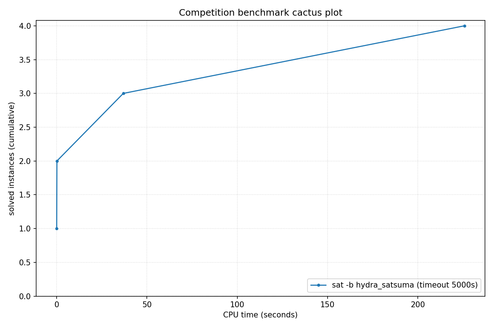

# Competition Benchmark Results (index=main_track_2026_official.jsonl, timeout=5000s, backend=hydra_satsuma, parallel=4)

## Summary

| Result | Count | % |
|--------|-------|---|
| SAT | 3 | 75.0% |
| UNSAT | 1 | 25.0% |
| **Total** | 4 | 100% |

### Solver effort (mean (min-max))

| Group | N | Paths covered | Conflicts | Conf/s | Restarts | Rst/s |
|-------|---|---------------|-----------|--------|----------|-------|
| SAT | 3 | — | — | — | — | — |
| UNSAT | 1 | — | — | — | — | — |
| Total | 4 | — | — | — | — | — |

## Cactus plot

## Per-problem results

| Problem | Result | Solve time | UNSAT proof time | Paths | Total | Conf | Rst |
|---------|--------|------------|------------------|-------|-------|------|-----|
| ezfact64_6.shuffled-as.sat05-453 | SAT | 0.0705s | — | — | — | — | — |
| pyhala-braun-sat-40-4-03.shuffled-as.sat03-1541 | SAT | 0.1986s | — | — | — | — | — |
| pyhala-braun-unsat-40-4-02.shuffled-as.sat05-459 | UNSAT | 36.94s | 74.1s | — | — | — | — |
| toughsat_factoring_895s | SAT | 225.7693s | — | — | — | — | — |
