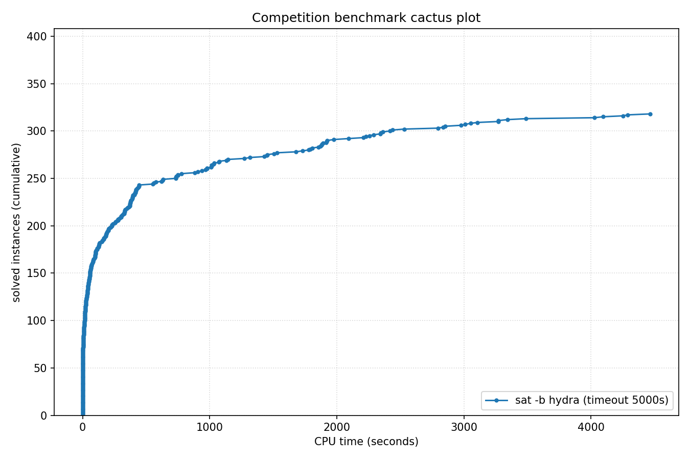

# Competition Benchmark Results (index=main_track_2026_official.jsonl, timeout=5000s, backend=hydra, parallel=10)

## Summary

| Result | Count | % |
|--------|-------|---|
| SAT | 132 | 33.0% |
| UNSAT | 186 | 46.5% |
| TIMEOUT | 82 | 20.5% |
| **Total** | 400 | 100% |

### Solver effort (mean (min-max))

| Group | N | Paths covered | Conflicts | Conf/s | Restarts | Rst/s |
|-------|---|---------------|-----------|--------|----------|-------|
| SAT | 132 | — | 5.2M (0-98.4M) | 9.4K (0-41.6K) | 164.7K (0-3.0M) | 343 (0-2.4K) |
| UNSAT | 186 | — | 6.5M (0-53.3M) | 17.0K (0-90.5K) | 208.3K (0-1.7M) | 582 (0-4.4K) |
| TIMEOUT | 82 | — | 41.5M (84.0K-241.9M) | 8.3K (17-48.4K) | 1.0M (4.9K-4.1M) | 206 (1-820) |
| Total | 400 | — | 14.0M (0-241.9M) | 12.2K (0-90.5K) | 378.9K (0-4.1M) | 409 (0-4.4K) |

## Cactus plot

## Per-problem results

| Problem | Result | Time | Paths | Total | Conf | Rst |
|---------|--------|------|-------|-------|------|-----|
| 14.normalised | SAT | 9.9838s | — | — | 0 | 0 |
| 13.normalised | SAT | 10.8749s | — | — | 0 | 0 |
| 18.normalised | SAT | 16.9615s | — | — | 0 | 0 |
| 20.normalised | SAT | 7.9988s | — | — | 0 | 0 |
| 3.normalised | SAT | 19.4199s | — | — | 0 | 0 |
| 2.normalised | SAT | 26.2162s | — | — | 0 | 0 |
| 1.normalised | SAT | 42.4952s | — | — | 0 | 0 |
| 5.normalised | SAT | 59.4341s | — | — | 0 | 0 |
| 8.normalised | SAT | 98.1574s | — | — | 0 | 0 |
| 11.normalised | SAT | 101.7504s | — | — | 0 | 0 |
| 10.normalised | SAT | 101.9802s | — | — | 0 | 0 |
| SC25_Timetable_C_395_E_47_Cl_27_D_7_T_50.normalised | SAT | 66.4489s | — | — | 444.6K | 16.6K |
| SC25_Timetable_C_393_E_45_Cl_26_D_7_T_50.normalised | SAT | 42.2692s | — | — | 294.2K | 8.5K |
| SC25_Timetable_C_481_E_49_Cl_32_D_7_T_58.normalised | SAT | 26.8472s | — | — | 98.1K | 2.3K |
| 17.normalised | SAT | 149.8971s | — | — | 0 | 0 |
| crusti_g2io_250_0.2_255_12.normalised | SAT | 30.2192s | — | — | 92.5K | 744 |
| SC25_Timetable_C_495_E_50_Cl_33_D_7_T_50.normalised | SAT | 1316.2541s | — | — | 7.3M | 219.8K |
| crusti_g2io_175_0.2_511_10.normalised | SAT | 20.5767s | — | — | 24.7K | 56 |
| crusti_g2io_250_0.2_255_24.normalised | SAT | 32.6049s | — | — | 105.1K | 1.7K |
| SC25_Timetable_C_498_E_46_Cl_34_D_7_T_50.normalised | TIMEOUT | 5000.8167s | — | — | 26.5M | 630.4K |
| SC25_Timetable_C_466_E_39_Cl_31_D_7_T_58.normalised | TIMEOUT | 5000.7657s | — | — | 78.8M | 1.9M |
| SC25_Timetable_C_495_E_43_Cl_35_D_7_T_58.normalised | TIMEOUT | 5001.0285s | — | — | 75.5M | 1.8M |
| SC25_Timetable_C_470_E_39_Cl_32_D_7_T_58.normalised | TIMEOUT | 5000.9103s | — | — | 77.2M | 1.9M |
| crusti_g2io_200_0.1_127_19.normalised | SAT | 28.2845s | — | — | 174.4K | 2.0K |
| SC25_Timetable_C_496_E_46_Cl_33_D_7_T_50.normalised | TIMEOUT | 5000.9738s | — | — | 29.0M | 643.9K |
| crusti_g2io_250_0.2_255_18.normalised | SAT | 18.2913s | — | — | 24.3K | 108 |
| crusti_g2io_175_0.2_511_32.normalised | SAT | 20.592s | — | — | 19.7K | 24 |
| crusti_g2io_250_0.2_255_31.normalised | SAT | 49.0688s | — | — | 247.7K | 5.6K |
| crusti_g2io_225_0.1_31_25.normalised | SAT | 46.1025s | — | — | 669.2K | 17.1K |
| SC25_Timetable_C_475_E_39_Cl_33_D_7_T_58.normalised | TIMEOUT | 5000.8656s | — | — | 80.5M | 1.9M |
| SC25_Timetable_C_496_E_48_Cl_33_D_7_T_50.normalised | TIMEOUT | 5000.856s | — | — | 26.7M | 637.6K |
| SC25_Timetable_C_495_E_48_Cl_33_D_7_T_50.normalised | TIMEOUT | 5000.8564s | — | — | 24.3M | 647.0K |
| st_1391_70_12_1674.normalised | TIMEOUT | 5000.0482s | — | — | 59.7M | 194.0K |
| st_826_34_8_3910.normalised | TIMEOUT | 5000.0193s | — | — | 62.5M | 1.2M |
| lockchart-group3-L15-K29-p4d3j1.normalised | UNSAT | 2255.4249s | — | — | 24.2M | 785.9K |
| lockchart-group3-L13-K26-p4d3j1.normalised | UNSAT | 3269.9908s | — | — | 30.3M | 976.2K |
| lockchart-group3-L11-K23-p4d3j1.normalised | UNSAT | 2343.0652s | — | — | 23.9M | 749.0K |
| lockchart-group3-L12-K24-p4d3j1.normalised | UNSAT | 4024.6541s | — | — | 35.0M | 1.1M |
| st_890_86_9_572.normalised | TIMEOUT | 5000.0464s | — | — | 64.7M | 521.1K |
| b20 | UNSAT | 5.9697s | — | — | 232.8K | 7.9K |
| b20_1 | UNSAT | 3.6221s | — | — | 142.3K | 4.5K |
| b15 | UNSAT | 1.4582s | — | — | 42.5K | 1.8K |
| s15850 | UNSAT | 0.2465s | — | — | 11.0K | 910 |
| b22_1 | UNSAT | 6.5883s | — | — | 211.5K | 7.3K |
| c7552 | UNSAT | 0.1997s | — | — | 14.7K | 752 |
| st_1352_53_23_3737.normalised | TIMEOUT | 5000.0346s | — | — | 57.9M | 278.1K |
| b21 | UNSAT | 5.7675s | — | — | 204.1K | 7.1K |
| s38417 | UNSAT | 0.5228s | — | — | 14.5K | 868 |
| c3540 | UNSAT | 0.5853s | — | — | 40.7K | 1.7K |
| c5315 | UNSAT | 0.1498s | — | — | 11.3K | 662 |
| lockchart-group1-L240-K345-p8d4j1.normalised | TIMEOUT | 5000.4698s | — | — | 3.1M | 21.7K |
| lockchart-group2-rnd0.3-L19-K38-P8D4J1_1.normalised | TIMEOUT | 5000.0312s | — | — | 16.5M | 399.6K |
| lockchart-group1-L220-K317-p8d4j1.normalised | TIMEOUT | 5000.6336s | — | — | 3.8M | 21.0K |
| lockchart-group1-L190-K276-p8d4j1.normalised | TIMEOUT | 5001.0206s | — | — | 4.5M | 24.7K |
| oski15a01b02s_opt | UNSAT | 304.8444s | — | — | 2.4M | 36.1K |
| oski15a01b74s_opt | UNSAT | 415.2863s | — | — | 3.1M | 46.0K |
| oski15a01b64s_opt | UNSAT | 375.1422s | — | — | 2.2M | 32.4K |
| oski15a01b03s_opt | UNSAT | 431.3738s | — | — | 3.6M | 62.1K |
| b19 | UNSAT | 738.4568s | — | — | 10.3M | 360.8K |
| b19_1 | UNSAT | 750.3576s | — | — | 9.3M | 347.4K |
| oski15a01b15s_opt | UNSAT | 330.769s | — | — | 2.3M | 28.8K |
| oski15a01b62s_opt | UNSAT | 393.4968s | — | — | 2.3M | 32.5K |
| oski15a01b19s_opt | UNSAT | 397.3711s | — | — | 2.7M | 33.2K |
| oski15a01b77s_opt | UNSAT | 386.4932s | — | — | 2.3M | 36.8K |
| gm24sparrc | UNSAT | 6.3856s | — | — | 1.2K | 72 |
| oski15a01b60s_opt | UNSAT | 370.6519s | — | — | 2.1M | 32.4K |
| oski15a01b40s_opt | UNSAT | 377.2621s | — | — | 2.5M | 31.0K |
| oski15a01b52s_opt | UNSAT | 357.5596s | — | — | 2.2M | 37.6K |
| oski15a01b09s_opt | UNSAT | 427.9877s | — | — | 2.4M | 35.3K |
| gm28sparrc | UNSAT | 1.5288s | — | — | 140 | 24 |
| gm32sparrc | UNSAT | 25.9952s | — | — | 1.2K | 27 |
| gm36sparrc | UNSAT | 4.2027s | — | — | 632 | 53 |
| gm16spctrc | UNSAT | 230.3091s | — | — | 653.4K | 17.8K |
| gm20sparrc | UNSAT | 8.5165s | — | — | 2.2K | 29 |
| lockchart-group1-L255-K366-p8d4j1.normalised | TIMEOUT | 5000.5926s | — | — | 3.2M | 15.4K |
| lockchart-group3-L14-K27-p4d3j1.normalised | UNSAT | 3051.3569s | — | — | 30.4M | 1.0M |
| case10 | SAT | 81.9371s | — | — | 2.2M | 73.5K |
| case12.normalised | UNSAT | 13.4642s | — | — | 530.2K | 13.8K |
| lockchart-group2-rnd0.3-L19-K38-P8D4J1_3 | TIMEOUT | 5000.0354s | — | — | 17.2M | 371.2K |
| case18.normalised | UNSAT | 440.1797s | — | — | 2.3M | 105.5K |
| lockchart-group2-rnd0.3-L19-K38-P8D4J1_2 | TIMEOUT | 5000.0306s | — | — | 17.1M | 348.0K |
| case7.normalised | SAT | 101.1721s | — | — | 2.6M | 84.9K |
| case3 | UNSAT | 937.0105s | — | — | 9.0M | 303.5K |
| case1.normalised | SAT | 1031.0929s | — | — | 9.7M | 296.0K |
| case2 | SAT | 39.0622s | — | — | 946.1K | 49.4K |
| case9 | SAT | 51.5563s | — | — | 1.5M | 53.7K |
| case19.normalised | SAT | 6.8465s | — | — | 277 | 21 |
| MVRoundRobin_n12_d10_v3 | UNSAT | 0.0228s | — | — | — | — |
| MVRoundRobin_n16_d10_v2 | UNSAT | 0.0426s | — | — | — | — |
| MVRoundRobin_n12_d10_v2 | UNSAT | 0.0125s | — | — | — | — |
| RoundRobin_n17_d13 | UNSAT | 0.0027s | — | — | — | — |
| RoundRobin_n15_d13 | UNSAT | 0.0019s | — | — | — | — |
| RoundRobin_n18_d16 | UNSAT | 0.0038s | — | — | — | — |
| RoundRobin_n16_d14 | UNSAT | 0.0023s | — | — | — | — |
| RoundRobin_n16_d13 | UNSAT | 0.0024s | — | — | — | — |
| RoundRobin_n18_d15 | UNSAT | 0.0036s | — | — | — | — |
| MVRoundRobin_n20_d10_v2 | UNSAT | 0.1161s | — | — | — | — |
| MVRoundRobin_n12_d10_v4 | UNSAT | 0.0371s | — | — | — | — |
| MVRoundRobin_n20_d10_v3 | UNSAT | 0.2025s | — | — | — | — |
| clqcl_30_7_6.normalised | UNSAT | 0.0056s | — | — | — | — |
| clqcl_30_8_7.normalised | UNSAT | 0.0086s | — | — | — | — |
| clqcl_30_11_10.normalised | UNSAT | 0.0224s | — | — | — | — |
| clqcl_25_9_8.normalised | UNSAT | 0.009s | — | — | — | — |
| clqcl_70_6_5.normalised | UNSAT | 0.0163s | — | — | — | — |
| clqcl_25_7_6.normalised | UNSAT | 0.0135s | — | — | — | — |
| clqcl_30_9_8.normalised | UNSAT | 0.0124s | — | — | — | — |
| clqcl_60_6_5.normalised | UNSAT | 0.012s | — | — | — | — |
| case11.normalised | SAT | 325.9086s | — | — | 7.8M | 191.6K |
| case6.normalised | SAT | 3342.9143s | — | — | 24.9M | 798.2K |
| clqcl_45_6_5.normalised | UNSAT | 0.0076s | — | — | — | — |
| clqcl_30_10_9.normalised | UNSAT | 0.0169s | — | — | — | — |
| gm16spwtcl | TIMEOUT | 5000.9955s | — | — | 756.3K | 14.5K |
| gm24spctbk | TIMEOUT | 5000.7243s | — | — | 568.3K | 17.2K |
| gm32spctlf | TIMEOUT | 5001.8917s | — | — | 84.0K | 6.1K |
| gm16spwtrc | TIMEOUT | 5000.4866s | — | — | 1.6M | 57.9K |
| gm24spctrc | TIMEOUT | 5001.0567s | — | — | 384.0K | 23.6K |
| gm20spctrc | TIMEOUT | 5000.4882s | — | — | 797.8K | 22.9K |
| 16_16_default_mapped_ultra_and_and_dadda_mapped_bit28 | UNSAT | 1133.2355s | — | — | 11.2M | 402.7K |
| 16_16_booth_wallace_mapped_and_default_origin_bit28 | UNSAT | 1504.6291s | — | — | 12.9M | 469.4K |
| 16_16_default_mapped_ultra_and_and_dadda_origin_bit28 | UNSAT | 1034.199s | — | — | 11.1M | 402.2K |
| 16_16_booth_dadda_mapped_and_and_wallace_origin_bit28 | UNSAT | 1917.3327s | — | — | 16.1M | 571.5K |
| case4 | TIMEOUT | 5000.0487s | — | — | 111.5M | 3.1M |
| 16_16_booth_dadda_origin_and_default_mapped_ultra_bit29 | UNSAT | 420.2438s | — | — | 6.5M | 231.6K |
| nla-digbench-scaling_dijkstra-u_valuebound1_transition | UNSAT | 1.3935s | — | — | 1 | 0 |
| cal182_cal182_transition | UNSAT | 3.9529s | — | — | 1 | 0 |
| bv_ILA_Piccolo_JALR_sanity_transition | UNSAT | 3.2935s | — | — | 5.7K | 95 |
| bv_ILA_Piccolo_BEQ_sanity_transition | UNSAT | 3.5672s | — | — | 5.7K | 84 |
| nla-digbench-scaling_freire1_valuebound1_transition | UNSAT | 2.069s | — | — | 1 | 0 |
| x-epic_a19-p16_step | UNSAT | 66.4475s | — | — | 86.4K | 3.1K |
| 2018D_VexRiscv-regch0-20-p1_step | UNSAT | 37.6619s | — | — | 587.3K | 24.8K |
| veer_axi_yosyshq_appnote_123_veer_axi-p06_transition | UNSAT | 3.0612s | — | — | 3 | 0 |
| bv_rocket_1951_transition | UNSAT | 3.2908s | — | — | 1 | 0 |
| x-epic_a19-p15_transition | UNSAT | 1.2173s | — | — | 0 | 0 |
| x-epic_a10-p53_transition | UNSAT | 1.9143s | — | — | 1 | 0 |
| 16_16_booth_dadda_origin_and_and_dadda_origin_bit29 | UNSAT | 733.4678s | — | — | 8.6M | 303.7K |
| 16_16_booth_wallace_origin_and_and_dadda_mapped_bit28 | UNSAT | 1924.9714s | — | — | 15.3M | 539.1K |
| arles_thres10_p20_r4514 | UNSAT | 0.0054s | — | — | — | — |
| 16_16_booth_dadda_origin_and_and_dadda_origin_bit28 | UNSAT | 2359.8356s | — | — | 19.1M | 640.1K |
| arles_thres20_p10_r7508 | UNSAT | 0.0086s | — | — | 0 | 0 |
| arles_thres10_p10_r8180 | UNSAT | 0.0027s | — | — | — | — |
| nla-digbench-scaling_dijkstra-u_valuebound1_step | UNSAT | 349.2143s (proof unchecked: cake_lpr out of memory (heap cap; not a rejection)) | — | — | 86.7K | 2.9K |
| arles_thres20_p10_r7475 | UNSAT | 0.0082s | — | — | 0 | 0 |
| arles_thres10_p10_r8188 | UNSAT | 0.0028s | — | — | — | — |
| arles_thres20_p20_r4109 | UNSAT | 0.0116s | — | — | 0 | 0 |
| arles_thres10_p10_r8186 | UNSAT | 0.0029s | — | — | — | — |
| arles_thres20_p30_r2554 | UNSAT | 0.0027s | — | — | — | — |
| arles_thres10_p10_r8185 | UNSAT | 0.0026s | — | — | — | — |
| arles_thres10_p10_r8062 | UNSAT | 0.0027s | — | — | — | — |
| arles_thres20_p10_r7533 | UNSAT | 0.0078s | — | — | 0 | 0 |
| arles_thres10_p10_r8184 | UNSAT | 0.0025s | — | — | — | — |
| 16_16_booth_dadda_mapped_and_booth_wallace_mapped | UNSAT | 2208.3105s | — | — | 19.1M | 690.6K |
| bp4_BC012_IXA_LPI_FPBLE.normalised | UNSAT | 34.4928s | — | — | 319.9K | 7.2K |
| bp4_BC012_AM_IXA_LPI.normalised | UNSAT | 61.2098s | — | — | 478.8K | 13.7K |
| bp4_CSO_AM_IXA_LP.normalised | UNSAT | 53.9531s | — | — | 293.4K | 7.8K |
| bp4_CB_LP_FPBLE.normalised | UNSAT | 332.4738s | — | — | 2.2M | 65.0K |
| bp4_BC012_TCO_CSO_LP_FPBEQ_ZR.normalised | SAT | 415.6494s | — | — | 1.9M | 77.0K |
| bp4_BC012_AM_FPBEQ_ZR.normalised | SAT | 779.4049s | — | — | 3.3M | 125.3K |
| bp4_BC012_TCO_AM_IXA.normalised | UNSAT | 158.1592s | — | — | 908.3K | 32.1K |
| 16_16_booth_dadda_mapped_and_and_wallace_mapped_bit28 | UNSAT | 1780.8452s | — | — | 14.8M | 541.8K |
| bp4_CB_CSO_LP_FPBEQ_FPBLE.normalised | UNSAT | 134.9919s | — | — | 1.3M | 36.3K |
| ramsey_3_6_19.normalised | TIMEOUT | 5000.031s | — | — | 21.2M | 633.4K |
| 16_16_and_wallace_origin_and_default_mapped_ultra_bit27 | UNSAT | 2229.4455s | — | — | 18.7M | 722.7K |
| ramsey_4_4_18.normalised | TIMEOUT | 5000.0273s | — | — | 36.0M | 752.0K |
| oddball_43_5_tto_zp.normalised | SAT | 10.7668s | — | — | 8.5K | 139 |
| bp4_TCO_AM_IXA_FPBLE.normalised | UNSAT | 54.2111s | — | — | 437.2K | 14.9K |
| bp5_CSO.normalised | SAT | 1145.5578s | — | — | 1.6M | 40.5K |
| bp4_BC012_AM_IXA_FPBLE.normalised | UNSAT | 59.325s | — | — | 436.9K | 15.3K |
| oddball_24_4_ttf.normalised | UNSAT | 310.6389s | — | — | 11.8M | 402.3K |
| bp5.normalised | SAT | 2290.3802s | — | — | 2.6M | 59.6K |
| oddball_13_5_ttf.normalised | UNSAT | 23.5402s | — | — | 1.3M | 49.6K |
| oddball_20_5_ttf.normalised | UNSAT | 1.6766s | — | — | 69.2K | 2.5K |
| oddball_44_5_tto_zp.normalised | SAT | 173.8286s | — | — | 740.5K | 11.4K |
| oddball_20_4_ttf.normalised | UNSAT | 1.8047s | — | — | 110.8K | 3.3K |
| oddball_70_5_tto_zp.normalised | SAT | 1016.2298s | — | — | 3.2M | 128.3K |
| oddball_47_5_tto_zp.normalised | SAT | 181.5864s | — | — | 854.4K | 15.5K |
| oddball_56_5_tto_zp.normalised | SAT | 443.5628s | — | — | 2.0M | 71.6K |
| bp4_BC012_TCO_AM_FPBEQ_ZR.normalised | SAT | 2346.4635s | — | — | 10.7M | 365.2K |
| oddball_51_5_tto_zp.normalised | SAT | 320.4773s | — | — | 1.4M | 35.5K |
| bp4_TCO_CB_LP.normalised | UNSAT | 2094.0751s | — | — | 18.6M | 608.5K |
| oddball_54_5_tto_zp.normalised | SAT | 882.1192s | — | — | 2.7M | 73.2K |
| 16_16_booth_dadda_mapped_and_booth_wallace_origin | TIMEOUT | 5000.0224s | — | — | 28.9M | 1.1M |
| qpr-bmp280-driver-5 | SAT | 0.6374s | — | — | 1.2K | 121 |
| oddball_79_5_tto_zp.normalised | SAT | 2794.541s | — | — | 7.8M | 233.9K |
| bp4_CB_FPBEQ_FPBLE.normalised | UNSAT | 4287.2464s | — | — | 43.0M | 1.2M |
| bp4_TCO_CSO_ZR.normalised | SAT | 4464.2884s | — | — | 21.2M | 646.1K |
| clqcl_40_6_5.normalised | UNSAT | 0.0058s | — | — | — | — |
| gensys-ukn006.shuffled-as.sat05-3846 | UNSAT | 301.6281s | — | — | 4.8M | 141.6K |
| oddball_26_4_ttf.normalised | UNSAT | 1882.8044s | — | — | 51.6M | 1.7M |
| bench_5078.smt2 | SAT | 18.0147s | — | — | 282.7K | 15.3K |
| hid-uns-enc-6-1-0-0-0-0-26462 | UNSAT | 202.6566s | — | — | 3.8M | 126.0K |
| x2_72.shuffled-as.sat03-1604 | UNSAT | 0.0027s | — | — | — | — |
| oddball_29_4_ttf.normalised | UNSAT | 1881.062s | — | — | 50.5M | 1.6M |
| ssp-0.46172681388173037 | SAT | 1530.1999s | — | — | 6.0M | 331.2K |
| E02F20 | SAT | 40.2738s | — | — | 523.6K | 18.1K |
| squ_ali_s10x10_c39_abix_SAT-sc2017 | SAT | 13.0386s | — | — | 542.9K | 29.2K |
| SCPC-900-27 | SAT | 10.866s | — | — | 308.2K | 2.1K |
| oddball_33_4_ttf.normalised | TIMEOUT | 5000.0644s | — | — | 118.6M | 3.8M |
| oddball_28_4_ttf.normalised | TIMEOUT | 5000.0799s | — | — | 123.9M | 4.1M |
| mp1-bsat210-739 | UNSAT | 1449.6091s | — | — | 16.1M | 520.2K |
| post-cbmc-aes-d-r2-noholes | UNSAT | 61.1705s | — | — | 895.3K | 54.6K |
| 45-126477 | SAT | 2852.4354s | — | — | 68.3M | 2.2M |
| stone-width3chain-nmarkers-13_shuffled | UNSAT | 168.7976s | — | — | 6.5M | 159.5K |
| connm-ue-csp-sat-n1200-d-0.02-s405595518.shuffled-as.sat05-531 | SAT | 1977.9064s | — | — | 17.7M | 612.3K |
| multiplier_16bits__miter_19 | TIMEOUT | 5000.0243s | — | — | 32.6M | 1.2M |
| b20 | UNSAT | 5.7895s | — | — | 232.8K | 7.9K |
| cliquecoloring_n24_k6_c5 | UNSAT | 0.0029s | — | — | — | — |
| or_randxor_k3_n510_m510.sanitized | UNSAT | 1.2812s | — | — | 82.4K | 1.7K |
| VanDerWaerden_pd_2-3-25_606 | SAT | 3009.8716s | — | — | 35.2M | 747.4K |
| 19.normalised | SAT | 18.5263s | — | — | 0 | 0 |
| two-trees-1023v.sanitized | TIMEOUT | 5000.0218s | — | — | 53.4M | 1.6M |
| bphp_p51_h50.sanitized | TIMEOUT | 5000.0374s | — | — | 77.5M | 866.3K |
| 49-134444 | SAT | 4251.4298s | — | — | 98.4M | 3.0M |
| cfi-rigid-t2-0048-04-or_3_shuffle_all | SAT | 24.6882s | — | — | 56.0K | 2.2K |
| mp1-Nb6T27 | SAT | 21.1575s | — | — | 357.2K | 20.6K |
| le450_15a.col.15 | TIMEOUT | 5000.0665s | — | — | 103.1M | 2.9M |
| oski15a01b70s_opt | UNSAT | 373.2324s | — | — | 2.9M | 50.8K |
| transport-transport-three-cities-sequential-14nodes-1000size-4degree-100mindistance-4trucks-14packages-2008seed.020-NOTKNOWN | SAT | 965.749s | — | — | 408.5K | 5.8K |
| 1-ZC-1024-K-117.sanitized | TIMEOUT | 5000.336s | — | — | 13.7M | 565.9K |
| sted1_0x0-637 | SAT | 1273.3847s | — | — | 9.1M | 334.2K |
| sum_of_3_cubes_94_bits_30 | TIMEOUT | 5000.2293s | — | — | 19.2M | 1.2M |
| simon-r22-1.sanitized | SAT | 0.0228s | — | — | 0 | 0 |
| hid-uns-enc-6-1-0-0-0-0-28258 | UNSAT | 125.1145s | — | — | 2.6M | 87.1K |
| hwmcc10-timeframe-expansion-k45-pdtpmsgoodbakery-tseitin | UNSAT | 76.6412s | — | — | 833.6K | 53.9K |
| 20180321_140833987_p_cnf_320_1120 | TIMEOUT | 5000.0111s | — | — | 33.9M | 870.9K |
| 1-ZC-512-K-60.sanitized | SAT | 363.366s | — | — | 1.5M | 79.6K |
| 4g_5color_170_050_05 | SAT | 328.1776s | — | — | 798.5K | 23.6K |
| puzzle57_sat | TIMEOUT | 5000.9282s | — | — | 30.7M | 1.1M |
| newpol29-4 | UNSAT | 561.2761s | — | — | 442.1K | 19.7K |
| ssp-0.497665446947731 | SAT | 51.8652s | — | — | 294.8K | 28.6K |
| sat-bench-trig-taylor2 | UNSAT | 409.9659s | — | — | 434.0K | 21.4K |
| lockchart-group1-L235-K339-p8d4j1.normalised | TIMEOUT | 5000.3585s | — | — | 3.7M | 18.0K |
| mchess_20 | UNSAT | 0.0011s | — | — | — | — |
| ncc_none_5047_6_3_3_3_0_435991723 | SAT | 57.6596s | — | — | 36.7K | 533 |
| floodit_4_n70_k10_m229 | SAT | 97.5484s | — | — | 20.6K | 1.9K |
| LZMAFile_write_12 | UNSAT | 13.8235s | — | — | 1.0M | 27.4K |
| gto_p50c314 | TIMEOUT | 5000.0242s | — | — | 82.2M | 2.5M |
| RoundRobin_n17_d14 | UNSAT | 0.0027s | — | — | — | — |
| crn_40_1521_s | TIMEOUT | 5000.066s | — | — | 121.2M | 4.1M |
| mchess_17 | UNSAT | 0.0005s | — | — | — | — |
| ezfact64_6.shuffled-as.sat05-453 | SAT | 38.2034s | — | — | 443.9K | 12.1K |
| ncc_none_3001_7_3_3_1_31_435991723 | SAT | 72.8103s | — | — | 23.1K | 298 |
| slp-synthesis-aes-bottom22 | TIMEOUT | 5000.3593s | — | — | 37.2M | 1.5M |
| ecarev-110-1031-23-40-8-sc2018 | SAT | 239.5361s | — | — | 4.6M | 156.1K |
| ramsey_4_4_18.normalised | TIMEOUT | 5000.0286s | — | — | 35.6M | 736.7K |
| mp1-blockpuzzle_5x10_s8_free3 | UNSAT | 17.6158s | — | — | 465.3K | 16.5K |
| lec_mult_DvK_12x11.sanitized | UNSAT | 3104.5298s | — | — | 20.9M | 782.7K |
| x2_64.shuffled-as.sat03-1603 | UNSAT | 0.0018s | — | — | — | — |
| oddball_80_5_tto_zp.normalised | SAT | 1729.3595s | — | — | 5.0M | 214.2K |
| urqh5x5.shuffled-as.sat03-1481.cnf.mis-127.debugged | TIMEOUT | 5000.0206s | — | — | 104.3M | 3.4M |
| peb-pyrofpyr-15-neq-3_shuffled | UNSAT | 86.5939s | — | — | 3.8M | 138.6K |
| bench_3098.smt2 | SAT | 38.5756s | — | — | 612.8K | 30.8K |
| homer12.shuffled | UNSAT | 44.1811s | — | — | 3.4M | 101.5K |
| UNSAT_MS_opt_termes_p20.pddl_105 | TIMEOUT | 5000.3868s | — | — | 11.0M | 320.6K |
| 008-80-8 | SAT | 261.2094s | — | — | 4.1M | 175.6K |
| baseballcover12with25_and4positions | SAT | 377.957s | — | — | 1.7M | 60.2K |
| satcoin-genesis-UNSAT-12300 | UNSAT | 1890.7632s | — | — | 733.8K | 34.6K |
| UNSAT_MS_opt_snake_p17.pddl_61 | TIMEOUT | 5000.9455s | — | — | 1.3M | 4.9K |
| mdp-28-10-sat | SAT | 204.7583s | — | — | 5.1M | 209.7K |
| Mycielski-11-hints-1 | UNSAT | 277.5066s | — | — | 5.5M | 162.4K |
| Steiner-729-112-bce | TIMEOUT | 5000.142s | — | — | 35.8M | 933.2K |
| bvsub_06991 | UNSAT | 16.9566s | — | — | 3.7K | 3 |
| arles_thres20_p10_r7475 | UNSAT | 0.008s | — | — | 0 | 0 |
| SCPC-500-7 | UNSAT | 44.8252s | — | — | 1.3M | 23.3K |
| 005 | SAT | 187.2283s | — | — | 3.3M | 152.3K |
| cube-11-h14-sat | SAT | 980.089s | — | — | 984.9K | 32.5K |
| aes_decry_2_rounds.debugged | UNSAT | 57.6414s | — | — | 873.1K | 44.9K |
| bvurem_17.smt2 | UNSAT | 1012.0185s | — | — | 17.7M | 642.5K |
| color-11-3.shuffled-as.sat05-445 | TIMEOUT | 5000.026s | — | — | 53.0M | 897.0K |
| rook-44-1-1 | UNSAT | 156.439s | — | — | 1.3M | 32.9K |
| sum_of_3_cubes_108_bits_52 | TIMEOUT | 5000.3171s | — | — | 19.1M | 1.2M |
| 170224890 | SAT | 92.6983s | — | — | 1.3M | 25.1K |
| 1-ET-512-K-98.sanitized | TIMEOUT | 5001.0181s | — | — | 8.3M | 398.0K |
| Mycielski-10-hints-6 | TIMEOUT | 5000.2529s | — | — | 40.0M | 843.2K |
| shuffling-1-s1931574585-of-bench-sat04-328.used-as.sat04-449 | UNSAT | 8.9911s | — | — | 150.7K | 12.2K |
| linvrinv5.shuffled-as.sat05-564 | UNSAT | 1676.5014s | — | — | 18.4M | 655.8K |
| sncf_model_ixl_bmc_depth_15 | TIMEOUT | 5000.4915s | — | — | 5.9M | 61.1K |
| SGI_30_60_28_40_7-log.shuffled-as.sat03-127 | UNSAT | 3488.8159s | — | — | 29.5M | 914.1K |
| hcp_d14_14 | SAT | 114.3415s | — | — | 2.0M | 71.7K |
| x9-12022.sat.sanitized | SAT | 1792.8108s | — | — | 16.2M | 533.1K |
| grs-48-160 | UNSAT | 629.0939s | — | — | 2.5M | 54.1K |
| queen12_12.col.12 | UNSAT | 2.1617s | — | — | 131.2K | 2.6K |
| b19_1 | UNSAT | 748.8589s | — | — | 9.3M | 347.4K |
| aes_32_4_keyfind_1 | TIMEOUT | 5000.0161s | — | — | 30.0M | 1.2M |
| ssp-0.046166496845693274 | TIMEOUT | 5000.1269s | — | — | 6.1M | 337.1K |
| q_query_3_L200_coli.sat | UNSAT | 59.1287s | — | — | 539.4K | 17.5K |
| sted5_0x0-157 | SAT | 196.8177s | — | — | 2.6M | 99.7K |
| connm-ue-csp-sat-n1200-d-0.02-s383740539.sat05-534.reshuffled-07 | TIMEOUT | 5000.017s | — | — | 42.3M | 1.3M |
| MVD_ADS_S11_7_7 | SAT | 0.6318s | — | — | 84 | 11 |
| hash_table_find_safety_size_21 | UNSAT | 280.9472s (proof unchecked: cake_lpr out of memory (heap cap; not a rejection)) | — | — | 12.3K | 45 |
| mp1-blockpuzzle_5x12_s6_free3 | UNSAT | 105.0299s | — | — | 2.4M | 86.6K |
| oddball_22_5_ttf.normalised | UNSAT | 15.9081s | — | — | 805.8K | 29.4K |
| gt-025.shuffled-as.sat05-1306 | UNSAT | 0.0573s | — | — | 4.3K | 16 |
| eq.atree.braun.13.unsat | UNSAT | 4093.4515s | — | — | 31.4M | 1.1M |
| si2-r001-m200-00 | SAT | 6.8405s | — | — | 68.4K | 2.9K |
| case13.normalised | SAT | 31.3554s | — | — | 344.2K | 17.1K |
| HCP-470-105 | SAT | 1074.5491s | — | — | 23.1M | 742.8K |
| stable-400-0.1-11-98765432140011 | SAT | 190.3753s | — | — | 4.3M | 102.3K |
| Karatsuba4477457x5308417 | SAT | 98.9655s | — | — | 1.5M | 82.7K |
| x-epic_a19-p15_transition | UNSAT | 1.2237s | — | — | 0 | 0 |
| FmlaImplyChain_3_7_7.sanitized | UNSAT | 337.0943s | — | — | 30.5M | 1.1M |
| 18.normalised | SAT | 14.8651s | — | — | 0 | 0 |
| abw-T-dwt__592.mtx-w98 | SAT | 578.6997s | — | — | 587.2K | 3.0K |
| constraints_16_0.4_1.sanitized | UNSAT | 71.7351s | — | — | 909.6K | 29.7K |
| x9-11067.sat.sanitized | SAT | 979.1348s | — | — | 11.3M | 386.2K |
| clauses-8.shuffled-as.sat05-1969 | SAT | 224.3906s | — | — | 1.9M | 94.3K |
| rphp_p6_r540 | TIMEOUT | 5000.3362s | — | — | 41.3M | 243.2K |
| posixpath_expanduser_14 | UNSAT | 2837.5596s | — | — | 53.3M | 1.4M |
| esawn_uw3.debugged | SAT | 19.1136s | — | — | 0 | 0 |
| 01-integer-programming-20-30-40 | SAT | 1015.298s | — | — | 1.5M | 76.0K |
| mrpp_8x8#20_16 | SAT | 6.7882s | — | — | 266.1K | 16.1K |
| oski15a01b38s_opt | UNSAT | 369.8795s | — | — | 2.2M | 34.8K |
| EDP3-16000 | TIMEOUT | 5000.2992s | — | — | 11.8M | 493.5K |
| or_randxor_k3_n590_m590.sanitized | UNSAT | 4.0214s | — | — | 255.8K | 5.4K |
| 31.smt2 | SAT | 52.9649s | — | — | 497.3K | 25.7K |
| strips-gripper-12t22.shuffled-as.sat05-1151 | UNSAT | 19.6889s | — | — | 495.1K | 21.9K |
| floodit_7_n70_k10_m230 | SAT | 71.561s | — | — | 14.1K | 1.4K |
| x9-11035.sat.sanitized | SAT | 255.4253s | — | — | 4.7M | 160.6K |
| pyhala-braun-unsat-40-4-02.shuffled-as.sat05-459 | UNSAT | 81.8035s | — | — | 922.1K | 42.9K |
| sted5_0x1e3-120 | SAT | 218.041s | — | — | 3.0M | 111.8K |
| sgen1-unsat-103-100.cnf.mis-78.debugged | UNSAT | 551.2145s | — | — | 19.5M | 699.0K |
| stable-400-0.1-12-98765432140012 | SAT | 381.2321s | — | — | 9.7M | 244.4K |
| Kakuro-easy-138-ext.xml.hg_5 | SAT | 733.9307s | — | — | 2.2M | 66.1K |
| w19-8.0 | UNSAT | 131.2198s | — | — | 2.4M | 92.5K |
| md5_48_3 | SAT | 65.6832s | — | — | 858.3K | 66.7K |
| 01-integer-programming-5-10-100 | TIMEOUT | 5000.1195s | — | — | 30.7M | 1.1M |
| x9-12096.sat.sanitized | SAT | 634.2974s | — | — | 8.6M | 288.6K |
| ex025_19 | UNSAT | 2978.6331s | — | — | 19.7M | 586.3K |
| 59-131122 | SAT | 1453.3858s | — | — | 37.8M | 1.2M |
| shuffling-1-s1948244678-of-bench-sat04-301.used-as.sat04-476 | UNSAT | 130.1339s | — | — | 2.5M | 99.1K |
| med30.shuffled | SAT | 7.9388s | — | — | 190.0K | 3.3K |
| Folkman-185-152478531.sanitized | SAT | 1920.876s | — | — | 20.3M | 622.0K |
| LABS_n089_goal008-sc2013 | SAT | 1853.9566s | — | — | 974.3K | 49.3K |
| SAT_instance_N=85 | TIMEOUT | 5001.0027s | — | — | 27.7M | 866.7K |
| ex095_8 | UNSAT | 1872.1664s | — | — | 11.8M | 360.8K |
| gt-ordering-unsat-gt-045.sat05-1310.reshuffled-07 | UNSAT | 0.639s | — | — | 24.5K | 178 |
| sp5-26-19-bin-nons-tree-noid | TIMEOUT | 5000.0263s | — | — | 49.4M | 1.6M |
| asconhashv12_opt64_H8_M2-1yQCyA0j_m2_6.c | SAT | 124.2434s | — | — | 824.9K | 115.7K |
| satcoin-genesis-SAT-16 | SAT | 22.5369s | — | — | 9.7K | 370 |
| mdp-32-12-sat | SAT | 408.9172s | — | — | 9.8M | 301.4K |
| 46-128972 | SAT | 1806.4986s | — | — | 48.2M | 1.5M |
| SAT_dat.k40.debugged | UNSAT | 393.7239s | — | — | 2.7M | 113.5K |
| safe-50-h49-unsat | TIMEOUT | 5000.8078s | — | — | 49.2M | 1.6M |
| hantzsche_wendt_unit_83 | UNSAT | 622.5809s | — | — | 4.8M | 175.8K |
| puzzle42_unsat | TIMEOUT | 5000.1554s | — | — | 23.3M | 938.7K |
| battleship-20-39-sat | SAT | 9.3689s | — | — | 300.1K | 1.2K |
| satcoin-genesis-UNSAT-6120 | TIMEOUT | 5000.2182s | — | — | 2.3M | 85.8K |
| mm-2x3-8-8-sb.1.shuffled-as.sat03-1504.used-as.sat04-829 | UNSAT | 269.5323s | — | — | 5.8M | 194.0K |
| SE_PR_stb_588_138.apx_1 | SAT | 43.9703s | — | — | 1.0M | 30.5K |
| full-bg-gb-9-ce | SAT | 1430.6206s | — | — | 14.0M | 423.0K |
| gus-md5-15 | TIMEOUT | 5000.3591s | — | — | 4.2M | 128.1K |
| manthey_DimacsSorterHalf_35_9 | SAT | 1071.9999s | — | — | 8.1M | 277.0K |
| abw-T-dwt__592.mtx-w102 | TIMEOUT | 5000.5126s | — | — | 5.7M | 33.7K |
| Q3inK12 | SAT | 1.4326s | — | — | 1.8K | 12 |
| Kakuro-easy-106-ext.xml.hg_6 | SAT | 113.6265s | — | — | 293.2K | 8.3K |
| b04_s_unknown | SAT | 165.0527s | — | — | 324.2K | 16.9K |
| lockchart-group1-L190-K276-p8d4j1.normalised | TIMEOUT | 5000.2254s | — | — | 5.0M | 26.4K |
| ncc_none_12477_5_3_3_0_0_435991723 | UNSAT | 40.1243s | — | — | 55.5K | 483 |
| 2.normalised | SAT | 23.8034s | — | — | 0 | 0 |
| summle_X8651_steps8_I1-2-2-4-4-8-25-100 | SAT | 14.288s | — | — | 80.6K | 6.0K |
| Break_14_60.xml | SAT | 103.4944s | — | — | 2.7M | 26.0K |
| urqh1c5x5.shuffled-as.sat03-1468.cnf.mis-103.debugged | TIMEOUT | 5000.0183s | — | — | 92.6M | 3.0M |
| oski15a01b09s_opt | UNSAT | 419.4513s | — | — | 2.4M | 35.3K |
| reconf10_22_queen20_3_8667 | SAT | 3270.475s | — | — | 11.5M | 288.8K |
| asconhashv12_opt64_H6_M2-4XKSMr_m1_3_U25.c | UNSAT | 230.1123s | — | — | 1.8M | 234.1K |
| shuffling-2-s340247357-of-bench-sat04-361.used-as.sat04-638 | UNSAT | 4.6894s | — | — | 149.8K | 6.4K |
| IBM_FV_2004_rule_batch_1_31_2_SAT_dat.k95.debugged | UNSAT | 35.6346s | — | — | 489.0K | 24.6K |
| PRP_40_40 | SAT | 26.1063s | — | — | 477.8K | 20.1K |
| baseballcover13with25_and1positions | SAT | 46.8523s | — | — | 431.2K | 20.4K |
| linked_list_swap_contents_safety_unwind57 | UNSAT | 188.1655s | — | — | 101.5K | 815 |
| gus-md5-14-sc2009 | TIMEOUT | 5000.3301s | — | — | 4.0M | 103.0K |
| vlsat2_40896_6104639.dimacs | TIMEOUT | 5000.3243s | — | — | 48.9M | 155.4K |
| tseitingrid6x185_shuffled | UNSAT | 0.0274s | — | — | — | — |
| clauses-8.renamed-as.sat05-1964 | SAT | 183.8629s | — | — | 2.1M | 96.8K |
| post-cbmc-aes-ee-r2-noholes | UNSAT | 59.8776s | — | — | 885.5K | 41.2K |
| at-least-two-sokoban-sequential-p145-microban-sequential.030-NOTKNOWN | UNSAT | 2418.3279s | — | — | 253.5K | 3.0K |
| Circuit_multiplier37 | SAT | 8.6757s | — | — | 256.8K | 15.8K |
| 5col160_15_6.shuffled | TIMEOUT | 5000.0196s | — | — | 34.9M | 1.1M |
| sgp_9-4-8.shuffled-as.sat05-2673 | TIMEOUT | 5000.305s | — | — | 37.3M | 1.2M |
| oski15a01b42s_opt | UNSAT | 396.1155s | — | — | 2.8M | 51.6K |
| sin-mitern26 | UNSAT | 442.2933s | — | — | 1.5M | 67.4K |
| 48-134487 | TIMEOUT | 5000.4277s | — | — | 126.2M | 4.0M |
| baseballcover11with22_and2positions | SAT | 291.0121s | — | — | 468.7K | 20.9K |
| g2-T122.1.0 | UNSAT | 207.2853s | — | — | 178.2K | 7.6K |
| GP_100_951_33 | SAT | 16.6677s | — | — | 0 | 0 |
| rphp5_045_shuffled | UNSAT | 2437.6645s | — | — | 44.5M | 1.1M |
| rbsat-v760c43649g8 | SAT | 2528.9652s | — | — | 47.7M | 1.2M |
| SC23_Timetable_C_476_E_50_Cl_32_D_6_T_50 | SAT | 128.3661s | — | — | 837.3K | 45.1K |
| pyhala-braun-sat-40-4-03.shuffled-as.sat03-1541 | SAT | 11.7369s | — | — | 172.7K | 7.0K |
| battleship-19-19-unsat | TIMEOUT | 5000.0398s | — | — | 63.9M | 911.0K |
| toughsat_factoring_895s | SAT | 25.0263s | — | — | 485.5K | 24.4K |
| vlsat2_21573_2289124.dimacs | SAT | 87.9191s | — | — | 1.2M | 2.1K |
| sum_of_3_cubes_145_bits_74 | TIMEOUT | 5000.5382s | — | — | 17.4M | 1.1M |
| xor_op_n46_d3 | TIMEOUT | 5000.1979s | — | — | 241.9M | 2.1M |
| marg6x6.shuffled-as.sat03-1456.cnf.mis-119.debugged | TIMEOUT | 5000.0224s | — | — | 92.9M | 2.9M |
| ctl_4201_555_unsat_pre | UNSAT | 905.6883s | — | — | 9.3M | 280.7K |
| worker_50_50_30_0.8 | TIMEOUT | 5000.0372s | — | — | 121.2M | 1.3M |
| custmulsb2x32o | TIMEOUT | 5000.015s | — | — | 39.3M | 1.2M |
| 30_2 | TIMEOUT | 5000.0472s | — | — | 27.3M | 279.8K |
| b2005-p3-14x14c17h9-Ser8-0 | TIMEOUT | 5000.8758s | — | — | 3.3M | 105.9K |
| mp1-rubikcube220 | TIMEOUT | 5000.0314s | — | — | 25.7M | 899.7K |
