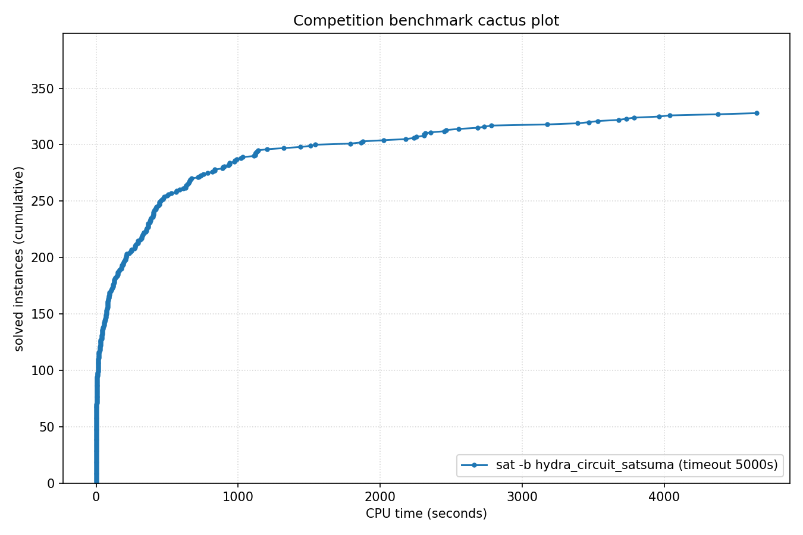

# Competition Benchmark Results (index=main_track_2026_official.jsonl, timeout=5000s, backend=hydra_circuit_satsuma, parallel=10)

## Summary

| Result | Count | % |
|--------|-------|---|
| SAT | 136 | 34.8% |
| UNSAT | 192 | 49.1% |
| TIMEOUT | 63 | 16.1% |
| **Total** | 391 | 100% |

### Solver effort (mean (min-max))

| Group | N | Paths covered | Conflicts | Conf/s | Restarts | Rst/s |
|-------|---|---------------|-----------|--------|----------|-------|
| SAT | 136 | — | — | — | — | — |
| UNSAT | 192 | — | — | — | — | — |
| TIMEOUT | 63 | — | — | — | — | — |
| Total | 391 | — | — | — | — | — |

## Cactus plot

## Per-problem results

| Problem | Result | Solve time | UNSAT proof time | Paths | Total | Conf | Rst |
|---------|--------|------------|------------------|-------|-------|------|-----|
| 14.normalised | SAT | 7.8185s | — | — | — | — | — |
| 13.normalised | SAT | 8.2041s | — | — | — | — | — |
| 18.normalised | SAT | 11.7664s | — | — | — | — | — |
| 20.normalised | SAT | 5.062s | — | — | — | — | — |
| 3.normalised | SAT | 13.2242s | — | — | — | — | — |
| 2.normalised | SAT | 19.2887s | — | — | — | — | — |
| 1.normalised | SAT | 25.7918s | — | — | — | — | — |
| 5.normalised | SAT | 41.0179s | — | — | — | — | — |
| SC25_Timetable_C_395_E_47_Cl_27_D_7_T_50.normalised | SAT | 29.6572s | — | — | — | — | — |
| 8.normalised | SAT | 70.6355s | — | — | — | — | — |
| 11.normalised | SAT | 74.1885s | — | — | — | — | — |
| 10.normalised | SAT | 81.5911s | — | — | — | — | — |
| SC25_Timetable_C_393_E_45_Cl_26_D_7_T_50.normalised | SAT | 19.08s | — | — | — | — | — |
| SC25_Timetable_C_481_E_49_Cl_32_D_7_T_58.normalised | SAT | 80.3358s | — | — | — | — | — |
| 17.normalised | SAT | 117.235s | — | — | — | — | — |
| SC25_Timetable_C_496_E_48_Cl_33_D_7_T_50.normalised | SAT | 247.192s | — | — | — | — | — |
| crusti_g2io_250_0.2_255_12.normalised | SAT | 242.5749s | — | — | — | — | — |
| SC25_Timetable_C_495_E_48_Cl_33_D_7_T_50.normalised | SAT | 407.5138s | — | — | — | — | — |
| crusti_g2io_175_0.2_511_10.normalised | SAT | 49.3043s | — | — | — | — | — |
| crusti_g2io_250_0.2_255_24.normalised | SAT | 79.9015s | — | — | — | — | — |
| crusti_g2io_200_0.1_127_19.normalised | SAT | 44.9307s | — | — | — | — | — |
| crusti_g2io_250_0.2_255_31.normalised | SAT | 20.3324s | — | — | — | — | — |
| SC25_Timetable_C_495_E_50_Cl_33_D_7_T_50.normalised | SAT | 4037.7401s | — | — | — | — | — |
| crusti_g2io_250_0.2_255_18.normalised | SAT | 18.8703s | — | — | — | — | — |
| crusti_g2io_175_0.2_511_32.normalised | SAT | 13.6866s | — | — | — | — | — |
| SC25_Timetable_C_498_E_46_Cl_34_D_7_T_50.normalised | TIMEOUT | 4998.9467s | — | — | — | — | — |
| SC25_Timetable_C_466_E_39_Cl_31_D_7_T_58.normalised | TIMEOUT | 4999.1028s | — | — | — | — | — |
| SC25_Timetable_C_495_E_43_Cl_35_D_7_T_58.normalised | TIMEOUT | 4999.1118s | — | — | — | — | — |
| SC25_Timetable_C_470_E_39_Cl_32_D_7_T_58.normalised | TIMEOUT | 4999.2966s | — | — | — | — | — |
| SC25_Timetable_C_496_E_46_Cl_33_D_7_T_50.normalised | TIMEOUT | 4999.1061s | — | — | — | — | — |
| crusti_g2io_225_0.1_31_25.normalised | SAT | 32.0381s | — | — | — | — | — |
| SC25_Timetable_C_475_E_39_Cl_33_D_7_T_58.normalised | TIMEOUT | 4998.8229s | — | — | — | — | — |
| st_1391_70_12_1674.normalised | TIMEOUT | 4998.4455s | — | — | — | — | — |
| st_826_34_8_3910.normalised | TIMEOUT | 4998.4053s | — | — | — | — | — |
| st_890_86_9_572.normalised | TIMEOUT | 4998.4081s | — | — | — | — | — |
| lockchart-group1-L190-K276-p8d4j1.normalised | SAT | 724.8089s | — | — | — | — | — |
| st_1352_53_23_3737.normalised | TIMEOUT | 4998.4503s | — | — | — | — | — |
| lockchart-group1-L240-K345-p8d4j1.normalised | TIMEOUT | 4999.1575s | — | — | — | — | — |
| lockchart-group2-rnd0.3-L19-K38-P8D4J1_1.normalised | TIMEOUT | 4998.3706s | — | — | — | — | — |
| lockchart-group1-L220-K317-p8d4j1.normalised | TIMEOUT | 4998.7355s | — | — | — | — | — |
| b20_1 | UNSAT | 4.5969s | 4.6s | — | — | — | — |
| b20 | UNSAT | 6.5609s | 7.7s | — | — | — | — |
| b15 | UNSAT | 2.4102s | 3.4s | — | — | — | — |
| s15850 | UNSAT | 0.9882s | 1.0s | — | — | — | — |
| c7552 | UNSAT | 0.6927s | 0.6s | — | — | — | — |
| b22_1 | UNSAT | 7.6216s | 6.7s | — | — | — | — |
| b21 | UNSAT | 6.199s | 7.1s | — | — | — | — |
| s38417 | UNSAT | 1.4413s | 0.7s | — | — | — | — |
| c3540 | UNSAT | 0.8964s | 1.0s | — | — | — | — |
| c5315 | UNSAT | 0.7691s | 0.7s | — | — | — | — |
| lockchart-group3-L15-K29-p4d3j1.normalised | UNSAT | 1019.8353s | 4270.0s | — | — | — | — |
| lockchart-group1-L255-K366-p8d4j1.normalised | TIMEOUT | 4998.7566s | — | — | — | — | — |
| lockchart-group2-rnd0.3-L19-K38-P8D4J1_3 | TIMEOUT | 4998.4447s | — | — | — | — | — |
| lockchart-group3-L11-K23-p4d3j1.normalised | UNSAT | 1030.8239s | 4373.4s | — | — | — | — |
| lockchart-group3-L13-K26-p4d3j1.normalised | UNSAT | 1542.0791s | dsr-trim timeout (unchecked) | — | — | — | — |
| b19_1 | UNSAT | 379.368s | 1255.4s | — | — | — | — |
| b19 | UNSAT | 404.8218s | 1246.0s | — | — | — | — |
| lockchart-group3-L12-K24-p4d3j1.normalised | UNSAT | 1438.1892s | dsr-trim timeout (unchecked) | — | — | — | — |
| oski15a01b74s_opt | UNSAT | 335.2146s | 1226.7s | — | — | — | — |
| oski15a01b03s_opt | UNSAT | 403.8591s | 1882.4s | — | — | — | — |
| oski15a01b77s_opt | UNSAT | 297.1054s | 1099.4s | — | — | — | — |
| oski15a01b62s_opt | UNSAT | 355.5831s | 1436.4s | — | — | — | — |
| oski15a01b64s_opt | UNSAT | 469.7746s | 1999.6s | — | — | — | — |
| oski15a01b19s_opt | UNSAT | 366.799s | 1684.6s | — | — | — | — |
| gm24sparrc | UNSAT | 2.5715s | 0.2s | — | — | — | — |
| lockchart-group2-rnd0.3-L19-K38-P8D4J1_2 | SAT | 4648.8168s | — | — | — | — | — |
| oski15a01b40s_opt | UNSAT | 384.3491s | 1967.7s | — | — | — | — |
| gm16spctrc | UNSAT | 60.4208s | 7.4s | — | — | — | — |
| oski15a01b15s_opt | UNSAT | 498.2097s | 2396.0s | — | — | — | — |
| gm28sparrc | UNSAT | 8.0803s | 0.4s | — | — | — | — |
| gm32sparrc | UNSAT | 6.3518s | 0.5s | — | — | — | — |
| gm36sparrc | UNSAT | 11.1597s | 0.8s | — | — | — | — |
| oski15a01b60s_opt | UNSAT | 364.4249s | 1534.7s | — | — | — | — |
| gm20sparrc | UNSAT | 0.625s | 0.1s | — | — | — | — |
| oski15a01b09s_opt | UNSAT | 364.8616s | 1354.5s | — | — | — | — |
| oski15a01b52s_opt | UNSAT | 398.5398s | 1563.9s | — | — | — | — |
| lockchart-group3-L14-K27-p4d3j1.normalised | UNSAT | 988.9624s | 4175.9s | — | — | — | — |
| case12.normalised | UNSAT | 16.2477s | 37.8s | — | — | — | — |
| oski15a01b02s_opt | UNSAT | 671.1363s | 4028.3s | — | — | — | — |
| case10 | SAT | 456.0618s | — | — | — | — | — |
| case6.normalised | SAT | 786.9076s | — | — | — | — | — |
| case7.normalised | SAT | 130.5818s | — | — | — | — | — |
| case18.normalised | UNSAT | 293.9198s | 643.0s | — | — | — | — |
| case1.normalised | SAT | 586.4439s | — | — | — | — | — |
| case2 | SAT | 72.4436s | — | — | — | — | — |
| gm16spwtrc | UNSAT | 1788.8429s | 584.6s | — | — | — | — |
| case9 | SAT | 71.7914s | — | — | — | — | — |
| MVRoundRobin_n12_d10_v3 | UNSAT | 0.025s | 0.5s | — | — | — | — |
| MVRoundRobin_n16_d10_v2 | UNSAT | 0.047s | 0.5s | — | — | — | — |
| MVRoundRobin_n12_d10_v2 | UNSAT | 0.0139s | 0.5s | — | — | — | — |
| case19.normalised | SAT | 44.2089s | — | — | — | — | — |
| RoundRobin_n17_d13 | UNSAT | 0.0039s | 0.5s | — | — | — | — |
| RoundRobin_n15_d13 | UNSAT | 0.0025s | 0.5s | — | — | — | — |
| RoundRobin_n18_d16 | UNSAT | 0.0044s | 0.5s | — | — | — | — |
| RoundRobin_n16_d14 | UNSAT | 0.0029s | 0.5s | — | — | — | — |
| RoundRobin_n16_d13 | UNSAT | 0.0029s | 0.5s | — | — | — | — |
| RoundRobin_n18_d15 | UNSAT | 0.0043s | 0.5s | — | — | — | — |
| MVRoundRobin_n12_d10_v4 | UNSAT | 0.0382s | 0.5s | — | — | — | — |
| MVRoundRobin_n20_d10_v2 | UNSAT | 0.1279s | 0.5s | — | — | — | — |
| MVRoundRobin_n20_d10_v3 | UNSAT | 0.216s | 1.0s | — | — | — | — |
| clqcl_30_7_6.normalised | UNSAT | 0.0133s | 1.5s | — | — | — | — |
| clqcl_30_8_7.normalised | UNSAT | 0.0202s | 2.6s | — | — | — | — |
| clqcl_25_9_8.normalised | UNSAT | 0.0222s | 2.6s | — | — | — | — |
| clqcl_30_11_10.normalised | UNSAT | 0.0744s | 10.3s | — | — | — | — |
| clqcl_25_7_6.normalised | UNSAT | 0.0094s | 1.0s | — | — | — | — |
| clqcl_70_6_5.normalised | UNSAT | 0.0749s | 8.8s | — | — | — | — |
| clqcl_30_9_8.normalised | UNSAT | 0.0305s | 4.1s | — | — | — | — |
| clqcl_60_6_5.normalised | UNSAT | 0.0485s | 5.1s | — | — | — | — |
| case11.normalised | SAT | 632.7168s | — | — | — | — | — |
| clqcl_45_6_5.normalised | UNSAT | 0.0228s | 2.1s | — | — | — | — |
| clqcl_30_10_9.normalised | UNSAT | 0.0517s | 6.7s | — | — | — | — |
| gm20spctrc | UNSAT | 2308.2135s | 196.5s | — | — | — | — |
| gm16spwtcl | TIMEOUT | 4998.3645s | — | — | — | — | — |
| gm24spctbk | TIMEOUT | 4998.4228s | — | — | — | — | — |
| gm32spctlf | TIMEOUT | 4998.4796s | — | — | — | — | — |
| gm24spctrc | TIMEOUT | 4998.4961s | — | — | — | — | — |
| case3 | UNSAT | 835.5788s | 3210.9s | — | — | — | — |
| case4 | TIMEOUT | 4998.52s | — | — | — | — | — |
| 16_16_booth_wallace_mapped_and_default_origin_bit28 | UNSAT | 737.6795s | 2446.6s | — | — | — | — |
| 16_16_default_mapped_ultra_and_and_dadda_mapped_bit28 | UNSAT | 437.4704s | 1416.1s | — | — | — | — |
| 16_16_booth_dadda_mapped_and_and_wallace_origin_bit28 | UNSAT | 817.8587s | 2717.2s | — | — | — | — |
| 16_16_booth_dadda_origin_and_default_mapped_ultra_bit29 | UNSAT | 327.1189s | 1041.9s | — | — | — | — |
| 16_16_default_mapped_ultra_and_and_dadda_origin_bit28 | UNSAT | 460.5481s | 1497.4s | — | — | — | — |
| nla-digbench-scaling_dijkstra-u_valuebound1_transition | UNSAT | 2.1567s | 2.2s | — | — | — | — |
| cal182_cal182_transition | UNSAT | 5.6008s | 4.3s | — | — | — | — |
| bv_ILA_Piccolo_JALR_sanity_transition | UNSAT | 4.2049s | 10.6s | — | — | — | — |
| bv_ILA_Piccolo_BEQ_sanity_transition | UNSAT | 4.6591s | 9.9s | — | — | — | — |
| nla-digbench-scaling_freire1_valuebound1_transition | UNSAT | 2.8651s | 0.8s | — | — | — | — |
| ramsey_3_6_19.normalised | TIMEOUT | 4998.3434s | — | — | — | — | — |
| 16_16_booth_dadda_origin_and_and_dadda_origin_bit29 | UNSAT | 386.9762s | 1242.7s | — | — | — | — |
| ramsey_4_4_18.normalised | UNSAT | 973.6948s | 4506.8s | — | — | — | — |
| veer_axi_yosyshq_appnote_123_veer_axi-p06_transition | UNSAT | 15.5281s | 108.2s | — | — | — | — |
| x-epic_a19-p15_transition | UNSAT | 2.7349s | 2.5s | — | — | — | — |
| 16_16_booth_dadda_mapped_and_booth_wallace_mapped | UNSAT | 837.1221s | 2597.5s | — | — | — | — |
| x-epic_a10-p53_transition | UNSAT | 30.9477s | 173.6s | — | — | — | — |
| arles_thres10_p20_r4514 | UNSAT | 0.0053s | 0.5s | — | — | — | — |
| arles_thres20_p10_r7508 | UNSAT | 0.343s | 0.3s | — | — | — | — |
| arles_thres10_p10_r8180 | UNSAT | 0.0073s | 0.5s | — | — | — | — |
| arles_thres20_p10_r7475 | UNSAT | 0.3545s | 0.4s | — | — | — | — |
| arles_thres10_p10_r8188 | UNSAT | 0.003s | 0.5s | — | — | — | — |
| arles_thres20_p20_r4109 | UNSAT | 0.4644s | 0.4s | — | — | — | — |
| arles_thres10_p10_r8186 | UNSAT | 0.0034s | 0.5s | — | — | — | — |
| arles_thres20_p30_r2554 | UNSAT | 0.004s | 0.5s | — | — | — | — |
| arles_thres10_p10_r8185 | UNSAT | 0.003s | 0.5s | — | — | — | — |
| arles_thres10_p10_r8062 | UNSAT | 0.0031s | 0.5s | — | — | — | — |
| arles_thres20_p10_r7533 | UNSAT | 0.431s | 0.4s | — | — | — | — |
| arles_thres10_p10_r8184 | UNSAT | 0.0079s | 0.5s | — | — | — | — |
| bv_rocket_1951_transition | UNSAT | 15.3779s | 417.2s | — | — | — | — |
| bp4_CB_FPBEQ_FPBLE.normalised | UNSAT | 86.8238s | 552.3s | — | — | — | — |
| 16_16_booth_dadda_origin_and_and_dadda_origin_bit28 | UNSAT | 1140.1109s | 3988.6s | — | — | — | — |
| 2018D_VexRiscv-regch0-20-p1_step | UNSAT | 145.1888s | 1727.0s | — | — | — | — |
| 16_16_booth_wallace_origin_and_and_dadda_mapped_bit28 | UNSAT | 930.4175s | 3191.1s | — | — | — | — |
| 16_16_and_wallace_origin_and_default_mapped_ultra_bit27 | UNSAT | 890.7117s | 3126.6s | — | — | — | — |
| bp4_CB_LP_FPBLE.normalised | UNSAT | 125.3205s | 927.6s | — | — | — | — |
| 16_16_booth_dadda_mapped_and_and_wallace_mapped_bit28 | UNSAT | 900.7918s | 3136.5s | — | — | — | — |
| bp4_BC012_TCO_CSO_LP_FPBEQ_ZR.normalised | SAT | 148.6346s | — | — | — | — | — |
| bp5_CSO.normalised | SAT | 278.7319s | — | — | — | — | — |
| bp4_CSO_AM_IXA_LP.normalised | UNSAT | 103.8107s | 1271.1s | — | — | — | — |
| bp4_BC012_AM_IXA_LPI.normalised | UNSAT | 210.0413s | 2386.7s | — | — | — | — |
| bp4_TCO_CSO_ZR.normalised | SAT | 656.0864s | — | — | — | — | — |
| bp4_BC012_AM_FPBEQ_ZR.normalised | SAT | 2453.166s | — | — | — | — | — |
| bp5.normalised | SAT | 1876.9503s | — | — | — | — | — |
| bp4_TCO_CB_LP.normalised | UNSAT | 136.7256s | 1280.2s | — | — | — | — |
| oddball_43_5_tto_zp.normalised | SAT | 80.1908s | — | — | — | — | — |
| x-epic_a19-p16_step | UNSAT | 207.2095s | dsr-trim timeout (unchecked) | — | — | — | — |
| bp4_CB_CSO_LP_FPBEQ_FPBLE.normalised | UNSAT | 213.2335s | 1637.1s | — | — | — | — |
| bp4_BC012_TCO_AM_FPBEQ_ZR.normalised | SAT | 2024.2093s | — | — | — | — | — |
| nla-digbench-scaling_dijkstra-u_valuebound1_step | UNSAT | 250.9488s | 4984.8s | — | — | — | — |
| oddball_24_4_ttf.normalised | UNSAT | 270.8604s | 1645.6s | — | — | — | — |
| bp4_BC012_IXA_LPI_FPBLE.normalised | UNSAT | 612.8242s | dsr-trim timeout (unchecked) | — | — | — | — |
| oddball_20_5_ttf.normalised | UNSAT | 4.692s | 14.6s | — | — | — | — |
| oddball_13_5_ttf.normalised | UNSAT | 14.6404s | 67.6s | — | — | — | — |
| oddball_20_4_ttf.normalised | UNSAT | 7.5702s | 28.1s | — | — | — | — |
| oddball_44_5_tto_zp.normalised | SAT | 79.0539s | — | — | — | — | — |
| 16_16_booth_dadda_mapped_and_booth_wallace_origin | UNSAT | 2732.6637s | dsr-trim timeout (unchecked) | — | — | — | — |
| bp4_BC012_TCO_AM_IXA.normalised | UNSAT | 405.5734s | 4353.2s | — | — | — | — |
| bp4_TCO_AM_IXA_FPBLE.normalised | UNSAT | 366.03s | 3608.6s | — | — | — | — |
| oddball_51_5_tto_zp.normalised | SAT | 176.5885s | — | — | — | — | — |
| oddball_47_5_tto_zp.normalised | SAT | 1118.2196s | — | — | — | — | — |
| oddball_54_5_tto_zp.normalised | SAT | 422.5629s | — | — | — | — | — |
| 45-126477 | SAT | 198.3319s | — | — | — | — | — |
| qpr-bmp280-driver-5 | SAT | 3.1411s | — | — | — | — | — |
| bp4_BC012_AM_IXA_FPBLE.normalised | UNSAT | 400.3943s | 3665.2s | — | — | — | — |
| oddball_70_5_tto_zp.normalised | SAT | 3677.8693s | — | — | — | — | — |
| ssp-0.46172681388173037 | SAT | 333.5778s | — | — | — | — | — |
| clqcl_40_6_5.normalised | UNSAT | 0.0153s | 1.6s | — | — | — | — |
| gensys-ukn006.shuffled-as.sat05-3846 | UNSAT | 159.8772s | 449.9s | — | — | — | — |
| hid-uns-enc-6-1-0-0-0-0-26462 | UNSAT | 94.9494s | 247.6s | — | — | — | — |
| bench_5078.smt2 | SAT | 27.0843s | — | — | — | — | — |
| le450_15a.col.15 | UNSAT | 0.6582s | 1.2s | — | — | — | — |
| x2_72.shuffled-as.sat03-1604 | UNSAT | 0.0032s | 0.5s | — | — | — | — |
| oddball_79_5_tto_zp.normalised | TIMEOUT | 4999.3118s | — | — | — | — | — |
| oddball_56_5_tto_zp.normalised | SAT | 4376.0581s | — | — | — | — | — |
| E02F20 | SAT | 15.3744s | — | — | — | — | — |
| squ_ali_s10x10_c39_abix_SAT-sc2017 | SAT | 16.0106s | — | — | — | — | — |
| oddball_26_4_ttf.normalised | UNSAT | 631.1263s | 3910.8s | — | — | — | — |
| SCPC-900-27 | SAT | 659.6185s | — | — | — | — | — |
| oddball_33_4_ttf.normalised | UNSAT | 2254.7955s | dsr-trim timeout (unchecked) | — | — | — | — |
| oddball_28_4_ttf.normalised | UNSAT | 2235.6413s | dsr-trim timeout (unchecked) | — | — | — | — |
| mp1-bsat210-739 | UNSAT | 631.4419s | 2015.3s | — | — | — | — |
| 49-134444 | SAT | 1864.9066s | — | — | — | — | — |
| multiplier_16bits__miter_19 | TIMEOUT | 4998.3386s | — | — | — | — | — |
| post-cbmc-aes-d-r2-noholes | UNSAT | 80.9803s | 642.6s | — | — | — | — |
| two-trees-1023v.sanitized | TIMEOUT | 4998.636s | — | — | — | — | — |
| cliquecoloring_n24_k6_c5 | UNSAT | 0.0055s | 0.5s | — | — | — | — |
| or_randxor_k3_n510_m510.sanitized | UNSAT | 4.1714s | 3.2s | — | — | — | — |
| oddball_29_4_ttf.normalised | UNSAT | 755.7629s | dsr-trim timeout (unchecked) | — | — | — | — |
| 19.normalised | SAT | 27.2101s | — | — | — | — | — |
| transport-transport-three-cities-sequential-14nodes-1000size-4degree-100mindistance-4trucks-14packages-2008seed.020-NOTKNOWN | SAT | 74.1188s | — | — | — | — | — |
| bphp_p51_h50.sanitized | TIMEOUT | 4998.5448s | — | — | — | — | — |
| cfi-rigid-t2-0048-04-or_3_shuffle_all | SAT | 177.2941s | — | — | — | — | — |
| mp1-Nb6T27 | SAT | 480.4688s | — | — | — | — | — |
| oski15a01b70s_opt | UNSAT | 321.3972s | 1001.9s | — | — | — | — |
| 20180321_140833987_p_cnf_320_1120 | SAT | 2355.4394s | — | — | — | — | — |
| VanDerWaerden_pd_2-3-25_606 | SAT | 3532.1292s | — | — | — | — | — |
| sted1_0x0-637 | SAT | 383.1386s | — | — | — | — | — |
| connm-ue-csp-sat-n1200-d-0.02-s405595518.shuffled-as.sat05-531 | TIMEOUT | 4998.4487s | — | — | — | — | — |
| hid-uns-enc-6-1-0-0-0-0-28258 | UNSAT | 49.8517s | 130.8s | — | — | — | — |
| simon-r22-1.sanitized | SAT | 0.4044s | — | — | — | — | — |
| 1-ZC-1024-K-117.sanitized | TIMEOUT | 4999.2837s | — | — | — | — | — |
| hwmcc10-timeframe-expansion-k45-pdtpmsgoodbakery-tseitin | UNSAT | 55.2158s | 89.7s | — | — | — | — |
| sum_of_3_cubes_94_bits_30 | TIMEOUT | 4998.6472s | — | — | — | — | — |
| stone-width3chain-nmarkers-13_shuffled | UNSAT | 63.0864s | dsr-trim timeout (unchecked) | — | — | — | — |
| 1-ZC-512-K-60.sanitized | SAT | 447.8825s | — | — | — | — | — |
| 4g_5color_170_050_05 | SAT | 192.1906s | — | — | — | — | — |
| puzzle57_sat | TIMEOUT | 4998.8964s | — | — | — | — | — |
| ssp-0.497665446947731 | SAT | 358.4414s | — | — | — | — | — |
| lockchart-group1-L235-K339-p8d4j1.normalised | TIMEOUT | 4999.527s | — | — | — | — | — |
| sat-bench-trig-taylor2 | UNSAT | 353.6387s | 669.0s | — | — | — | — |
| mchess_20 | UNSAT | 0.0013s | 0.5s | — | — | — | — |
| ncc_none_5047_6_3_3_3_0_435991723 | SAT | 58.5034s | — | — | — | — | — |
| floodit_4_n70_k10_m229 | SAT | 153.0906s | — | — | — | — | — |
| LZMAFile_write_12 | UNSAT | 0.3584s | 0.3s | — | — | — | — |
| gto_p50c314 | TIMEOUT | 4998.3831s | — | — | — | — | — |
| RoundRobin_n17_d14 | UNSAT | 0.0034s | 0.5s | — | — | — | — |
| ezfact64_6.shuffled-as.sat05-453 | SAT | 0.0819s | — | — | — | — | — |
| mchess_17 | UNSAT | 0.0011s | 0.5s | — | — | — | — |
| ncc_none_3001_7_3_3_1_31_435991723 | SAT | 90.5278s | — | — | — | — | — |
| newpol29-4 | UNSAT | 443.7645s | 1809.2s | — | — | — | — |
| ecarev-110-1031-23-40-8-sc2018 | SAT | 232.5632s | — | — | — | — | — |
| crn_40_1521_s | TIMEOUT | 4999.0974s | — | — | — | — | — |
| slp-synthesis-aes-bottom22 | TIMEOUT | 4998.9329s | — | — | — | — | — |
| mp1-blockpuzzle_5x10_s8_free3 | UNSAT | 4.1974s | 6.1s | — | — | — | — |
| satcoin-genesis-UNSAT-12300 | UNSAT | 529.3069s | 613.2s | — | — | — | — |
| x2_64.shuffled-as.sat03-1603 | UNSAT | 0.0024s | 0.5s | — | — | — | — |
| urqh5x5.shuffled-as.sat03-1481.cnf.mis-127.debugged | TIMEOUT | 4998.7578s | — | — | — | — | — |
| UNSAT_MS_opt_termes_p20.pddl_105 | TIMEOUT | 4999.25s | — | — | — | — | — |
| peb-pyrofpyr-15-neq-3_shuffled | UNSAT | 293.5583s | 235.1s | — | — | — | — |
| bench_3098.smt2 | SAT | 17.9451s | — | — | — | — | — |
| homer12.shuffled | UNSAT | 0.358s | 0.3s | — | — | — | — |
| lec_mult_DvK_12x11.sanitized | UNSAT | 2310.79s | dsr-trim timeout (unchecked) | — | — | — | — |
| UNSAT_MS_opt_snake_p17.pddl_61 | TIMEOUT | 4999.531s | — | — | — | — | — |
| Steiner-729-112-bce | TIMEOUT | 4998.6199s | — | — | — | — | — |
| baseballcover12with25_and4positions | SAT | 474.4996s | — | — | — | — | — |
| color-11-3.shuffled-as.sat05-445 | TIMEOUT | 4998.4174s | — | — | — | — | — |
| cube-11-h14-sat | SAT | 564.6939s | — | — | — | — | — |
| mdp-28-10-sat | SAT | 115.4088s | — | — | — | — | — |
| bvsub_06991 | UNSAT | 20.1428s | 342.5s | — | — | — | — |
| 005 | SAT | 324.1947s | — | — | — | — | — |
| SCPC-500-7 | UNSAT | 31.321s | 78.3s | — | — | — | — |
| sum_of_3_cubes_108_bits_52 | TIMEOUT | 4998.8946s | — | — | — | — | — |
| oddball_80_5_tto_zp.normalised | TIMEOUT | 4998.9072s | — | — | — | — | — |
| Mycielski-11-hints-1 | UNSAT | 411.6356s | 1280.8s | — | — | — | — |
| 1-ET-512-K-98.sanitized | TIMEOUT | 4998.6216s | — | — | — | — | — |
| rook-44-1-1 | UNSAT | 119.6183s | 361.8s | — | — | — | — |
| aes_decry_2_rounds.debugged | UNSAT | 94.3217s | 720.1s | — | — | — | — |
| Mycielski-10-hints-6 | TIMEOUT | 4999.294s | — | — | — | — | — |
| 170224890 | SAT | 38.7876s | — | — | — | — | — |
| rphp_p6_r540 | UNSAT | 6.9676s | 168.9s | — | — | — | — |
| 008-80-8 | SAT | 3468.3618s | — | — | — | — | — |
| shuffling-1-s1931574585-of-bench-sat04-328.used-as.sat04-449 | UNSAT | 4.5034s | 5.0s | — | — | — | — |
| sncf_model_ixl_bmc_depth_15 | TIMEOUT | 4999.2189s | — | — | — | — | — |
| x9-12022.sat.sanitized | SAT | 1319.7716s | — | — | — | — | — |
| bvurem_17.smt2 | UNSAT | 644.0686s | 3783.1s | — | — | — | — |
| connm-ue-csp-sat-n1200-d-0.02-s383740539.sat05-534.reshuffled-07 | SAT | 2783.0465s | — | — | — | — | — |
| posixpath_expanduser_14 | UNSAT | 0.3683s | 0.3s | — | — | — | — |
| queen12_12.col.12 | UNSAT | 0.4559s | 0.4s | — | — | — | — |
| HCP-470-105 | SAT | 1132.36s | — | — | — | — | — |
| aes_32_4_keyfind_1 | TIMEOUT | 4998.3372s | — | — | — | — | — |
| ssp-0.046166496845693274 | TIMEOUT | 4998.447s | — | — | — | — | — |
| hcp_d14_14 | SAT | 2463.6071s | — | — | — | — | — |
| mp1-blockpuzzle_5x12_s6_free3 | UNSAT | 6.2699s | 11.9s | — | — | — | — |
| sted5_0x0-157 | SAT | 1124.1567s | — | — | — | — | — |
| MVD_ADS_S11_7_7 | SAT | 8.1522s | — | — | — | — | — |
| oddball_22_5_ttf.normalised | UNSAT | 3.5116s | 9.3s | — | — | — | — |
| q_query_3_L200_coli.sat | UNSAT | 128.7001s | 1226.4s | — | — | — | — |
| gt-025.shuffled-as.sat05-1306 | UNSAT | 0.6324s | 0.5s | — | — | — | — |
| si2-r001-m200-00 | SAT | 13.7496s | — | — | — | — | — |
| linvrinv5.shuffled-as.sat05-564 | UNSAT | 894.0013s | 4328.3s | — | — | — | — |
| case13.normalised | SAT | 26.8059s | — | — | — | — | — |
| EDP3-16000 | TIMEOUT | 4998.8214s | — | — | — | — | — |
| x9-11067.sat.sanitized | SAT | 69.514s | — | — | — | — | — |
| stable-400-0.1-11-98765432140011 | SAT | 121.065s | — | — | — | — | — |
| Karatsuba4477457x5308417 | SAT | 52.8682s | — | — | — | — | — |
| abw-T-dwt__592.mtx-w98 | SAT | 88.0187s | — | — | — | — | — |
| SGI_30_60_28_40_7-log.shuffled-as.sat03-127 | UNSAT | 2180.2341s | dsr-trim timeout (unchecked) | — | — | — | — |
| FmlaImplyChain_3_7_7.sanitized | UNSAT | 190.3215s | 301.6s | — | — | — | — |
| constraints_16_0.4_1.sanitized | UNSAT | 54.9598s | 126.2s | — | — | — | — |
| clauses-8.shuffled-as.sat05-1969 | SAT | 126.5441s | — | — | — | — | — |
| 01-integer-programming-5-10-100 | TIMEOUT | 4999.3066s | — | — | — | — | — |
| x9-11035.sat.sanitized | SAT | 4.7239s | — | — | — | — | — |
| 01-integer-programming-20-30-40 | SAT | 716.1832s | — | — | — | — | — |
| mrpp_8x8#20_16 | SAT | 12.5351s | — | — | — | — | — |
| esawn_uw3.debugged | SAT | 31.6419s | — | — | — | — | — |
| Kakuro-easy-138-ext.xml.hg_5 | SAT | 217.5421s | — | — | — | — | — |
| 31.smt2 | SAT | 95.6007s | — | — | — | — | — |
| or_randxor_k3_n590_m590.sanitized | UNSAT | 6.7849s | 8.1s | — | — | — | — |
| strips-gripper-12t22.shuffled-as.sat05-1151 | UNSAT | 7.2386s | 12.4s | — | — | — | — |
| sted5_0x1e3-120 | SAT | 69.5167s | — | — | — | — | — |
| floodit_7_n70_k10_m230 | SAT | 83.4158s | — | — | — | — | — |
| pyhala-braun-unsat-40-4-02.shuffled-as.sat05-459 | UNSAT | 42.0984s | 91.5s | — | — | — | — |
| sp5-26-19-bin-nons-tree-noid | SAT | 1509.8009s | — | — | — | — | — |
| oski15a01b38s_opt | UNSAT | 351.3112s | 1351.1s | — | — | — | — |
| eq.atree.braun.13.unsat | UNSAT | 2684.1965s | dsr-trim timeout (unchecked) | — | — | — | — |
| sgen1-unsat-103-100.cnf.mis-78.debugged | UNSAT | 272.3329s | 1274.5s | — | — | — | — |
| grs-48-160 | UNSAT | 940.2938s | dsr-trim timeout (unchecked) | — | — | — | — |
| md5_48_3 | SAT | 15.4135s | — | — | — | — | — |
| x9-12096.sat.sanitized | SAT | 663.8225s | — | — | — | — | — |
| w19-8.0 | UNSAT | 129.2567s | 391.8s | — | — | — | — |
| Folkman-185-152478531.sanitized | SAT | 181.5948s | — | — | — | — | — |
| hash_table_find_safety_size_21 | UNSAT | 209.2274s | dsr-trim timeout (unchecked) | — | — | — | — |
| satcoin-genesis-UNSAT-6120 | UNSAT | 508.483s | 617.1s | — | — | — | — |
| 59-131122 | SAT | 937.7399s | — | — | — | — | — |
| med30.shuffled | SAT | 1.9912s | — | — | — | — | — |
| shuffling-1-s1948244678-of-bench-sat04-301.used-as.sat04-476 | UNSAT | 85.4433s | 236.1s | — | — | — | — |
| 46-128972 | SAT | 379.5206s | — | — | — | — | — |
| abw-T-dwt__592.mtx-w102 | SAT | 446.8088s | — | — | — | — | — |
| gt-ordering-unsat-gt-045.sat05-1310.reshuffled-07 | UNSAT | 3.8415s | 3.1s | — | — | — | — |
| LABS_n089_goal008-sc2013 | SAT | 1111.6483s | — | — | — | — | — |
| asconhashv12_opt64_H8_M2-1yQCyA0j_m2_6.c | SAT | 4.57s | — | — | — | — | — |
| satcoin-genesis-SAT-16 | SAT | 5.5468s | — | — | — | — | — |
| SAT_instance_N=85 | TIMEOUT | 4998.661s | — | — | — | — | — |
| stable-400-0.1-12-98765432140012 | SAT | 3176.2706s | — | — | — | — | — |
| SAT_dat.k40.debugged | UNSAT | 163.5887s | 417.8s | — | — | — | — |
| mdp-32-12-sat | SAT | 1117.8511s | — | — | — | — | — |
| safe-50-h49-unsat | TIMEOUT | 4998.6166s | — | — | — | — | — |
| puzzle42_unsat | TIMEOUT | 4998.6972s | — | — | — | — | — |
| battleship-20-39-sat | SAT | 66.8296s | — | — | — | — | — |
| hantzsche_wendt_unit_83 | UNSAT | 565.1568s | 1936.1s | — | — | — | — |
| mm-2x3-8-8-sb.1.shuffled-as.sat03-1504.used-as.sat04-829 | UNSAT | 214.9888s | 684.1s | — | — | — | — |
| SE_PR_stb_588_138.apx_1 | SAT | 2.6222s | — | — | — | — | — |
| gus-md5-15 | TIMEOUT | 4999.3118s | — | — | — | — | — |
| ex025_19 | UNSAT | 3730.5098s | dsr-trim timeout (unchecked) | — | — | — | — |
| manthey_DimacsSorterHalf_35_9 | SAT | 195.9259s | — | — | — | — | — |
| reconf10_22_queen20_3_8667 | SAT | 976.7419s | — | — | — | — | — |
| Q3inK12 | SAT | 59.7844s | — | — | — | — | — |
| Kakuro-easy-106-ext.xml.hg_6 | SAT | 180.0241s | — | — | — | — | — |
| full-bg-gb-9-ce | SAT | 3390.4403s | — | — | — | — | — |
| b04_s_unknown | SAT | 154.2485s | — | — | — | — | — |
| summle_X8651_steps8_I1-2-2-4-4-8-25-100 | SAT | 14.0637s | — | — | — | — | — |
| Break_14_60.xml | SAT | 41.0651s | — | — | — | — | — |
| urqh1c5x5.shuffled-as.sat03-1468.cnf.mis-103.debugged | TIMEOUT | 4998.4997s | — | — | — | — | — |
| asconhashv12_opt64_H6_M2-4XKSMr_m1_3_U25.c | UNSAT | 107.4337s | 112.9s | — | — | — | — |
| ncc_none_12477_5_3_3_0_0_435991723 | UNSAT | 45.6222s | 477.4s | — | — | — | — |
| gus-md5-14-sc2009 | TIMEOUT | 4999.0394s | — | — | — | — | — |
| shuffling-2-s340247357-of-bench-sat04-361.used-as.sat04-638 | UNSAT | 2.0877s | 2.6s | — | — | — | — |
| IBM_FV_2004_rule_batch_1_31_2_SAT_dat.k95.debugged | UNSAT | 39.8314s | 65.5s | — | — | — | — |
| PRP_40_40 | SAT | 30.6518s | — | — | — | — | — |
| baseballcover13with25_and1positions | SAT | 76.0914s | — | — | — | — | — |
| vlsat2_40896_6104639.dimacs | TIMEOUT | 4999.3852s | — | — | — | — | — |
| 5col160_15_6.shuffled | TIMEOUT | 4998.3792s | — | — | — | — | — |
| clauses-8.renamed-as.sat05-1964 | SAT | 152.6078s | — | — | — | — | — |
| tseitingrid6x185_shuffled | UNSAT | 0.0273s | 0.5s | — | — | — | — |
| rphp5_045_shuffled | UNSAT | 0.3834s | 0.4s | — | — | — | — |
| at-least-two-sokoban-sequential-p145-microban-sequential.030-NOTKNOWN | UNSAT | 311.0716s | 2142.2s | — | — | — | — |
| ex095_8 | UNSAT | 2549.4766s | dsr-trim timeout (unchecked) | — | — | — | — |
| Circuit_multiplier37 | SAT | 8.776s | — | — | — | — | — |
| linked_list_swap_contents_safety_unwind57 | UNSAT | 41.9614s | 2141.5s | — | — | — | — |
| post-cbmc-aes-ee-r2-noholes | UNSAT | 90.3603s | 702.0s | — | — | — | — |
| 48-134487 | SAT | 3962.8521s | — | — | — | — | — |
| oski15a01b42s_opt | UNSAT | 320.8369s | 906.8s | — | — | — | — |
| sgp_9-4-8.shuffled-as.sat05-2673 | TIMEOUT | 4998.8121s | — | — | — | — | — |
| rbsat-v760c43649g8 | SAT | 1203.9292s | — | — | — | — | — |
| sin-mitern26 | UNSAT | 285.237s | 649.3s | — | — | — | — |
| GP_100_951_33 | SAT | 22.6103s | — | — | — | — | — |
| baseballcover11with22_and2positions | SAT | 425.0443s | — | — | — | — | — |
| g2-T122.1.0 | UNSAT | 422.7346s | 424.4s | — | — | — | — |
| SC23_Timetable_C_476_E_50_Cl_32_D_6_T_50 | SAT | 111.4987s | — | — | — | — | — |
| pyhala-braun-sat-40-4-03.shuffled-as.sat03-1541 | SAT | 0.2157s | — | — | — | — | — |
| battleship-19-19-unsat | TIMEOUT | 4998.3877s | — | — | — | — | — |
| sum_of_3_cubes_145_bits_74 | TIMEOUT | 4998.5269s | — | — | — | — | — |
| vlsat2_21573_2289124.dimacs | SAT | 12.8322s | — | — | — | — | — |
| toughsat_factoring_895s | SAT | 273.2683s | — | — | — | — | — |
| marg6x6.shuffled-as.sat03-1456.cnf.mis-119.debugged | TIMEOUT | 4998.6192s | — | — | — | — | — |
| worker_50_50_30_0.8 | TIMEOUT | 4998.3589s | — | — | — | — | — |
| ctl_4201_555_unsat_pre | UNSAT | 650.642s | 1794.7s | — | — | — | — |
| xor_op_n46_d3 | UNSAT | 2316.6217s | dsr-trim timeout (unchecked) | — | — | — | — |
| 30_2 | TIMEOUT | 4998.3593s | — | — | — | — | — |
| mp1-rubikcube220 | TIMEOUT | 4998.5857s | — | — | — | — | — |
| b2005-p3-14x14c17h9-Ser8-0 | TIMEOUT | 4998.3467s | — | — | — | — | — |
| custmulsb2x32o | UNSAT | 3786.5647s | dsr-trim timeout (unchecked) | — | — | — | — |
