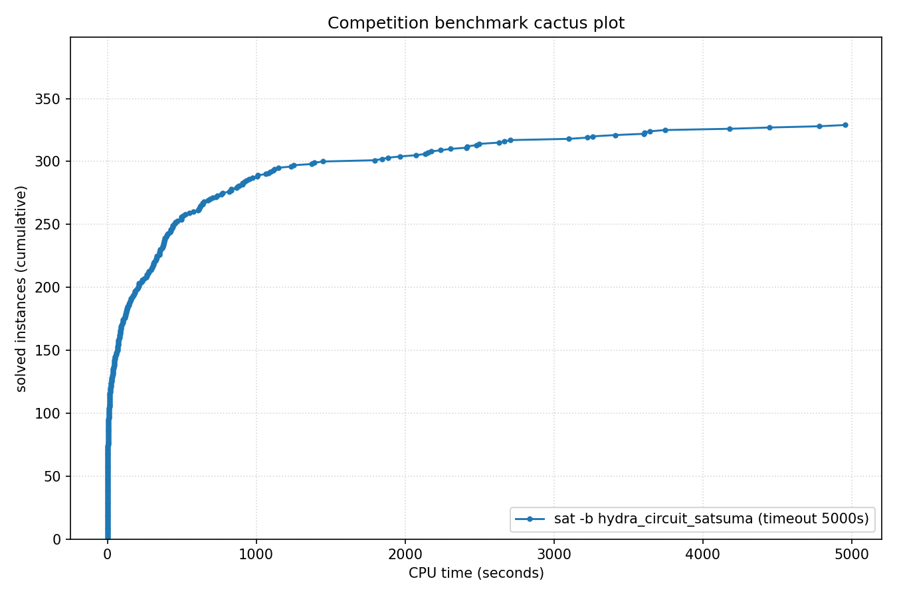

# Competition Benchmark Results (index=main_track_2026_official.jsonl, timeout=5000s, backend=hydra_circuit_satsuma, parallel=10)

## Summary

| Result | Count | % |
|--------|-------|---|
| SAT | 136 | 34.8% |
| UNSAT | 193 | 49.4% |
| TIMEOUT | 62 | 15.9% |
| **Total** | 391 | 100% |

### Solver effort (mean (min-max))

| Group | N | Paths covered | Conflicts | Conf/s | Restarts | Rst/s |
|-------|---|---------------|-----------|--------|----------|-------|
| SAT | 136 | — | — | — | — | — |
| UNSAT | 193 | — | — | — | — | — |
| TIMEOUT | 62 | — | — | — | — | — |
| Total | 391 | — | — | — | — | — |

## Cactus plot

## Per-problem results

| Problem | Result | Solve time | UNSAT proof time | Paths | Total | Conf | Rst |
|---------|--------|------------|------------------|-------|-------|------|-----|
| 14.normalised | SAT | 6.8167s | — | — | — | — | — |
| 13.normalised | SAT | 7.6141s | — | — | — | — | — |
| 18.normalised | SAT | 10.6188s | — | — | — | — | — |
| 20.normalised | SAT | 4.7s | — | — | — | — | — |
| 3.normalised | SAT | 12.6346s | — | — | — | — | — |
| 2.normalised | SAT | 16.5221s | — | — | — | — | — |
| 1.normalised | SAT | 20.6713s | — | — | — | — | — |
| 8.normalised | SAT | 32.7884s | — | — | — | — | — |
| 11.normalised | SAT | 37.8414s | — | — | — | — | — |
| 5.normalised | SAT | 26.5893s | — | — | — | — | — |
| 10.normalised | SAT | 39.7067s | — | — | — | — | — |
| SC25_Timetable_C_466_E_39_Cl_31_D_7_T_58.normalised | TIMEOUT | 4998.4615s | — | — | — | — | — |
| SC25_Timetable_C_495_E_43_Cl_35_D_7_T_58.normalised | TIMEOUT | 4998.9245s | — | — | — | — | — |
| SC25_Timetable_C_498_E_46_Cl_34_D_7_T_50.normalised | TIMEOUT | 4999.5124s | — | — | — | — | — |
| SC25_Timetable_C_496_E_46_Cl_33_D_7_T_50.normalised | TIMEOUT | 4998.9251s | — | — | — | — | — |
| SC25_Timetable_C_470_E_39_Cl_32_D_7_T_58.normalised | TIMEOUT | 4999.3789s | — | — | — | — | — |
| SC25_Timetable_C_395_E_47_Cl_27_D_7_T_50.normalised | SAT | 25.7316s | — | — | — | — | — |
| 17.normalised | SAT | 88.5382s | — | — | — | — | — |
| SC25_Timetable_C_393_E_45_Cl_26_D_7_T_50.normalised | SAT | 18.1909s | — | — | — | — | — |
| crusti_g2io_175_0.2_511_10.normalised | SAT | 46.7578s | — | — | — | — | — |
| SC25_Timetable_C_481_E_49_Cl_32_D_7_T_58.normalised | SAT | 73.9121s | — | — | — | — | — |
| crusti_g2io_250_0.2_255_24.normalised | SAT | 83.3273s | — | — | — | — | — |
| crusti_g2io_250_0.2_255_31.normalised | SAT | 16.5695s | — | — | — | — | — |
| crusti_g2io_200_0.1_127_19.normalised | SAT | 46.0372s | — | — | — | — | — |
| crusti_g2io_175_0.2_511_32.normalised | SAT | 13.7835s | — | — | — | — | — |
| crusti_g2io_250_0.2_255_18.normalised | SAT | 16.4742s | — | — | — | — | — |
| SC25_Timetable_C_496_E_48_Cl_33_D_7_T_50.normalised | SAT | 233.8573s | — | — | — | — | — |
| crusti_g2io_225_0.1_31_25.normalised | SAT | 29.9462s | — | — | — | — | — |
| crusti_g2io_250_0.2_255_12.normalised | SAT | 246.6352s | — | — | — | — | — |
| SC25_Timetable_C_495_E_48_Cl_33_D_7_T_50.normalised | SAT | 396.7449s | — | — | — | — | — |
| SC25_Timetable_C_495_E_50_Cl_33_D_7_T_50.normalised | SAT | 4445.8393s | — | — | — | — | — |
| lockchart-group3-L15-K29-p4d3j1.normalised | UNSAT | 937.1577s | 3674.0s | — | — | — | — |
| SC25_Timetable_C_475_E_39_Cl_33_D_7_T_58.normalised | TIMEOUT | 4999.0339s | — | — | — | — | — |
| st_1391_70_12_1674.normalised | TIMEOUT | 4998.3985s | — | — | — | — | — |
| st_826_34_8_3910.normalised | TIMEOUT | 4998.3405s | — | — | — | — | — |
| st_890_86_9_572.normalised | TIMEOUT | 4998.3979s | — | — | — | — | — |
| st_1352_53_23_3737.normalised | TIMEOUT | 4998.3696s | — | — | — | — | — |
| lockchart-group1-L240-K345-p8d4j1.normalised | TIMEOUT | 4999.1348s | — | — | — | — | — |
| lockchart-group2-rnd0.3-L19-K38-P8D4J1_1.normalised | TIMEOUT | 4998.3849s | — | — | — | — | — |
| b20 | UNSAT | 6.5971s | 7.7s | — | — | — | — |
| b20_1 | UNSAT | 4.4659s | 4.6s | — | — | — | — |
| b15 | UNSAT | 2.3874s | 3.4s | — | — | — | — |
| s15850 | UNSAT | 0.9968s | 0.9s | — | — | — | — |
| b22_1 | UNSAT | 7.6753s | 6.9s | — | — | — | — |
| c7552 | UNSAT | 0.692s | 0.6s | — | — | — | — |
| b21 | UNSAT | 6.3961s | 7.5s | — | — | — | — |
| s38417 | UNSAT | 1.443s | 0.8s | — | — | — | — |
| lockchart-group1-L190-K276-p8d4j1.normalised | SAT | 738.4479s | — | — | — | — | — |
| c3540 | UNSAT | 0.7635s | 1.0s | — | — | — | — |
| c5315 | UNSAT | 0.7802s | 0.6s | — | — | — | — |
| lockchart-group3-L13-K26-p4d3j1.normalised | UNSAT | 1373.215s | dsr-trim timeout (unchecked) | — | — | — | — |
| b19_1 | UNSAT | 387.6403s | 1360.9s | — | — | — | — |
| b19 | UNSAT | 407.3681s | 1369.2s | — | — | — | — |
| oski15a01b74s_opt | UNSAT | 354.8215s | 1356.1s | — | — | — | — |
| lockchart-group1-L220-K317-p8d4j1.normalised | TIMEOUT | 4999.2149s | — | — | — | — | — |
| oski15a01b03s_opt | UNSAT | 437.0589s | 1829.3s | — | — | — | — |
| lockchart-group2-rnd0.3-L19-K38-P8D4J1_2 | SAT | 4783.3622s | — | — | — | — | — |
| lockchart-group1-L255-K366-p8d4j1.normalised | TIMEOUT | 4998.3746s | — | — | — | — | — |
| lockchart-group2-rnd0.3-L19-K38-P8D4J1_3 | TIMEOUT | 4998.3644s | — | — | — | — | — |
| lockchart-group3-L14-K27-p4d3j1.normalised | UNSAT | 1007.185s | 4180.5s | — | — | — | — |
| lockchart-group3-L11-K23-p4d3j1.normalised | UNSAT | 1009.3581s | 4327.3s | — | — | — | — |
| oski15a01b64s_opt | UNSAT | 497.1894s | 1984.2s | — | — | — | — |
| oski15a01b62s_opt | UNSAT | 356.852s | 1167.7s | — | — | — | — |
| oski15a01b19s_opt | UNSAT | 376.8143s | 1346.7s | — | — | — | — |
| gm24sparrc | UNSAT | 2.7073s | 0.2s | — | — | — | — |
| lockchart-group3-L12-K24-p4d3j1.normalised | UNSAT | 1390.8115s | dsr-trim timeout (unchecked) | — | — | — | — |
| oski15a01b77s_opt | UNSAT | 299.3351s | 1006.5s | — | — | — | — |
| gm16spctrc | UNSAT | 60.461s | 7.5s | — | — | — | — |
| oski15a01b02s_opt | UNSAT | 709.0162s | 3686.4s | — | — | — | — |
| gm28sparrc | UNSAT | 8.2087s | 0.4s | — | — | — | — |
| gm32sparrc | UNSAT | 6.435s | 0.5s | — | — | — | — |
| gm36sparrc | UNSAT | 11.2835s | 0.7s | — | — | — | — |
| oski15a01b60s_opt | UNSAT | 331.7389s | 1545.4s | — | — | — | — |
| gm20sparrc | UNSAT | 0.597s | 0.1s | — | — | — | — |
| oski15a01b52s_opt | UNSAT | 370.7366s | 1540.9s | — | — | — | — |
| oski15a01b40s_opt | UNSAT | 382.5486s | 1864.4s | — | — | — | — |
| oski15a01b09s_opt | UNSAT | 371.1279s | 1289.3s | — | — | — | — |
| case12.normalised | UNSAT | 16.062s | 37.6s | — | — | — | — |
| oski15a01b15s_opt | UNSAT | 497.446s | 2090.1s | — | — | — | — |
| case10 | SAT | 457.9591s | — | — | — | — | — |
| case6.normalised | SAT | 773.4145s | — | — | — | — | — |
| case7.normalised | SAT | 130.0064s | — | — | — | — | — |
| case18.normalised | UNSAT | 292.0706s | 678.2s | — | — | — | — |
| case1.normalised | SAT | 578.6797s | — | — | — | — | — |
| gm16spwtrc | UNSAT | 1796.4003s | 597.8s | — | — | — | — |
| case2 | SAT | 72.3234s | — | — | — | — | — |
| case19.normalised | SAT | 46.237s | — | — | — | — | — |
| MVRoundRobin_n12_d10_v3 | UNSAT | 0.0243s | 0.5s | — | — | — | — |
| MVRoundRobin_n16_d10_v2 | UNSAT | 0.0468s | 0.5s | — | — | — | — |
| MVRoundRobin_n12_d10_v2 | UNSAT | 0.0136s | 0.5s | — | — | — | — |
| RoundRobin_n17_d13 | UNSAT | 0.0036s | 0.5s | — | — | — | — |
| RoundRobin_n15_d13 | UNSAT | 0.0045s | 0.5s | — | — | — | — |
| RoundRobin_n18_d16 | UNSAT | 0.0047s | 0.5s | — | — | — | — |
| RoundRobin_n16_d14 | UNSAT | 0.0031s | 0.5s | — | — | — | — |
| RoundRobin_n16_d13 | UNSAT | 0.0028s | 0.5s | — | — | — | — |
| RoundRobin_n18_d15 | UNSAT | 0.0042s | 0.5s | — | — | — | — |
| MVRoundRobin_n20_d10_v2 | UNSAT | 0.1215s | 0.5s | — | — | — | — |
| case9 | SAT | 71.7022s | — | — | — | — | — |
| MVRoundRobin_n12_d10_v4 | UNSAT | 0.0384s | 0.5s | — | — | — | — |
| MVRoundRobin_n20_d10_v3 | UNSAT | 0.2122s | 1.0s | — | — | — | — |
| clqcl_30_7_6.normalised | UNSAT | 0.0127s | 1.6s | — | — | — | — |
| clqcl_30_8_7.normalised | UNSAT | 0.0205s | 2.6s | — | — | — | — |
| clqcl_25_9_8.normalised | UNSAT | 0.0192s | 2.6s | — | — | — | — |
| clqcl_30_11_10.normalised | UNSAT | 0.0838s | 10.3s | — | — | — | — |
| clqcl_25_7_6.normalised | UNSAT | 0.0095s | 1.0s | — | — | — | — |
| clqcl_70_6_5.normalised | UNSAT | 0.0697s | 8.7s | — | — | — | — |
| clqcl_30_9_8.normalised | UNSAT | 0.0342s | 4.1s | — | — | — | — |
| clqcl_60_6_5.normalised | UNSAT | 0.0492s | 5.2s | — | — | — | — |
| case11.normalised | SAT | 626.2175s | — | — | — | — | — |
| clqcl_45_6_5.normalised | UNSAT | 0.0226s | 2.1s | — | — | — | — |
| clqcl_30_10_9.normalised | UNSAT | 0.0511s | 6.7s | — | — | — | — |
| gm20spctrc | UNSAT | 2307.3175s | 195.1s | — | — | — | — |
| gm24spctbk | TIMEOUT | 4998.8206s | — | — | — | — | — |
| gm32spctlf | TIMEOUT | 4999.2626s | — | — | — | — | — |
| gm24spctrc | TIMEOUT | 4998.999s | — | — | — | — | — |
| case3 | UNSAT | 832.7875s | 3308.0s | — | — | — | — |
| gm16spwtcl | UNSAT | 4956.6033s | 1319.2s | — | — | — | — |
| case4 | TIMEOUT | 4998.3997s | — | — | — | — | — |
| 16_16_booth_dadda_mapped_and_and_wallace_origin_bit28 | UNSAT | 819.1183s | 2703.3s | — | — | — | — |
| 16_16_booth_wallace_mapped_and_default_origin_bit28 | UNSAT | 767.4098s | 2535.2s | — | — | — | — |
| 16_16_default_mapped_ultra_and_and_dadda_mapped_bit28 | UNSAT | 437.5628s | 1389.8s | — | — | — | — |
| 16_16_booth_dadda_origin_and_default_mapped_ultra_bit29 | UNSAT | 316.7698s | 1071.2s | — | — | — | — |
| ramsey_3_6_19.normalised | TIMEOUT | 4998.3127s | — | — | — | — | — |
| nla-digbench-scaling_dijkstra-u_valuebound1_transition | UNSAT | 2.1197s | 1.8s | — | — | — | — |
| cal182_cal182_transition | UNSAT | 5.6257s | 4.4s | — | — | — | — |
| bv_ILA_Piccolo_JALR_sanity_transition | UNSAT | 4.0437s | 10.7s | — | — | — | — |
| bv_ILA_Piccolo_BEQ_sanity_transition | UNSAT | 4.2087s | 10.0s | — | — | — | — |
| nla-digbench-scaling_freire1_valuebound1_transition | UNSAT | 2.7278s | 0.8s | — | — | — | — |
| 16_16_default_mapped_ultra_and_and_dadda_origin_bit28 | UNSAT | 459.1779s | 1454.5s | — | — | — | — |
| ramsey_4_4_18.normalised | UNSAT | 975.5022s | 4322.0s | — | — | — | — |
| 16_16_booth_dadda_origin_and_and_dadda_origin_bit29 | UNSAT | 383.3004s | 1262.4s | — | — | — | — |
| veer_axi_yosyshq_appnote_123_veer_axi-p06_transition | UNSAT | 12.8593s | 105.2s | — | — | — | — |
| x-epic_a19-p15_transition | UNSAT | 2.5262s | 2.0s | — | — | — | — |
| x-epic_a10-p53_transition | UNSAT | 29.4508s | 172.3s | — | — | — | — |
| bv_rocket_1951_transition | UNSAT | 14.156s | 413.7s | — | — | — | — |
| arles_thres10_p20_r4514 | UNSAT | 0.0053s | 0.5s | — | — | — | — |
| arles_thres20_p10_r7508 | UNSAT | 0.3032s | 0.3s | — | — | — | — |
| arles_thres10_p10_r8180 | UNSAT | 0.0032s | 0.5s | — | — | — | — |
| arles_thres20_p10_r7475 | UNSAT | 0.3255s | 0.3s | — | — | — | — |
| arles_thres10_p10_r8188 | UNSAT | 0.0069s | 0.5s | — | — | — | — |
| arles_thres20_p20_r4109 | UNSAT | 0.3305s | 0.3s | — | — | — | — |
| arles_thres10_p10_r8186 | UNSAT | 0.0031s | 0.5s | — | — | — | — |
| arles_thres20_p30_r2554 | UNSAT | 0.0041s | 0.5s | — | — | — | — |
| arles_thres10_p10_r8185 | UNSAT | 0.0033s | 0.5s | — | — | — | — |
| arles_thres10_p10_r8062 | UNSAT | 0.0032s | 0.5s | — | — | — | — |
| arles_thres20_p10_r7533 | UNSAT | 0.3138s | 0.3s | — | — | — | — |
| arles_thres10_p10_r8184 | UNSAT | 0.0072s | 0.5s | — | — | — | — |
| 16_16_booth_dadda_mapped_and_booth_wallace_mapped | UNSAT | 832.1438s | 2481.3s | — | — | — | — |
| bp4_CB_FPBEQ_FPBLE.normalised | UNSAT | 87.9065s | 528.2s | — | — | — | — |
| 16_16_booth_wallace_origin_and_and_dadda_mapped_bit28 | UNSAT | 909.2581s | 3114.7s | — | — | — | — |
| 2018D_VexRiscv-regch0-20-p1_step | UNSAT | 135.3141s | 1701.1s | — | — | — | — |
| 16_16_booth_dadda_origin_and_and_dadda_origin_bit28 | UNSAT | 1148.2176s | 4052.4s | — | — | — | — |
| 16_16_and_wallace_origin_and_default_mapped_ultra_bit27 | UNSAT | 877.7608s | 3224.5s | — | — | — | — |
| 16_16_booth_dadda_mapped_and_and_wallace_mapped_bit28 | UNSAT | 885.2201s | 3175.8s | — | — | — | — |
| bp4_CB_LP_FPBLE.normalised | UNSAT | 125.2868s | 1059.3s | — | — | — | — |
| bp4_BC012_TCO_CSO_LP_FPBEQ_ZR.normalised | SAT | 144.0348s | — | — | — | — | — |
| bp5_CSO.normalised | SAT | 278.4924s | — | — | — | — | — |
| bp4_BC012_AM_IXA_LPI.normalised | UNSAT | 211.3075s | 2468.7s | — | — | — | — |
| bp4_CSO_AM_IXA_LP.normalised | UNSAT | 106.4191s | 1304.6s | — | — | — | — |
| bp4_TCO_CSO_ZR.normalised | SAT | 641.7119s | — | — | — | — | — |
| bp4_BC012_AM_FPBEQ_ZR.normalised | SAT | 2477.2567s | — | — | — | — | — |
| bp5.normalised | SAT | 1845.9015s | — | — | — | — | — |
| x-epic_a19-p16_step | UNSAT | 201.0214s | dsr-trim timeout (unchecked) | — | — | — | — |
| oddball_43_5_tto_zp.normalised | SAT | 73.8009s | — | — | — | — | — |
| bp4_TCO_CB_LP.normalised | UNSAT | 129.2981s | 1257.8s | — | — | — | — |
| bp4_CB_CSO_LP_FPBEQ_FPBLE.normalised | UNSAT | 213.8384s | 1570.9s | — | — | — | — |
| nla-digbench-scaling_dijkstra-u_valuebound1_step | UNSAT | 236.0285s | 4898.2s | — | — | — | — |
| bp4_BC012_TCO_AM_FPBEQ_ZR.normalised | SAT | 1965.6299s | — | — | — | — | — |
| bp4_BC012_IXA_LPI_FPBLE.normalised | UNSAT | 613.6685s | dsr-trim timeout (unchecked) | — | — | — | — |
| oddball_13_5_ttf.normalised | UNSAT | 14.5307s | 64.7s | — | — | — | — |
| oddball_20_5_ttf.normalised | UNSAT | 4.6273s | 14.3s | — | — | — | — |
| oddball_44_5_tto_zp.normalised | SAT | 73.4106s | — | — | — | — | — |
| oddball_20_4_ttf.normalised | UNSAT | 7.5496s | 28.1s | — | — | — | — |
| oddball_24_4_ttf.normalised | UNSAT | 265.1764s | 1676.8s | — | — | — | — |
| 16_16_booth_dadda_mapped_and_booth_wallace_origin | UNSAT | 2629.237s | dsr-trim timeout (unchecked) | — | — | — | — |
| bp4_BC012_TCO_AM_IXA.normalised | UNSAT | 401.3458s | 4111.6s | — | — | — | — |
| oddball_51_5_tto_zp.normalised | SAT | 156.2527s | — | — | — | — | — |
| bp4_TCO_AM_IXA_FPBLE.normalised | UNSAT | 350.988s | 3450.9s | — | — | — | — |
| oddball_47_5_tto_zp.normalised | SAT | 1095.85s | — | — | — | — | — |
| oddball_54_5_tto_zp.normalised | SAT | 401.821s | — | — | — | — | — |
| 45-126477 | SAT | 192.0959s | — | — | — | — | — |
| qpr-bmp280-driver-5 | SAT | 3.0429s | — | — | — | — | — |
| bp4_BC012_AM_IXA_FPBLE.normalised | UNSAT | 385.2186s | 3549.1s | — | — | — | — |
| ssp-0.46172681388173037 | SAT | 328.8973s | — | — | — | — | — |
| oddball_70_5_tto_zp.normalised | SAT | 3646.6237s | — | — | — | — | — |
| clqcl_40_6_5.normalised | UNSAT | 0.0168s | 1.6s | — | — | — | — |
| gensys-ukn006.shuffled-as.sat05-3846 | UNSAT | 149.745s | 432.1s | — | — | — | — |
| hid-uns-enc-6-1-0-0-0-0-26462 | UNSAT | 90.3372s | 235.9s | — | — | — | — |
| bench_5078.smt2 | SAT | 26.3062s | — | — | — | — | — |
| le450_15a.col.15 | UNSAT | 0.6433s | 1.1s | — | — | — | — |
| x2_72.shuffled-as.sat03-1604 | UNSAT | 0.0025s | 0.5s | — | — | — | — |
| oddball_79_5_tto_zp.normalised | TIMEOUT | 4998.6445s | — | — | — | — | — |
| oddball_56_5_tto_zp.normalised | SAT | 4180.286s | — | — | — | — | — |
| E02F20 | SAT | 14.743s | — | — | — | — | — |
| squ_ali_s10x10_c39_abix_SAT-sc2017 | SAT | 15.858s | — | — | — | — | — |
| oddball_26_4_ttf.normalised | UNSAT | 608.9918s | 3714.1s | — | — | — | — |
| SCPC-900-27 | SAT | 674.555s | — | — | — | — | — |
| oddball_33_4_ttf.normalised | UNSAT | 2176.2325s | dsr-trim timeout (unchecked) | — | — | — | — |
| 49-134444 | SAT | 1884.9758s | — | — | — | — | — |
| mp1-bsat210-739 | UNSAT | 619.0078s | 2026.4s | — | — | — | — |
| oddball_28_4_ttf.normalised | UNSAT | 2154.6397s | dsr-trim timeout (unchecked) | — | — | — | — |
| multiplier_16bits__miter_19 | TIMEOUT | 4998.3049s | — | — | — | — | — |
| post-cbmc-aes-d-r2-noholes | UNSAT | 81.0522s | 641.0s | — | — | — | — |
| two-trees-1023v.sanitized | TIMEOUT | 4998.2983s | — | — | — | — | — |
| cliquecoloring_n24_k6_c5 | UNSAT | 0.0063s | 0.5s | — | — | — | — |
| or_randxor_k3_n510_m510.sanitized | UNSAT | 3.9299s | 3.1s | — | — | — | — |
| oddball_29_4_ttf.normalised | UNSAT | 728.0066s | dsr-trim timeout (unchecked) | — | — | — | — |
| 19.normalised | SAT | 13.3956s | — | — | — | — | — |
| transport-transport-three-cities-sequential-14nodes-1000size-4degree-100mindistance-4trucks-14packages-2008seed.020-NOTKNOWN | SAT | 68.7681s | — | — | — | — | — |
| bphp_p51_h50.sanitized | TIMEOUT | 4998.3411s | — | — | — | — | — |
| cfi-rigid-t2-0048-04-or_3_shuffle_all | SAT | 165.4348s | — | — | — | — | — |
| mp1-Nb6T27 | SAT | 473.0651s | — | — | — | — | — |
| oski15a01b70s_opt | UNSAT | 310.8953s | 1000.3s | — | — | — | — |
| VanDerWaerden_pd_2-3-25_606 | SAT | 3411.1939s | — | — | — | — | — |
| 20180321_140833987_p_cnf_320_1120 | SAT | 2412.296s | — | — | — | — | — |
| sted1_0x0-637 | SAT | 350.6593s | — | — | — | — | — |
| connm-ue-csp-sat-n1200-d-0.02-s405595518.shuffled-as.sat05-531 | TIMEOUT | 4998.3668s | — | — | — | — | — |
| hid-uns-enc-6-1-0-0-0-0-28258 | UNSAT | 45.593s | 114.3s | — | — | — | — |
| simon-r22-1.sanitized | SAT | 0.347s | — | — | — | — | — |
| hwmcc10-timeframe-expansion-k45-pdtpmsgoodbakery-tseitin | UNSAT | 47.7422s | 82.8s | — | — | — | — |
| 1-ZC-1024-K-117.sanitized | TIMEOUT | 4999.028s | — | — | — | — | — |
| 1-ZC-512-K-60.sanitized | SAT | 423.3874s | — | — | — | — | — |
| 4g_5color_170_050_05 | SAT | 177.792s | — | — | — | — | — |
| sum_of_3_cubes_94_bits_30 | TIMEOUT | 4998.4277s | — | — | — | — | — |
| stone-width3chain-nmarkers-13_shuffled | UNSAT | 63.7468s | dsr-trim timeout (unchecked) | — | — | — | — |
| puzzle57_sat | TIMEOUT | 4998.9793s | — | — | — | — | — |
| sat-bench-trig-taylor2 | UNSAT | 325.1146s | 628.4s | — | — | — | — |
| ssp-0.497665446947731 | SAT | 351.3198s | — | — | — | — | — |
| lockchart-group1-L235-K339-p8d4j1.normalised | TIMEOUT | 4998.6963s | — | — | — | — | — |
| mchess_20 | UNSAT | 0.0014s | 0.5s | — | — | — | — |
| ncc_none_5047_6_3_3_3_0_435991723 | SAT | 53.1374s | — | — | — | — | — |
| floodit_4_n70_k10_m229 | SAT | 137.4753s | — | — | — | — | — |
| LZMAFile_write_12 | UNSAT | 0.2804s | 0.3s | — | — | — | — |
| newpol29-4 | UNSAT | 427.8719s | 1726.4s | — | — | — | — |
| RoundRobin_n17_d14 | UNSAT | 0.0036s | 0.5s | — | — | — | — |
| ezfact64_6.shuffled-as.sat05-453 | SAT | 0.0813s | — | — | — | — | — |
| mchess_17 | UNSAT | 0.0008s | 0.5s | — | — | — | — |
| ncc_none_3001_7_3_3_1_31_435991723 | SAT | 83.5698s | — | — | — | — | — |
| gto_p50c314 | TIMEOUT | 4998.3118s | — | — | — | — | — |
| ecarev-110-1031-23-40-8-sc2018 | SAT | 226.0579s | — | — | — | — | — |
| crn_40_1521_s | TIMEOUT | 4999.0699s | — | — | — | — | — |
| slp-synthesis-aes-bottom22 | TIMEOUT | 4998.8555s | — | — | — | — | — |
| mp1-blockpuzzle_5x10_s8_free3 | UNSAT | 3.2322s | 6.0s | — | — | — | — |
| satcoin-genesis-UNSAT-12300 | UNSAT | 511.7473s | 588.0s | — | — | — | — |
| x2_64.shuffled-as.sat03-1603 | UNSAT | 0.0024s | 0.5s | — | — | — | — |
| urqh5x5.shuffled-as.sat03-1481.cnf.mis-127.debugged | TIMEOUT | 4998.5413s | — | — | — | — | — |
| UNSAT_MS_opt_termes_p20.pddl_105 | TIMEOUT | 4999.0004s | — | — | — | — | — |
| lec_mult_DvK_12x11.sanitized | UNSAT | 2136.0206s | dsr-trim timeout (unchecked) | — | — | — | — |
| bench_3098.smt2 | SAT | 17.1619s | — | — | — | — | — |
| homer12.shuffled | UNSAT | 0.3165s | 0.3s | — | — | — | — |
| peb-pyrofpyr-15-neq-3_shuffled | UNSAT | 273.6937s | 213.0s | — | — | — | — |
| baseballcover12with25_and4positions | SAT | 450.072s | — | — | — | — | — |
| Steiner-729-112-bce | TIMEOUT | 4998.5155s | — | — | — | — | — |
| UNSAT_MS_opt_snake_p17.pddl_61 | TIMEOUT | 4999.147s | — | — | — | — | — |
| color-11-3.shuffled-as.sat05-445 | TIMEOUT | 4998.334s | — | — | — | — | — |
| cube-11-h14-sat | SAT | 523.0564s | — | — | — | — | — |
| mdp-28-10-sat | SAT | 111.4724s | — | — | — | — | — |
| 005 | SAT | 305.9805s | — | — | — | — | — |
| bvsub_06991 | UNSAT | 20.6092s | 341.2s | — | — | — | — |
| SCPC-500-7 | UNSAT | 30.3812s | 75.1s | — | — | — | — |
| sum_of_3_cubes_108_bits_52 | TIMEOUT | 4998.8028s | — | — | — | — | — |
| Mycielski-11-hints-1 | UNSAT | 367.0113s | 1158.3s | — | — | — | — |
| oddball_80_5_tto_zp.normalised | TIMEOUT | 4999.2967s | — | — | — | — | — |
| 1-ET-512-K-98.sanitized | TIMEOUT | 4999.2329s | — | — | — | — | — |
| rook-44-1-1 | UNSAT | 106.1779s | 309.3s | — | — | — | — |
| aes_decry_2_rounds.debugged | UNSAT | 90.2811s | 701.2s | — | — | — | — |
| Mycielski-10-hints-6 | TIMEOUT | 4999.2586s | — | — | — | — | — |
| 170224890 | SAT | 37.7011s | — | — | — | — | — |
| 008-80-8 | SAT | 3225.0765s | — | — | — | — | — |
| rphp_p6_r540 | UNSAT | 6.1266s | 157.0s | — | — | — | — |
| shuffling-1-s1931574585-of-bench-sat04-328.used-as.sat04-449 | UNSAT | 4.4404s | 4.9s | — | — | — | — |
| sncf_model_ixl_bmc_depth_15 | TIMEOUT | 4998.7555s | — | — | — | — | — |
| x9-12022.sat.sanitized | SAT | 1250.7664s | — | — | — | — | — |
| bvurem_17.smt2 | UNSAT | 622.6021s | 3546.5s | — | — | — | — |
| connm-ue-csp-sat-n1200-d-0.02-s383740539.sat05-534.reshuffled-07 | SAT | 2668.32s | — | — | — | — | — |
| posixpath_expanduser_14 | UNSAT | 0.3164s | 0.3s | — | — | — | — |
| queen12_12.col.12 | UNSAT | 0.4674s | 0.5s | — | — | — | — |
| HCP-470-105 | SAT | 1111.6323s | — | — | — | — | — |
| aes_32_4_keyfind_1 | TIMEOUT | 4998.2697s | — | — | — | — | — |
| ssp-0.046166496845693274 | TIMEOUT | 4999.2466s | — | — | — | — | — |
| hcp_d14_14 | SAT | 2417.7074s | — | — | — | — | — |
| mp1-blockpuzzle_5x12_s6_free3 | UNSAT | 5.6409s | 11.4s | — | — | — | — |
| sted5_0x0-157 | SAT | 1082.6026s | — | — | — | — | — |
| MVD_ADS_S11_7_7 | SAT | 7.3048s | — | — | — | — | — |
| oddball_22_5_ttf.normalised | UNSAT | 3.4996s | 9.1s | — | — | — | — |
| linvrinv5.shuffled-as.sat05-564 | UNSAT | 867.7362s | 4057.0s | — | — | — | — |
| gt-025.shuffled-as.sat05-1306 | UNSAT | 0.5801s | 0.5s | — | — | — | — |
| si2-r001-m200-00 | SAT | 12.0119s | — | — | — | — | — |
| q_query_3_L200_coli.sat | UNSAT | 117.2013s | 1191.1s | — | — | — | — |
| case13.normalised | SAT | 25.2211s | — | — | — | — | — |
| EDP3-16000 | TIMEOUT | 4998.5488s | — | — | — | — | — |
| stable-400-0.1-11-98765432140011 | SAT | 117.0687s | — | — | — | — | — |
| Karatsuba4477457x5308417 | SAT | 51.29s | — | — | — | — | — |
| x9-11067.sat.sanitized | SAT | 67.8218s | — | — | — | — | — |
| FmlaImplyChain_3_7_7.sanitized | UNSAT | 186.7573s | 287.7s | — | — | — | — |
| abw-T-dwt__592.mtx-w98 | SAT | 93.6989s | — | — | — | — | — |
| SGI_30_60_28_40_7-log.shuffled-as.sat03-127 | UNSAT | 2074.1976s | dsr-trim timeout (unchecked) | — | — | — | — |
| constraints_16_0.4_1.sanitized | UNSAT | 52.7272s | 121.8s | — | — | — | — |
| clauses-8.shuffled-as.sat05-1969 | SAT | 122.9658s | — | — | — | — | — |
| 01-integer-programming-20-30-40 | SAT | 689.2433s | — | — | — | — | — |
| x9-11035.sat.sanitized | SAT | 4.6173s | — | — | — | — | — |
| esawn_uw3.debugged | SAT | 18.4181s | — | — | — | — | — |
| mrpp_8x8#20_16 | SAT | 11.5066s | — | — | — | — | — |
| 01-integer-programming-5-10-100 | TIMEOUT | 4999.1901s | — | — | — | — | — |
| Kakuro-easy-138-ext.xml.hg_5 | SAT | 205.5047s | — | — | — | — | — |
| 31.smt2 | SAT | 94.0644s | — | — | — | — | — |
| or_randxor_k3_n590_m590.sanitized | UNSAT | 6.6611s | 8.0s | — | — | — | — |
| strips-gripper-12t22.shuffled-as.sat05-1151 | UNSAT | 7.2068s | 12.4s | — | — | — | — |
| sted5_0x1e3-120 | SAT | 68.2098s | — | — | — | — | — |
| floodit_7_n70_k10_m230 | SAT | 80.2994s | — | — | — | — | — |
| sp5-26-19-bin-nons-tree-noid | SAT | 1448.2889s | — | — | — | — | — |
| pyhala-braun-unsat-40-4-02.shuffled-as.sat05-459 | UNSAT | 41.5514s | 86.3s | — | — | — | — |
| oski15a01b38s_opt | UNSAT | 334.4189s | 1272.0s | — | — | — | — |
| eq.atree.braun.13.unsat | UNSAT | 2707.409s | dsr-trim timeout (unchecked) | — | — | — | — |
| grs-48-160 | UNSAT | 909.0772s | dsr-trim timeout (unchecked) | — | — | — | — |
| sgen1-unsat-103-100.cnf.mis-78.debugged | UNSAT | 259.2889s | 1212.2s | — | — | — | — |
| md5_48_3 | SAT | 15.2668s | — | — | — | — | — |
| w19-8.0 | UNSAT | 124.863s | 385.0s | — | — | — | — |
| x9-12096.sat.sanitized | SAT | 650.9416s | — | — | — | — | — |
| Folkman-185-152478531.sanitized | SAT | 182.9297s | — | — | — | — | — |
| hash_table_find_safety_size_21 | UNSAT | 145.3666s | dsr-trim timeout (unchecked) | — | — | — | — |
| satcoin-genesis-UNSAT-6120 | UNSAT | 496.2529s | 609.2s | — | — | — | — |
| 59-131122 | SAT | 919.9925s | — | — | — | — | — |
| med30.shuffled | SAT | 1.7966s | — | — | — | — | — |
| shuffling-1-s1948244678-of-bench-sat04-301.used-as.sat04-476 | UNSAT | 84.95s | 228.1s | — | — | — | — |
| 46-128972 | SAT | 376.7734s | — | — | — | — | — |
| abw-T-dwt__592.mtx-w102 | SAT | 441.5694s | — | — | — | — | — |
| gt-ordering-unsat-gt-045.sat05-1310.reshuffled-07 | UNSAT | 3.7519s | 3.0s | — | — | — | — |
| SAT_instance_N=85 | TIMEOUT | 4998.6632s | — | — | — | — | — |
| asconhashv12_opt64_H8_M2-1yQCyA0j_m2_6.c | SAT | 4.6457s | — | — | — | — | — |
| satcoin-genesis-SAT-16 | SAT | 4.719s | — | — | — | — | — |
| LABS_n089_goal008-sc2013 | SAT | 1062.9522s | — | — | — | — | — |
| SAT_dat.k40.debugged | UNSAT | 160.4579s | 411.3s | — | — | — | — |
| stable-400-0.1-12-98765432140012 | SAT | 3101.8379s | — | — | — | — | — |
| mdp-32-12-sat | SAT | 1123.5797s | — | — | — | — | — |
| safe-50-h49-unsat | TIMEOUT | 4998.5022s | — | — | — | — | — |
| puzzle42_unsat | TIMEOUT | 4998.708s | — | — | — | — | — |
| battleship-20-39-sat | SAT | 62.1286s | — | — | — | — | — |
| hantzsche_wendt_unit_83 | UNSAT | 550.7107s | 1886.5s | — | — | — | — |
| mm-2x3-8-8-sb.1.shuffled-as.sat03-1504.used-as.sat04-829 | UNSAT | 212.3678s | 652.0s | — | — | — | — |
| SE_PR_stb_588_138.apx_1 | SAT | 2.6235s | — | — | — | — | — |
| gus-md5-15 | TIMEOUT | 4999.144s | — | — | — | — | — |
| ex025_19 | UNSAT | 3607.2576s | dsr-trim timeout (unchecked) | — | — | — | — |
| manthey_DimacsSorterHalf_35_9 | SAT | 186.3512s | — | — | — | — | — |
| reconf10_22_queen20_3_8667 | SAT | 954.5983s | — | — | — | — | — |
| Q3inK12 | SAT | 57.0996s | — | — | — | — | — |
| full-bg-gb-9-ce | SAT | 3261.4871s | — | — | — | — | — |
| Kakuro-easy-106-ext.xml.hg_6 | SAT | 171.5588s | — | — | — | — | — |
| b04_s_unknown | SAT | 153.2734s | — | — | — | — | — |
| summle_X8651_steps8_I1-2-2-4-4-8-25-100 | SAT | 12.9174s | — | — | — | — | — |
| Break_14_60.xml | SAT | 39.2861s | — | — | — | — | — |
| urqh1c5x5.shuffled-as.sat03-1468.cnf.mis-103.debugged | TIMEOUT | 4998.4478s | — | — | — | — | — |
| asconhashv12_opt64_H6_M2-4XKSMr_m1_3_U25.c | UNSAT | 98.7436s | 112.0s | — | — | — | — |
| ncc_none_12477_5_3_3_0_0_435991723 | UNSAT | 43.6662s | 465.1s | — | — | — | — |
| gus-md5-14-sc2009 | TIMEOUT | 4998.8665s | — | — | — | — | — |
| shuffling-2-s340247357-of-bench-sat04-361.used-as.sat04-638 | UNSAT | 1.9256s | 2.3s | — | — | — | — |
| IBM_FV_2004_rule_batch_1_31_2_SAT_dat.k95.debugged | UNSAT | 36.9555s | 60.9s | — | — | — | — |
| PRP_40_40 | SAT | 29.8807s | — | — | — | — | — |
| baseballcover13with25_and1positions | SAT | 69.1563s | — | — | — | — | — |
| vlsat2_40896_6104639.dimacs | TIMEOUT | 4998.5073s | — | — | — | — | — |
| at-least-two-sokoban-sequential-p145-microban-sequential.030-NOTKNOWN | UNSAT | 295.5576s | 1809.3s | — | — | — | — |
| clauses-8.renamed-as.sat05-1964 | SAT | 129.8981s | — | — | — | — | — |
| tseitingrid6x185_shuffled | UNSAT | 0.0274s | 0.5s | — | — | — | — |
| rphp5_045_shuffled | UNSAT | 0.3267s | 0.4s | — | — | — | — |
| 5col160_15_6.shuffled | TIMEOUT | 4998.3267s | — | — | — | — | — |
| ex095_8 | UNSAT | 2497.7457s | dsr-trim timeout (unchecked) | — | — | — | — |
| Circuit_multiplier37 | SAT | 8.5451s | — | — | — | — | — |
| linked_list_swap_contents_safety_unwind57 | UNSAT | 35.0044s | 2034.7s | — | — | — | — |
| post-cbmc-aes-ee-r2-noholes | UNSAT | 88.4192s | 684.1s | — | — | — | — |
| 48-134487 | SAT | 3746.9177s | — | — | — | — | — |
| oski15a01b42s_opt | UNSAT | 309.8598s | 883.9s | — | — | — | — |
| rbsat-v760c43649g8 | SAT | 1233.7068s | — | — | — | — | — |
| sgp_9-4-8.shuffled-as.sat05-2673 | TIMEOUT | 4998.8717s | — | — | — | — | — |
| baseballcover11with22_and2positions | SAT | 329.6611s | — | — | — | — | — |
| GP_100_951_33 | SAT | 11.753s | — | — | — | — | — |
| sin-mitern26 | UNSAT | 277.8046s | 581.7s | — | — | — | — |
| g2-T122.1.0 | UNSAT | 426.2018s | 401.0s | — | — | — | — |
| SC23_Timetable_C_476_E_50_Cl_32_D_6_T_50 | SAT | 105.5638s | — | — | — | — | — |
| pyhala-braun-sat-40-4-03.shuffled-as.sat03-1541 | SAT | 0.2188s | — | — | — | — | — |
| battleship-19-19-unsat | TIMEOUT | 4998.3145s | — | — | — | — | — |
| sum_of_3_cubes_145_bits_74 | TIMEOUT | 4999.1199s | — | — | — | — | — |
| vlsat2_21573_2289124.dimacs | SAT | 10.1978s | — | — | — | — | — |
| toughsat_factoring_895s | SAT | 266.4845s | — | — | — | — | — |
| marg6x6.shuffled-as.sat03-1456.cnf.mis-119.debugged | TIMEOUT | 4998.4948s | — | — | — | — | — |
| worker_50_50_30_0.8 | TIMEOUT | 4998.336s | — | — | — | — | — |
| ctl_4201_555_unsat_pre | UNSAT | 642.4441s | 1875.1s | — | — | — | — |
| xor_op_n46_d3 | UNSAT | 2240.2965s | dsr-trim timeout (unchecked) | — | — | — | — |
| 30_2 | TIMEOUT | 4998.3056s | — | — | — | — | — |
| b2005-p3-14x14c17h9-Ser8-0 | TIMEOUT | 4998.5003s | — | — | — | — | — |
| mp1-rubikcube220 | TIMEOUT | 4998.3784s | — | — | — | — | — |
| custmulsb2x32o | UNSAT | 3604.3232s | dsr-trim timeout (unchecked) | — | — | — | — |
