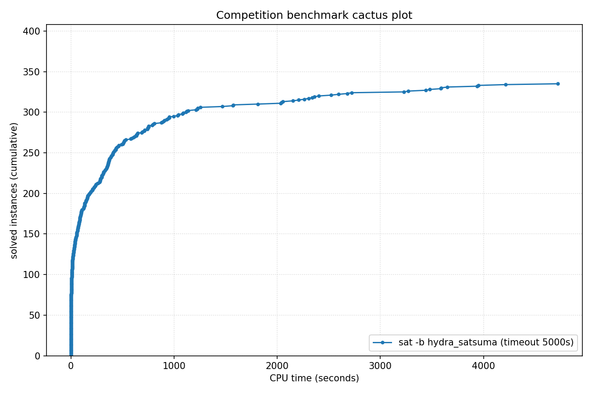

# Competition Benchmark Results (index=main_track_2026_official.jsonl, timeout=5000s, backend=hydra_satsuma, parallel=10)

## Summary

| Result | Count | % |
|--------|-------|---|
| SAT | 139 | 34.8% |
| UNSAT | 196 | 49.0% |
| TIMEOUT | 65 | 16.2% |
| **Total** | 400 | 100% |

### Solver effort (mean (min-max))

| Group | N | Paths covered | Conflicts | Conf/s | Restarts | Rst/s |
|-------|---|---------------|-----------|--------|----------|-------|
| SAT | 139 | — | — | — | — | — |
| UNSAT | 196 | — | — | — | — | — |
| TIMEOUT | 65 | — | — | — | — | — |
| Total | 400 | — | — | — | — | — |

## Cactus plot

## Per-problem results

| Problem | Result | Time | Paths | Total | Conf | Rst |
|---------|--------|------|-------|-------|------|-----|
| 14.normalised | SAT | 7.1891s | — | — | — | — |
| 13.normalised | SAT | 7.4736s | — | — | — | — |
| 18.normalised | SAT | 11.033s | — | — | — | — |
| 20.normalised | SAT | 4.6834s | — | — | — | — |
| 3.normalised | SAT | 12.3975s | — | — | — | — |
| 2.normalised | SAT | 16.8287s | — | — | — | — |
| 1.normalised | SAT | 21.1173s | — | — | — | — |
| 5.normalised | SAT | 36.6366s | — | — | — | — |
| SC25_Timetable_C_395_E_47_Cl_27_D_7_T_50.normalised | SAT | 22.391s | — | — | — | — |
| 8.normalised | SAT | 56.9337s | — | — | — | — |
| 11.normalised | SAT | 57.9978s | — | — | — | — |
| 10.normalised | SAT | 60.1264s | — | — | — | — |
| SC25_Timetable_C_393_E_45_Cl_26_D_7_T_50.normalised | SAT | 15.4141s | — | — | — | — |
| SC25_Timetable_C_481_E_49_Cl_32_D_7_T_58.normalised | SAT | 66.6204s | — | — | — | — |
| 17.normalised | SAT | 98.2939s | — | — | — | — |
| SC25_Timetable_C_496_E_48_Cl_33_D_7_T_50.normalised | SAT | 234.3372s | — | — | — | — |
| crusti_g2io_250_0.2_255_12.normalised | SAT | 240.5188s | — | — | — | — |
| SC25_Timetable_C_495_E_48_Cl_33_D_7_T_50.normalised | SAT | 384.8186s | — | — | — | — |
| crusti_g2io_175_0.2_511_10.normalised | SAT | 45.7994s | — | — | — | — |
| crusti_g2io_250_0.2_255_24.normalised | SAT | 77.0849s | — | — | — | — |
| crusti_g2io_200_0.1_127_19.normalised | SAT | 39.9978s | — | — | — | — |
| crusti_g2io_250_0.2_255_31.normalised | SAT | 14.7999s | — | — | — | — |
| SC25_Timetable_C_495_E_50_Cl_33_D_7_T_50.normalised | SAT | 3937.0401s | — | — | — | — |
| crusti_g2io_250_0.2_255_18.normalised | SAT | 17.907s | — | — | — | — |
| crusti_g2io_175_0.2_511_32.normalised | SAT | 13.0343s | — | — | — | — |
| SC25_Timetable_C_498_E_46_Cl_34_D_7_T_50.normalised | TIMEOUT | 4999.4196s | — | — | — | — |
| SC25_Timetable_C_466_E_39_Cl_31_D_7_T_58.normalised | TIMEOUT | 4999.3064s | — | — | — | — |
| SC25_Timetable_C_495_E_43_Cl_35_D_7_T_58.normalised | TIMEOUT | 4999.3103s | — | — | — | — |
| SC25_Timetable_C_470_E_39_Cl_32_D_7_T_58.normalised | TIMEOUT | 4999.1853s | — | — | — | — |
| SC25_Timetable_C_496_E_46_Cl_33_D_7_T_50.normalised | TIMEOUT | 4999.2885s | — | — | — | — |
| crusti_g2io_225_0.1_31_25.normalised | SAT | 29.7607s | — | — | — | — |
| SC25_Timetable_C_475_E_39_Cl_33_D_7_T_58.normalised | TIMEOUT | 4999.2195s | — | — | — | — |
| st_1391_70_12_1674.normalised | TIMEOUT | 4998.3472s | — | — | — | — |
| st_826_34_8_3910.normalised | TIMEOUT | 4998.3569s | — | — | — | — |
| st_890_86_9_572.normalised | TIMEOUT | 4998.3563s | — | — | — | — |
| lockchart-group1-L190-K276-p8d4j1.normalised | SAT | 686.7553s | — | — | — | — |
| st_1352_53_23_3737.normalised | TIMEOUT | 4998.315s | — | — | — | — |
| lockchart-group1-L240-K345-p8d4j1.normalised | TIMEOUT | 4998.6791s | — | — | — | — |
| lockchart-group2-rnd0.3-L19-K38-P8D4J1_1.normalised | TIMEOUT | 4998.3044s | — | — | — | — |
| lockchart-group1-L220-K317-p8d4j1.normalised | TIMEOUT | 4998.9294s | — | — | — | — |
| b20_1 | UNSAT | 4.358s | — | — | — | — |
| b20 | UNSAT | 6.4453s | — | — | — | — |
| s15850 | UNSAT | 0.9319s | — | — | — | — |
| b15 | UNSAT | 2.3549s | — | — | — | — |
| c7552 | UNSAT | 0.5824s | — | — | — | — |
| b22_1 | UNSAT | 7.396s | — | — | — | — |
| s38417 | UNSAT | 1.3159s | — | — | — | — |
| b21 | UNSAT | 6.0609s | — | — | — | — |
| c3540 | UNSAT | 0.7911s | — | — | — | — |
| lockchart-group3-L13-K26-p4d3j1.normalised | UNSAT | 1575.9469s | — | — | — | — |
| c5315 | UNSAT | 0.7982s | — | — | — | — |
| lockchart-group3-L15-K29-p4d3j1.normalised | UNSAT | 1033.0827s | — | — | — | — |
| lockchart-group3-L12-K24-p4d3j1.normalised | UNSAT | 1469.7964s | — | — | — | — |
| lockchart-group3-L11-K23-p4d3j1.normalised | UNSAT | 1042.6909s | — | — | — | — |
| lockchart-group1-L255-K366-p8d4j1.normalised | TIMEOUT | 4998.6528s | — | — | — | — |
| lockchart-group2-rnd0.3-L19-K38-P8D4J1_3 | TIMEOUT | 4998.2828s | — | — | — | — |
| oski15a01b74s_opt | UNSAT | 350.1973s | — | — | — | — |
| b19_1 | UNSAT | 407.3753s | — | — | — | — |
| b19 | UNSAT | 436.6381s | — | — | — | — |
| oski15a01b62s_opt | UNSAT | 392.7324s | — | — | — | — |
| oski15a01b03s_opt | UNSAT | 435.6151s | — | — | — | — |
| oski15a01b19s_opt | UNSAT | 404.4319s | — | — | — | — |
| oski15a01b64s_opt | UNSAT | 520.3535s | — | — | — | — |
| oski15a01b77s_opt | UNSAT | 295.8808s | — | — | — | — |
| gm24sparrc | UNSAT | 7.426s | — | — | — | — |
| lockchart-group2-rnd0.3-L19-K38-P8D4J1_2 | SAT | 4719.6225s | — | — | — | — |
| oski15a01b40s_opt | UNSAT | 373.6257s | — | — | — | — |
| oski15a01b60s_opt | UNSAT | 327.8223s | — | — | — | — |
| oski15a01b09s_opt | UNSAT | 342.593s | — | — | — | — |
| gm28sparrc | UNSAT | 11.5451s | — | — | — | — |
| gm32sparrc | UNSAT | 7.6334s | — | — | — | — |
| gm36sparrc | UNSAT | 5.2258s | — | — | — | — |
| oski15a01b52s_opt | UNSAT | 365.4996s | — | — | — | — |
| gm20sparrc | UNSAT | 0.6817s | — | — | — | — |
| oski15a01b15s_opt | UNSAT | 491.8665s | — | — | — | — |
| lockchart-group3-L14-K27-p4d3j1.normalised | UNSAT | 1123.1939s | — | — | — | — |
| oski15a01b02s_opt | UNSAT | 747.4123s | — | — | — | — |
| case12.normalised | UNSAT | 16.5699s | — | — | — | — |
| case6.normalised | SAT | 753.7069s | — | — | — | — |
| case10 | SAT | 440.8927s | — | — | — | — |
| case18.normalised | UNSAT | 280.712s | — | — | — | — |
| gm16spctrc | UNSAT | 511.1106s | — | — | — | — |
| case7.normalised | SAT | 125.4247s | — | — | — | — |
| case1.normalised | SAT | 534.3282s | — | — | — | — |
| case2 | SAT | 69.6172s | — | — | — | — |
| case9 | SAT | 69.8755s | — | — | — | — |
| case19.normalised | SAT | 37.3262s | — | — | — | — |
| MVRoundRobin_n12_d10_v3 | UNSAT | 0.0224s | — | — | — | — |
| MVRoundRobin_n16_d10_v2 | UNSAT | 0.0433s | — | — | — | — |
| MVRoundRobin_n12_d10_v2 | UNSAT | 0.0135s | — | — | — | — |
| RoundRobin_n17_d13 | UNSAT | 0.0031s | — | — | — | — |
| RoundRobin_n15_d13 | UNSAT | 0.003s | — | — | — | — |
| RoundRobin_n18_d16 | UNSAT | 0.0036s | — | — | — | — |
| RoundRobin_n16_d14 | UNSAT | 0.0024s | — | — | — | — |
| RoundRobin_n16_d13 | UNSAT | 0.0053s | — | — | — | — |
| RoundRobin_n18_d15 | UNSAT | 0.0033s | — | — | — | — |
| MVRoundRobin_n20_d10_v2 | UNSAT | 0.1223s | — | — | — | — |
| MVRoundRobin_n12_d10_v4 | UNSAT | 0.0368s | — | — | — | — |
| MVRoundRobin_n20_d10_v3 | UNSAT | 0.2194s | — | — | — | — |
| clqcl_30_7_6.normalised | UNSAT | 0.0065s | — | — | — | — |
| clqcl_30_8_7.normalised | UNSAT | 0.0097s | — | — | — | — |
| clqcl_30_11_10.normalised | UNSAT | 0.0226s | — | — | — | — |
| clqcl_25_9_8.normalised | UNSAT | 0.0087s | — | — | — | — |
| case11.normalised | SAT | 635.7483s | — | — | — | — |
| clqcl_25_7_6.normalised | UNSAT | 0.0041s | — | — | — | — |
| clqcl_30_9_8.normalised | UNSAT | 0.0121s | — | — | — | — |
| clqcl_70_6_5.normalised | UNSAT | 0.0157s | — | — | — | — |
| clqcl_60_6_5.normalised | UNSAT | 0.0119s | — | — | — | — |
| gm16spwtcl | TIMEOUT | 4999.0757s | — | — | — | — |
| clqcl_45_6_5.normalised | UNSAT | 0.0074s | — | — | — | — |
| clqcl_30_10_9.normalised | UNSAT | 0.0171s | — | — | — | — |
| gm24spctbk | TIMEOUT | 4998.9911s | — | — | — | — |
| gm32spctlf | TIMEOUT | 4999.2343s | — | — | — | — |
| gm16spwtrc | TIMEOUT | 4998.7918s | — | — | — | — |
| case3 | UNSAT | 796.2279s | — | — | — | — |
| gm24spctrc | TIMEOUT | 4999.1094s | — | — | — | — |
| gm20spctrc | TIMEOUT | 4998.7313s | — | — | — | — |
| case4 | TIMEOUT | 4998.3113s | — | — | — | — |
| 16_16_default_mapped_ultra_and_and_dadda_mapped_bit28 | UNSAT | 413.8152s | — | — | — | — |
| 16_16_default_mapped_ultra_and_and_dadda_origin_bit28 | UNSAT | 449.565s | — | — | — | — |
| 16_16_booth_wallace_mapped_and_default_origin_bit28 | UNSAT | 717.3275s | — | — | — | — |
| 16_16_booth_dadda_mapped_and_and_wallace_origin_bit28 | UNSAT | 787.2688s | — | — | — | — |
| 16_16_booth_dadda_origin_and_default_mapped_ultra_bit29 | UNSAT | 317.1398s | — | — | — | — |
| nla-digbench-scaling_dijkstra-u_valuebound1_transition | UNSAT | 1.2469s | — | — | — | — |
| cal182_cal182_transition | UNSAT | 4.7338s | — | — | — | — |
| bv_ILA_Piccolo_JALR_sanity_transition | UNSAT | 2.9167s | — | — | — | — |
| bv_ILA_Piccolo_BEQ_sanity_transition | UNSAT | 3.1613s | — | — | — | — |
| nla-digbench-scaling_freire1_valuebound1_transition | UNSAT | 2.1882s | — | — | — | — |
| ramsey_3_6_19.normalised | TIMEOUT | 4998.2741s | — | — | — | — |
| ramsey_4_4_18.normalised | UNSAT | 952.2082s | — | — | — | — |
| veer_axi_yosyshq_appnote_123_veer_axi-p06_transition | UNSAT | 10.9739s | — | — | — | — |
| 16_16_booth_dadda_origin_and_and_dadda_origin_bit29 | UNSAT | 387.0785s | — | — | — | — |
| x-epic_a19-p15_transition | UNSAT | 2.2703s | — | — | — | — |
| bv_rocket_1951_transition | UNSAT | 9.6006s | — | — | — | — |
| 16_16_booth_dadda_mapped_and_booth_wallace_mapped | UNSAT | 810.8625s | — | — | — | — |
| arles_thres10_p20_r4514 | UNSAT | 0.0046s | — | — | — | — |
| arles_thres20_p10_r7508 | UNSAT | 0.3859s | — | — | — | — |
| arles_thres10_p10_r8180 | UNSAT | 0.0065s | — | — | — | — |
| arles_thres20_p10_r7475 | UNSAT | 0.2784s | — | — | — | — |
| arles_thres10_p10_r8188 | UNSAT | 0.0031s | — | — | — | — |
| arles_thres20_p20_r4109 | UNSAT | 0.2822s | — | — | — | — |
| arles_thres10_p10_r8186 | UNSAT | 0.0031s | — | — | — | — |
| arles_thres20_p30_r2554 | UNSAT | 0.0028s | — | — | — | — |
| arles_thres10_p10_r8185 | UNSAT | 0.0046s | — | — | — | — |
| arles_thres10_p10_r8062 | UNSAT | 0.0029s | — | — | — | — |
| arles_thres20_p10_r7533 | UNSAT | 0.2637s | — | — | — | — |
| arles_thres10_p10_r8184 | UNSAT | 0.0057s | — | — | — | — |
| x-epic_a10-p53_transition | UNSAT | 9.4597s | — | — | — | — |
| bp4_CB_FPBEQ_FPBLE.normalised | UNSAT | 83.1085s | — | — | — | — |
| 16_16_booth_wallace_origin_and_and_dadda_mapped_bit28 | UNSAT | 888.1559s | — | — | — | — |
| 16_16_booth_dadda_origin_and_and_dadda_origin_bit28 | UNSAT | 1082.489s | — | — | — | — |
| 2018D_VexRiscv-regch0-20-p1_step | UNSAT | 132.943s | — | — | — | — |
| bp4_CB_LP_FPBLE.normalised | UNSAT | 120.2497s | — | — | — | — |
| bp4_BC012_TCO_CSO_LP_FPBEQ_ZR.normalised | SAT | 145.9348s | — | — | — | — |
| bp4_BC012_AM_IXA_LPI.normalised | UNSAT | 208.671s | — | — | — | — |
| bp4_CSO_AM_IXA_LP.normalised | UNSAT | 98.0139s | — | — | — | — |
| 16_16_and_wallace_origin_and_default_mapped_ultra_bit27 | UNSAT | 906.4881s | — | — | — | — |
| bp5_CSO.normalised | SAT | 263.9135s | — | — | — | — |
| 16_16_booth_dadda_mapped_and_and_wallace_mapped_bit28 | UNSAT | 899.0132s | — | — | — | — |
| bp4_BC012_AM_FPBEQ_ZR.normalised | SAT | 2405.4095s | — | — | — | — |
| bp4_TCO_CSO_ZR.normalised | SAT | 636.9295s | — | — | — | — |
| 16_16_booth_dadda_mapped_and_booth_wallace_origin | UNSAT | 2521.2048s | — | — | — | — |
| x-epic_a19-p16_step | UNSAT | 187.2617s | — | — | — | — |
| oddball_43_5_tto_zp.normalised | SAT | 83.3926s | — | — | — | — |
| bp5.normalised | SAT | 1812.3083s | — | — | — | — |
| bp4_TCO_CB_LP.normalised | UNSAT | 134.1198s | — | — | — | — |
| bp4_CB_CSO_LP_FPBEQ_FPBLE.normalised | UNSAT | 208.5086s | — | — | — | — |
| bp4_BC012_TCO_AM_FPBEQ_ZR.normalised | SAT | 2032.9891s | — | — | — | — |
| nla-digbench-scaling_dijkstra-u_valuebound1_step | UNSAT | 244.5264s | — | — | — | — |
| oddball_13_5_ttf.normalised | UNSAT | 16.0223s | — | — | — | — |
| oddball_20_5_ttf.normalised | UNSAT | 4.8657s | — | — | — | — |
| oddball_44_5_tto_zp.normalised | SAT | 75.63s | — | — | — | — |
| oddball_20_4_ttf.normalised | UNSAT | 7.751s | — | — | — | — |
| bp4_BC012_IXA_LPI_FPBLE.normalised | UNSAT | 588.6358s | — | — | — | — |
| oddball_24_4_ttf.normalised | UNSAT | 283.2659s | — | — | — | — |
| oddball_47_5_tto_zp.normalised | SAT | 1138.973s | — | — | — | — |
| oddball_51_5_tto_zp.normalised | SAT | 154.697s | — | — | — | — |
| oddball_54_5_tto_zp.normalised | SAT | 408.8281s | — | — | — | — |
| bp4_TCO_AM_IXA_FPBLE.normalised | UNSAT | 350.4799s | — | — | — | — |
| bp4_BC012_TCO_AM_IXA.normalised | UNSAT | 397.1203s | — | — | — | — |
| 45-126477 | SAT | 193.1126s | — | — | — | — |
| qpr-bmp280-driver-5 | SAT | 2.8459s | — | — | — | — |
| oddball_70_5_tto_zp.normalised | SAT | 3478.7707s | — | — | — | — |
| ssp-0.46172681388173037 | SAT | 335.4982s | — | — | — | — |
| bp4_BC012_AM_IXA_FPBLE.normalised | UNSAT | 421.1956s | — | — | — | — |
| clqcl_40_6_5.normalised | UNSAT | 0.006s | — | — | — | — |
| gensys-ukn006.shuffled-as.sat05-3846 | UNSAT | 151.0946s | — | — | — | — |
| hid-uns-enc-6-1-0-0-0-0-26462 | UNSAT | 90.8939s | — | — | — | — |
| bench_5078.smt2 | SAT | 26.0581s | — | — | — | — |
| le450_15a.col.15 | UNSAT | 0.4041s | — | — | — | — |
| x2_72.shuffled-as.sat03-1604 | UNSAT | 0.0021s | — | — | — | — |
| oddball_33_4_ttf.normalised | UNSAT | 2305.2734s | — | — | — | — |
| oddball_56_5_tto_zp.normalised | SAT | 4216.0195s | — | — | — | — |
| E02F20 | SAT | 15.5948s | — | — | — | — |
| squ_ali_s10x10_c39_abix_SAT-sc2017 | SAT | 16.819s | — | — | — | — |
| oddball_28_4_ttf.normalised | UNSAT | 2209.0734s | — | — | — | — |
| oddball_79_5_tto_zp.normalised | TIMEOUT | 4999.3166s | — | — | — | — |
| SCPC-900-27 | SAT | 710.1643s | — | — | — | — |
| oddball_26_4_ttf.normalised | UNSAT | 605.4829s | — | — | — | — |
| 49-134444 | SAT | 2043.2729s | — | — | — | — |
| post-cbmc-aes-d-r2-noholes | UNSAT | 86.9962s | — | — | — | — |
| mp1-bsat210-739 | UNSAT | 694.2631s | — | — | — | — |
| oddball_29_4_ttf.normalised | UNSAT | 740.9134s | — | — | — | — |
| multiplier_16bits__miter_19 | TIMEOUT | 4998.2864s | — | — | — | — |
| b20 | UNSAT | 6.5409s | — | — | — | — |
| cliquecoloring_n24_k6_c5 | UNSAT | 0.0098s | — | — | — | — |
| or_randxor_k3_n510_m510.sanitized | UNSAT | 4.1616s | — | — | — | — |
| two-trees-1023v.sanitized | TIMEOUT | 4998.2807s | — | — | — | — |
| 19.normalised | SAT | 14.8854s | — | — | — | — |
| transport-transport-three-cities-sequential-14nodes-1000size-4degree-100mindistance-4trucks-14packages-2008seed.020-NOTKNOWN | SAT | 58.7672s | — | — | — | — |
| bphp_p51_h50.sanitized | TIMEOUT | 4998.298s | — | — | — | — |
| VanDerWaerden_pd_2-3-25_606 | SAT | 3586.3965s | — | — | — | — |
| cfi-rigid-t2-0048-04-or_3_shuffle_all | SAT | 161.3028s | — | — | — | — |
| mp1-Nb6T27 | SAT | 461.1439s | — | — | — | — |
| oski15a01b70s_opt | UNSAT | 301.1137s | — | — | — | — |
| connm-ue-csp-sat-n1200-d-0.02-s405595518.shuffled-as.sat05-531 | TIMEOUT | 4998.41s | — | — | — | — |
| 20180321_140833987_p_cnf_320_1120 | SAT | 2340.2609s | — | — | — | — |
| sted1_0x0-637 | SAT | 347.717s | — | — | — | — |
| 1-ZC-1024-K-117.sanitized | TIMEOUT | 4998.6042s | — | — | — | — |
| hid-uns-enc-6-1-0-0-0-0-28258 | UNSAT | 47.2228s | — | — | — | — |
| simon-r22-1.sanitized | SAT | 0.2777s | — | — | — | — |
| hwmcc10-timeframe-expansion-k45-pdtpmsgoodbakery-tseitin | UNSAT | 49.8481s | — | — | — | — |
| 1-ZC-512-K-60.sanitized | SAT | 427.2805s | — | — | — | — |
| stone-width3chain-nmarkers-13_shuffled | UNSAT | 64.1217s | — | — | — | — |
| sum_of_3_cubes_94_bits_30 | TIMEOUT | 4998.5334s | — | — | — | — |
| 4g_5color_170_050_05 | SAT | 175.9342s | — | — | — | — |
| puzzle57_sat | TIMEOUT | 4999.4992s | — | — | — | — |
| lockchart-group1-L235-K339-p8d4j1.normalised | TIMEOUT | 4998.5474s | — | — | — | — |
| ssp-0.497665446947731 | SAT | 321.3492s | — | — | — | — |
| sat-bench-trig-taylor2 | UNSAT | 308.6455s | — | — | — | — |
| gto_p50c314 | TIMEOUT | 4998.2706s | — | — | — | — |
| mchess_20 | UNSAT | 0.0008s | — | — | — | — |
| ncc_none_5047_6_3_3_3_0_435991723 | SAT | 29.3708s | — | — | — | — |
| floodit_4_n70_k10_m229 | SAT | 127.3022s | — | — | — | — |
| LZMAFile_write_12 | UNSAT | 0.2653s | — | — | — | — |
| newpol29-4 | UNSAT | 365.3117s | — | — | — | — |
| RoundRobin_n17_d14 | UNSAT | 0.0028s | — | — | — | — |
| ezfact64_6.shuffled-as.sat05-453 | SAT | 30.0395s | — | — | — | — |
| mchess_17 | UNSAT | 0.0006s | — | — | — | — |
| ncc_none_3001_7_3_3_1_31_435991723 | SAT | 42.4711s | — | — | — | — |
| crn_40_1521_s | TIMEOUT | 4998.3369s | — | — | — | — |
| ecarev-110-1031-23-40-8-sc2018 | SAT | 226.5175s | — | — | — | — |
| slp-synthesis-aes-bottom22 | TIMEOUT | 4998.6361s | — | — | — | — |
| ramsey_4_4_18.normalised | UNSAT | 941.0426s | — | — | — | — |
| mp1-blockpuzzle_5x10_s8_free3 | UNSAT | 3.3103s | — | — | — | — |
| lec_mult_DvK_12x11.sanitized | UNSAT | 2153.4378s | — | — | — | — |
| x2_64.shuffled-as.sat03-1603 | UNSAT | 0.0024s | — | — | — | — |
| satcoin-genesis-UNSAT-12300 | UNSAT | 503.3835s | — | — | — | — |
| urqh5x5.shuffled-as.sat03-1481.cnf.mis-127.debugged | TIMEOUT | 4998.3426s | — | — | — | — |
| peb-pyrofpyr-15-neq-3_shuffled | UNSAT | 258.7717s | — | — | — | — |
| bench_3098.smt2 | SAT | 18.1512s | — | — | — | — |
| homer12.shuffled | UNSAT | 0.3019s | — | — | — | — |
| UNSAT_MS_opt_termes_p20.pddl_105 | TIMEOUT | 4998.6689s | — | — | — | — |
| baseballcover12with25_and4positions | SAT | 367.8677s | — | — | — | — |
| cube-11-h14-sat | SAT | 518.1764s | — | — | — | — |
| UNSAT_MS_opt_snake_p17.pddl_61 | TIMEOUT | 4998.7283s | — | — | — | — |
| Steiner-729-112-bce | TIMEOUT | 4998.362s | — | — | — | — |
| mdp-28-10-sat | SAT | 110.144s | — | — | — | — |
| color-11-3.shuffled-as.sat05-445 | TIMEOUT | 4998.352s | — | — | — | — |
| bvsub_06991 | UNSAT | 18.5154s | — | — | — | — |
| SCPC-500-7 | UNSAT | 29.5097s | — | — | — | — |
| arles_thres20_p10_r7475 | UNSAT | 0.6606s | — | — | — | — |
| sum_of_3_cubes_108_bits_52 | TIMEOUT | 4998.6217s | — | — | — | — |
| 005 | SAT | 301.1426s | — | — | — | — |
| Mycielski-11-hints-1 | UNSAT | 358.4044s | — | — | — | — |
| oddball_80_5_tto_zp.normalised | TIMEOUT | 4999.229s | — | — | — | — |
| 1-ET-512-K-98.sanitized | TIMEOUT | 4998.4616s | — | — | — | — |
| 008-80-8 | SAT | 3229.0838s | — | — | — | — |
| aes_decry_2_rounds.debugged | UNSAT | 88.2729s | — | — | — | — |
| Mycielski-10-hints-6 | TIMEOUT | 4998.7444s | — | — | — | — |
| 170224890 | SAT | 37.0074s | — | — | — | — |
| rook-44-1-1 | UNSAT | 103.0323s | — | — | — | — |
| sncf_model_ixl_bmc_depth_15 | TIMEOUT | 4998.8028s | — | — | — | — |
| shuffling-1-s1931574585-of-bench-sat04-328.used-as.sat04-449 | UNSAT | 4.0968s | — | — | — | — |
| rphp_p6_r540 | UNSAT | 3.045s | — | — | — | — |
| x9-12022.sat.sanitized | SAT | 1256.2151s | — | — | — | — |
| bvurem_17.smt2 | UNSAT | 616.8605s | — | — | — | — |
| connm-ue-csp-sat-n1200-d-0.02-s383740539.sat05-534.reshuffled-07 | SAT | 2678.6957s | — | — | — | — |
| posixpath_expanduser_14 | UNSAT | 0.2874s | — | — | — | — |
| b19_1 | UNSAT | 354.0701s | — | — | — | — |
| queen12_12.col.12 | UNSAT | 0.3212s | — | — | — | — |
| aes_32_4_keyfind_1 | TIMEOUT | 4998.2668s | — | — | — | — |
| SGI_30_60_28_40_7-log.shuffled-as.sat03-127 | UNSAT | 2054.8364s | — | — | — | — |
| ssp-0.046166496845693274 | TIMEOUT | 4998.3338s | — | — | — | — |
| hcp_d14_14 | SAT | 2360.6287s | — | — | — | — |
| mp1-blockpuzzle_5x12_s6_free3 | UNSAT | 5.626s | — | — | — | — |
| eq.atree.braun.13.unsat | UNSAT | 2724.0655s | — | — | — | — |
| MVD_ADS_S11_7_7 | SAT | 7.2342s | — | — | — | — |
| oddball_22_5_ttf.normalised | UNSAT | 3.4044s | — | — | — | — |
| linvrinv5.shuffled-as.sat05-564 | UNSAT | 877.461s | — | — | — | — |
| gt-025.shuffled-as.sat05-1306 | UNSAT | 0.7669s | — | — | — | — |
| si2-r001-m200-00 | SAT | 11.5581s | — | — | — | — |
| HCP-470-105 | SAT | 1224.5868s | — | — | — | — |
| case13.normalised | SAT | 30.8378s | — | — | — | — |
| EDP3-16000 | TIMEOUT | 4998.5637s | — | — | — | — |
| stable-400-0.1-11-98765432140011 | SAT | 132.7621s | — | — | — | — |
| x9-11067.sat.sanitized | SAT | 75.7101s | — | — | — | — |
| sted5_0x0-157 | SAT | 1230.4632s | — | — | — | — |
| x-epic_a19-p15_transition | UNSAT | 2.5305s | — | — | — | — |
| Karatsuba4477457x5308417 | SAT | 58.4557s | — | — | — | — |
| 01-integer-programming-5-10-100 | TIMEOUT | 4998.3734s | — | — | — | — |
| 18.normalised | SAT | 15.8237s | — | — | — | — |
| abw-T-dwt__592.mtx-w98 | SAT | 80.4624s | — | — | — | — |
| q_query_3_L200_coli.sat | UNSAT | 95.9895s | — | — | — | — |
| clauses-8.shuffled-as.sat05-1969 | SAT | 129.4328s | — | — | — | — |
| FmlaImplyChain_3_7_7.sanitized | UNSAT | 213.8492s | — | — | — | — |
| x9-11035.sat.sanitized | SAT | 5.0602s | — | — | — | — |
| constraints_16_0.4_1.sanitized | UNSAT | 59.3629s | — | — | — | — |
| mrpp_8x8#20_16 | SAT | 12.0695s | — | — | — | — |
| esawn_uw3.debugged | SAT | 21.622s | — | — | — | — |
| Kakuro-easy-138-ext.xml.hg_5 | SAT | 173.5483s | — | — | — | — |
| 31.smt2 | SAT | 99.0158s | — | — | — | — |
| or_randxor_k3_n590_m590.sanitized | UNSAT | 7.4466s | — | — | — | — |
| strips-gripper-12t22.shuffled-as.sat05-1151 | UNSAT | 7.9418s | — | — | — | — |
| sted5_0x1e3-120 | SAT | 78.3156s | — | — | — | — |
| floodit_7_n70_k10_m230 | SAT | 86.0063s | — | — | — | — |
| 01-integer-programming-20-30-40 | SAT | 744.7575s | — | — | — | — |
| pyhala-braun-unsat-40-4-02.shuffled-as.sat05-459 | UNSAT | 43.1797s | — | — | — | — |
| grs-48-160 | UNSAT | 930.7117s | — | — | — | — |
| sp5-26-19-bin-nons-tree-noid | SAT | 1570.6316s | — | — | — | — |
| sgen1-unsat-103-100.cnf.mis-78.debugged | UNSAT | 287.9001s | — | — | — | — |
| oski15a01b38s_opt | UNSAT | 357.5453s | — | — | — | — |
| md5_48_3 | SAT | 16.1646s | — | — | — | — |
| x9-12096.sat.sanitized | SAT | 752.8588s | — | — | — | — |
| satcoin-genesis-UNSAT-6120 | UNSAT | 506.42s | — | — | — | — |
| w19-8.0 | UNSAT | 143.5431s | — | — | — | — |
| Folkman-185-152478531.sanitized | SAT | 178.9376s | — | — | — | — |
| 59-131122 | SAT | 952.9452s | — | — | — | — |
| shuffling-1-s1948244678-of-bench-sat04-301.used-as.sat04-476 | UNSAT | 85.0386s | — | — | — | — |
| med30.shuffled | SAT | 1.7013s | — | — | — | — |
| LABS_n089_goal008-sc2013 | SAT | 1091.7556s | — | — | — | — |
| 46-128972 | SAT | 373.4742s | — | — | — | — |
| hash_table_find_safety_size_21 | UNSAT | 148.1805s | — | — | — | — |
| abw-T-dwt__592.mtx-w102 | SAT | 463.3379s | — | — | — | — |
| gt-ordering-unsat-gt-045.sat05-1310.reshuffled-07 | UNSAT | 3.548s | — | — | — | — |
| stable-400-0.1-12-98765432140012 | SAT | 3271.0364s | — | — | — | — |
| asconhashv12_opt64_H8_M2-1yQCyA0j_m2_6.c | SAT | 3.8859s | — | — | — | — |
| satcoin-genesis-SAT-16 | SAT | 3.2859s | — | — | — | — |
| SAT_instance_N=85 | TIMEOUT | 4998.3461s | — | — | — | — |
| lockchart-group1-L190-K276-p8d4j1.normalised | SAT | 643.8333s | — | — | — | — |
| ex025_19 | UNSAT | 3590.517s | — | — | — | — |
| SAT_dat.k40.debugged | UNSAT | 163.0999s | — | — | — | — |
| mdp-32-12-sat | SAT | 1117.5127s | — | — | — | — |
| safe-50-h49-unsat | TIMEOUT | 4999.3092s | — | — | — | — |
| battleship-20-39-sat | SAT | 66.4836s | — | — | — | — |
| puzzle42_unsat | TIMEOUT | 4998.4192s | — | — | — | — |
| mm-2x3-8-8-sb.1.shuffled-as.sat03-1504.used-as.sat04-829 | UNSAT | 222.9423s | — | — | — | — |
| SE_PR_stb_588_138.apx_1 | SAT | 2.7336s | — | — | — | — |
| reconf10_22_queen20_3_8667 | SAT | 998.655s | — | — | — | — |
| manthey_DimacsSorterHalf_35_9 | SAT | 200.2182s | — | — | — | — |
| hantzsche_wendt_unit_83 | UNSAT | 580.5415s | — | — | — | — |
| gus-md5-15 | TIMEOUT | 4998.4929s | — | — | — | — |
| Q3inK12 | SAT | 70.0786s | — | — | — | — |
| ex095_8 | UNSAT | 2595.362s | — | — | — | — |
| Kakuro-easy-106-ext.xml.hg_6 | SAT | 158.968s | — | — | — | — |
| b04_s_unknown | SAT | 161.8141s | — | — | — | — |
| full-bg-gb-9-ce | SAT | 3438.7018s | — | — | — | — |
| 2.normalised | SAT | 21.7776s | — | — | — | — |
| summle_X8651_steps8_I1-2-2-4-4-8-25-100 | SAT | 13.5123s | — | — | — | — |
| ncc_none_12477_5_3_3_0_0_435991723 | UNSAT | 22.5131s | — | — | — | — |
| Break_14_60.xml | SAT | 41.6132s | — | — | — | — |
| asconhashv12_opt64_H6_M2-4XKSMr_m1_3_U25.c | UNSAT | 103.8832s | — | — | — | — |
| urqh1c5x5.shuffled-as.sat03-1468.cnf.mis-103.debugged | TIMEOUT | 4998.424s | — | — | — | — |
| oski15a01b09s_opt | UNSAT | 361.4705s | — | — | — | — |
| shuffling-2-s340247357-of-bench-sat04-361.used-as.sat04-638 | UNSAT | 2.0467s | — | — | — | — |
| IBM_FV_2004_rule_batch_1_31_2_SAT_dat.k95.debugged | UNSAT | 38.2285s | — | — | — | — |
| gus-md5-14-sc2009 | TIMEOUT | 4998.5217s | — | — | — | — |
| PRP_40_40 | SAT | 29.2111s | — | — | — | — |
| vlsat2_40896_6104639.dimacs | TIMEOUT | 4998.5037s | — | — | — | — |
| baseballcover13with25_and1positions | SAT | 52.9365s | — | — | — | — |
| clauses-8.renamed-as.sat05-1964 | SAT | 132.9704s | — | — | — | — |
| tseitingrid6x185_shuffled | UNSAT | 0.0247s | — | — | — | — |
| rphp5_045_shuffled | UNSAT | 0.2986s | — | — | — | — |
| at-least-two-sokoban-sequential-p145-microban-sequential.030-NOTKNOWN | UNSAT | 312.2538s | — | — | — | — |
| 5col160_15_6.shuffled | TIMEOUT | 4998.3029s | — | — | — | — |
| Circuit_multiplier37 | SAT | 9.3992s | — | — | — | — |
| post-cbmc-aes-ee-r2-noholes | UNSAT | 89.5989s | — | — | — | — |
| 48-134487 | SAT | 3951.3511s | — | — | — | — |
| linked_list_swap_contents_safety_unwind57 | UNSAT | 38.3715s | — | — | — | — |
| sgp_9-4-8.shuffled-as.sat05-2673 | TIMEOUT | 4998.6161s | — | — | — | — |
| baseballcover11with22_and2positions | SAT | 299.3556s | — | — | — | — |
| oski15a01b42s_opt | UNSAT | 315.3692s | — | — | — | — |
| sin-mitern26 | UNSAT | 288.3404s | — | — | — | — |
| GP_100_951_33 | SAT | 11.618s | — | — | — | — |
| rbsat-v760c43649g8 | SAT | 1213.1763s | — | — | — | — |
| g2-T122.1.0 | UNSAT | 376.3711s | — | — | — | — |
| SC23_Timetable_C_476_E_50_Cl_32_D_6_T_50 | SAT | 97.4014s | — | — | — | — |
| pyhala-braun-sat-40-4-03.shuffled-as.sat03-1541 | SAT | 42.4956s | — | — | — | — |
| battleship-19-19-unsat | TIMEOUT | 4998.3041s | — | — | — | — |
| sum_of_3_cubes_145_bits_74 | TIMEOUT | 4998.8561s | — | — | — | — |
| vlsat2_21573_2289124.dimacs | SAT | 6.9926s | — | — | — | — |
| toughsat_factoring_895s | SAT | 279.93s | — | — | — | — |
| marg6x6.shuffled-as.sat03-1456.cnf.mis-119.debugged | TIMEOUT | 4998.3358s | — | — | — | — |
| xor_op_n46_d3 | UNSAT | 2263.8759s | — | — | — | — |
| worker_50_50_30_0.8 | TIMEOUT | 4998.3016s | — | — | — | — |
| ctl_4201_555_unsat_pre | UNSAT | 648.2299s | — | — | — | — |
| custmulsb2x32o | UNSAT | 3650.3479s | — | — | — | — |
| 30_2 | TIMEOUT | 4998.3022s | — | — | — | — |
| b2005-p3-14x14c17h9-Ser8-0 | TIMEOUT | 4999.2297s | — | — | — | — |
| mp1-rubikcube220 | TIMEOUT | 4998.2627s | — | — | — | — |
