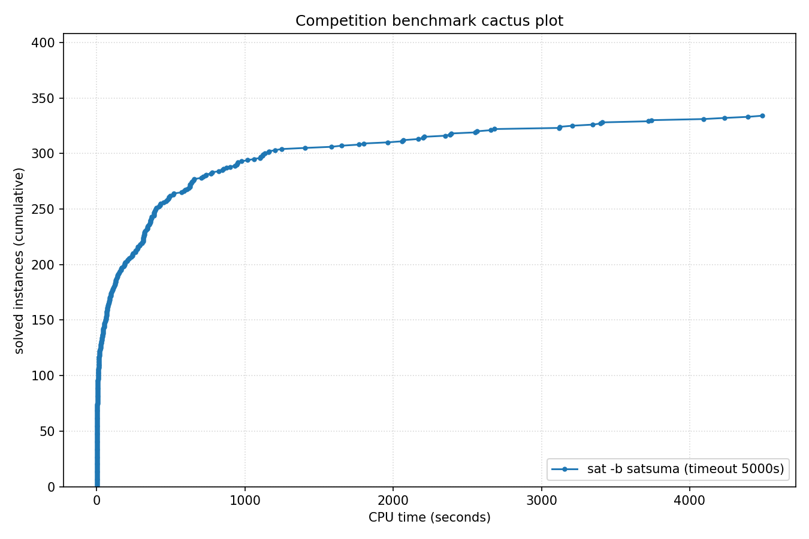

# Competition Benchmark Results (index=main_track_2026_official.jsonl, timeout=5000s, backend=satsuma, parallel=10)

## Summary

| Result | Count | % |
|--------|-------|---|
| SAT | 139 | 34.8% |
| UNSAT | 195 | 48.8% |
| TIMEOUT | 66 | 16.5% |
| **Total** | 400 | 100% |

### Solver effort (mean (min-max))

| Group | N | Paths covered | Conflicts | Conf/s | Restarts | Rst/s |
|-------|---|---------------|-----------|--------|----------|-------|
| SAT | 139 | — | — | — | — | — |
| UNSAT | 195 | — | — | — | — | — |
| TIMEOUT | 66 | — | — | — | — | — |
| Total | 400 | — | — | — | — | — |

## Cactus plot

## Per-problem results

| Problem | Result | Time | Paths | Total | Conf | Rst |
|---------|--------|------|-------|-------|------|-----|
| 14.normalised | SAT | 6.9346s | — | — | — | — |
| 13.normalised | SAT | 7.6863s | — | — | — | — |
| 18.normalised | SAT | 11.0525s | — | — | — | — |
| 20.normalised | SAT | 4.7028s | — | — | — | — |
| 3.normalised | SAT | 12.6217s | — | — | — | — |
| 2.normalised | SAT | 17.4327s | — | — | — | — |
| 1.normalised | SAT | 22.2664s | — | — | — | — |
| 5.normalised | SAT | 38.4296s | — | — | — | — |
| SC25_Timetable_C_395_E_47_Cl_27_D_7_T_50.normalised | SAT | 22.6642s | — | — | — | — |
| 8.normalised | SAT | 60.7518s | — | — | — | — |
| 11.normalised | SAT | 63.8205s | — | — | — | — |
| 10.normalised | SAT | 64.9053s | — | — | — | — |
| SC25_Timetable_C_393_E_45_Cl_26_D_7_T_50.normalised | SAT | 15.8332s | — | — | — | — |
| SC25_Timetable_C_481_E_49_Cl_32_D_7_T_58.normalised | SAT | 65.9012s | — | — | — | — |
| 17.normalised | SAT | 102.248s | — | — | — | — |
| SC25_Timetable_C_496_E_48_Cl_33_D_7_T_50.normalised | SAT | 240.4766s | — | — | — | — |
| crusti_g2io_250_0.2_255_12.normalised | SAT | 241.4822s | — | — | — | — |
| SC25_Timetable_C_495_E_48_Cl_33_D_7_T_50.normalised | SAT | 386.0879s | — | — | — | — |
| crusti_g2io_175_0.2_511_10.normalised | SAT | 43.8374s | — | — | — | — |
| crusti_g2io_250_0.2_255_24.normalised | SAT | 80.5989s | — | — | — | — |
| crusti_g2io_200_0.1_127_19.normalised | SAT | 40.9821s | — | — | — | — |
| crusti_g2io_250_0.2_255_31.normalised | SAT | 15.1801s | — | — | — | — |
| SC25_Timetable_C_495_E_50_Cl_33_D_7_T_50.normalised | SAT | 4092.7881s | — | — | — | — |
| crusti_g2io_250_0.2_255_18.normalised | SAT | 17.5821s | — | — | — | — |
| crusti_g2io_175_0.2_511_32.normalised | SAT | 13.0614s | — | — | — | — |
| SC25_Timetable_C_498_E_46_Cl_34_D_7_T_50.normalised | TIMEOUT | 4998.4859s | — | — | — | — |
| SC25_Timetable_C_466_E_39_Cl_31_D_7_T_58.normalised | TIMEOUT | 4998.4698s | — | — | — | — |
| SC25_Timetable_C_495_E_43_Cl_35_D_7_T_58.normalised | TIMEOUT | 4998.5373s | — | — | — | — |
| SC25_Timetable_C_470_E_39_Cl_32_D_7_T_58.normalised | TIMEOUT | 4998.6554s | — | — | — | — |
| SC25_Timetable_C_496_E_46_Cl_33_D_7_T_50.normalised | TIMEOUT | 4998.4434s | — | — | — | — |
| crusti_g2io_225_0.1_31_25.normalised | SAT | 30.5788s | — | — | — | — |
| SC25_Timetable_C_475_E_39_Cl_33_D_7_T_58.normalised | TIMEOUT | 4998.4537s | — | — | — | — |
| st_1391_70_12_1674.normalised | TIMEOUT | 4998.3872s | — | — | — | — |
| st_826_34_8_3910.normalised | TIMEOUT | 4998.3223s | — | — | — | — |
| st_890_86_9_572.normalised | TIMEOUT | 4998.3149s | — | — | — | — |
| lockchart-group1-L190-K276-p8d4j1.normalised | SAT | 738.2594s | — | — | — | — |
| st_1352_53_23_3737.normalised | TIMEOUT | 4998.3589s | — | — | — | — |
| lockchart-group1-L240-K345-p8d4j1.normalised | TIMEOUT | 4998.6473s | — | — | — | — |
| lockchart-group2-rnd0.3-L19-K38-P8D4J1_1.normalised | TIMEOUT | 4998.3339s | — | — | — | — |
| lockchart-group1-L220-K317-p8d4j1.normalised | TIMEOUT | 4998.5825s | — | — | — | — |
| b20 | UNSAT | 6.5895s | — | — | — | — |
| b20_1 | UNSAT | 4.4446s | — | — | — | — |
| s15850 | UNSAT | 0.9928s | — | — | — | — |
| b15 | UNSAT | 2.4016s | — | — | — | — |
| c7552 | UNSAT | 0.6514s | — | — | — | — |
| b22_1 | UNSAT | 7.3904s | — | — | — | — |
| s38417 | UNSAT | 1.4025s | — | — | — | — |
| b21 | UNSAT | 6.1484s | — | — | — | — |
| c3540 | UNSAT | 0.8053s | — | — | — | — |
| c5315 | UNSAT | 0.7836s | — | — | — | — |
| lockchart-group3-L15-K29-p4d3j1.normalised | UNSAT | 1107.7269s | — | — | — | — |
| lockchart-group1-L255-K366-p8d4j1.normalised | TIMEOUT | 4998.7145s | — | — | — | — |
| lockchart-group2-rnd0.3-L19-K38-P8D4J1_3 | TIMEOUT | 4998.3014s | — | — | — | — |
| lockchart-group3-L11-K23-p4d3j1.normalised | UNSAT | 1123.5121s | — | — | — | — |
| lockchart-group3-L13-K26-p4d3j1.normalised | UNSAT | 1651.2893s (proof unchecked: dsr-trim timeout (unchecked)) | — | — | — | — |
| b19_1 | UNSAT | 370.53s | — | — | — | — |
| b19 | UNSAT | 401.4362s | — | — | — | — |
| lockchart-group3-L12-K24-p4d3j1.normalised | UNSAT | 1581.2317s (proof unchecked: dsr-trim timeout (unchecked)) | — | — | — | — |
| oski15a01b74s_opt | UNSAT | 321.6018s | — | — | — | — |
| oski15a01b03s_opt | UNSAT | 395.1585s | — | — | — | — |
| oski15a01b77s_opt | UNSAT | 287.896s | — | — | — | — |
| oski15a01b62s_opt | UNSAT | 341.0545s | — | — | — | — |
| oski15a01b64s_opt | UNSAT | 467.083s | — | — | — | — |
| oski15a01b19s_opt | UNSAT | 356.547s | — | — | — | — |
| gm24sparrc | UNSAT | 6.8642s | — | — | — | — |
| lockchart-group2-rnd0.3-L19-K38-P8D4J1_2 | SAT | 4489.194s | — | — | — | — |
| oski15a01b40s_opt | UNSAT | 370.6131s | — | — | — | — |
| oski15a01b15s_opt | UNSAT | 475.5872s | — | — | — | — |
| oski15a01b60s_opt | UNSAT | 334.647s | — | — | — | — |
| gm28sparrc | UNSAT | 10.6633s | — | — | — | — |
| gm32sparrc | UNSAT | 7.9668s | — | — | — | — |
| gm36sparrc | UNSAT | 5.0208s | — | — | — | — |
| oski15a01b09s_opt | UNSAT | 343.3658s | — | — | — | — |
| gm20sparrc | UNSAT | 0.662s | — | — | — | — |
| lockchart-group3-L14-K27-p4d3j1.normalised | UNSAT | 977.143s | — | — | — | — |
| oski15a01b52s_opt | UNSAT | 362.7604s | — | — | — | — |
| oski15a01b02s_opt | UNSAT | 658.9806s | — | — | — | — |
| case12.normalised | UNSAT | 15.6746s | — | — | — | — |
| case10 | SAT | 431.8712s | — | — | — | — |
| case6.normalised | SAT | 735.4829s | — | — | — | — |
| gm16spctrc | UNSAT | 515.7457s | — | — | — | — |
| case7.normalised | SAT | 125.4175s | — | — | — | — |
| case18.normalised | UNSAT | 276.9987s | — | — | — | — |
| case1.normalised | SAT | 520.7062s | — | — | — | — |
| case2 | SAT | 69.5944s | — | — | — | — |
| case9 | SAT | 69.3477s | — | — | — | — |
| case19.normalised | SAT | 34.902s | — | — | — | — |
| MVRoundRobin_n12_d10_v3 | UNSAT | 1.0097s | — | — | — | — |
| MVRoundRobin_n16_d10_v2 | UNSAT | 1.3558s | — | — | — | — |
| MVRoundRobin_n12_d10_v2 | UNSAT | 0.6481s | — | — | — | — |
| RoundRobin_n17_d13 | UNSAT | 0.5089s | — | — | — | — |
| RoundRobin_n15_d13 | UNSAT | 0.4935s | — | — | — | — |
| RoundRobin_n18_d16 | UNSAT | 0.5351s | — | — | — | — |
| RoundRobin_n16_d14 | UNSAT | 0.4725s | — | — | — | — |
| RoundRobin_n16_d13 | UNSAT | 0.4176s | — | — | — | — |
| RoundRobin_n18_d15 | UNSAT | 0.6505s | — | — | — | — |
| MVRoundRobin_n20_d10_v2 | UNSAT | 3.1288s | — | — | — | — |
| MVRoundRobin_n12_d10_v4 | UNSAT | 1.6275s | — | — | — | — |
| case11.normalised | SAT | 636.9704s | — | — | — | — |
| clqcl_30_7_6.normalised | UNSAT | 0.3128s | — | — | — | — |
| clqcl_30_8_7.normalised | UNSAT | 0.3377s | — | — | — | — |
| clqcl_30_11_10.normalised | UNSAT | 0.3997s | — | — | — | — |
| clqcl_25_9_8.normalised | UNSAT | 0.3298s | — | — | — | — |
| clqcl_70_6_5.normalised | UNSAT | 0.559s | — | — | — | — |
| clqcl_25_7_6.normalised | UNSAT | 0.3126s | — | — | — | — |
| clqcl_30_9_8.normalised | UNSAT | 0.4075s | — | — | — | — |
| clqcl_60_6_5.normalised | UNSAT | 0.4766s | — | — | — | — |
| MVRoundRobin_n20_d10_v3 | UNSAT | 5.3689s | — | — | — | — |
| gm16spwtcl | TIMEOUT | 4998.4706s | — | — | — | — |
| clqcl_45_6_5.normalised | UNSAT | 0.3632s | — | — | — | — |
| clqcl_30_10_9.normalised | UNSAT | 0.439s | — | — | — | — |
| gm24spctbk | TIMEOUT | 4998.4372s | — | — | — | — |
| gm32spctlf | TIMEOUT | 4999.2427s | — | — | — | — |
| gm16spwtrc | TIMEOUT | 4998.4019s | — | — | — | — |
| case3 | UNSAT | 776.9284s | — | — | — | — |
| gm24spctrc | TIMEOUT | 4998.4764s | — | — | — | — |
| gm20spctrc | TIMEOUT | 4998.4079s | — | — | — | — |
| case4 | TIMEOUT | 4998.2928s | — | — | — | — |
| 16_16_default_mapped_ultra_and_and_dadda_mapped_bit28 | UNSAT | 419.5617s | — | — | — | — |
| 16_16_booth_dadda_origin_and_default_mapped_ultra_bit29 | UNSAT | 312.4726s | — | — | — | — |
| 16_16_booth_wallace_mapped_and_default_origin_bit28 | UNSAT | 704.2179s | — | — | — | — |
| 16_16_default_mapped_ultra_and_and_dadda_origin_bit28 | UNSAT | 449.054s | — | — | — | — |
| 16_16_booth_dadda_mapped_and_and_wallace_origin_bit28 | UNSAT | 769.4986s | — | — | — | — |
| nla-digbench-scaling_dijkstra-u_valuebound1_transition | UNSAT | 1.1635s | — | — | — | — |
| cal182_cal182_transition | UNSAT | 1.4652s | — | — | — | — |
| bv_ILA_Piccolo_JALR_sanity_transition | UNSAT | 2.3943s | — | — | — | — |
| bv_ILA_Piccolo_BEQ_sanity_transition | UNSAT | 2.6156s | — | — | — | — |
| nla-digbench-scaling_freire1_valuebound1_transition | UNSAT | 0.6657s | — | — | — | — |
| ramsey_3_6_19.normalised | TIMEOUT | 4998.2805s | — | — | — | — |
| ramsey_4_4_18.normalised | UNSAT | 953.8875s | — | — | — | — |
| veer_axi_yosyshq_appnote_123_veer_axi-p06_transition | UNSAT | 9.8963s | — | — | — | — |
| 16_16_booth_dadda_mapped_and_booth_wallace_mapped | UNSAT | 821.7061s | — | — | — | — |
| bv_rocket_1951_transition | UNSAT | 8.9257s | — | — | — | — |
| x-epic_a19-p15_transition | UNSAT | 1.3515s | — | — | — | — |
| 16_16_booth_dadda_origin_and_and_dadda_origin_bit29 | UNSAT | 387.7367s | — | — | — | — |
| arles_thres10_p20_r4514 | UNSAT | 0.2896s | — | — | — | — |
| arles_thres20_p10_r7508 | UNSAT | 0.3077s | — | — | — | — |
| arles_thres10_p10_r8180 | UNSAT | 0.292s | — | — | — | — |
| arles_thres20_p10_r7475 | UNSAT | 0.3037s | — | — | — | — |
| arles_thres10_p10_r8188 | UNSAT | 0.2739s | — | — | — | — |
| arles_thres20_p20_r4109 | UNSAT | 0.3148s | — | — | — | — |
| arles_thres10_p10_r8186 | UNSAT | 0.3151s | — | — | — | — |
| arles_thres20_p30_r2554 | UNSAT | 0.2867s | — | — | — | — |
| arles_thres10_p10_r8185 | UNSAT | 0.3386s | — | — | — | — |
| arles_thres10_p10_r8062 | UNSAT | 0.2973s | — | — | — | — |
| arles_thres20_p10_r7533 | UNSAT | 0.3183s | — | — | — | — |
| arles_thres10_p10_r8184 | UNSAT | 0.2889s | — | — | — | — |
| x-epic_a10-p53_transition | UNSAT | 9.0641s | — | — | — | — |
| bp4_CB_FPBEQ_FPBLE.normalised | UNSAT | 86.2368s | — | — | — | — |
| 16_16_booth_wallace_origin_and_and_dadda_mapped_bit28 | UNSAT | 949.348s | — | — | — | — |
| 2018D_VexRiscv-regch0-20-p1_step | UNSAT | 129.2384s | — | — | — | — |
| 16_16_booth_dadda_origin_and_and_dadda_origin_bit28 | UNSAT | 1101.603s | — | — | — | — |
| bp4_CB_LP_FPBLE.normalised | UNSAT | 116.1053s | — | — | — | — |
| bp4_BC012_TCO_CSO_LP_FPBEQ_ZR.normalised | SAT | 141.6909s | — | — | — | — |
| bp4_CSO_AM_IXA_LP.normalised | UNSAT | 96.4405s | — | — | — | — |
| bp4_BC012_AM_IXA_LPI.normalised | UNSAT | 207.9459s | — | — | — | — |
| 16_16_and_wallace_origin_and_default_mapped_ultra_bit27 | UNSAT | 855.9821s | — | — | — | — |
| bp5_CSO.normalised | SAT | 260.7422s | — | — | — | — |
| 16_16_booth_dadda_mapped_and_and_wallace_mapped_bit28 | UNSAT | 846.3106s | — | — | — | — |
| bp4_TCO_CSO_ZR.normalised | SAT | 627.9221s | — | — | — | — |
| bp4_BC012_AM_FPBEQ_ZR.normalised | SAT | 2390.5035s | — | — | — | — |
| bp5.normalised | SAT | 1768.9986s | — | — | — | — |
| x-epic_a19-p16_step | UNSAT | 183.6308s (proof unchecked: dsr-trim timeout (unchecked)) | — | — | — | — |
| oddball_43_5_tto_zp.normalised | SAT | 73.2688s | — | — | — | — |
| bp4_TCO_CB_LP.normalised | UNSAT | 132.4034s | — | — | — | — |
| bp4_CB_CSO_LP_FPBEQ_FPBLE.normalised | UNSAT | 206.367s | — | — | — | — |
| bp4_BC012_TCO_AM_FPBEQ_ZR.normalised | SAT | 1961.9252s | — | — | — | — |
| nla-digbench-scaling_dijkstra-u_valuebound1_step | UNSAT | 231.0174s | — | — | — | — |
| bp4_BC012_IXA_LPI_FPBLE.normalised | UNSAT | 590.2353s (proof unchecked: dsr-trim timeout (unchecked)) | — | — | — | — |
| oddball_13_5_ttf.normalised | UNSAT | 14.2231s | — | — | — | — |
| oddball_24_4_ttf.normalised | UNSAT | 265.3159s | — | — | — | — |
| oddball_20_5_ttf.normalised | UNSAT | 4.1361s | — | — | — | — |
| oddball_20_4_ttf.normalised | UNSAT | 7.2502s | — | — | — | — |
| oddball_44_5_tto_zp.normalised | SAT | 71.1095s | — | — | — | — |
| 16_16_booth_dadda_mapped_and_booth_wallace_origin | UNSAT | 2567.0875s (proof unchecked: dsr-trim timeout (unchecked)) | — | — | — | — |
| bp4_TCO_AM_IXA_FPBLE.normalised | UNSAT | 345.6008s | — | — | — | — |
| bp4_BC012_TCO_AM_IXA.normalised | UNSAT | 390.9005s | — | — | — | — |
| oddball_47_5_tto_zp.normalised | SAT | 1059.9293s | — | — | — | — |
| oddball_51_5_tto_zp.normalised | SAT | 152.7672s | — | — | — | — |
| oddball_54_5_tto_zp.normalised | SAT | 396.6181s | — | — | — | — |
| 45-126477 | SAT | 193.3984s | — | — | — | — |
| qpr-bmp280-driver-5 | SAT | 2.4364s | — | — | — | — |
| oddball_70_5_tto_zp.normalised | SAT | 3346.4695s | — | — | — | — |
| bp4_BC012_AM_IXA_FPBLE.normalised | UNSAT | 384.6859s | — | — | — | — |
| ssp-0.46172681388173037 | SAT | 317.3491s | — | — | — | — |
| clqcl_40_6_5.normalised | UNSAT | 0.314s | — | — | — | — |
| gensys-ukn006.shuffled-as.sat05-3846 | UNSAT | 149.6094s | — | — | — | — |
| hid-uns-enc-6-1-0-0-0-0-26462 | UNSAT | 90.811s | — | — | — | — |
| bench_5078.smt2 | SAT | 24.6839s | — | — | — | — |
| le450_15a.col.15 | UNSAT | 0.4171s | — | — | — | — |
| x2_72.shuffled-as.sat03-1604 | UNSAT | 0.3489s | — | — | — | — |
| oddball_79_5_tto_zp.normalised | TIMEOUT | 4999.2473s | — | — | — | — |
| oddball_56_5_tto_zp.normalised | SAT | 4234.0068s | — | — | — | — |
| E02F20 | SAT | 14.1538s | — | — | — | — |
| squ_ali_s10x10_c39_abix_SAT-sc2017 | SAT | 15.7725s | — | — | — | — |
| oddball_26_4_ttf.normalised | UNSAT | 596.1741s | — | — | — | — |
| SCPC-900-27 | SAT | 630.7082s | — | — | — | — |
| mp1-bsat210-739 | UNSAT | 628.4017s | — | — | — | — |
| oddball_33_4_ttf.normalised | UNSAT | 2168.0552s (proof unchecked: dsr-trim timeout (unchecked)) | — | — | — | — |
| oddball_28_4_ttf.normalised | UNSAT | 2060.8938s (proof unchecked: dsr-trim timeout (unchecked)) | — | — | — | — |
| 49-134444 | SAT | 1800.2001s | — | — | — | — |
| post-cbmc-aes-d-r2-noholes | UNSAT | 76.9189s | — | — | — | — |
| multiplier_16bits__miter_19 | TIMEOUT | 4998.2825s | — | — | — | — |
| two-trees-1023v.sanitized | TIMEOUT | 4998.3028s | — | — | — | — |
| b20 | UNSAT | 5.9283s | — | — | — | — |
| cliquecoloring_n24_k6_c5 | UNSAT | 0.3302s | — | — | — | — |
| or_randxor_k3_n510_m510.sanitized | UNSAT | 3.8143s | — | — | — | — |
| oddball_29_4_ttf.normalised | UNSAT | 717.5258s | — | — | — | — |
| 19.normalised | SAT | 13.2347s | — | — | — | — |
| transport-transport-three-cities-sequential-14nodes-1000size-4degree-100mindistance-4trucks-14packages-2008seed.020-NOTKNOWN | SAT | 59.2872s | — | — | — | — |
| bphp_p51_h50.sanitized | TIMEOUT | 4998.3375s | — | — | — | — |
| cfi-rigid-t2-0048-04-or_3_shuffle_all | SAT | 164.4721s | — | — | — | — |
| mp1-Nb6T27 | SAT | 482.8459s | — | — | — | — |
| oski15a01b70s_opt | UNSAT | 313.3579s | — | — | — | — |
| VanDerWaerden_pd_2-3-25_606 | SAT | 3408.7202s | — | — | — | — |
| 20180321_140833987_p_cnf_320_1120 | SAT | 2351.1802s | — | — | — | — |
| connm-ue-csp-sat-n1200-d-0.02-s405595518.shuffled-as.sat05-531 | TIMEOUT | 4998.2991s | — | — | — | — |
| sted1_0x0-637 | SAT | 363.6662s | — | — | — | — |
| 1-ZC-1024-K-117.sanitized | TIMEOUT | 4998.5492s | — | — | — | — |
| hid-uns-enc-6-1-0-0-0-0-28258 | UNSAT | 47.2887s | — | — | — | — |
| simon-r22-1.sanitized | SAT | 0.3133s | — | — | — | — |
| stone-width3chain-nmarkers-13_shuffled | UNSAT | 54.8145s (proof unchecked: dsr-trim timeout (unchecked)) | — | — | — | — |
| hwmcc10-timeframe-expansion-k45-pdtpmsgoodbakery-tseitin | UNSAT | 48.9166s | — | — | — | — |
| sum_of_3_cubes_94_bits_30 | TIMEOUT | 4998.3499s | — | — | — | — |
| 4g_5color_170_050_05 | SAT | 166.7094s | — | — | — | — |
| 1-ZC-512-K-60.sanitized | SAT | 425.7602s | — | — | — | — |
| puzzle57_sat | TIMEOUT | 4998.2565s | — | — | — | — |
| lockchart-group1-L235-K339-p8d4j1.normalised | TIMEOUT | 4998.5787s | — | — | — | — |
| sat-bench-trig-taylor2 | UNSAT | 315.8644s | — | — | — | — |
| ssp-0.497665446947731 | SAT | 320.5879s | — | — | — | — |
| gto_p50c314 | TIMEOUT | 4998.3039s | — | — | — | — |
| newpol29-4 | UNSAT | 362.2398s | — | — | — | — |
| ncc_none_5047_6_3_3_3_0_435991723 | SAT | 28.0435s | — | — | — | — |
| floodit_4_n70_k10_m229 | SAT | 126.5556s | — | — | — | — |
| LZMAFile_write_12 | UNSAT | 0.3169s | — | — | — | — |
| crn_40_1521_s | TIMEOUT | 4998.2897s | — | — | — | — |
| RoundRobin_n17_d14 | UNSAT | 0.5843s | — | — | — | — |
| ezfact64_6.shuffled-as.sat05-453 | SAT | 31.166s | — | — | — | — |
| slp-synthesis-aes-bottom22 | TIMEOUT | 4998.3166s | — | — | — | — |
| ncc_none_3001_7_3_3_1_31_435991723 | SAT | 43.4927s | — | — | — | — |
| ecarev-110-1031-23-40-8-sc2018 | SAT | 222.5904s | — | — | — | — |
| ramsey_4_4_18.normalised | UNSAT | 1018.4341s | — | — | — | — |
| satcoin-genesis-UNSAT-12300 | UNSAT | 489.2649s | — | — | — | — |
| urqh5x5.shuffled-as.sat03-1481.cnf.mis-127.debugged | TIMEOUT | 4998.3093s | — | — | — | — |
| mp1-blockpuzzle_5x10_s8_free3 | UNSAT | 2.9427s | — | — | — | — |
| UNSAT_MS_opt_termes_p20.pddl_105 | TIMEOUT | 4998.3508s | — | — | — | — |
| x2_64.shuffled-as.sat03-1603 | UNSAT | 0.3506s | — | — | — | — |
| lec_mult_DvK_12x11.sanitized | UNSAT | 2208.856s (proof unchecked: dsr-trim timeout (unchecked)) | — | — | — | — |
| UNSAT_MS_opt_snake_p17.pddl_61 | TIMEOUT | 4998.5322s | — | — | — | — |
| Steiner-729-112-bce | TIMEOUT | 4998.3317s | — | — | — | — |
| bench_3098.smt2 | SAT | 15.7105s | — | — | — | — |
| homer12.shuffled | UNSAT | 0.3021s | — | — | — | — |
| peb-pyrofpyr-15-neq-3_shuffled | UNSAT | 244.163s | — | — | — | — |
| mchess_20 | TIMEOUT | 4998.2915s | — | — | — | — |
| baseballcover12with25_and4positions | SAT | 324.1509s | — | — | — | — |
| color-11-3.shuffled-as.sat05-445 | TIMEOUT | 4998.3195s | — | — | — | — |
| cube-11-h14-sat | SAT | 496.2748s | — | — | — | — |
| mdp-28-10-sat | SAT | 108.7013s | — | — | — | — |
| bvsub_06991 | UNSAT | 6.4522s | — | — | — | — |
| sum_of_3_cubes_108_bits_52 | TIMEOUT | 4998.3695s | — | — | — | — |
| SCPC-500-7 | UNSAT | 29.4098s | — | — | — | — |
| arles_thres20_p10_r7475 | UNSAT | 0.3075s | — | — | — | — |
| 005 | SAT | 305.2374s | — | — | — | — |
| Mycielski-11-hints-1 | UNSAT | 342.4403s | — | — | — | — |
| oddball_80_5_tto_zp.normalised | TIMEOUT | 4998.933s | — | — | — | — |
| 008-80-8 | SAT | 3122.3039s | — | — | — | — |
| 1-ET-512-K-98.sanitized | TIMEOUT | 4998.4252s | — | — | — | — |
| aes_decry_2_rounds.debugged | UNSAT | 87.9626s | — | — | — | — |
| Mycielski-10-hints-6 | TIMEOUT | 4998.298s | — | — | — | — |
| rook-44-1-1 | UNSAT | 106.2409s | — | — | — | — |
| 170224890 | SAT | 37.3523s | — | — | — | — |
| rphp_p6_r540 | UNSAT | 2.8682s | — | — | — | — |
| sncf_model_ixl_bmc_depth_15 | TIMEOUT | 4998.7226s | — | — | — | — |
| shuffling-1-s1931574585-of-bench-sat04-328.used-as.sat04-449 | UNSAT | 4.2418s | — | — | — | — |
| bvurem_17.smt2 | UNSAT | 609.7606s | — | — | — | — |
| mchess_17 | UNSAT | 4392.7233s (proof unchecked: dsr-trim timeout (unchecked)) | — | — | — | — |
| connm-ue-csp-sat-n1200-d-0.02-s383740539.sat05-534.reshuffled-07 | SAT | 2682.7071s | — | — | — | — |
| x9-12022.sat.sanitized | SAT | 1246.7342s | — | — | — | — |
| posixpath_expanduser_14 | UNSAT | 0.2951s | — | — | — | — |
| aes_32_4_keyfind_1 | TIMEOUT | 4998.2925s | — | — | — | — |
| queen12_12.col.12 | UNSAT | 0.348s | — | — | — | — |
| ssp-0.046166496845693274 | TIMEOUT | 4998.3509s | — | — | — | — |
| b19_1 | UNSAT | 354.8537s | — | — | — | — |
| HCP-470-105 | SAT | 1158.1417s | — | — | — | — |
| hcp_d14_14 | SAT | 2383.7933s | — | — | — | — |
| mp1-blockpuzzle_5x12_s6_free3 | UNSAT | 5.3738s | — | — | — | — |
| SGI_30_60_28_40_7-log.shuffled-as.sat03-127 | UNSAT | 2066.129s (proof unchecked: dsr-trim timeout (unchecked)) | — | — | — | — |
| MVD_ADS_S11_7_7 | SAT | 6.9047s | — | — | — | — |
| oddball_22_5_ttf.normalised | UNSAT | 3.1654s | — | — | — | — |
| sted5_0x0-157 | SAT | 1163.7712s | — | — | — | — |
| gt-025.shuffled-as.sat05-1306 | UNSAT | 0.5946s | — | — | — | — |
| si2-r001-m200-00 | SAT | 10.3792s | — | — | — | — |
| linvrinv5.shuffled-as.sat05-564 | UNSAT | 877.0312s | — | — | — | — |
| case13.normalised | SAT | 25.1132s | — | — | — | — |
| EDP3-16000 | TIMEOUT | 4998.3857s | — | — | — | — |
| stable-400-0.1-11-98765432140011 | SAT | 117.5979s | — | — | — | — |
| q_query_3_L200_coli.sat | UNSAT | 95.2574s | — | — | — | — |
| x9-11067.sat.sanitized | SAT | 68.3539s | — | — | — | — |
| Karatsuba4477457x5308417 | SAT | 51.991s | — | — | — | — |
| x-epic_a19-p15_transition | UNSAT | 1.3709s | — | — | — | — |
| 18.normalised | SAT | 12.1231s | — | — | — | — |
| abw-T-dwt__592.mtx-w98 | SAT | 66.5295s | — | — | — | — |
| FmlaImplyChain_3_7_7.sanitized | UNSAT | 188.6296s | — | — | — | — |
| clauses-8.shuffled-as.sat05-1969 | SAT | 111.2882s | — | — | — | — |
| constraints_16_0.4_1.sanitized | UNSAT | 51.5954s | — | — | — | — |
| 01-integer-programming-20-30-40 | SAT | 653.0077s | — | — | — | — |
| x9-11035.sat.sanitized | SAT | 4.5509s | — | — | — | — |
| esawn_uw3.debugged | SAT | 17.0306s | — | — | — | — |
| mrpp_8x8#20_16 | SAT | 11.158s | — | — | — | — |
| 01-integer-programming-5-10-100 | TIMEOUT | 4998.3388s | — | — | — | — |
| Kakuro-easy-138-ext.xml.hg_5 | SAT | 155.9557s | — | — | — | — |
| 31.smt2 | SAT | 88.2652s | — | — | — | — |
| or_randxor_k3_n590_m590.sanitized | UNSAT | 6.6996s | — | — | — | — |
| strips-gripper-12t22.shuffled-as.sat05-1151 | UNSAT | 7.0476s | — | — | — | — |
| sted5_0x1e3-120 | SAT | 68.2623s | — | — | — | — |
| floodit_7_n70_k10_m230 | SAT | 79.6918s | — | — | — | — |
| sp5-26-19-bin-nons-tree-noid | SAT | 1405.3575s | — | — | — | — |
| pyhala-braun-unsat-40-4-02.shuffled-as.sat05-459 | UNSAT | 41.2115s | — | — | — | — |
| oski15a01b38s_opt | UNSAT | 320.5117s | — | — | — | — |
| eq.atree.braun.13.unsat | UNSAT | 2658.5787s (proof unchecked: dsr-trim timeout (unchecked)) | — | — | — | — |
| sgen1-unsat-103-100.cnf.mis-78.debugged | UNSAT | 259.5383s | — | — | — | — |
| grs-48-160 | UNSAT | 899.3142s (proof unchecked: dsr-trim timeout (unchecked)) | — | — | — | — |
| md5_48_3 | SAT | 7.9659s | — | — | — | — |
| w19-8.0 | UNSAT | 124.219s | — | — | — | — |
| x9-12096.sat.sanitized | SAT | 641.9637s | — | — | — | — |
| satcoin-genesis-UNSAT-6120 | UNSAT | 487.8535s | — | — | — | — |
| Folkman-185-152478531.sanitized | SAT | 181.2717s | — | — | — | — |
| hash_table_find_safety_size_21 | UNSAT | 138.6162s (proof unchecked: dsr-trim timeout (unchecked)) | — | — | — | — |
| 59-131122 | SAT | 930.6258s | — | — | — | — |
| med30.shuffled | SAT | 1.7185s | — | — | — | — |
| shuffling-1-s1948244678-of-bench-sat04-301.used-as.sat04-476 | UNSAT | 83.9728s | — | — | — | — |
| 46-128972 | SAT | 366.1581s | — | — | — | — |
| abw-T-dwt__592.mtx-w102 | SAT | 426.691s | — | — | — | — |
| LABS_n089_goal008-sc2013 | SAT | 1116.0256s | — | — | — | — |
| gt-ordering-unsat-gt-045.sat05-1310.reshuffled-07 | UNSAT | 3.5998s | — | — | — | — |
| SAT_instance_N=85 | TIMEOUT | 4998.2726s | — | — | — | — |
| asconhashv12_opt64_H8_M2-1yQCyA0j_m2_6.c | SAT | 4.0171s | — | — | — | — |
| satcoin-genesis-SAT-16 | SAT | 3.1054s | — | — | — | — |
| lockchart-group1-L190-K276-p8d4j1.normalised | SAT | 620.5045s | — | — | — | — |
| stable-400-0.1-12-98765432140012 | SAT | 3117.7273s | — | — | — | — |
| SAT_dat.k40.debugged | UNSAT | 163.3926s | — | — | — | — |
| mdp-32-12-sat | SAT | 1132.2543s | — | — | — | — |
| safe-50-h49-unsat | TIMEOUT | 4998.4249s | — | — | — | — |
| puzzle42_unsat | TIMEOUT | 4998.2683s | — | — | — | — |
| battleship-20-39-sat | SAT | 62.8947s | — | — | — | — |
| hantzsche_wendt_unit_83 | UNSAT | 571.6328s | — | — | — | — |
| mm-2x3-8-8-sb.1.shuffled-as.sat03-1504.used-as.sat04-829 | UNSAT | 218.1662s | — | — | — | — |
| SE_PR_stb_588_138.apx_1 | SAT | 2.5835s | — | — | — | — |
| gus-md5-15 | TIMEOUT | 4998.3731s | — | — | — | — |
| ex025_19 | UNSAT | 3399.2341s (proof unchecked: dsr-trim timeout (unchecked)) | — | — | — | — |
| manthey_DimacsSorterHalf_35_9 | SAT | 189.4038s | — | — | — | — |
| reconf10_22_queen20_3_8667 | SAT | 943.481s | — | — | — | — |
| Q3inK12 | SAT | 66.2226s | — | — | — | — |
| Kakuro-easy-106-ext.xml.hg_6 | SAT | 144.2203s | — | — | — | — |
| full-bg-gb-9-ce | SAT | 3209.3694s | — | — | — | — |
| b04_s_unknown | SAT | 136.896s | — | — | — | — |
| ncc_none_12477_5_3_3_0_0_435991723 | UNSAT | 19.1694s | — | — | — | — |
| urqh1c5x5.shuffled-as.sat03-1468.cnf.mis-103.debugged | TIMEOUT | 4998.2942s | — | — | — | — |
| summle_X8651_steps8_I1-2-2-4-4-8-25-100 | SAT | 7.2158s | — | — | — | — |
| 2.normalised | SAT | 17.4736s | — | — | — | — |
| Break_14_60.xml | SAT | 38.8658s | — | — | — | — |
| asconhashv12_opt64_H6_M2-4XKSMr_m1_3_U25.c | UNSAT | 95.0373s | — | — | — | — |
| gus-md5-14-sc2009 | TIMEOUT | 4998.3109s | — | — | — | — |
| vlsat2_40896_6104639.dimacs | TIMEOUT | 4998.5346s | — | — | — | — |
| shuffling-2-s340247357-of-bench-sat04-361.used-as.sat04-638 | UNSAT | 2.054s | — | — | — | — |
| oski15a01b09s_opt | UNSAT | 311.807s | — | — | — | — |
| PRP_40_40 | SAT | 27.325s | — | — | — | — |
| IBM_FV_2004_rule_batch_1_31_2_SAT_dat.k95.debugged | UNSAT | 34.9938s | — | — | — | — |
| baseballcover13with25_and1positions | SAT | 49.9319s | — | — | — | — |
| at-least-two-sokoban-sequential-p145-microban-sequential.030-NOTKNOWN | UNSAT | 278.1378s | — | — | — | — |
| clauses-8.renamed-as.sat05-1964 | SAT | 125.7891s | — | — | — | — |
| tseitingrid6x185_shuffled | UNSAT | 14.091s | — | — | — | — |
| rphp5_045_shuffled | UNSAT | 0.3493s | — | — | — | — |
| 5col160_15_6.shuffled | TIMEOUT | 4998.2776s | — | — | — | — |
| ex095_8 | UNSAT | 2552.7527s (proof unchecked: dsr-trim timeout (unchecked)) | — | — | — | — |
| Circuit_multiplier37 | SAT | 8.6547s | — | — | — | — |
| post-cbmc-aes-ee-r2-noholes | UNSAT | 84.8084s | — | — | — | — |
| linked_list_swap_contents_safety_unwind57 | UNSAT | 35.5672s | — | — | — | — |
| 48-134487 | SAT | 3720.1463s | — | — | — | — |
| oski15a01b42s_opt | UNSAT | 312.653s | — | — | — | — |
| sgp_9-4-8.shuffled-as.sat05-2673 | TIMEOUT | 4998.3444s | — | — | — | — |
| baseballcover11with22_and2positions | SAT | 294.7018s | — | — | — | — |
| rbsat-v760c43649g8 | SAT | 1203.1879s | — | — | — | — |
| GP_100_951_33 | SAT | 11.3857s | — | — | — | — |
| sin-mitern26 | UNSAT | 307.1304s | — | — | — | — |
| g2-T122.1.0 | UNSAT | 384.8894s | — | — | — | — |
| SC23_Timetable_C_476_E_50_Cl_32_D_6_T_50 | SAT | 98.3469s | — | — | — | — |
| pyhala-braun-sat-40-4-03.shuffled-as.sat03-1541 | SAT | 41.6424s | — | — | — | — |
| battleship-19-19-unsat | TIMEOUT | 4998.3026s | — | — | — | — |
| sum_of_3_cubes_145_bits_74 | TIMEOUT | 4998.4136s | — | — | — | — |
| vlsat2_21573_2289124.dimacs | SAT | 6.1472s | — | — | — | — |
| toughsat_factoring_895s | SAT | 272.4828s | — | — | — | — |
| marg6x6.shuffled-as.sat03-1456.cnf.mis-119.debugged | TIMEOUT | 4998.3063s | — | — | — | — |
| worker_50_50_30_0.8 | TIMEOUT | 4998.3139s | — | — | — | — |
| ctl_4201_555_unsat_pre | UNSAT | 643.9148s | — | — | — | — |
| xor_op_n46_d3 | UNSAT | 2202.4249s (proof unchecked: dsr-trim timeout (unchecked)) | — | — | — | — |
| 30_2 | TIMEOUT | 4998.2805s | — | — | — | — |
| b2005-p3-14x14c17h9-Ser8-0 | TIMEOUT | 4999.0847s | — | — | — | — |
| mp1-rubikcube220 | TIMEOUT | 4998.2737s | — | — | — | — |
| custmulsb2x32o | UNSAT | 3743.4054s (proof unchecked: dsr-trim timeout (unchecked)) | — | — | — | — |
