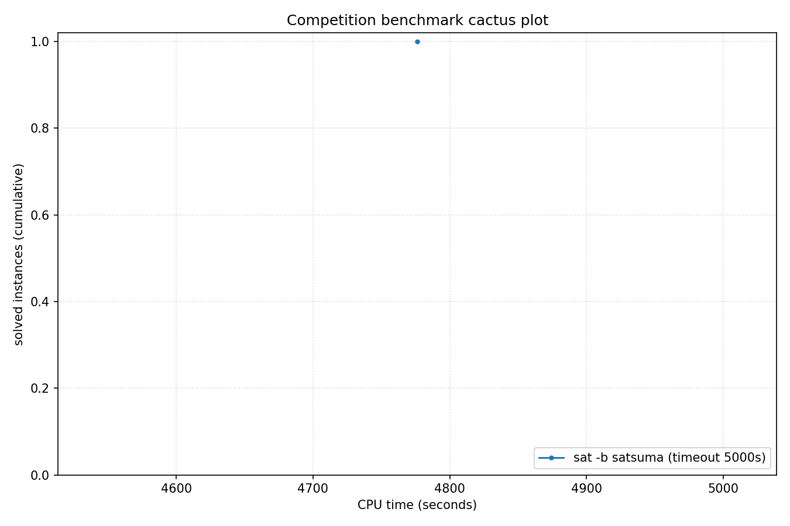

# Competition Benchmark Results (index=mchess17.jsonl, timeout=5000s, backend=satsuma, parallel=1)

## Summary

| Result | Count | % |
|--------|-------|---|
| UNSAT | 1 | 100.0% |
| **Total** | 1 | 100% |

### Solver effort (mean (min-max))

| Group | N | Paths covered | Conflicts | Conf/s | Restarts | Rst/s |
|-------|---|---------------|-----------|--------|----------|-------|
| UNSAT | 1 | — | — | — | — | — |
| Total | 1 | — | — | — | — | — |

## Cactus plot

## Per-problem results

| Problem | Result | Solve time | UNSAT proof time | Paths | Total | Conf | Rst |
|---------|--------|------------|------------------|-------|-------|------|-----|
| mchess_17 | UNSAT | 4776.3823s | 28504.9s | — | — | — | — |
