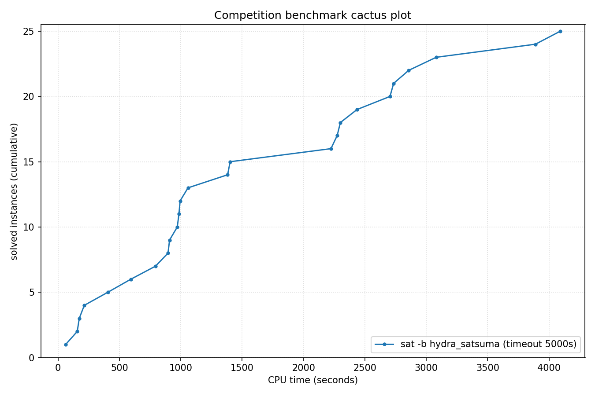

# Competition Benchmark Results (index=unchecked26.jsonl, timeout=5000s, backend=hydra_satsuma, parallel=10)

## Summary

| Result | Count | % |
|--------|-------|---|
| UNSAT | 25 | 100.0% |
| **Total** | 25 | 100% |

### Solver effort (mean (min-max))

| Group | N | Paths covered | Conflicts | Conf/s | Restarts | Rst/s |
|-------|---|---------------|-----------|--------|----------|-------|
| UNSAT | 25 | — | — | — | — | — |
| Total | 25 | — | — | — | — | — |

## Cactus plot

## Per-problem results

| Problem | Result | Solve time | UNSAT proof time | Paths | Total | Conf | Rst |
|---------|--------|------------|------------------|-------|-------|------|-----|
| nla-digbench-scaling_dijkstra-u_valuebound1_step | UNSAT | 213.9793s | 4942.2s | — | — | — | — |
| lockchart-group3-L15-K29-p4d3j1.normalised | UNSAT | 908.7514s | 4295.7s | — | — | — | — |
| lockchart-group3-L14-K27-p4d3j1.normalised | UNSAT | 994.5894s | 4332.1s | — | — | — | — |
| lockchart-group3-L11-K23-p4d3j1.normalised | UNSAT | 985.185s | 4513.1s | — | — | — | — |
| ramsey_4_4_18.normalised | UNSAT | 896.0648s | 4919.5s | — | — | — | — |
| bp4_BC012_IXA_LPI_FPBLE.normalised | UNSAT | 593.1879s | 6629.7s | — | — | — | — |
| lockchart-group3-L12-K24-p4d3j1.normalised | UNSAT | 1381.6743s | 6283.8s | — | — | — | — |
| lockchart-group3-L13-K26-p4d3j1.normalised | UNSAT | 1402.0759s | 6295.6s | — | — | — | — |
| bp4_BC012_TCO_AM_IXA.normalised | UNSAT | 405.7127s | 4577.3s | — | — | — | — |
| oddball_29_4_ttf.normalised | UNSAT | 794.3602s | 6246.4s | — | — | — | — |
| 16_16_booth_dadda_mapped_and_booth_wallace_origin | UNSAT | 2704.5984s | 10347.1s | — | — | — | — |
| x-epic_a19-p16_step | UNSAT | 172.8975s | 13777.9s | — | — | — | — |
| linvrinv5.shuffled-as.sat05-564 | UNSAT | 971.5009s | 5609.8s | — | — | — | — |
| lec_mult_DvK_12x11.sanitized | UNSAT | 2436.4922s | 9546.3s | — | — | — | — |
| grs-48-160 | UNSAT | 1059.1122s | 8958.4s | — | — | — | — |
| oddball_28_4_ttf.normalised | UNSAT | 2223.4761s | 16987.2s | — | — | — | — |
| eq.atree.braun.13.unsat | UNSAT | 2857.2174s | 14943.0s | — | — | — | — |
| oddball_33_4_ttf.normalised | UNSAT | 2300.389s | 19013.4s | — | — | — | — |
| ex095_8 | UNSAT | 3081.3104s | 8670.7s | — | — | — | — |
| xor_op_n46_d3 | UNSAT | 2734.0552s | 8949.5s | — | — | — | — |
| ex025_19 | UNSAT | 3889.1596s | 15243.8s | — | — | — | — |
| SGI_30_60_28_40_7-log.shuffled-as.sat03-127 | UNSAT | 2274.0311s | 23808.8s | — | — | — | — |
| custmulsb2x32o | UNSAT | 4092.4754s | 14347.0s | — | — | — | — |
| stone-width3chain-nmarkers-13_shuffled | UNSAT | 62.1546s | dsr-trim timeout (unchecked) | — | — | — | — |
| hash_table_find_safety_size_21 | UNSAT | 156.5786s | dsr-trim timeout (unchecked) | — | — | — | — |
