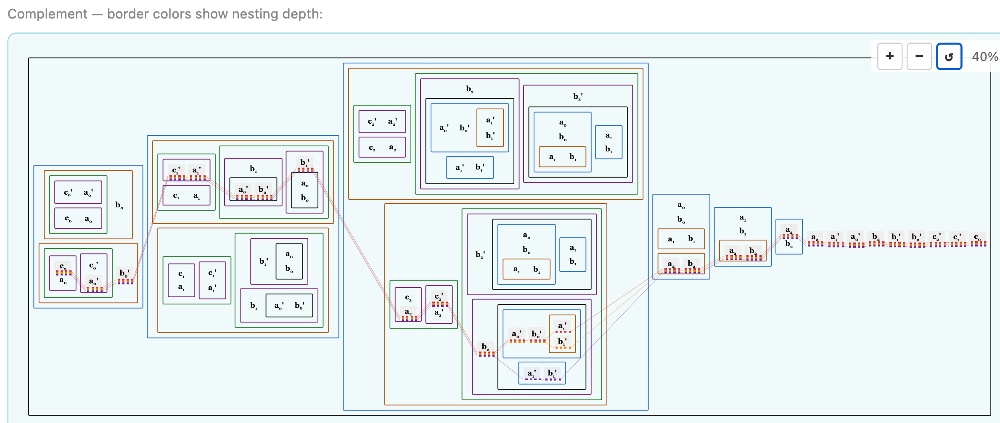
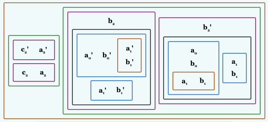

# Effective Path Count Strategy Prompt



This is a picture highlighting the uncovered paths through the complement of jq generating the formula below.  Can you see it?

```
3 as $w |
prod(
  plus("a";"b";"c";$w),
  v_eq("a";3;$w), 
  v_eq("b";3;$w), 
  v_eq("c";6;$w)
)
```

```
(c_0 = a_0 ⊕ b_0)
(c_1 = a_1 ⊕ b_1 ⊕ (a_0 b_0))
(c_2 = a_2 ⊕ b_2 ⊕ (a_0 b_0 (a_1 + b_1) + a_1 b_1))
(a_0 b_0 (a_1 + b_1) (a_2 + b_2) + a_1 b_1 (a_2 + b_2) + a_2 b_2)'
a_2'
a_1
a_0
b_2'
b_1
b_0
c_2
c_1
c_0'
```

This leads me to think of what might be an efficient path enumeration strategy.  We could keep a count of the effective number of paths through each NNF at all levels and adjust this number according to the literals on the path prefix have traced so far.  We would select from prods and traverse sums smallest to largest effective path count order, but the prod and sum orders would not be completely determined on entry; they would unfold as we added literals to the path prefix.

In the example we looked at above, the top level sum has literals a2 a1' a0' b2 b1' b0' c2' c1' c0 with one path each and other members that have more than one path, so we'd start the path with one of these.  Let's say we started a2 then b2 for a path prefix of {a2,b2}. At this point, the 2 path member (a2 · b2) member of the current sum effectively has only one path choice because a2 and b2 are already on the path prefix.  Selecting either a2 or b2 to add to the path does not change the satisfying assignment, the effective path count is in a sense the potentially satisfying assignment option count.

Processing all the on effective path count NNFs in the top level sum we'd have an effective path {a2 a1' a0' b2 b1' b0' c2' c1' c0},  we don't need to repeat the extra a2 or b2 selected from (a2 · b2) in the effective path as it doesn't contribute to the assignment.

(a1 ·b1 ·(a2+b2)) in the top level sum started with 3 effective paths but now has only one effective paths as the paths {a1} and {b1} through it are complementary with a1' and b1' in the effective path prefix.

Updating the effective path count given this effective path prefix from NNF literal leaves and up the NNF tree can be done efficiently I think.  We'd find that the NNF tree in the included nested box picture has no effective paths remaining given this prefix as b2', a1, and b1 are complementary with the effective path prefix.



Does that make sense?  If so, can you update doc/dual-search-design.md to explain this and how it would be implemented.  Looks like it would need an update to the DualPathSearchController trait and an implementation that uses this effective path counting strategy.
