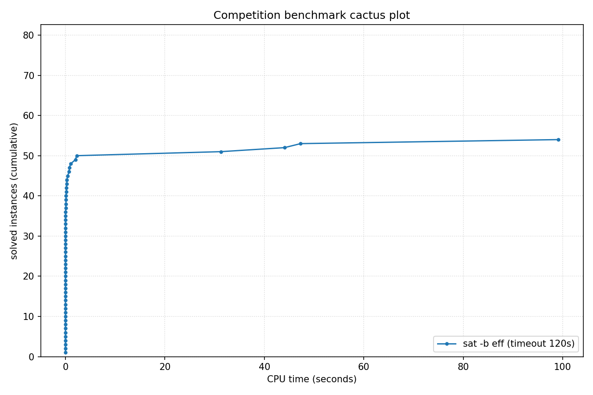

# Competition Benchmark Results (index=curated_struct_eff.jsonl, timeout=120s, backend=eff, parallel=10)

## Summary

| Result | Count | % |
|--------|-------|---|
| SAT | 23 | 28.4% |
| UNSAT | 31 | 38.3% |
| TIMEOUT | 27 | 33.3% |
| **Total** | 81 | 100% |

## Cactus plot

## Per-problem results

| Problem | Result | Time |
|---------|--------|------|
| bench_16516.smt2 | UNSAT | 0.0036s |
| bench_10559.smt2 | UNSAT | 0.0077s |
| php-010-010.shuffled-as.sat05-1157 | SAT | 0.0008s |
| bench_17124.smt2 | UNSAT | 0.0049s |
| bench_11676.smt2 | UNSAT | 0.0132s |
| fphp-010-010.shuffled-as.sat05-1199 | SAT | 0.0014s |
| fphp-012-012.shuffled-as.sat05-1200 | SAT | 0.0024s |
| php-012-012.shuffled-as.sat05-1158 | SAT | 0.0011s |
| urqh2x2.shuffled-as.sat03-1470 | SAT | 0.0007s |
| bench_11496.smt2 | UNSAT | 0.0367s |
| marg2x2.shuffled-as.sat03-1440 | UNSAT | 0.0005s |
| hcb2.shuffled-as.sat03-1430 | UNSAT | 0.0007s |
| urqh1c2x2.shuffled-as.sat03-1457 | UNSAT | 0.002s |
| marg2x3.shuffled-as.sat03-1441 | UNSAT | 0.0061s |
| fclqcolor-08-06-06.shuffled-as.sat05-1265 | SAT | 0.0029s |
| mod2c-3cage-unsat-10-3.sat05-2568.reshuffled-07 | SAT | 0.0722s |
| urqh1c2x3.shuffled-as.sat03-1458 | UNSAT | 47.2883s |
| 3col80_5_8.shuffled | SAT | 0.7557s |
| 3col80_5_5.shuffled | SAT | 0.1246s |
| rope_0001.shuffled | UNSAT | 0.0009s |
| 3col80_5_3.shuffled | SAT | 0.2957s |
| bench_14437.smt2 | TIMEOUT | 120s |
| bench_246.smt2 | TIMEOUT | 120s |
| bench_5712.smt2 | TIMEOUT | 120s |
| bench_1604.smt2 | TIMEOUT | 120s |
| bench_210.smt2 | TIMEOUT | 120s |
| ph12 | TIMEOUT | 120s |
| mod2-rand3bip-sat-200-3.shuffled-as.sat05-2145 | TIMEOUT | 120s |
| fphp-010-008.shuffled-as.sat05-1213 | TIMEOUT | 120s |
| clqcolor-08-06-06.shuffled-as.sat05-1241 | TIMEOUT | 120s |
| 3col20_5_6.shuffled | UNSAT | 0.0011s |
| 3col20_5_7.shuffled | UNSAT | 0.0011s |
| 3col20_5_1.shuffled | UNSAT | 0.0011s |
| 3col20_5_8.shuffled | UNSAT | 0.001s |
| Break_04_06.xml | SAT | 0.0152s |
| Break_04_08.xml | SAT | 0.0144s |
| Break_triple_04_06.xml | SAT | 0.0184s |
| x9-02007.sat.sanitized | SAT | 0.0016s |
| Break_04_10.xml | SAT | 0.0151s |
| Break_triple_04_08.xml | SAT | 0.0169s |
| x9-02023.sat.sanitized | SAT | 0.0051s |
| x9-02044.sat.sanitized | SAT | 0.0033s |
| Break_triple_04_10.xml | SAT | 0.0203s |
| x9-02043.sat.sanitized | SAT | 0.0015s |
| x9-02090.sat.sanitized | SAT | 0.0051s |
| x9-02036.sat.sanitized | UNSAT | 0.006s |
| x9-02042.sat.sanitized | UNSAT | 0.0075s |
| x9-02021.sat.sanitized | UNSAT | 0.0057s |
| x9-02053.sat.sanitized | UNSAT | 0.0087s |
| x9-02073.sat.sanitized | UNSAT | 0.0072s |
| Break_triple_04_04.xml | SAT | 0.0873s |
| Break_unsat_04_03.xml | UNSAT | 0.129s |
| Break_04_04.xml | SAT | 0.197s |
| ezfact16_8.shuffled | UNSAT | 0.4287s |
| ezfact16_7.shuffled | UNSAT | 0.753s |
| ezfact16_5.shuffled | UNSAT | 1.0697s |
| ezfact16_10.shuffled | UNSAT | 2.2618s |
| ph9 | UNSAT | 1.9922s |
| x1_16.shuffled | UNSAT | 0.1967s |
| x2_16.shuffled | UNSAT | 0.2634s |
| ezfact16_6.shuffled | UNSAT | 31.2333s |
| php-010-008.shuffled-as.sat05-1171 | TIMEOUT | 120s |
| x1_24.shuffled | UNSAT | 44.0423s |
| Break_unsat_06_07.xml | TIMEOUT | 120s |
| ezfact32_2.shuffled | TIMEOUT | 120s |
| ezfact32_4.shuffled | TIMEOUT | 120s |
| ezfact32_9.shuffled | TIMEOUT | 120s |
| fphp-010-009.shuffled-as.sat05-1227 | TIMEOUT | 120s |
| mod2-rand3bip-sat-200-2.shuffled-as.sat05-2144 | TIMEOUT | 120s |
| php-010-009.shuffled-as.sat05-1185 | TIMEOUT | 120s |
| VanDerWaerden_pd_2-3-18_311 | TIMEOUT | 120s |
| x2_24.shuffled | UNSAT | 99.1481s |
| x2_32.shuffled | TIMEOUT | 120s |
| VanDerWaerden_pd_2-3-18_313 | TIMEOUT | 120s |
| x1_32.shuffled | TIMEOUT | 120s |
| 38bits_10.dimacs | TIMEOUT | 120s |
| 40bits_10.dimacs | TIMEOUT | 120s |
| mod2-rand3bip-sat-200-1.shuffled-as.sat05-2143 | TIMEOUT | 120s |
| VanDerWaerden_pd_2-3-18_300 | TIMEOUT | 120s |
| VanDerWaerden_pd_2-3-18_298 | TIMEOUT | 120s |
| x1_36.shuffled-as.sat03-1589 | TIMEOUT | 120s |
