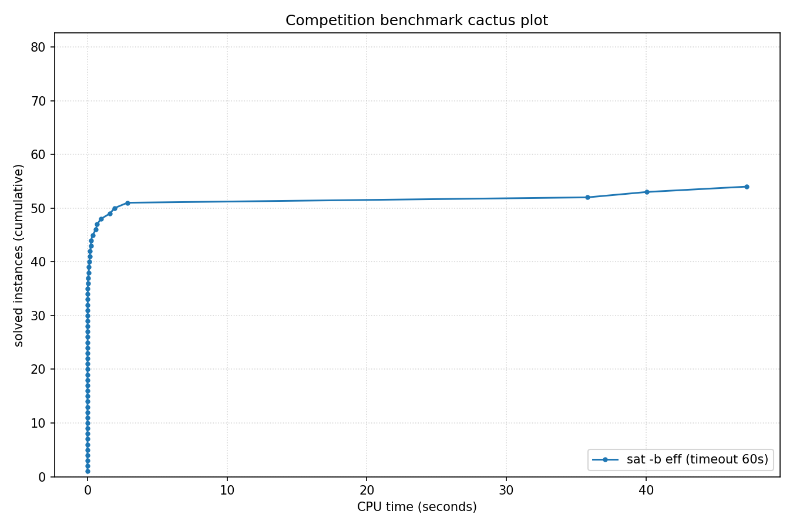

# Competition Benchmark Results (index=curated_struct_eff.jsonl, timeout=60s, backend=eff, parallel=10)

## Summary

| Result | Count | % |
|--------|-------|---|
| SAT | 24 | 29.6% |
| UNSAT | 30 | 37.0% |
| TIMEOUT | 27 | 33.3% |
| **Total** | 81 | 100% |

### Solver effort (mean (min-max))

| Group | N | Paths covered | Conflicts | Conf/s | Restarts | Rst/s |
|-------|---|---------------|-----------|--------|----------|-------|
| SAT | 24 | 43.4% (0.0%-100.0%) | 377 (0-4.8K) | 12.4K (0-57.2K) | 2 (0-25) | 74 (0-308) |
| UNSAT | 30 | 95.6% (90.7%-100.0%) | 216 (30-698) | 55.3K (30.9K-106.5K) | 1 (0-5) | 281 (0-769) |
| TIMEOUT | 27 | 32.6% (0.0%-100.0%) | 490.1K (31.6K-1.6M) | 8.2K (527-26.7K) | 1.0K (115-3.1K) | 17 (2-52) |
| Total | 81 | 50.6% (0.0%-100.0%) | 217.1K (0-1.6M) | 20.4K (0-106.5K) | 446 (0-3.1K) | 96 (0-769) |

## Cactus plot

## Per-problem results

| Problem | Result | Time | Paths | Total | Conf | Rst |
|---------|--------|------|-------|-------|------|-----|
| bench_16516.smt2 | UNSAT | 0.0039s | — | — | — | — |
| php-010-010.shuffled-as.sat05-1157 | SAT | 0.0009s | 2.91e+145 | 10^145.5 | 0 | 0 |
| bench_10559.smt2 | UNSAT | 0.0082s | — | — | — | — |
| bench_17124.smt2 | UNSAT | 0.0053s | — | — | — | — |
| bench_11676.smt2 | UNSAT | 0.0145s | — | — | — | — |
| fphp-010-010.shuffled-as.sat05-1199 | SAT | 0.0021s | 8.45e+280 | 10^280.9 | 12 | 0 |
| fphp-012-012.shuffled-as.sat05-1200 | SAT | 0.0034s | 1 | 10^489.8 | 0 | 0 |
| php-012-012.shuffled-as.sat05-1158 | SAT | 0.0014s | 2.32e+251 | 10^251.4 | 0 | 0 |
| urqh2x2.shuffled-as.sat03-1470 | SAT | 0.0007s | 2.00e+63 | 10^63.3 | 21 | 0 |
| marg2x2.shuffled-as.sat03-1440 | UNSAT | 0.0006s | 1.9P | 10^15.3 | 30 | 0 |
| bench_11496.smt2 | UNSAT | 0.0385s | — | — | — | — |
| hcb2.shuffled-as.sat03-1430 | UNSAT | 0.0007s | 1.9P | 10^15.3 | 30 | 0 |
| urqh1c2x2.shuffled-as.sat03-1457 | UNSAT | 0.0026s | 4.30e+39 | 10^39.6 | 277 | 2 |
| marg2x3.shuffled-as.sat03-1441 | UNSAT | 0.0066s | 1.49e+40 | 10^40.2 | 698 | 5 |
| fclqcolor-08-06-06.shuffled-as.sat05-1265 | SAT | 0.0032s | 1 | 10^615.4 | 0 | 0 |
| mod2c-3cage-unsat-10-3.sat05-2568.reshuffled-07 | SAT | 0.0839s | 1 | 10^336.6 | 4.8K | 25 |
| clqcolor-08-06-06.shuffled-as.sat05-1241 | SAT | 0.0051s | 1 | 10^528.7 | 2 | 0 |
| 3col80_5_8.shuffled | SAT | 0.6878s | — | — | — | — |
| 3col80_5_5.shuffled | SAT | 0.1432s | — | — | — | — |
| rope_0001.shuffled | UNSAT | 0.0011s | 2.51e+27 | 10^27.4 | 34 | 0 |
| 3col80_5_3.shuffled | SAT | 0.3691s | — | — | — | — |
| urqh1c2x3.shuffled-as.sat03-1458 | UNSAT | 47.2176s | — | — | — | — |
| 3col20_5_8.shuffled | UNSAT | 0.0015s | 2.89e+76 | 10^76.5 | 79 | 0 |
| 3col20_5_1.shuffled | UNSAT | 0.0014s | 2.89e+76 | 10^76.5 | 91 | 0 |
| 3col20_5_6.shuffled | UNSAT | 0.0019s | 2.89e+76 | 10^76.5 | 115 | 1 |
| 3col20_5_7.shuffled | UNSAT | 0.0015s | 2.89e+76 | 10^76.5 | 113 | 1 |
| Break_triple_04_04.xml | SAT | 0.1062s | 1 | 10^388.1 | 1.4K | 9 |
| Break_04_04.xml | SAT | 0.2362s | — | — | — | — |
| Break_04_06.xml | SAT | 0.0192s | 1 | 10^390.8 | 120 | 1 |
| Break_triple_04_06.xml | SAT | 0.0207s | 1 | 10^400.9 | 134 | 1 |
| Break_04_08.xml | SAT | 0.017s | 1 | 10^400.7 | 128 | 1 |
| Break_unsat_04_03.xml | UNSAT | 0.1627s | — | — | — | — |
| Break_triple_04_08.xml | SAT | 0.0188s | 1 | 10^410.7 | 103 | 1 |
| Break_04_10.xml | SAT | 0.0178s | 1 | 10^399.7 | 110 | 1 |
| Break_triple_04_10.xml | SAT | 0.0241s | 1 | 10^409.7 | 104 | 1 |
| x9-02023.sat.sanitized | SAT | 0.0081s | 4.91e+302 | 10^302.7 | 232 | 2 |
| x9-02007.sat.sanitized | SAT | 0.0022s | 1.88e+301 | 10^301.3 | 15 | 0 |
| x9-02044.sat.sanitized | SAT | 0.0044s | 3.61e+301 | 10^301.6 | 135 | 1 |
| x9-02090.sat.sanitized | SAT | 0.0065s | 6.93e+301 | 10^301.8 | 216 | 2 |
| x9-02043.sat.sanitized | SAT | 0.0022s | 1.33e+302 | 10^302.1 | 12 | 0 |
| x9-02036.sat.sanitized | UNSAT | 0.0073s | 3.61e+301 | 10^301.6 | 282 | 2 |
| x9-02042.sat.sanitized | UNSAT | 0.009s | 6.93e+301 | 10^301.8 | 325 | 2 |
| x9-02021.sat.sanitized | UNSAT | 0.0067s | 4.91e+302 | 10^302.7 | 239 | 2 |
| x9-02053.sat.sanitized | UNSAT | 0.0104s | 2.56e+302 | 10^302.4 | 398 | 2 |
| x9-02073.sat.sanitized | UNSAT | 0.0087s | 6.93e+301 | 10^301.8 | 313 | 2 |
| bench_246.smt2 | TIMEOUT | 60s | 0 | 10^558.9 | 1.5M | 2.9K |
| bench_5712.smt2 | TIMEOUT | 60s | 0 | 10^438.9 | 1.6M | 3.1K |
| bench_210.smt2 | TIMEOUT | 60s | 0 | 10^480.5 | 1.5M | 2.9K |
| bench_14437.smt2 | TIMEOUT | 60s | 0 | 10^515.7 | 1.3M | 2.6K |
| bench_1604.smt2 | TIMEOUT | 60s | 0 | 10^513.2 | 1.5M | 2.9K |
| mod2-rand3bip-sat-200-3.shuffled-as.sat05-2145 | TIMEOUT | 60s | 0 | 10^381.7 | 71.1K | 220 |
| ph12 | TIMEOUT | 60s | 3.11e+295 | 10^295.5 | 62.5K | 189 |
| fphp-010-008.shuffled-as.sat05-1213 | TIMEOUT | 60s | 4.90e+201 | 10^201.7 | 58.3K | 186 |
| ezfact16_8.shuffled | UNSAT | 0.5962s | — | — | — | — |
| ezfact16_7.shuffled | UNSAT | 0.9675s | — | — | — | — |
| php-010-008.shuffled-as.sat05-1171 | TIMEOUT | 60s | 2.52e+117 | 10^117.4 | 57.8K | 184 |
| ezfact16_5.shuffled | UNSAT | 1.6106s | — | — | — | — |
| ph9 | UNSAT | 1.929s | — | — | — | — |
| ezfact16_10.shuffled | UNSAT | 2.859s | — | — | — | — |
| x1_16.shuffled | UNSAT | 0.1879s | — | — | — | — |
| x2_16.shuffled | UNSAT | 0.2532s | — | — | — | — |
| ezfact16_6.shuffled | UNSAT | 40.0426s | — | — | — | — |
| Break_unsat_06_07.xml | TIMEOUT | 60s | 0 | 10^1677.0 | 35.8K | 125 |
| ezfact32_2.shuffled | TIMEOUT | 60s | 0 | 10^2640.3 | 1.5M | 2.8K |
| ezfact32_4.shuffled | TIMEOUT | 60s | 0 | 10^2640.3 | 1.3M | 2.5K |
| ezfact32_9.shuffled | TIMEOUT | 60s | 0 | 10^2640.3 | 1.5M | 2.9K |
| fphp-010-009.shuffled-as.sat05-1227 | TIMEOUT | 60s | 6.77e+239 | 10^239.8 | 54.3K | 167 |
| mod2-rand3bip-sat-200-2.shuffled-as.sat05-2144 | TIMEOUT | 60s | 0 | 10^381.7 | 77.6K | 249 |
| php-010-009.shuffled-as.sat05-1185 | TIMEOUT | 60s | 2.88e+131 | 10^131.5 | 53.2K | 160 |
| VanDerWaerden_pd_2-3-18_311 | TIMEOUT | 60s | 0 | 10^7092.6 | 35.2K | 124 |
| x2_24.shuffled | TIMEOUT | 60s | 9.40e+83 | 10^84.0 | 131.5K | 361 |
| x1_24.shuffled | UNSAT | 35.8053s | — | — | — | — |
| x2_32.shuffled | TIMEOUT | 60s | 2.12e+118 | 10^118.3 | 132.9K | 365 |
| x1_32.shuffled | TIMEOUT | 60s | 2.12e+118 | 10^118.3 | 141.3K | 381 |
| VanDerWaerden_pd_2-3-18_313 | TIMEOUT | 60s | 0 | 10^7184.5 | 32.2K | 121 |
| 38bits_10.dimacs | TIMEOUT | 60s | 0 | 10^10614.9 | 160.9K | 442 |
| 40bits_10.dimacs | TIMEOUT | 60s | 0 | 10^10877.8 | 163.2K | 444 |
| mod2-rand3bip-sat-200-1.shuffled-as.sat05-2143 | TIMEOUT | 60s | 0 | 10^381.7 | 75.8K | 241 |
| VanDerWaerden_pd_2-3-18_300 | TIMEOUT | 60s | 0 | 10^6746.6 | 31.6K | 115 |
| x1_36.shuffled-as.sat03-1589 | TIMEOUT | 60s | 3.93e+133 | 10^133.6 | 124.1K | 332 |
| VanDerWaerden_pd_2-3-18_298 | TIMEOUT | 60s | 0 | 10^6655.4 | 32.9K | 123 |
