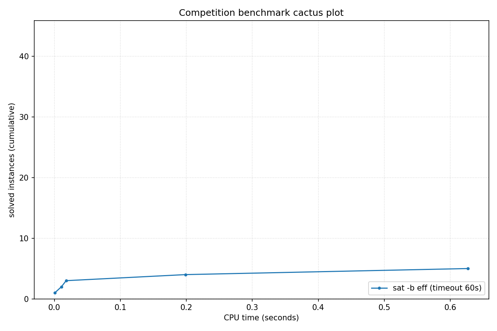

# Competition Benchmark Results (index=evo_fitness.jsonl, timeout=60s, backend=eff, parallel=10)

## Summary

| Result | Count | % |
|--------|-------|---|
| SAT | 3 | 6.7% |
| UNSAT | 2 | 4.4% |
| TIMEOUT | 40 | 88.9% |
| **Total** | 45 | 100% |

## Cactus plot

## Per-problem results

| Problem | Result | Time |
|---------|--------|------|
| Steiner-9-5-bce | UNSAT | 0.0008s |
| Break_triple_04_06.xml | SAT | 0.0179s |
| Steiner-15-7-bce | UNSAT | 0.0108s |
| combined-crypto1-wff-seed-107-wffvars-500-cryptocplx-31-overlap-2 | TIMEOUT | 60s |
| 170055892 | TIMEOUT | 60s |
| 170059081 | TIMEOUT | 60s |
| 170223547 | TIMEOUT | 60s |
| x9-10070.sat.sanitized | TIMEOUT | 60s |
| combined-crypto1-wff-seed-132-wffvars-500-cryptocplx-31-overlap-2 | TIMEOUT | 60s |
| SCPC-500-12 | TIMEOUT | 60s |
| 170058440 | TIMEOUT | 60s |
| 170222843 | TIMEOUT | 60s |
| VanDerWaerden_pd_2-3-22_462 | TIMEOUT | 60s |
| Break_04_04.xml | SAT | 0.1989s |
| x9-07092.sat.sanitized | SAT | 0.6269s |
| combined-crypto1-wff-seed-3-wffvars-450-cryptocplx-40-overlap-2 | TIMEOUT | 60s |
| x9-06068.sat.sanitized | TIMEOUT | 60s |
| SCPC-500-13 | TIMEOUT | 60s |
| gto_p60c241 | TIMEOUT | 60s |
| 170225812 | TIMEOUT | 60s |
| SCPC-500-14 | TIMEOUT | 60s |
| hid-uns-enc-6-1-0-0-0-0-14492 | TIMEOUT | 60s |
| stable-300-0.1-20-98765432130020 | TIMEOUT | 60s |
| combined-crypto1-wff-seed-102-wffvars-500-cryptocplx-31-overlap-2 | TIMEOUT | 60s |
| combined-crypto1-wff-seed-101-wffvars-500-cryptocplx-31-overlap-2 | TIMEOUT | 60s |
| hid-uns-enc-6-1-0-0-0-0-3251 | TIMEOUT | 60s |
| hid-uns-enc-6-1-0-0-0-0-27601 | TIMEOUT | 60s |
| Steiner-27-10-bce | TIMEOUT | 60s |
| x9-06099.sat.sanitized | TIMEOUT | 60s |
| SCPC-500-5 | TIMEOUT | 60s |
| SCPC-500-1 | TIMEOUT | 60s |
| WS_500_16_90_70.apx_1_DC-ST | TIMEOUT | 60s |
| frb35-17-5_ext | TIMEOUT | 60s |
| rbsat-v760c43649g8 | TIMEOUT | 60s |
| n320p5q2_n.apx_16 | TIMEOUT | 60s |
| case20.normalised | TIMEOUT | 60s |
| case17.normalised | TIMEOUT | 60s |
| case16.normalised | TIMEOUT | 60s |
| Steiner-45-16-bce | TIMEOUT | 60s |
| 170153306 | TIMEOUT | 60s |
| battleship-16-31-sat | TIMEOUT | 60s |
| combined-crypto1-wff-seed-115-wffvars-500-cryptocplx-31-overlap-2 | TIMEOUT | 60s |
| case9 | TIMEOUT | 60s |
| battleship-24-47-sat | TIMEOUT | 60s |
| contest03-SGI_30_50_30_20_3-dir.sat05-440.reshuffled-07 | TIMEOUT | 60s |
