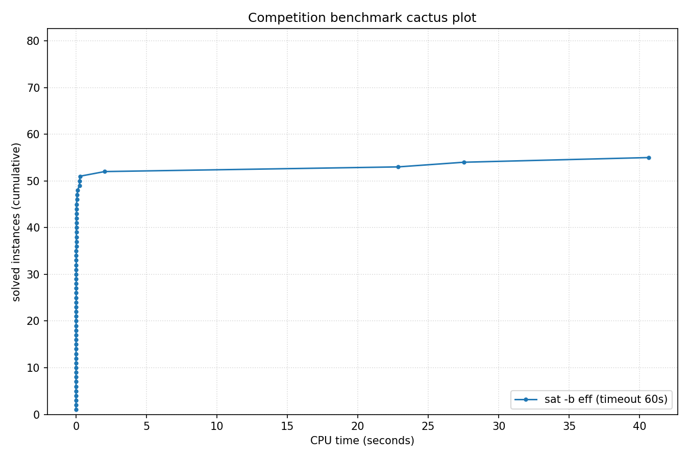

# Competition Benchmark Results (index=curated_struct_eff.jsonl, timeout=60s, backend=eff, parallel=10)

## Summary

| Result | Count | % |
|--------|-------|---|
| SAT | 25 | 30.9% |
| UNSAT | 30 | 37.0% |
| TIMEOUT | 26 | 32.1% |
| **Total** | 81 | 100% |

### Solver effort (mean (min-max))

| Group | N | Paths covered | Conflicts | Conf/s | Restarts | Rst/s |
|-------|---|---------------|-----------|--------|----------|-------|
| SAT | 25 | 36.1% (0.0%-100.0%) | 817 (0-5.9K) | 20.1K (0-106.7K) | 4 (0-29) | 106 (0-674) |
| UNSAT | 30 | 70.5% (0.0%-100.0%) | 281 (30-681) | 38.9K (10.0K-144.4K) | 2 (0-5) | 152 (0-862) |
| TIMEOUT | 26 | 31.2% (0.0%-100.0%) | 370.3K (33.1K-1.6M) | 6.2K (552-26.7K) | 784 (123-3.1K) | 13 (2-52) |
| Total | 81 | 43.9% (0.0%-100.0%) | 136.5K (0-1.6M) | 20.2K (0-144.4K) | 290 (0-3.1K) | 85 (0-862) |

## Cactus plot

## Per-problem results

| Problem | Result | Time | Paths | Total | Conf | Rst |
|---------|--------|------|-------|-------|------|-----|
| php-010-010.shuffled-as.sat05-1157 | SAT | 0.0012s | 2.91e+145 | 10^145.5 | 0 | 0 |
| bench_16516.smt2 | UNSAT | 0.0036s | — | — | — | — |
| bench_10559.smt2 | UNSAT | 0.008s | — | — | — | — |
| bench_17124.smt2 | UNSAT | 0.005s | — | — | — | — |
| bench_11676.smt2 | UNSAT | 0.014s | — | — | — | — |
| bench_11496.smt2 | UNSAT | 0.0373s | — | — | — | — |
| fphp-010-010.shuffled-as.sat05-1199 | SAT | 0.0021s | 8.45e+280 | 10^280.9 | 12 | 0 |
| fphp-012-012.shuffled-as.sat05-1200 | SAT | 0.0033s | 1 | 10^489.8 | 0 | 0 |
| urqh2x2.shuffled-as.sat03-1470 | SAT | 0.0007s | 2.00e+63 | 10^63.3 | 21 | 0 |
| php-012-012.shuffled-as.sat05-1158 | SAT | 0.0015s | 2.32e+251 | 10^251.4 | 0 | 0 |
| marg2x2.shuffled-as.sat03-1440 | UNSAT | 0.0007s | 1.9P | 10^15.3 | 30 | 0 |
| hcb2.shuffled-as.sat03-1430 | UNSAT | 0.0007s | 1.9P | 10^15.3 | 30 | 0 |
| urqh1c2x2.shuffled-as.sat03-1457 | UNSAT | 0.0027s | 4.30e+39 | 10^39.6 | 390 | 2 |
| marg2x3.shuffled-as.sat03-1441 | UNSAT | 0.0058s | 1.49e+40 | 10^40.2 | 681 | 5 |
| fclqcolor-08-06-06.shuffled-as.sat05-1265 | SAT | 0.0037s | 1 | 10^615.4 | 0 | 0 |
| mod2c-3cage-unsat-10-3.sat05-2568.reshuffled-07 | SAT | 0.086s | 1 | 10^336.6 | 4.8K | 25 |
| clqcolor-08-06-06.shuffled-as.sat05-1241 | SAT | 0.0042s | 1 | 10^528.7 | 2 | 0 |
| 3col80_5_8.shuffled | SAT | 0.057s | 1 | 10^365.5 | 5.9K | 29 |
| 3col80_5_5.shuffled | SAT | 0.1026s | 1 | 10^365.5 | 5.7K | 29 |
| rope_0001.shuffled | UNSAT | 0.0012s | 2.51e+27 | 10^27.4 | 50 | 0 |
| 3col80_5_3.shuffled | SAT | 0.0178s | 1 | 10^365.5 | 1.9K | 12 |
| urqh1c2x3.shuffled-as.sat03-1458 | UNSAT | 22.8603s | — | — | — | — |
| 3col20_5_8.shuffled | UNSAT | 0.0016s | 2.89e+76 | 10^76.5 | 60 | 0 |
| 3col20_5_1.shuffled | UNSAT | 0.0016s | 2.89e+76 | 10^76.5 | 65 | 0 |
| 3col20_5_6.shuffled | UNSAT | 0.0013s | 2.89e+76 | 10^76.5 | 52 | 0 |
| 3col20_5_7.shuffled | UNSAT | 0.0017s | 2.89e+76 | 10^76.5 | 65 | 0 |
| Break_triple_04_04.xml | SAT | 0.0234s | 1 | 10^388.1 | 84 | 0 |
| Break_04_04.xml | SAT | 0.0198s | 1 | 10^378.1 | 204 | 2 |
| Break_04_06.xml | SAT | 0.0144s | 1 | 10^390.8 | 104 | 1 |
| Break_triple_04_06.xml | SAT | 0.0138s | 1 | 10^400.9 | 1 | 0 |
| Break_04_08.xml | SAT | 0.0152s | 1 | 10^400.7 | 104 | 1 |
| Break_unsat_04_03.xml | UNSAT | 0.255s | — | — | — | — |
| Break_triple_04_08.xml | SAT | 0.017s | 1 | 10^410.7 | 1 | 0 |
| Break_04_10.xml | SAT | 0.0162s | 1 | 10^399.7 | 105 | 1 |
| Break_triple_04_10.xml | SAT | 0.0208s | 1 | 10^409.7 | 1 | 0 |
| x9-02023.sat.sanitized | SAT | 0.0067s | 4.91e+302 | 10^302.7 | 123 | 1 |
| x9-02007.sat.sanitized | SAT | 0.0051s | 1.88e+301 | 10^301.3 | 97 | 0 |
| x9-02044.sat.sanitized | SAT | 0.0026s | 3.61e+301 | 10^301.6 | 19 | 0 |
| x9-02090.sat.sanitized | SAT | 0.0129s | 6.93e+301 | 10^301.8 | 312 | 2 |
| x9-02043.sat.sanitized | SAT | 0.0054s | 1.33e+302 | 10^302.1 | 115 | 1 |
| x9-02036.sat.sanitized | UNSAT | 0.0178s | 3.61e+301 | 10^301.6 | 452 | 3 |
| x9-02042.sat.sanitized | UNSAT | 0.0201s | 6.93e+301 | 10^301.8 | 548 | 4 |
| x9-02021.sat.sanitized | UNSAT | 0.0125s | 4.91e+302 | 10^302.7 | 301 | 2 |
| x9-02053.sat.sanitized | UNSAT | 0.0222s | 2.56e+302 | 10^302.4 | 531 | 4 |
| x9-02073.sat.sanitized | UNSAT | 0.0176s | 6.93e+301 | 10^301.8 | 428 | 3 |
| bench_246.smt2 | TIMEOUT | 60s | 0 | 10^558.9 | 1.5M | 2.9K |
| bench_14437.smt2 | TIMEOUT | 60s | 0 | 10^515.7 | 1.3M | 2.4K |
| bench_5712.smt2 | TIMEOUT | 60s | 0 | 10^438.9 | 1.6M | 3.1K |
| bench_210.smt2 | TIMEOUT | 60s | 0 | 10^480.5 | 1.5M | 2.9K |
| bench_1604.smt2 | TIMEOUT | 60s | 0 | 10^513.2 | 1.5M | 3.0K |
| mod2-rand3bip-sat-200-3.shuffled-as.sat05-2145 | TIMEOUT | 60s | 0 | 10^381.7 | 71.8K | 220 |
| ph12 | TIMEOUT | 60s | 3.11e+295 | 10^295.5 | 61.2K | 189 |
| fphp-010-008.shuffled-as.sat05-1213 | TIMEOUT | 60s | 4.90e+201 | 10^201.7 | 60.6K | 188 |
| ezfact16_8.shuffled | UNSAT | 0.0232s | 0 | 10^581.6 | 318 | 2 |
| ezfact16_7.shuffled | UNSAT | 0.0197s | 0 | 10^581.6 | 381 | 2 |
| ezfact16_5.shuffled | UNSAT | 0.0296s | 0 | 10^581.6 | 296 | 2 |
| ezfact16_6.shuffled | UNSAT | 0.0217s | 0 | 10^581.6 | 318 | 2 |
| ezfact16_10.shuffled | UNSAT | 0.0349s | 0 | 10^581.6 | 349 | 2 |
| php-010-008.shuffled-as.sat05-1171 | TIMEOUT | 60s | — | — | — | — |
| x1_16.shuffled | UNSAT | 0.2437s | — | — | — | — |
| x2_16.shuffled | UNSAT | 0.2737s | — | — | — | — |
| ph9 | UNSAT | 2.0326s | — | — | — | — |
| Break_unsat_06_07.xml | TIMEOUT | 60s | 0 | 10^1677.0 | 36.5K | 125 |
| ezfact32_9.shuffled | SAT | 27.5315s | — | — | — | — |
| x1_24.shuffled | UNSAT | 40.6579s | — | — | — | — |
| ezfact32_4.shuffled | TIMEOUT | 60s | 0 | 10^2640.3 | 150.0K | 396 |
| ezfact32_2.shuffled | TIMEOUT | 60s | 0 | 10^2640.3 | 154.0K | 412 |
| fphp-010-009.shuffled-as.sat05-1227 | TIMEOUT | 60s | 6.77e+239 | 10^239.8 | 53.1K | 160 |
| mod2-rand3bip-sat-200-2.shuffled-as.sat05-2144 | TIMEOUT | 60s | 0 | 10^381.7 | 75.1K | 235 |
| php-010-009.shuffled-as.sat05-1185 | TIMEOUT | 60s | 2.88e+131 | 10^131.5 | 51.3K | 157 |
| VanDerWaerden_pd_2-3-18_311 | TIMEOUT | 60s | 0 | 10^7092.6 | 33.7K | 124 |
| x2_24.shuffled | TIMEOUT | 60s | 9.40e+83 | 10^84.0 | 128.9K | 348 |
| x2_32.shuffled | TIMEOUT | 60s | 2.12e+118 | 10^118.3 | 132.5K | 363 |
| x1_32.shuffled | TIMEOUT | 60s | 2.12e+118 | 10^118.3 | 142.2K | 381 |
| VanDerWaerden_pd_2-3-18_313 | TIMEOUT | 60s | 0 | 10^7184.5 | 33.5K | 123 |
| 40bits_10.dimacs | TIMEOUT | 60s | 0 | 10^10877.8 | 188.7K | 508 |
| 38bits_10.dimacs | TIMEOUT | 60s | 0 | 10^10614.9 | 201.4K | 509 |
| mod2-rand3bip-sat-200-1.shuffled-as.sat05-2143 | TIMEOUT | 60s | 0 | 10^381.7 | 83.3K | 253 |
| x1_36.shuffled-as.sat03-1589 | TIMEOUT | 60s | 3.93e+133 | 10^133.6 | 131.5K | 361 |
| VanDerWaerden_pd_2-3-18_300 | TIMEOUT | 60s | 0 | 10^6746.6 | 33.1K | 123 |
| VanDerWaerden_pd_2-3-18_298 | TIMEOUT | 60s | 0 | 10^6655.4 | 34.5K | 124 |
