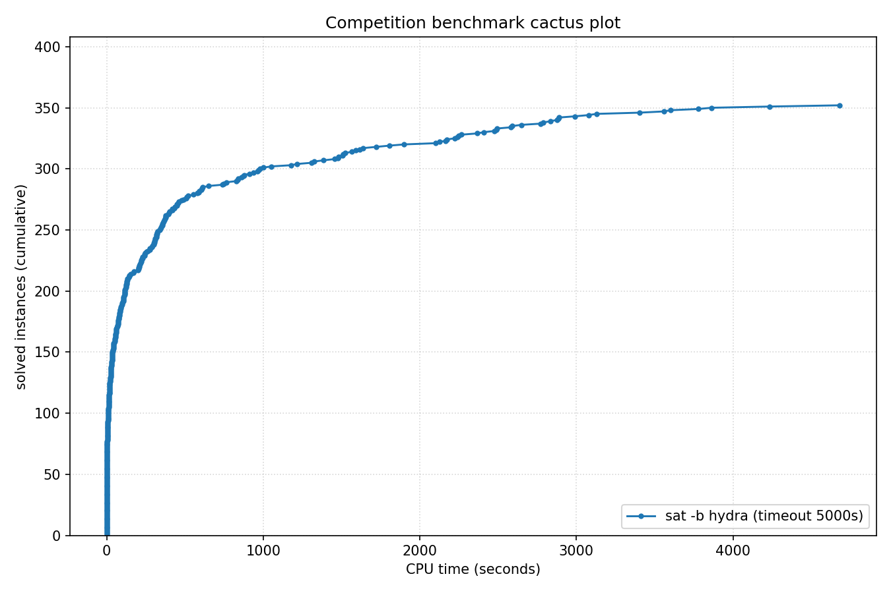

# Competition Benchmark Results (index=main_track_2025.jsonl, timeout=5000s, backend=hydra, parallel=10)

## Summary

| Result | Count | % |
|--------|-------|---|
| SAT | 164 | 41.0% |
| UNSAT | 188 | 47.0% |
| TIMEOUT | 48 | 12.0% |
| **Total** | 400 | 100% |

### Solver effort (mean (min-max))

| Group | N | Paths covered | Conflicts | Conf/s | Restarts | Rst/s |
|-------|---|---------------|-----------|--------|----------|-------|
| SAT | 164 | — | 3.6M (784-42.4M) | 14.3K (74-63.3K) | 107.7K (31-1.7M) | 537 (0-5.1K) |
| UNSAT | 188 | — | 5.7M (20-51.6M) | 19.4K (20-112.8K) | 166.6K (1-1.7M) | 582 (1-3.5K) |
| TIMEOUT | 48 | — | 37.7M (65.8K-218.1M) | 7.5K (11-43.6K) | 780.9K (597-2.3M) | 156 (0-460) |
| Total | 400 | — | 9.4M (20-218.1M) | 15.4K (11-112.8K) | 231.0K (1-2.3M) | 500 (0-5.1K) |

## Cactus plot

## Per-problem results

| Problem | Result | Time | Paths | Total | Conf | Rst |
|---------|--------|------|-------|-------|------|-----|
| gm24sparrc | UNSAT | 4.0086s | — | — | 2.6K | 22 |
| GP_216_290_40 | SAT | 6.9935s | — | — | — | — |
| Break_triple_04_06.xml | SAT | 0.0159s | — | — | — | — |
| mp1-klieber2017s-0500-023-t12 | SAT | 10.2479s | — | — | 64.1K | 2.9K |
| cliquecoloring_n26_k7_c6 | UNSAT | 0.005s | — | — | — | — |
| clqcl_100_6_5.normalised | UNSAT | 0.077s | — | — | — | — |
| s38417 | UNSAT | 0.8289s | — | — | 27.5K | 1.3K |
| 2.normalised | SAT | 18.9573s | — | — | — | — |
| GP_300_140_20 | SAT | 3.7752s | — | — | — | — |
| pj2013_k9 | UNSAT | 18.3708s | — | — | 19.1K | 687 |
| sum_of_three_cubes_42_known_representation | SAT | 124.2765s | — | — | 186.2K | 11.4K |
| dislog_a14_x14_n24 | SAT | 292.0193s | — | — | 4.3M | 126.6K |
| bp4_CSO_AM_IXA_LP.normalised | UNSAT | 86.1757s | — | — | 1.2M | 31.9K |
| SCPC-500-12 | UNSAT | 26.8596s | — | — | 900.0K | 12.6K |
| oddball_53_5_tto_zp.normalised | SAT | 589.4379s | — | — | 314.0K | 3.1K |
| b19_1 | UNSAT | 356.5714s | — | — | 5.8M | 139.5K |
| Break_12_50.xml | SAT | 1.3182s | — | — | 35.3K | 1.7K |
| sudoku-N30-12 | UNSAT | 287.7755s | — | — | 1.1M | 25.0K |
| rook-51-0-0 | UNSAT | 1050.8219s | — | — | 2.6M | 82.8K |
| pj2016_k100 | SAT | 359.6445s | — | — | 174.5K | 2.6K |
| 6s268r_Iter94 | UNSAT | 449.0578s | — | — | 151.1K | 6.1K |
| clqcl_30_7_6.normalised | UNSAT | 0.0055s | — | — | — | — |
| bp4_BC012_CSO_AM_IXA.normalised | UNSAT | 316.1204s | — | — | 5.4M | 131.8K |
| Circuit_multiplier24 | SAT | 91.2437s | — | — | 2.1M | 97.4K |
| RoundRobin_n16_d14 | UNSAT | 0.0024s | — | — | — | — |
| 6s299b685_Iter22 | SAT | 2.6701s | — | — | 1.8K | 218 |
| ER_400_20_7.apx_2_DS-ST | SAT | 241.4688s | — | — | 10.6M | 237.2K |
| aaai10-planning-ipc5-pathways-17-step20 | UNSAT | 50.3676s | — | — | 1.1M | 35.7K |
| sqrt-mitern170 | UNSAT | 114.9573s | — | — | 3.2M | 88.9K |
| goldcrest-and-11 | UNSAT | 174.7239s | — | — | 775.7K | 24.3K |
| par32-2.shuffled-as.sat03-1534 | SAT | 2834.5783s | — | — | 42.4M | 1.7M |
| homer11.shuffled | UNSAT | 31.9098s | — | — | 3.6M | 99.7K |
| spg_300_300 | UNSAT | 231.3238s | — | — | 722.0K | 16.7K |
| BubbleVsPancakeSort_8_4 | UNSAT | 319.002s | — | — | 11.6M | 250.8K |
| arles_thres10_p10_r8185 | UNSAT | 0.004s (proof unchecked: no proof emitted) | — | — | — | — |
| ramsey_3_6_19.normalised | TIMEOUT | 5000.1077s | — | — | 20.7M | 619.1K |
| st_890_86_9_572.normalised | TIMEOUT | 5000.0869s | — | — | 65.0M | 523.6K |
| oisc-subrv-and-nested-15 | TIMEOUT | 5000.5367s | — | — | 202.4K | 15.5K |
| pj2002_k500 | UNSAT | 3404.3342s (CaDiCaL proof unverified) | — | — | 2.2M | 15.8K |
| cfi-rigid-s2-0064-04-or_2_shuffle_all | UNSAT | 961.9488s | — | — | 4.9M | 141.4K |
| rook-56-0-0 | UNSAT | 1216.5015s | — | — | 3.4M | 107.5K |
| bp4_BC012_AM_FPBEQ_ZR.normalised | SAT | 1179.3262s | — | — | 3.3M | 125.3K |
| oddball_54_5_tto_zp.normalised | SAT | 1325.6443s | — | — | 2.7M | 73.2K |
| SC25_Timetable_C_392_E_45_Cl_25_D_7_T_50.normalised | SAT | 7.9101s | — | — | 54.7K | 867 |
| GP_190_225_30 | SAT | 4.7842s | — | — | — | — |
| QG7-gensys-icl006.sat05-3132.reshuffled-07 | UNSAT | 133.4835s | — | — | 2.6M | 59.0K |
| oddball_26_5_ttf.normalised | UNSAT | 377.1992s | — | — | 22.5M | 560.9K |
| clqcl_50_6_5.normalised | UNSAT | 0.0085s | — | — | — | — |
| shuffling-1-s1769330284-of-bench-sat04-422.used-as.sat04-561 | UNSAT | 57.7123s | — | — | 1.7M | 51.4K |
| crusti_g2io_225_0.1_31_25.normalised | SAT | 26.6607s | — | — | 449.6K | 12.7K |
| oddball_80_5_tto_zp.normalised | SAT | 2126.5517s | — | — | 5.0M | 214.2K |
| x9-10070.sat.sanitized | SAT | 16.5168s | — | — | 609.6K | 18.9K |
| linked_list_swap_contents_safety_unwind50 | UNSAT | 20.088s | — | — | 9.4K | 232 |
| arles_thres20_p10_r7340 | UNSAT | 0.0063s | — | — | — | — |
| SC25_Timetable_C_481_E_49_Cl_32_D_7_T_58.normalised | SAT | 133.4013s | — | — | 1.3M | 45.6K |
| oddball_52_5_tto_zp.normalised | SAT | 581.2528s | — | — | 329.5K | 7.8K |
| 9.normalised | SAT | 50.7259s | — | — | — | — |
| crusti_g2io_175_0.2_511_32.normalised | SAT | 10.1967s | — | — | 13.8K | 31 |
| reconf10_22_queen20_3_8667 | SAT | 431.1062s | — | — | 2.7M | 62.5K |
| UR-15-10p0 | UNSAT | 125.7835s | — | — | 899.9K | 33.7K |
| cliquecoloring_n32_k5_c4 | UNSAT | 0.0026s | — | — | — | — |
| ramsey_4_4_18.normalised | TIMEOUT | 5000.0502s | — | — | 35.2M | 732.7K |
| oddball_24_5_ttf.normalised | UNSAT | 215.9564s | — | — | 12.3M | 324.8K |
| b18 | UNSAT | 209.4656s | — | — | 4.3M | 112.6K |
| at-least-two-ibm-2004-23-k100 | SAT | 606.7887s | — | — | 1.1M | 39.1K |
| bp4_AM_IXA_FPBLE.normalised | UNSAT | 377.4094s | — | — | 6.3M | 171.3K |
| 1-ET-256-K-65.sanitized | UNSAT | 115.3679s | — | — | 2.5M | 73.7K |
| 170223547 | SAT | 1.079s | — | — | 64.4K | 1.4K |
| Kakuro-easy-132-ext.xml.hg_8 | SAT | 861.4101s | — | — | 694.9K | 21.1K |
| multiplier_16bits__miter_22 | TIMEOUT | 5000.0237s | — | — | 31.1M | 1.2M |
| oski15a01b45s_opt | UNSAT | 937.655s | — | — | 2.3M | 34.7K |
| b20_1 | UNSAT | 3.9298s | — | — | 159.0K | 6.9K |
| case11.normalised | SAT | 836.8828s | — | — | 7.8M | 191.6K |
| hhyp_cec_multi_2 | TIMEOUT | 5001.0404s | — | — | 12.3M | 595.2K |
| sqrt-mitern171 | UNSAT | 56.057s | — | — | 1.7M | 47.7K |
| oski15a01b40s_opt | UNSAT | 374.9034s | — | — | 4.5M | 61.4K |
| oisc-subrv-sll-nested-8 | TIMEOUT | 5900s | — | — | 65.8K | 597 |
| MVRoundRobin_n14_d10_v2 | UNSAT | 0.03s | — | — | — | — |
| arles_thres20_p10_r7475 | UNSAT | 0.0113s | — | — | — | — |
| Carry_Bits_Fast_19.cnf | SAT | 1.377s | — | — | 20.2K | 622 |
| blocks-blocks-36-0.150-NOTKNOWN | SAT | 59.0909s | — | — | 67.1K | 1.8K |
| 6s299b685_Iter30 | SAT | 34.8301s | — | — | 20.8K | 798 |
| xor_op_n40_d3 | TIMEOUT | 5000.1831s | — | — | 202.4M | 2.3M |
| oddball_69_5_tto_zp.normalised | SAT | 1310.1026s | — | — | 2.3M | 65.6K |
| MVRoundRobin_n16_d10_v3 | UNSAT | 0.0878s | — | — | — | — |
| nla-digbench-scaling_dijkstra-u_valuebound1_transition | UNSAT | 35.655s | — | — | — | — |
| BubbleVsPancakeSort_7_6 | UNSAT | 202.0423s | — | — | 6.5M | 161.8K |
| HCP-446-105 | SAT | 1721.0415s | — | — | 26.6M | 801.5K |
| ITC2021_Late_10.xml | TIMEOUT | 5000.777s | — | — | 15.9M | 462.8K |
| 16_16_booth_wallace_mapped_and_default_origin_bit28 | UNSAT | 2170.8137s | — | — | 12.9M | 469.4K |
| rook-52-0-1 | UNSAT | 1385.7955s | — | — | 2.5M | 60.2K |
| oski15a01b39s_opt | UNSAT | 448.5196s | — | — | 6.4M | 77.9K |
| gto_p60c238-sc2018 | UNSAT | 34.8129s | — | — | 2.5M | 64.5K |
| grs-64-48 | UNSAT | 74.4742s | — | — | 1.3M | 32.2K |
| connm-ue-csp-sat-n1200-d-0.02-s405595518.shuffled-as.sat05-531 | SAT | 2647.3835s | — | — | 17.7M | 612.3K |
| gm16spctrc | UNSAT | 763.9281s | — | — | 653.4K | 17.8K |
| tseitin_d3_n100000 | UNSAT | 84.663s | — | — | — | — |
| case10 | SAT | 592.0012s | — | — | 2.2M | 73.5K |
| tseitin_n188_d3 | UNSAT | 0.0022s | — | — | — | — |
| GP_100_1000_10 | SAT | 13.0622s | — | — | — | — |
| manthey_single-ordered-initialized-w42-b8 | UNSAT | 81.9952s | — | — | 1.2M | 37.8K |
| oddball_51_5_tto_zp.normalised | SAT | 829.5771s | — | — | 1.4M | 35.5K |
| ER_400_20_7.apx_1_DS-ST | SAT | 356.7288s | — | — | 14.2M | 289.2K |
| mchess_20 | UNSAT | 0.0008s | — | — | — | — |
| oski15a01b09s_opt | UNSAT | 512.3182s | — | — | 7.6M | 115.1K |
| REGRandom-K4-L1-Seed40.sanitized | UNSAT | 2.4433s | — | — | 5.3K | 151 |
| crusti_g2io_175_0.2_511_10.normalised | SAT | 43.4451s | — | — | 34.1K | 334 |
| lockchart-group1-L200-K289-p8d4j1.normalised | TIMEOUT | 5000.3504s | — | — | 3.7M | 21.5K |
| fsf-300-354-2-2-3-2.35.opt | SAT | 20.3849s | — | — | 790.1K | 34.5K |
| arles_thres10_p10_r8188 | UNSAT | 0.003s | — | — | — | — |
| b17 | UNSAT | 21.2771s | — | — | 404.6K | 14.4K |
| case8.normalised | SAT | 116.6334s | — | — | 3.2M | 85.3K |
| case6.normalised | SAT | 4232.4402s | — | — | 24.9M | 798.2K |
| oddball_67_5_tto_zp.normalised | SAT | 1639.3066s | — | — | 2.9M | 88.8K |
| fsf-300-354-2-2-3-2.9.opt | SAT | 73.6265s | — | — | 2.4M | 56.9K |
| VanDerWaerden_pd_2-3-27_663 | SAT | 972.4936s | — | — | 8.0M | 159.4K |
| bp4_TCO_CSO_ZR.normalised | TIMEOUT | 5000.7412s | — | — | 19.5M | 591.8K |
| GP_100_951_33 | SAT | 13.0057s | — | — | — | — |
| 16_16_booth_wallace_origin_and_and_dadda_mapped_bit28 | UNSAT | 2490.882s | — | — | 15.3M | 539.1K |
| lockchart-group2-rnd0.3-L19-K38-P8D4J1_1.normalised | TIMEOUT | 5000.0605s | — | — | 15.7M | 380.9K |
| arles_thres10_p10_r8142 | UNSAT | 0.0029s | — | — | — | — |
| bob12s09-opt | UNSAT | 36.9379s | — | — | 572.3K | 27.4K |
| at-least-two-vmpc_28 | SAT | 911.2513s | — | — | 5.7M | 170.7K |
| b15 | UNSAT | 2.2037s | — | — | 63.2K | 2.7K |
| myciel6-cn.used-as.sat04-319 | UNSAT | 420.3227s | — | — | 16.9M | 340.6K |
| Ptn-7824-b19 | SAT | 521.1509s | — | — | 563.9K | 20.7K |
| case1.normalised | SAT | 1566.4721s | — | — | 9.7M | 296.0K |
| maximum_constrained_partition_14_bits_n200 | SAT | 25.365s | — | — | 530.6K | 30.9K |
| RoundRobin_n17_d15 | UNSAT | 0.0036s | — | — | — | — |
| intel047_Iter78 | SAT | 17.5152s | — | — | 175.2K | 10.8K |
| hwmcc17miters-xits-iso-6s163.sanitized | UNSAT | 0.9659s (proof unchecked: no proof emitted) | — | — | — | — |
| mp1-Nb7T46 | SAT | 11.9919s | — | — | 87.2K | 5.7K |
| grs-32-64 | UNSAT | 76.0941s | — | — | 1.5M | 38.2K |
| lockchart-group2-rnd0.3-L19-K38-P8D4J1_3 | TIMEOUT | 5000.0611s | — | — | 15.8M | 347.3K |
| s38584 | UNSAT | 1.3589s | — | — | 30.1K | 685 |
| oski15a01b15s_opt | UNSAT | 397.8568s | — | — | 6.3M | 86.1K |
| oddball_26_4_ttf.normalised | UNSAT | 2406.6505s | — | — | 51.6M | 1.7M |
| jgiraldezlevy.2200.9086.08.40.149-sr2015 | SAT | 18.68s | — | — | 600.4K | 37.2K |
| 1-ET-512-K-120.sanitized | TIMEOUT | 5000.9063s | — | — | 11.4M | 474.3K |
| c7552 | UNSAT | 0.3167s | — | — | 13.9K | 1.1K |
| hcp_CP18_18 | SAT | 839.06s | — | — | 1.6M | 40.2K |
| multiplier_15bits__miter_23 | UNSAT | 3127.6751s | — | — | 21.0M | 839.7K |
| VanDerWaerden_pd_2-3-22_462 | SAT | 2099.7314s | — | — | 21.5M | 549.9K |
| case7.normalised | SAT | 130.3294s | — | — | 3.4M | 91.8K |
| oski15a01b06s_opt | UNSAT | 338.1666s | — | — | 4.1M | 55.4K |
| baseballcover12with25_and5positions | UNSAT | 3862.3225s | — | — | 39.4M | 1.2M |
| pj2009_k80 | SAT | 52.5881s | — | — | 48.1K | 331 |
| bp4_CSO_IXA_ZR.normalised | SAT | 66.5765s | — | — | 691.4K | 24.8K |
| b21 | UNSAT | 5.2668s | — | — | 194.6K | 7.4K |
| Break_12_30.xml | SAT | 2.7988s | — | — | 81.1K | 3.2K |
| Kakuro-easy-112-ext.xml.hg_7 | SAT | 37.1252s | — | — | 17.9K | 810 |
| SGI_30_60_20_50_3-dir.shuffled-as.sat03-114 | UNSAT | 1456.0756s | — | — | 23.3M | 804.7K |
| 20.normalised | SAT | 4.9068s | — | — | — | — |
| 18.normalised | SAT | 13.3379s | — | — | — | — |
| hid-uns-enc-6-1-0-0-0-0-14492 | UNSAT | 34.026s | — | — | 922.8K | 29.7K |
| lockchart-group2-rnd0.3-L18-K36-P8D4J1 | TIMEOUT | 5000.0653s | — | — | 17.4M | 409.9K |
| SCPC-500-13 | UNSAT | 6.6941s | — | — | 222.4K | 3.4K |
| crusti_g2io_250_0.2_255_18.normalised | SAT | 13.5426s | — | — | 19.9K | 327 |
| em_8_4_5_cmp | SAT | 303.2687s | — | — | 5.3M | 174.4K |
| jkkk-one-one-10-34-sat | SAT | 204.4205s | — | — | 2.7M | 85.2K |
| arles_thres10_p10_r8180 | UNSAT | 0.0029s | — | — | — | — |
| x9-07092.sat.sanitized | SAT | 0.0519s | — | — | 3.1K | 171 |
| velev-pipe-sat-1.0-b7 | SAT | 88.7918s | — | — | 340.2K | 5.9K |
| crusti_g2io_250_0.2_255_31.normalised | SAT | 13.5008s | — | — | 22.6K | 309 |
| Break_04_04.xml | SAT | 0.0109s | — | — | — | — |
| RoundRobin_n16_d13 | UNSAT | 0.0024s | — | — | — | — |
| 16_16_booth_wallace_origin_and_default_mapped_bit29 | UNSAT | 309.7542s | — | — | 6.2M | 163.0K |
| sted1_0x24204-330 | SAT | 61.1448s | — | — | 1.0M | 37.9K |
| x9-06068.sat.sanitized | SAT | 0.3339s | — | — | 15.1K | 962 |
| xor_op_n38_d3 | TIMEOUT | 5000.2951s | — | — | 218.1M | 2.1M |
| summle_X8638_steps7_I1-2-2-4-4-8-25-100 | SAT | 15.2578s | — | — | 131.0K | 11.5K |
| ramsey_3_7_23.normalised | TIMEOUT | 5000.1602s | — | — | 16.1M | 285.5K |
| harder-fphp-016-015.sat05-1230.reshuffled-07 | UNSAT | 0.0011s | — | — | — | — |
| RoundRobin_n18_d15 | UNSAT | 0.0033s | — | — | — | — |
| case13.normalised | SAT | 18.7505s | — | — | 274.5K | 12.5K |
| 17.normalised | SAT | 115.5446s | — | — | — | — |
| contest04-lksat-n1100-m7545-k4-l4-s310659001.sat05-524.reshuffled-07 | UNSAT | 122.4074s | — | — | 3.5M | 96.0K |
| x-epic_a19-p15_transition | UNSAT | 1.0155s | — | — | 20 | 1 |
| bp4_CSO_LP_FPBLE_ZR_YS.normalised | UNSAT | 85.6692s | — | — | 1.5M | 50.2K |
| oski15a01b20s_opt | UNSAT | 395.2622s | — | — | 4.8M | 60.1K |
| 16_16_booth_dadda_mapped_and_and_wallace_mapped_bit28 | UNSAT | 2249.9952s | — | — | 14.8M | 541.8K |
| oisc-subrv-and-nested-12 | TIMEOUT | 5001.0634s | — | — | 2.1M | 108.0K |
| 16.normalised | SAT | 12.172s | — | — | — | — |
| SCPC-500-14 | UNSAT | 17.8141s | — | — | 552.6K | 11.6K |
| tseitin_grid_n12_m12 | UNSAT | 0.0028s | — | — | — | — |
| case19.normalised | SAT | 5.5909s | — | — | 784 | 224 |
| frb80-14-1.used-as.sat04-879 | SAT | 3557.6025s | — | — | 41.8M | 1.3M |
| lockchart-group2-rnd0.3-L19-K38-P8D4J1_2 | TIMEOUT | 5000.061s | — | — | 16.4M | 333.1K |
| RoundRobin_n17_d14 | UNSAT | 0.0029s | — | — | — | — |
| bp4_CB_CSO_LP_FPBEQ_FPBLE.normalised | UNSAT | 261.7112s | — | — | 4.1M | 118.7K |
| rbsat-v1375c111739gyes10 | SAT | 350.9741s | — | — | 6.6M | 151.0K |
| Break_triple_12_20.xml | SAT | 3.2358s | — | — | 94.7K | 4.5K |
| oski15a01b01s_opt | UNSAT | 349.5691s | — | — | 4.6M | 58.7K |
| bv_ILA_Piccolo_BEQ_sanity_transition | UNSAT | 1.5386s | — | — | 8.4K | 277 |
| oddball_56_5_tto_zp.normalised | SAT | 369.2044s | — | — | 6.4M | 130.8K |
| cfi-rigid-t2-0048-04-or_3_shuffle_all | SAT | 40.156s | — | — | 373.5K | 12.4K |
| GP_105_308_40 | SAT | 3.0106s | — | — | — | — |
| clqcl_30_11_10.normalised | UNSAT | 0.0251s | — | — | — | — |
| RoundRobin_n15_d13 | UNSAT | 0.0019s | — | — | — | — |
| test_v7_r12_vr10_c1_s18160.smt2-stp212 | TIMEOUT | 5000.2166s | — | — | 18.0M | 572.3K |
| 1.normalised | SAT | 26.7262s | — | — | — | — |
| simon-r20-1.sanitized | SAT | 0.017s | — | — | — | — |
| REGRandom-K3-L3-Seed30.sanitized | UNSAT | 0.9446s | — | — | 2.5K | 88 |
| sum_of_3_cubes_37_bits_87 | SAT | 877.4614s | — | — | 3.0M | 144.3K |
| circuit_48in64out_with_800gates_4in4out_dist128_seed3.sanitized | SAT | 6.9387s | — | — | 235.2K | 12.3K |
| BubbleVsPancakeSort_9_4 | TIMEOUT | 5000.0474s | — | — | 60.4M | 1.9M |
| ktf_TF-7.tf_3_0.06_113 | SAT | 22.0398s | — | — | 125.0K | 6.6K |
| clqcl_40_6_5.normalised | UNSAT | 0.006s | — | — | — | — |
| sted2_0x1e3-216 | SAT | 275.0034s | — | — | 5.0M | 144.1K |
| hwmcc17miters-xits-iso-6s299b685.sanitized | UNSAT | 4.6403s (proof unchecked: no proof emitted) | — | — | — | — |
| stb_664_50.apx_2_DC-ST | TIMEOUT | 5000.046s | — | — | 52.0M | 1.5M |
| crafted_n10_d6_c4_num9 | UNSAT | 70.4061s (proof unchecked: no proof emitted) | — | — | 383.9K | 13.1K |
| bp4_LPI_FPBEQ_ZR.normalised | TIMEOUT | 5000.5772s | — | — | 21.0M | 690.2K |
| arles_thres10_p10_r7466 | UNSAT | 0.0028s | — | — | — | — |
| mp1-Nb7T45 | SAT | 875.4439s | — | — | 3.4M | 155.3K |
| simon-r23-0.sanitized | SAT | 0.0221s | — | — | — | — |
| ncc_none_2_18_8_3_1_0_435991723 | SAT | 324.279s | — | — | 296.1K | 15.1K |
| GP_300_180_30 | SAT | 5.7724s | — | — | — | — |
| PancakeVsSelectionSort_6_7 | UNSAT | 143.5045s | — | — | 4.2M | 108.2K |
| SC25_Timetable_C_393_E_45_Cl_26_D_7_T_50.normalised | SAT | 25.6648s | — | — | 172.8K | 5.7K |
| PancakeVsSelectionSort_6_8 | UNSAT | 317.8518s | — | — | 7.7M | 189.4K |
| oddball_20_5_ttf.normalised | UNSAT | 1.7277s | — | — | 102.4K | 2.7K |
| g2-hwmcc15deep-oski15a10b10s-k20 | UNSAT | 1805.1369s | — | — | 9.5M | 344.5K |
| MVRoundRobin_n20_d10_v2 | UNSAT | 0.1274s | — | — | — | — |
| Wallace_Bits_Fast_8.cnf | SAT | 0.6777s | — | — | 8.3K | 1.1K |
| valves-gates-1-k617-unsat.shuffled-as.sat03-412 | UNSAT | 2887.5086s | — | — | 1.7M | 45.4K |
| SC25_Timetable_C_495_E_43_Cl_35_D_7_T_58.normalised | TIMEOUT | 5000.0494s | — | — | 65.4M | 1.5M |
| SCPC-500-1 | UNSAT | 43.4718s (CaDiCaL proof unverified) | — | — | 1.2M | 32.4K |
| reconf10_70_queen14_2 | SAT | 2884.8546s | — | — | 212.2K | 9.0K |
| DLTM_twitter845_79_19 | SAT | 28.556s | — | — | 152.7K | 7.2K |
| b14 | UNSAT | 2.4648s | — | — | 100.6K | 4.6K |
| bp4_BC012_CSO_FPBEQ_FPBLE_ZR.normalised | SAT | 460.8616s | — | — | 5.6M | 150.2K |
| 16_16_booth_dadda_origin_and_and_dadda_origin_bit28 | UNSAT | 3076.9008s | — | — | 19.1M | 640.1K |
| SCPC-500-5 | UNSAT | 10.7237s | — | — | 301.0K | 11.1K |
| ramsey_4_4_19.normalised | TIMEOUT | 5000.0584s | — | — | 31.9M | 624.5K |
| 1-ET-512-K-102.sanitized | TIMEOUT | 5000.273s | — | — | 7.3M | 338.6K |
| SC25_Timetable_C_492_E_48_Cl_33_D_7_T_58.normalised | SAT | 3778.8271s | — | — | 15.8M | 420.4K |
| bv_ILA_Piccolo_JALR_sanity_transition | UNSAT | 2.3294s | — | — | 9.5K | 459 |
| crusti_g2io_175_0.2_511_48.normalised | SAT | 106.9581s | — | — | 176.2K | 2.2K |
| 16_16_booth_wallace_mapped_and_and_wallace_origin_bit28 | UNSAT | 2221.9798s | — | — | 13.6M | 488.4K |
| tseitin_grid_n250_m250 | UNSAT | 59.217s | — | — | — | — |
| stb_792_333.apx_0 | SAT | 152.3471s | — | — | 3.8M | 104.2K |
| lockchart-group1-L210-K303-p8d4j1.normalised | TIMEOUT | 5000.5699s | — | — | 3.5M | 14.6K |
| ER_500_20_4.apx_1_DC-AD | TIMEOUT | 5000.0725s | — | — | 83.5M | 2.1M |
| reconf10_68_queen14_1 | SAT | 2581.3676s | — | — | 681.4K | 25.0K |
| bp4_BC012_IXA_LPI_FPBLE.normalised | UNSAT | 554.6313s | — | — | 319.9K | 7.2K |
| bp4_TCO_CSO_IXA_LP_ZR.normalised | SAT | 614.4825s | — | — | 644.2K | 23.8K |
| brocard_problem_large | UNSAT | 45.5522s | — | — | 6.8K | 918 |
| anbul-dated-5-15-u | UNSAT | 32.3194s | — | — | 809.3K | 27.2K |
| 5.normalised | SAT | 31.9824s | — | — | — | — |
| frb35-17-5_ext | SAT | 17.3178s | — | — | 700.5K | 19.7K |
| uniqinv40prop | UNSAT | 13.9576s | — | — | 549.5K | 16.8K |
| ramsey_3_6_18.normalised | TIMEOUT | 5000.0633s | — | — | 19.3M | 582.2K |
| EDP3-11000 | SAT | 55.7822s | — | — | 230.8K | 11.1K |
| bivium-39-200-0s0-0xdcfb6ab71951500b8e460045bd45afee15c87e08b0072eb174-43 | UNSAT | 418.8548s | — | — | 13.6M | 344.0K |
| HCP-529-420 | SAT | 609.944s | — | — | 2.8M | 110.6K |
| sqrt-mitern169 | UNSAT | 325.4486s | — | — | 6.9M | 167.5K |
| simon-r21-1.sanitized | SAT | 0.0194s | — | — | — | — |
| RoundRobin_n18_d16 | UNSAT | 0.0043s | — | — | — | — |
| arles_thres10_p10_r8186 | UNSAT | 0.0031s | — | — | — | — |
| oddball_22_5_ttf.normalised | UNSAT | 2.5157s | — | — | 135.5K | 4.2K |
| SC25_Timetable_C_496_E_48_Cl_33_D_7_T_50.normalised | TIMEOUT | 5000.1014s | — | — | 21.7M | 560.4K |
| 16_16_booth_dadda_origin_and_and_dadda_mapped_bit28 | UNSAT | 2489.0601s | — | — | 15.4M | 528.7K |
| mp1-blockpuzzle_9x9_s1_free9 | SAT | 7.8198s | — | — | 243.3K | 5.7K |
| x9-06099.sat.sanitized | SAT | 0.0537s | — | — | 3.4K | 131 |
| pj2008_k200 | SAT | 738.5775s | — | — | 170.1K | 339 |
| gm28sparrc | UNSAT | 9.7795s | — | — | 2.4K | 27 |
| b22_1 | UNSAT | 7.3947s | — | — | 268.4K | 8.4K |
| 16_16_booth_dadda_mapped_and_booth_wallace_mapped | UNSAT | 2789.5737s | — | — | 19.1M | 690.6K |
| lockchart-group3-L13-K26-p4d3j1.normalised | UNSAT | 3601.4193s | — | — | 30.3M | 976.2K |
| dubois50.cnf.mis-99.debugged | TIMEOUT | 5000.0658s | — | — | 67.7M | 2.1M |
| sum_of_three_cubes_906_known_representation | SAT | 13.5468s | — | — | 11.3K | 1.2K |
| arles_thres10_p20_r4305 | UNSAT | 0.0047s | — | — | — | — |
| pj2008_k80 | SAT | 79.1266s | — | — | 93.1K | 1.8K |
| WS_500_16_90_70.apx_1_DC-ST | SAT | 78.0041s | — | — | 2.6M | 58.9K |
| 16_16_booth_dadda_origin_and_and_dadda_origin_bit29 | UNSAT | 378.6713s | — | — | 8.1M | 187.5K |
| rbsat-v945c61409g3 | SAT | 1478.3529s | — | — | 18.6M | 534.0K |
| AProVE07-21 | UNSAT | 0.9734s | — | — | 34.1K | 2.0K |
| grs-32-128 | UNSAT | 505.7814s | — | — | 4.9M | 105.4K |
| 58-134003 | SAT | 2163.1905s | — | — | 41.7M | 1.2M |
| g2-T49.2.0 | UNSAT | 489.3842s | — | — | 481.7K | 10.6K |
| cliquecolouring_n15_k7_c6.sanitized | UNSAT | 0.0017s | — | — | — | — |
| ramsey_3_7_24.normalised | TIMEOUT | 5000.1966s | — | — | 15.3M | 275.7K |
| b22 | UNSAT | 9.2822s | — | — | 299.3K | 9.2K |
| case20.normalised | SAT | 107.5661s | — | — | 3.0M | 83.3K |
| mod2c-rand3bip-sat-250-3.shuffled-as.sat05-2535 | SAT | 107.7299s | — | — | 5.3M | 144.6K |
| ncc_none_21015_5_3_3_0_0_11 | UNSAT | 114.883s (proof unchecked: no proof emitted) | — | — | 79.7K | 1.8K |
| Kakuro-easy-126-ext.xml.hg_7 | SAT | 83.956s | — | — | 55.3K | 1.7K |
| Kakuro-easy-115-ext.xml.hg_5 | SAT | 120.0714s | — | — | 111.2K | 3.1K |
| fixedbandwidth-eq-37_shuffled | UNSAT | 278.1301s | — | — | 12.1M | 211.4K |
| n320p5q2_n.apx_16 | SAT | 10.5137s | — | — | 359.5K | 16.1K |
| ITC2021_Early_12.xml | SAT | 54.1257s | — | — | 357.5K | 9.1K |
| 4.normalised | SAT | 10.0726s | — | — | — | — |
| Circuit_multiplier29 | TIMEOUT | 5000.0372s | — | — | 20.1M | 1.0M |
| SC25_Timetable_C_495_E_48_Cl_33_D_7_T_50.normalised | TIMEOUT | 5000.9922s | — | — | 21.7M | 575.7K |
| BubbleVsPancakeSort_8_6 | UNSAT | 2989.433s | — | — | 37.3M | 1.3M |
| MVRoundRobin_n16_d10_v2 | UNSAT | 0.0449s | — | — | — | — |
| 16_16_and_wallace_origin_and_default_mapped_ultra_bit27 | UNSAT | 2769.6198s | — | — | 18.7M | 722.7K |
| lec_mult_CvW_11x10.sanitized | UNSAT | 129.3922s | — | — | 3.3M | 90.7K |
| case17.normalised | SAT | 21.2154s | — | — | 715.6K | 22.9K |
| oddball_13_5_ttf.normalised | UNSAT | 15.3371s | — | — | 1.3M | 45.6K |
| st_815_74_9_2860.normalised | TIMEOUT | 5000.07s | — | — | 60.0M | 694.1K |
| bp4_IXA_FPBEQ_ZR.normalised | SAT | 242.096s | — | — | 3.3M | 77.6K |
| ITC2021_Middle_9.xml | SAT | 5.8565s | — | — | 146.4K | 611 |
| SC25_Timetable_C_481_E_48_Cl_32_D_7_T_58.normalised | SAT | 126.5622s | — | — | 1.1M | 41.7K |
| cliquecoloring_n14_k7_c6 | UNSAT | 0.0017s | — | — | — | — |
| case16.normalised | SAT | 211.8602s | — | — | 4.9M | 118.7K |
| oddball_17_5_ttf.normalised | UNSAT | 0.4893s | — | — | 13.5K | 1.3K |
| RoundRobin_n17_d13 | UNSAT | 0.0029s | — | — | — | — |
| reconf10_73_queen13_2 | SAT | 2476.444s | — | — | 567.7K | 20.2K |
| em_11_3_4_cmp | SAT | 100.4933s | — | — | 2.5M | 75.6K |
| lockchart-group3-L15-K29-p4d3j1.normalised | UNSAT | 2874.283s | — | — | 24.2M | 785.9K |
| SC25_Timetable_C_498_E_46_Cl_34_D_7_T_50.normalised | TIMEOUT | 5000.9354s | — | — | 22.6M | 532.5K |
| sted2_0x0_n219-342 | SAT | 143.749s | — | — | 1.7M | 65.0K |
| goldcrest-and-14 | UNSAT | 1511.5342s | — | — | 1.6M | 47.5K |
| Break_triple_16_70.xml | SAT | 32.4487s | — | — | 593.4K | 21.8K |
| 544707209399nc.shuffled-as.sat03-1670 | SAT | 12.3801s | — | — | 229.6K | 11.8K |
| arles_thres10_p10_r8175 | UNSAT | 0.0032s | — | — | — | — |
| VanDerWaerden_pd_2-3-23_505 | SAT | 651.999s | — | — | 2.6M | 61.6K |
| div_miter_lec__2 | TIMEOUT | 5000.1596s | — | — | 25.2M | 953.6K |
| at-least-two-traffic_kkb_unknown | UNSAT | 247.3844s | — | — | 1.6M | 41.2K |
| bp4_BC012_AM_IXA_LPI.normalised | UNSAT | 219.7431s | — | — | 3.5M | 89.6K |
| PancakeVsSelectionSort_6_6 | UNSAT | 69.174s | — | — | 2.6M | 63.6K |
| SAT_dat.k100-24_1_rule_2 | UNSAT | 301.4196s (proof unchecked: no proof emitted) | — | — | 2.1M | 72.4K |
| bp5_CSO.normalised | SAT | 2267.2931s | — | — | 1.6M | 40.5K |
| velev-pipe-o-uns-1.1-6 | UNSAT | 17.3785s | — | — | 507.5K | 15.0K |
| 6g_6color_366_050_04 | SAT | 1592.9974s | — | — | 1.3M | 46.6K |
| xor_op_n36_d3 | TIMEOUT | 5000.214s | — | — | 131.4M | 2.2M |
| 7.normalised | SAT | 35.1203s | — | — | — | — |
| st_659_37_25_686.normalised | TIMEOUT | 5000.0848s | — | — | 57.6M | 913.6K |
| battleship-13-13-unsat | UNSAT | 12.5339s | — | — | 665.5K | 11.5K |
| SC25_Timetable_C_395_E_47_Cl_27_D_7_T_50.normalised | SAT | 12.7315s | — | — | 99.8K | 3.1K |
| snw_16_8_preOpt_pre | UNSAT | 101.3335s | — | — | 146.1K | 4.8K |
| arles_thres20_p10_r7532 | UNSAT | 0.0061s | — | — | — | — |
| bp4_BC012_CSO_IXA_LP.normalised | UNSAT | 94.9094s | — | — | 1.3M | 34.6K |
| grs-160-48 | UNSAT | 303.7608s | — | — | 3.2M | 61.0K |
| mod4block_3vars_7gates | UNSAT | 320.9173s | — | — | 8.5M | 231.0K |
| oski15a01b42s_opt | UNSAT | 311.0957s | — | — | 5.5M | 76.3K |
| oski15a01b19s_opt | UNSAT | 345.2404s | — | — | 5.7M | 70.4K |
| ncc_none_2_17_4_3_0_0_435991723 | UNSAT | 1000.9419s | — | — | 257.8K | 14.7K |
| rphp5_050_shuffled | TIMEOUT | 5000.0543s | — | — | 69.3M | 1.7M |
| veer_axi_yosyshq_appnote_123_veer_axi-p06_transition | UNSAT | 2.9107s | — | — | 3.0K | 538 |
| bp4_BC012_CSO_AM_FPBEQ_FPBLE_ZR.normalised | SAT | 1507.3302s | — | — | 4.6M | 161.8K |
| oddball_57_5_tto_zp.normalised | SAT | 748.9519s | — | — | 827.4K | 12.7K |
| oski15a01b02s_opt | UNSAT | 304.0701s | — | — | 4.5M | 60.8K |
| lockchart-group1-L190-K276-p8d4j1.normalised | TIMEOUT | 5000.7223s | — | — | 4.4M | 22.6K |
| 16_2 | TIMEOUT | 5000.04s | — | — | 35.9M | 1.3M |
| 544707209399nw.shuffled-as.sat03-1671 | SAT | 8.3758s | — | — | 184.2K | 13.8K |
| lockchart-group3-L11-K23-p4d3j1.normalised | UNSAT | 2588.2023s | — | — | 23.9M | 749.0K |
| sudoku-N30-16 | UNSAT | 1480.8641s | — | — | 2.0M | 52.4K |
| nla-digbench-scaling_dijkstra-u_valuebound1_step | UNSAT | 205.8135s | — | — | 63.2K | 2.6K |
| 2013113162201nw.shuffled-as.sat03-1668 | SAT | 4.8458s | — | — | 107.1K | 9.3K |
| 14.normalised | SAT | 6.0563s | — | — | — | — |
| mp1-klieber2017s-0300-032-t12 | SAT | 28.3451s | — | — | 378.0K | 13.2K |
| circuit_32in32out_with_64gates_7in7out_dist128_seed2.sanitized | SAT | 44.9837s | — | — | 1.4M | 28.8K |
| Break_triple_14_48.xml | SAT | 83.5195s | — | — | 1.8M | 67.6K |
| clqcl_30_9_8.normalised | UNSAT | 0.0115s | — | — | — | — |
| crusti_g2io_250_0.2_255_43.normalised | SAT | 140.714s | — | — | 495.6K | 10.0K |
| 59-129706 | SAT | 456.2393s | — | — | 24.7M | 659.7K |
| battleship-16-31-sat | SAT | 0.1717s | — | — | 10.6K | 877 |
| ITC2021_Early_9.xml | SAT | 0.6491s | — | — | 14.4K | 1.3K |
| crusti_g2io_250_0.2_255_12.normalised | SAT | 230.8788s | — | — | 734.5K | 3.5K |
| 11.normalised | SAT | 41.513s | — | — | — | — |
| oddball_19_4_ttf.normalised | UNSAT | 35.821s | — | — | 2.8M | 90.8K |
| div-mitern172 | UNSAT | 27.5013s | — | — | 880.6K | 32.0K |
| SC25_Timetable_C_406_E_45_Cl_26_D_7_T_50.normalised | SAT | 21.3137s | — | — | 170.4K | 7.3K |
| oisc-subrv-and-nested-11 | UNSAT | 4679.9306s | — | — | 8.3M | 295.4K |
| lockchart-group2-rnd0.3-L19-K38-P8D4J1_4 | SAT | 436.0844s | — | — | 3.0M | 79.7K |
| 16_16_booth_dadda_mapped_and_and_wallace_origin_bit28 | UNSAT | 2366.4571s | — | — | 16.1M | 571.5K |
| 1-TC-256-K-63.sanitized | SAT | 99.576s | — | — | 1.7M | 63.2K |
| simon-r17-1.sanitized | SAT | 0.0137s | — | — | — | — |
| sudoku-N30-15 | UNSAT | 220.4874s | — | — | 863.5K | 17.6K |
| WS_500_16_90_70.apx_1_DS-ST | SAT | 26.5131s | — | — | 1.1M | 25.4K |
| DLTM_twitter774_83_17 | SAT | 225.2525s | — | — | 2.2M | 79.9K |
| oddball_112_5_ttf.normalised | SAT | 55.2469s | — | — | 1.2M | 13.2K |
| oddball_24_4_ttf.normalised | UNSAT | 208.8162s | — | — | 13.1M | 342.0K |
| crusti_g2io_200_0.1_127_19.normalised | SAT | 43.64s | — | — | 217.8K | 5.7K |
| tseitin_grid_n400_m400 | UNSAT | 478.6856s | — | — | — | — |
| 2018D_VexRiscv-regch0-20-p1_step | UNSAT | 112.914s | — | — | 1.8M | 44.2K |
| Nb54T6 | UNSAT | 1523.6367s | — | — | 1.1M | 31.3K |
| arles_thres10_p20_r4514 | UNSAT | 0.0047s | — | — | — | — |
| bp4_BC012_CSO_IXA_LP_FPBLE.normalised | UNSAT | 107.2353s | — | — | 1.5M | 44.7K |
| case9 | SAT | 73.7532s | — | — | 2.1M | 59.0K |
| gm16sparrc | UNSAT | 0.1122s | — | — | 81 | 27 |
| bp4_TCO_IXA_FPBLE_ZR.normalised | SAT | 981.0322s | — | — | 2.7M | 92.4K |
| sudoku-N30-28 | UNSAT | 255.7487s | — | — | 890.7K | 19.2K |
| bp4_CB_LP_FPBLE.normalised | UNSAT | 72.0963s | — | — | 927.2K | 32.5K |
| rphp5_085_shuffled | TIMEOUT | 5000.0645s | — | — | 73.8M | 1.3M |
| SC25_Timetable_C_495_E_50_Cl_33_D_7_T_50.normalised | SAT | 1898.4761s | — | — | 7.3M | 219.8K |
| oski15a01b41s_opt | UNSAT | 363.4581s | — | — | 6.7M | 108.3K |
| fermat-834855329100173267 | TIMEOUT | 5000.0813s | — | — | 20.1M | 983.4K |
| rphp_p25_r25 | TIMEOUT | 5000.1302s | — | — | 50.7M | 417.6K |
| sudoku-N30-23 | TIMEOUT | 5000.774s | — | — | 7.1M | 189.3K |
| 16_16_default_mapped_ultra_and_and_dadda_mapped_bit28 | UNSAT | 403.5535s | — | — | 8.4M | 200.6K |
| grs-256-64 | UNSAT | 1614.7267s | — | — | 5.4M | 137.8K |
| oddball_29_4_ttf.normalised | UNSAT | 2240.1418s | — | — | 50.5M | 1.6M |
| TT7F-33-24B | TIMEOUT | 5000.7147s | — | — | 18.0M | 409.7K |
| crafted_n10_d6_c4_num8 | UNSAT | 63.0185s (proof unchecked: no proof emitted) | — | — | 290.6K | 8.4K |
| x-epic_a19-p16_step | UNSAT | 172.7681s (proof unchecked: no proof emitted) | — | — | 291.9K | 8.5K |
| lockchart-group1-L220-K317-p8d4j1.normalised | TIMEOUT | 5000.4253s | — | — | 5.8M | 32.0K |
