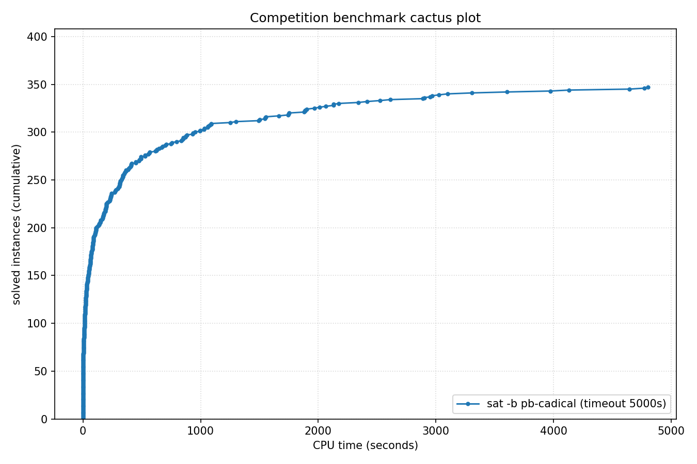

# Competition Benchmark Results (index=main_track_2025.jsonl, timeout=5000s, backend=pb-cadical, parallel=10)

## Summary

| Result | Count | % |
|--------|-------|---|
| SAT | 160 | 40.0% |
| UNSAT | 187 | 46.8% |
| TIMEOUT | 53 | 13.2% |
| **Total** | 400 | 100% |

### Solver effort (mean (min-max))

| Group | N | Paths covered | Conflicts | Conf/s | Restarts | Rst/s |
|-------|---|---------------|-----------|--------|----------|-------|
| SAT | 160 | — | 4.2M (0-77.1M) | 12.2K (0-65.9K) | 128.7K (0-1.7M) | 417 (0-3.4K) |
| UNSAT | 187 | — | 5.8M (0-138.3M) | 17.2K (0-78.1K) | 183.1K (0-2.3M) | 577 (0-4.0K) |
| TIMEOUT | 53 | — | 43.9M (203.2K-233.6M) | 8.8K (41-46.7K) | 931.9K (15.5K-4.1M) | 186 (3-820) |
| Total | 400 | — | 10.5M (0-233.6M) | 13.4K (0-78.1K) | 265.5K (0-4.1M) | 439 (0-4.0K) |

## Cactus plot

## Per-problem results

| Problem | Result | Time | Paths | Total | Conf | Rst |
|---------|--------|------|-------|-------|------|-----|
| GP_216_290_40 | SAT | 11.0638s | — | — | 0 | 0 |
| gm24sparrc | UNSAT | 5.325s | — | — | 1.2K | 72 |
| Break_triple_04_06.xml | SAT | 0.0103s | — | — | 68 | 0 |
| clqcl_100_6_5.normalised | UNSAT | 0.1062s | — | — | — | — |
| cliquecoloring_n26_k7_c6 | UNSAT | 0.0062s | — | — | — | — |
| GP_300_140_20 | SAT | 6.7462s | — | — | 0 | 0 |
| s38417 | UNSAT | 0.5785s | — | — | 14.5K | 868 |
| 2.normalised | SAT | 27.5506s | — | — | 0 | 0 |
| mp1-klieber2017s-0500-023-t12 | SAT | 66.4461s | — | — | 357.8K | 13.6K |
| pj2013_k9 | UNSAT | 10.7891s | — | — | 18.8K | 651 |
| sudoku-N30-12 | UNSAT | 85.4371s | — | — | 200.9K | 4.8K |
| oddball_53_5_tto_zp.normalised | SAT | 78.3077s | — | — | 314.0K | 3.1K |
| bp4_CSO_AM_IXA_LP.normalised | UNSAT | 56.2158s | — | — | 293.4K | 7.8K |
| SCPC-500-12 | UNSAT | 44.6729s | — | — | 1.1M | 19.5K |
| pj2016_k100 | SAT | 207.6437s | — | — | 171.4K | 1.7K |
| goldcrest-and-11 | UNSAT | 294.114s | — | — | 680.8K | 24.3K |
| Break_12_50.xml | SAT | 7.8001s | — | — | 281.6K | 6.4K |
| 6s268r_Iter94 | UNSAT | 88.6674s | — | — | 435.6K | 15.5K |
| par32-2.shuffled-as.sat03-1534 | SAT | 2611.4518s | — | — | 42.4M | 1.7M |
| oddball_54_5_tto_zp.normalised | SAT | 554.4779s | — | — | 2.7M | 73.2K |
| rook-51-0-0 | UNSAT | 667.6706s | — | — | 2.6M | 82.8K |
| clqcl_30_7_6.normalised | UNSAT | 0.0082s | — | — | — | — |
| bp4_BC012_CSO_AM_IXA.normalised | UNSAT | 79.6518s | — | — | 495.1K | 20.8K |
| ramsey_3_6_19.normalised | TIMEOUT | 5000.0829s | — | — | 19.7M | 585.2K |
| st_890_86_9_572.normalised | TIMEOUT | 5000.0835s | — | — | 64.3M | 521.0K |
| RoundRobin_n16_d14 | UNSAT | 0.0029s | — | — | — | — |
| 6s299b685_Iter22 | SAT | 2.5931s | — | — | 1.2K | 47 |
| oisc-subrv-and-nested-15 | TIMEOUT | 5005.6645s | — | — | 203.2K | 15.5K |
| sum_of_three_cubes_42_known_representation | TIMEOUT | 5000.6486s | — | — | 16.8M | 938.2K |
| GP_190_225_30 | SAT | 11.5311s | — | — | 0 | 0 |
| dislog_a14_x14_n24 | TIMEOUT | 5000.0365s | — | — | 23.3M | 787.7K |
| spg_300_300 | UNSAT | 26.881s | — | — | 142.9K | 1.4K |
| homer11.shuffled | UNSAT | 83.3638s | — | — | 5.4M | 175.3K |
| b19_1 | UNSAT | 851.7022s (proof unchecked: veripb timeout (5000s)) | — | — | 9.3M | 347.4K |
| arles_thres10_p10_r8185 | UNSAT | 0.0112s | — | — | 1 | 0 |
| ER_400_20_7.apx_2_DS-ST | SAT | 1250.7514s | — | — | 32.1M | 716.6K |
| aaai10-planning-ipc5-pathways-17-step20 | UNSAT | 103.1582s | — | — | 823.7K | 26.2K |
| oddball_80_5_tto_zp.normalised | SAT | 1493.4165s | — | — | 5.0M | 214.2K |
| oddball_52_5_tto_zp.normalised | SAT | 89.4882s | — | — | 329.5K | 7.8K |
| sqrt-mitern170 | UNSAT | 233.7512s | — | — | 3.6M | 125.0K |
| 9.normalised | SAT | 135.9883s | — | — | 0 | 0 |
| bp4_BC012_AM_FPBEQ_ZR.normalised | SAT | 836.692s | — | — | 3.3M | 125.3K |
| SC25_Timetable_C_392_E_45_Cl_25_D_7_T_50.normalised | SAT | 29.3455s | — | — | 168.8K | 3.3K |
| linked_list_swap_contents_safety_unwind50 | UNSAT | 89.6492s | — | — | 16.0K | 304 |
| cfi-rigid-s2-0064-04-or_2_shuffle_all | UNSAT | 475.7591s (proof unchecked: veripb timeout (5000s)) | — | — | 4.9M | 141.4K |
| crusti_g2io_175_0.2_511_32.normalised | SAT | 25.2995s | — | — | 19.7K | 24 |
| oisc-subrv-sll-nested-8 | UNSAT | 200.733s (proof unchecked: veripb timeout (5000s)) | — | — | 80.2K | 500 |
| clqcl_50_6_5.normalised | UNSAT | 0.0086s | — | — | — | — |
| pj2002_k500 | UNSAT | 3099.9197s (proof unchecked: veripb timeout (5000s)) | — | — | 2.2M | 15.8K |
| crusti_g2io_225_0.1_31_25.normalised | SAT | 45.1074s | — | — | 669.2K | 17.1K |
| Circuit_multiplier24 | TIMEOUT | 5000.0291s | — | — | 24.2M | 1.1M |
| x9-10070.sat.sanitized | SAT | 14.6053s | — | — | 569.7K | 19.2K |
| shuffling-1-s1769330284-of-bench-sat04-422.used-as.sat04-561 | UNSAT | 106.9283s | — | — | 2.2M | 73.2K |
| arles_thres20_p10_r7340 | UNSAT | 0.0065s | — | — | 0 | 0 |
| SC25_Timetable_C_481_E_49_Cl_32_D_7_T_58.normalised | SAT | 23.4509s | — | — | 98.1K | 2.3K |
| BubbleVsPancakeSort_8_4 | UNSAT | 678.3099s | — | — | 12.4M | 419.2K |
| rook-56-0-0 | UNSAT | 1056.8935s | — | — | 3.4M | 107.5K |
| QG7-gensys-icl006.sat05-3132.reshuffled-07 | UNSAT | 311.6458s | — | — | 3.5M | 93.5K |
| bp4_AM_IXA_FPBLE.normalised | UNSAT | 51.0947s | — | — | 436.9K | 15.3K |
| at-least-two-ibm-2004-23-k100 | SAT | 84.851s | — | — | 891.0K | 30.1K |
| cliquecoloring_n32_k5_c4 | UNSAT | 0.0023s | — | — | — | — |
| ramsey_4_4_18.normalised | TIMEOUT | 5000.0209s | — | — | 34.5M | 712.4K |
| UR-15-10p0 | UNSAT | 110.5509s | — | — | 594.9K | 20.8K |
| oddball_26_5_ttf.normalised | UNSAT | 450.8074s | — | — | 14.1M | 460.0K |
| Kakuro-easy-132-ext.xml.hg_8 | SAT | 367.484s | — | — | 694.9K | 21.1K |
| oddball_69_5_tto_zp.normalised | SAT | 494.8112s | — | — | 2.3M | 65.6K |
| multiplier_16bits__miter_22 | TIMEOUT | 5000.0169s | — | — | 32.1M | 1.2M |
| 170223547 | SAT | 0.4247s | — | — | 28.0K | 294 |
| case11.normalised | SAT | 309.131s | — | — | 7.8M | 191.6K |
| blocks-blocks-36-0.150-NOTKNOWN | SAT | 237.9026s | — | — | 245.6K | 4.9K |
| oski15a01b40s_opt | UNSAT | 365.0651s | — | — | 2.5M | 31.0K |
| hhyp_cec_multi_2 | TIMEOUT | 5000.1197s | — | — | 13.3M | 634.3K |
| b20_1 | UNSAT | 3.4716s | — | — | 142.3K | 4.5K |
| reconf10_22_queen20_3_8667 | SAT | 3025.7069s | — | — | 11.5M | 288.8K |
| oddball_24_5_ttf.normalised | UNSAT | 231.7315s | — | — | 10.4M | 370.3K |
| sqrt-mitern171 | UNSAT | 72.0631s | — | — | 1.7M | 60.9K |
| ITC2021_Late_10.xml | SAT | 4772.9867s | — | — | 19.0M | 575.0K |
| MVRoundRobin_n14_d10_v2 | UNSAT | 0.0267s | — | — | — | — |
| arles_thres20_p10_r7475 | UNSAT | 0.007s | — | — | 0 | 0 |
| Carry_Bits_Fast_19.cnf | SAT | 1.6216s | — | — | 29.0K | 1.1K |
| xor_op_n40_d3 | TIMEOUT | 5000.1038s | — | — | 212.9M | 2.4M |
| 6s299b685_Iter30 | SAT | 23.6025s | — | — | 5.7K | 508 |
| oski15a01b45s_opt | UNSAT | 356.4528s | — | — | 2.3M | 34.7K |
| 1-ET-256-K-65.sanitized | UNSAT | 191.6738s | — | — | 2.4M | 85.9K |
| MVRoundRobin_n16_d10_v3 | UNSAT | 0.0751s | — | — | — | — |
| nla-digbench-scaling_dijkstra-u_valuebound1_transition | UNSAT | 0.9927s | — | — | 1 | 0 |
| HCP-446-105 | SAT | 1090.6484s | — | — | 26.6M | 801.5K |
| BubbleVsPancakeSort_7_6 | UNSAT | 182.1392s | — | — | 5.4M | 204.5K |
| oski15a01b39s_opt | UNSAT | 329.6098s | — | — | 2.2M | 31.0K |
| connm-ue-csp-sat-n1200-d-0.02-s405595518.shuffled-as.sat05-531 | SAT | 1899.6585s | — | — | 17.7M | 612.3K |
| b18 | UNSAT | 568.0203s (proof unchecked: veripb timeout (5000s)) | — | — | 9.4M | 350.0K |
| oski15a01b09s_opt | UNSAT | 414.2103s | — | — | 2.4M | 35.3K |
| grs-64-48 | UNSAT | 45.9577s | — | — | 622.2K | 19.1K |
| lockchart-group1-L200-K289-p8d4j1.normalised | TIMEOUT | 5000.9259s | — | — | 4.7M | 26.0K |
| case10 | SAT | 79.5005s | — | — | 2.2M | 73.5K |
| bp4_TCO_CSO_ZR.normalised | SAT | 4132.9671s | — | — | 21.2M | 646.1K |
| oddball_51_5_tto_zp.normalised | SAT | 228.5498s | — | — | 1.4M | 35.5K |
| case6.normalised | SAT | 3603.8023s | — | — | 24.9M | 798.2K |
| gto_p60c238-sc2018 | UNSAT | 193.8672s | — | — | 8.1M | 274.8K |
| GP_100_1000_10 | SAT | 16.9888s | — | — | 0 | 0 |
| lockchart-group2-rnd0.3-L19-K38-P8D4J1_1.normalised | TIMEOUT | 5000.0273s | — | — | 17.9M | 443.3K |
| manthey_single-ordered-initialized-w42-b8 | UNSAT | 78.5507s | — | — | 1.3M | 42.5K |
| 16_16_booth_wallace_mapped_and_default_origin_bit28 | UNSAT | 1501.3253s (proof unchecked: veripb timeout (5000s)) | — | — | 12.9M | 469.4K |
| mchess_20 | UNSAT | 0.0007s | — | — | — | — |
| REGRandom-K4-L1-Seed40.sanitized | UNSAT | 12.3531s | — | — | 571.7K | 7.6K |
| oddball_67_5_tto_zp.normalised | SAT | 614.8536s | — | — | 2.9M | 88.8K |
| crusti_g2io_175_0.2_511_10.normalised | SAT | 24.0205s | — | — | 24.7K | 56 |
| case8.normalised | SAT | 165.0174s | — | — | 2.3M | 100.0K |
| VanDerWaerden_pd_2-3-27_663 | SAT | 448.9025s | — | — | 8.0M | 159.4K |
| arles_thres10_p10_r8188 | UNSAT | 0.0092s | — | — | 1 | 0 |
| fsf-300-354-2-2-3-2.35.opt | SAT | 146.1471s | — | — | 3.7M | 86.1K |
| b17 | UNSAT | 12.2222s | — | — | 231.2K | 11.9K |
| rook-52-0-1 | UNSAT | 794.3424s (proof unchecked: veripb timeout (5000s)) | — | — | 2.5M | 60.2K |
| lockchart-group2-rnd0.3-L19-K38-P8D4J1_3 | TIMEOUT | 5000.0268s | — | — | 18.0M | 401.6K |
| fsf-300-354-2-2-3-2.9.opt | SAT | 33.2897s | — | — | 1.3M | 38.2K |
| Ptn-7824-b19 | SAT | 19.6141s | — | — | 563.9K | 20.7K |
| at-least-two-vmpc_28 | SAT | 382.9926s | — | — | 5.7M | 170.7K |
| GP_100_951_33 | SAT | 17.4076s | — | — | 0 | 0 |
| gm16spctrc | UNSAT | 200.9106s (proof unchecked: veripb timeout (5000s)) | — | — | 653.4K | 17.8K |
| case1.normalised | SAT | 1029.5152s | — | — | 9.7M | 296.0K |
| arles_thres10_p10_r8142 | UNSAT | 0.0115s | — | — | 1 | 0 |
| bob12s09-opt | UNSAT | 55.8892s | — | — | 619.5K | 31.6K |
| b15 | UNSAT | 1.3204s | — | — | 42.5K | 1.8K |
| ER_400_20_7.apx_1_DS-ST | SAT | 2967.0414s | — | — | 77.1M | 1.7M |
| tseitin_d3_n100000 | TIMEOUT | 5000.1304s | — | — | 16.3M | 128.6K |
| 1-ET-512-K-120.sanitized | TIMEOUT | 5000.2981s | — | — | 14.1M | 586.6K |
| tseitin_n188_d3 | TIMEOUT | 5000.0143s | — | — | 189.4M | 4.1M |
| maximum_constrained_partition_14_bits_n200 | SAT | 28.2203s | — | — | 463.0K | 25.3K |
| RoundRobin_n17_d15 | UNSAT | 0.0029s | — | — | — | — |
| intel047_Iter78 | SAT | 8.9363s | — | — | 220.9K | 11.9K |
| hwmcc17miters-xits-iso-6s163.sanitized | UNSAT | 1.6682s | — | — | 0 | 0 |
| mp1-Nb7T46 | SAT | 77.304s | — | — | 861.5K | 41.9K |
| myciel6-cn.used-as.sat04-319 | UNSAT | 565.1672s | — | — | 14.5M | 459.4K |
| oski15a01b15s_opt | UNSAT | 314.2856s | — | — | 2.3M | 28.8K |
| s38584 | UNSAT | 0.7729s | — | — | 15.1K | 1.1K |
| grs-32-64 | UNSAT | 69.0896s | — | — | 1.2M | 25.0K |
| hcp_CP18_18 | SAT | 313.8646s | — | — | 1.6M | 40.2K |
| jgiraldezlevy.2200.9086.08.40.149-sr2015 | SAT | 38.0735s | — | — | 909.3K | 50.3K |
| 16_16_booth_wallace_origin_and_and_dadda_mapped_bit28 | UNSAT | 1886.8659s (proof unchecked: veripb timeout (5000s)) | — | — | 15.3M | 539.1K |
| c7552 | UNSAT | 0.1882s | — | — | 14.7K | 752 |
| lockchart-group2-rnd0.3-L18-K36-P8D4J1 | TIMEOUT | 5000.0215s | — | — | 19.7M | 448.7K |
| VanDerWaerden_pd_2-3-22_462 | SAT | 1552.7902s | — | — | 21.5M | 549.9K |
| case7.normalised | SAT | 100.2803s | — | — | 2.6M | 84.9K |
| pj2009_k80 | SAT | 63.0037s | — | — | 69.1K | 1.6K |
| xor_op_n38_d3 | TIMEOUT | 5000.082s | — | — | 233.6M | 2.3M |
| oski15a01b06s_opt | UNSAT | 403.6163s | — | — | 2.9M | 32.6K |
| oddball_26_4_ttf.normalised | UNSAT | 1748.9998s (proof unchecked: veripb timeout (5000s)) | — | — | 51.6M | 1.7M |
| Kakuro-easy-112-ext.xml.hg_7 | SAT | 62.0059s | — | — | 74.7K | 2.0K |
| b21 | UNSAT | 5.2323s | — | — | 204.1K | 7.1K |
| Break_12_30.xml | SAT | 12.8359s | — | — | 470.0K | 14.4K |
| ramsey_3_7_23.normalised | TIMEOUT | 5000.1185s | — | — | 17.2M | 309.5K |
| oski15a01b20s_opt | UNSAT | 317.1586s | — | — | 2.4M | 36.9K |
| 20.normalised | SAT | 6.3601s | — | — | 0 | 0 |
| 18.normalised | SAT | 16.836s | — | — | 0 | 0 |
| hid-uns-enc-6-1-0-0-0-0-14492 | UNSAT | 48.2509s | — | — | 1.3M | 46.1K |
| em_8_4_5_cmp | SAT | 493.1743s | — | — | 7.9M | 235.0K |
| SCPC-500-13 | UNSAT | 7.002s | — | — | 237.9K | 4.8K |
| crusti_g2io_250_0.2_255_18.normalised | SAT | 21.8073s | — | — | 24.3K | 108 |
| jkkk-one-one-10-34-sat | SAT | 199.5101s | — | — | 2.1M | 79.5K |
| velev-pipe-sat-1.0-b7 | SAT | 42.737s | — | — | 123.4K | 6.3K |
| arles_thres10_p10_r8180 | UNSAT | 0.0095s | — | — | 1 | 0 |
| x9-07092.sat.sanitized | SAT | 0.0923s | — | — | 5.5K | 120 |
| bp4_CSO_IXA_ZR.normalised | SAT | 1888.6562s | — | — | 16.2M | 461.8K |
| crusti_g2io_250_0.2_255_31.normalised | SAT | 50.9934s | — | — | 247.7K | 5.6K |
| Break_04_04.xml | SAT | 0.0083s | — | — | 21 | 0 |
| RoundRobin_n16_d13 | UNSAT | 0.0024s | — | — | — | — |
| sted1_0x24204-330 | SAT | 110.4786s | — | — | 1.3M | 49.9K |
| contest04-lksat-n1100-m7545-k4-l4-s310659001.sat05-524.reshuffled-07 | UNSAT | 170.4658s | — | — | 4.4M | 152.3K |
| x9-06068.sat.sanitized | SAT | 0.1478s | — | — | 8.3K | 496 |
| 17.normalised | SAT | 175.2689s | — | — | 0 | 0 |
| summle_X8638_steps7_I1-2-2-4-4-8-25-100 | SAT | 13.9384s | — | — | 163.2K | 13.7K |
| SGI_30_60_20_50_3-dir.shuffled-as.sat03-114 | UNSAT | 842.6986s (proof unchecked: veripb timeout (5000s)) | — | — | 23.3M | 804.7K |
| harder-fphp-016-015.sat05-1230.reshuffled-07 | UNSAT | 0.0011s | — | — | — | — |
| RoundRobin_n18_d15 | UNSAT | 0.0036s | — | — | — | — |
| case13.normalised | SAT | 29.6259s | — | — | 344.2K | 17.1K |
| multiplier_15bits__miter_23 | UNSAT | 2524.3027s (proof unchecked: veripb timeout (5000s)) | — | — | 21.0M | 839.7K |
| lockchart-group2-rnd0.3-L19-K38-P8D4J1_2 | TIMEOUT | 5000.0254s | — | — | 17.6M | 358.8K |
| x-epic_a19-p15_transition | UNSAT | 0.3231s | — | — | 0 | 0 |
| bp4_CSO_LP_FPBLE_ZR_YS.normalised | UNSAT | 110.5725s | — | — | 1.4M | 50.8K |
| 16_16_booth_wallace_origin_and_default_mapped_bit29 | UNSAT | 628.4816s | — | — | 7.0M | 250.9K |
| 16.normalised | SAT | 15.8423s | — | — | 0 | 0 |
| baseballcover12with25_and5positions | UNSAT | 3305.1987s (proof unchecked: veripb timeout (5000s)) | — | — | 39.4M | 1.2M |
| SCPC-500-14 | UNSAT | 18.2758s | — | — | 590.6K | 9.9K |
| crafted_n10_d6_c4_num9 | UNSAT | 57.2863s | — | — | 313.8K | 13.0K |
| test_v7_r12_vr10_c1_s18160.smt2-stp212 | TIMEOUT | 5000.1558s | — | — | 19.8M | 618.4K |
| case19.normalised | SAT | 5.6361s | — | — | 277 | 21 |
| oski15a01b01s_opt | UNSAT | 346.1167s | — | — | 2.1M | 31.2K |
| tseitin_grid_n12_m12 | UNSAT | 623.7572s | — | — | 41.3M | 1.9M |
| RoundRobin_n17_d14 | UNSAT | 0.0027s | — | — | — | — |
| BubbleVsPancakeSort_9_4 | TIMEOUT | 5000.0192s | — | — | 68.3M | 2.2M |
| sum_of_3_cubes_37_bits_87 | SAT | 350.5335s | — | — | 3.0M | 144.3K |
| Break_triple_12_20.xml | SAT | 14.7712s | — | — | 367.3K | 20.4K |
| cfi-rigid-t2-0048-04-or_3_shuffle_all | SAT | 24.7737s | — | — | 56.0K | 2.2K |
| bv_ILA_Piccolo_BEQ_sanity_transition | UNSAT | 3.0359s | — | — | 5.7K | 84 |
| GP_105_308_40 | SAT | 4.1968s | — | — | 0 | 0 |
| frb80-14-1.used-as.sat04-879 | SAT | 2888.8116s | — | — | 41.8M | 1.3M |
| clqcl_30_11_10.normalised | UNSAT | 0.0228s | — | — | — | — |
| oddball_56_5_tto_zp.normalised | SAT | 337.1961s | — | — | 2.0M | 71.6K |
| RoundRobin_n15_d13 | UNSAT | 0.0019s | — | — | — | — |
| REGRandom-K3-L3-Seed30.sanitized | UNSAT | 2.7698s | — | — | 127.5K | 1.9K |
| 1.normalised | SAT | 34.1932s | — | — | 0 | 0 |
| simon-r20-1.sanitized | SAT | 0.0079s | — | — | 0 | 0 |
| mp1-Nb7T45 | SAT | 332.94s | — | — | 3.4M | 155.3K |
| 16_16_booth_dadda_mapped_and_and_wallace_mapped_bit28 | UNSAT | 1745.5055s (proof unchecked: veripb timeout (5000s)) | — | — | 14.8M | 541.8K |
| circuit_48in64out_with_800gates_4in4out_dist128_seed3.sanitized | SAT | 8.5528s | — | — | 287.9K | 14.0K |
| bp4_CB_CSO_LP_FPBEQ_FPBLE.normalised | UNSAT | 120.2642s | — | — | 1.3M | 36.3K |
| ktf_TF-7.tf_3_0.06_113 | SAT | 17.1145s | — | — | 146.4K | 8.0K |
| clqcl_40_6_5.normalised | UNSAT | 0.0057s | — | — | — | — |
| sted2_0x1e3-216 | SAT | 318.5055s | — | — | 4.2M | 150.4K |
| hwmcc17miters-xits-iso-6s299b685.sanitized | UNSAT | 6.874s | — | — | 0 | 0 |
| oisc-subrv-and-nested-12 | UNSAT | 4802.8147s (proof unchecked: veripb timeout (5000s)) | — | — | 5.0M | 324.8K |
| ncc_none_2_18_8_3_1_0_435991723 | SAT | 175.2236s | — | — | 214.3K | 8.5K |
| reconf10_70_queen14_2 | SAT | 851.4812s | — | — | 2.8M | 102.5K |
| arles_thres10_p10_r7466 | UNSAT | 0.0097s | — | — | 1 | 0 |
| GP_300_180_30 | SAT | 7.7966s | — | — | 0 | 0 |
| simon-r23-0.sanitized | SAT | 0.0082s | — | — | 0 | 0 |
| stb_664_50.apx_2_DC-ST | TIMEOUT | 5000.0127s | — | — | 58.1M | 1.7M |
| bp4_LPI_FPBEQ_ZR.normalised | TIMEOUT | 5000.0876s | — | — | 25.4M | 824.2K |
| PancakeVsSelectionSort_6_7 | UNSAT | 212.5652s | — | — | 5.3M | 193.2K |
| SC25_Timetable_C_393_E_45_Cl_26_D_7_T_50.normalised | SAT | 41.5455s | — | — | 294.2K | 8.5K |
| SC25_Timetable_C_495_E_43_Cl_35_D_7_T_58.normalised | TIMEOUT | 5000.1052s | — | — | 74.8M | 1.8M |
| oddball_20_5_ttf.normalised | UNSAT | 1.4651s | — | — | 69.2K | 2.5K |
| rbsat-v1375c111739gyes10 | TIMEOUT | 5000.0366s | — | — | 74.1M | 2.1M |
| MVRoundRobin_n20_d10_v2 | UNSAT | 0.1233s | — | — | — | — |
| Wallace_Bits_Fast_8.cnf | SAT | 1.7162s | — | — | 24.6K | 2.5K |
| PancakeVsSelectionSort_6_8 | UNSAT | 328.2081s | — | — | 7.3M | 265.5K |
| SCPC-500-1 | UNSAT | 52.9497s | — | — | 1.6M | 29.2K |
| ramsey_4_4_19.normalised | TIMEOUT | 5000.024s | — | — | 35.9M | 706.2K |
| bp4_BC012_CSO_FPBEQ_FPBLE_ZR.normalised | SAT | 239.205s | — | — | 1.2M | 56.3K |
| DLTM_twitter845_79_19 | SAT | 41.2588s | — | — | 175.7K | 9.6K |
| b14 | UNSAT | 3.808s | — | — | 200.1K | 6.0K |
| 1-ET-512-K-102.sanitized | TIMEOUT | 5000.2717s | — | — | 8.8M | 412.0K |
| lockchart-group1-L210-K303-p8d4j1.normalised | TIMEOUT | 5001.0003s | — | — | 4.6M | 21.6K |
| SCPC-500-5 | UNSAT | 10.3719s | — | — | 335.1K | 6.5K |
| g2-hwmcc15deep-oski15a10b10s-k20 | UNSAT | 1091.2476s (proof unchecked: veripb timeout (5000s)) | — | — | 9.5M | 344.5K |
| valves-gates-1-k617-unsat.shuffled-as.sat03-412 | UNSAT | 883.2116s (proof unchecked: veripb timeout (5000s)) | — | — | 1.7M | 45.4K |
| crusti_g2io_175_0.2_511_48.normalised | SAT | 24.6968s | — | — | 19.3K | 26 |
| bv_ILA_Piccolo_JALR_sanity_transition | UNSAT | 2.7314s | — | — | 5.7K | 95 |
| reconf10_68_queen14_1 | SAT | 478.8157s | — | — | 1.7M | 63.9K |
| stb_792_333.apx_0 | SAT | 525.8427s | — | — | 9.3M | 310.9K |
| ER_500_20_4.apx_1_DC-AD | TIMEOUT | 5000.0382s | — | — | 97.5M | 2.4M |
| SC25_Timetable_C_492_E_48_Cl_33_D_7_T_58.normalised | SAT | 2952.6143s | — | — | 15.8M | 420.4K |
| bp4_BC012_IXA_LPI_FPBLE.normalised | UNSAT | 31.0966s | — | — | 319.9K | 7.2K |
| bp4_TCO_CSO_IXA_LP_ZR.normalised | SAT | 88.6332s | — | — | 644.2K | 23.8K |
| ramsey_3_6_18.normalised | TIMEOUT | 5000.0265s | — | — | 21.3M | 656.0K |
| SC25_Timetable_C_496_E_48_Cl_33_D_7_T_50.normalised | TIMEOUT | 5000.1292s | — | — | 27.3M | 658.4K |
| 16_16_booth_dadda_origin_and_and_dadda_origin_bit28 | UNSAT | 2414.1952s (proof unchecked: veripb timeout (5000s)) | — | — | 19.1M | 640.1K |
| anbul-dated-5-15-u | UNSAT | 20.3947s | — | — | 740.8K | 32.2K |
| 5.normalised | SAT | 41.8277s | — | — | 0 | 0 |
| brocard_problem_large | UNSAT | 15.8146s | — | — | 1.9K | 75 |
| frb35-17-5_ext | SAT | 3.9301s | — | — | 207.6K | 4.5K |
| uniqinv40prop | UNSAT | 17.9956s | — | — | 449.1K | 26.5K |
| HCP-529-420 | SAT | 97.1211s | — | — | 2.8M | 110.6K |
| dubois50.cnf.mis-99.debugged | TIMEOUT | 5000.0145s | — | — | 75.8M | 2.4M |
| EDP3-11000 | SAT | 166.9281s | — | — | 539.6K | 27.5K |
| ncc_none_21015_5_3_3_0_0_11 | UNSAT | 107.367s | — | — | 46.2K | 563 |
| tseitin_grid_n250_m250 | TIMEOUT | 5000.1086s | — | — | 70.4M | 423.1K |
| simon-r21-1.sanitized | SAT | 0.0079s | — | — | 0 | 0 |
| RoundRobin_n18_d16 | UNSAT | 0.0038s | — | — | — | — |
| arles_thres10_p10_r8186 | UNSAT | 0.0092s | — | — | 1 | 0 |
| oddball_22_5_ttf.normalised | UNSAT | 14.0277s | — | — | 805.8K | 29.4K |
| 16_16_booth_wallace_mapped_and_and_wallace_origin_bit28 | UNSAT | 1550.347s (proof unchecked: veripb timeout (5000s)) | — | — | 13.6M | 488.4K |
| pj2008_k200 | SAT | 226.6384s | — | — | 170.1K | 339 |
| mp1-blockpuzzle_9x9_s1_free9 | SAT | 34.2306s | — | — | 878.3K | 31.6K |
| x9-06099.sat.sanitized | SAT | 0.3994s | — | — | 22.5K | 1.1K |
| 58-134003 | SAT | 1547.4923s | — | — | 41.7M | 1.2M |
| gm28sparrc | UNSAT | 1.3772s | — | — | 140 | 24 |
| b22_1 | UNSAT | 6.0479s | — | — | 211.5K | 7.3K |
| bivium-39-200-0s0-0xdcfb6ab71951500b8e460045bd45afee15c87e08b0072eb174-43 | UNSAT | 871.4631s (proof unchecked: veripb timeout (5000s)) | — | — | 17.3M | 661.6K |
| 16_16_booth_dadda_mapped_and_booth_wallace_mapped | UNSAT | 2131.1069s (proof unchecked: veripb timeout (5000s)) | — | — | 19.1M | 690.6K |
| rbsat-v945c61409g3 | SAT | 874.3938s | — | — | 18.6M | 534.0K |
| lockchart-group3-L13-K26-p4d3j1.normalised | UNSAT | 2902.6146s (proof unchecked: veripb timeout (5000s)) | — | — | 30.3M | 976.2K |
| arles_thres10_p20_r4305 | UNSAT | 0.0124s | — | — | 1 | 0 |
| 16_16_booth_dadda_origin_and_and_dadda_mapped_bit28 | UNSAT | 1881.5125s (proof unchecked: veripb timeout (5000s)) | — | — | 15.4M | 528.7K |
| pj2008_k80 | SAT | 62.7051s | — | — | 68.4K | 2.2K |
| WS_500_16_90_70.apx_1_DC-ST | SAT | 30.6719s | — | — | 1.2M | 40.9K |
| ramsey_3_7_24.normalised | TIMEOUT | 5000.1614s | — | — | 16.6M | 297.0K |
| AProVE07-21 | UNSAT | 3.1846s | — | — | 121.0K | 5.4K |
| sqrt-mitern169 | UNSAT | 410.003s | — | — | 7.4M | 257.7K |
| Circuit_multiplier29 | TIMEOUT | 5000.0183s | — | — | 21.5M | 1.1M |
| SC25_Timetable_C_495_E_48_Cl_33_D_7_T_50.normalised | TIMEOUT | 5000.1175s | — | — | 24.4M | 662.2K |
| cliquecolouring_n15_k7_c6.sanitized | UNSAT | 0.0016s | — | — | — | — |
| grs-32-128 | UNSAT | 243.0529s | — | — | 1.9M | 42.1K |
| b22 | UNSAT | 8.0901s | — | — | 249.8K | 8.5K |
| case20.normalised | SAT | 148.145s | — | — | 3.6M | 110.5K |
| mod2c-rand3bip-sat-250-3.shuffled-as.sat05-2535 | SAT | 282.5158s | — | — | 10.5M | 379.3K |
| fixedbandwidth-eq-37_shuffled | UNSAT | 190.1436s | — | — | 6.4M | 170.1K |
| Kakuro-easy-126-ext.xml.hg_7 | SAT | 129.6873s | — | — | 193.0K | 6.4K |
| Kakuro-easy-115-ext.xml.hg_5 | SAT | 137.4004s | — | — | 228.9K | 9.8K |
| g2-T49.2.0 | UNSAT | 748.1818s | — | — | 654.2K | 18.2K |
| n320p5q2_n.apx_16 | SAT | 16.6854s | — | — | 475.8K | 7.6K |
| st_815_74_9_2860.normalised | TIMEOUT | 5000.0223s | — | — | 69.0M | 790.1K |
| 4.normalised | SAT | 12.6799s | — | — | 0 | 0 |
| sum_of_three_cubes_906_known_representation | TIMEOUT | 5000.5518s | — | — | 19.0M | 1.1M |
| ITC2021_Early_12.xml | SAT | 233.3388s | — | — | 887.7K | 23.2K |
| 16_16_booth_dadda_origin_and_and_dadda_origin_bit29 | UNSAT | 707.1665s (proof unchecked: veripb timeout (5000s)) | — | — | 8.6M | 303.7K |
| MVRoundRobin_n16_d10_v2 | UNSAT | 0.0434s | — | — | — | — |
| reconf10_73_queen13_2 | SAT | 191.3685s | — | — | 742.9K | 29.9K |
| SC25_Timetable_C_498_E_46_Cl_34_D_7_T_50.normalised | TIMEOUT | 5000.1236s | — | — | 27.1M | 639.7K |
| case17.normalised | SAT | 150.306s | — | — | 3.5M | 113.6K |
| oddball_13_5_ttf.normalised | UNSAT | 19.8801s | — | — | 1.3M | 49.6K |
| div_miter_lec__2 | TIMEOUT | 5000.0458s | — | — | 32.0M | 1.2M |
| SC25_Timetable_C_481_E_48_Cl_32_D_7_T_58.normalised | SAT | 39.3345s | — | — | 227.6K | 10.2K |
| ITC2021_Middle_9.xml | SAT | 11.7166s | — | — | 82.0K | 1.4K |
| BubbleVsPancakeSort_8_6 | UNSAT | 2338.9757s (proof unchecked: veripb timeout (5000s)) | — | — | 37.3M | 1.3M |
| cliquecoloring_n14_k7_c6 | UNSAT | 0.0015s | — | — | — | — |
| 16_16_and_wallace_origin_and_default_mapped_ultra_bit27 | UNSAT | 2130.475s (proof unchecked: veripb timeout (5000s)) | — | — | 18.7M | 722.7K |
| oddball_17_5_ttf.normalised | UNSAT | 1.2784s | — | — | 77.1K | 2.9K |
| RoundRobin_n17_d13 | UNSAT | 0.0026s | — | — | — | — |
| case16.normalised | SAT | 244.255s | — | — | 4.6M | 151.5K |
| em_11_3_4_cmp | SAT | 91.5878s | — | — | 664.7K | 31.5K |
| lec_mult_CvW_11x10.sanitized | UNSAT | 310.0411s | — | — | 5.1M | 204.5K |
| VanDerWaerden_pd_2-3-23_505 | SAT | 110.5206s | — | — | 2.6M | 61.6K |
| SAT_dat.k100-24_1_rule_2 | UNSAT | 645.9662s (proof unchecked: veripb timeout (5000s)) | — | — | 2.5M | 96.0K |
| bp5_CSO.normalised | SAT | 992.9565s | — | — | 1.6M | 40.5K |
| Break_triple_16_70.xml | SAT | 67.201s | — | — | 2.3M | 20.1K |
| 544707209399nc.shuffled-as.sat03-1670 | SAT | 14.8789s | — | — | 314.4K | 14.5K |
| arles_thres10_p10_r8175 | UNSAT | 0.0142s | — | — | 1 | 0 |
| bp4_IXA_FPBEQ_ZR.normalised | SAT | 2010.6443s | — | — | 14.4M | 485.3K |
| 6g_6color_366_050_04 | SAT | 1034.6213s | — | — | 1.3M | 46.6K |
| sted2_0x0_n219-342 | SAT | 1062.8166s | — | — | 7.8M | 286.4K |
| bp4_BC012_AM_IXA_LPI.normalised | UNSAT | 55.2272s | — | — | 478.8K | 13.7K |
| st_659_37_25_686.normalised | TIMEOUT | 5000.0222s | — | — | 71.2M | 1.1M |
| PancakeVsSelectionSort_6_6 | UNSAT | 83.538s | — | — | 2.6M | 91.0K |
| snw_16_8_preOpt_pre | UNSAT | 198.2448s | — | — | 260.3K | 9.3K |
| velev-pipe-o-uns-1.1-6 | UNSAT | 22.9128s | — | — | 553.1K | 19.0K |
| goldcrest-and-14 | UNSAT | 756.4518s (proof unchecked: veripb timeout (5000s)) | — | — | 1.6M | 47.5K |
| at-least-two-traffic_kkb_unknown | UNSAT | 273.8912s | — | — | 1.4M | 49.6K |
| 7.normalised | SAT | 60.9237s | — | — | 0 | 0 |
| lockchart-group3-L15-K29-p4d3j1.normalised | UNSAT | 2064.1082s (proof unchecked: veripb timeout (5000s)) | — | — | 24.2M | 785.9K |
| battleship-13-13-unsat | UNSAT | 7.9008s | — | — | 374.6K | 4.3K |
| SC25_Timetable_C_395_E_47_Cl_27_D_7_T_50.normalised | SAT | 69.1495s | — | — | 444.6K | 16.6K |
| rphp5_050_shuffled | TIMEOUT | 5000.0251s | — | — | 79.6M | 2.0M |
| arles_thres20_p10_r7532 | UNSAT | 0.0075s | — | — | 0 | 0 |
| bp4_BC012_CSO_IXA_LP.normalised | UNSAT | 88.2103s | — | — | 584.9K | 15.5K |
| oski15a01b42s_opt | UNSAT | 388.4538s | — | — | 2.8M | 51.6K |
| grs-160-48 | UNSAT | 79.8411s | — | — | 881.5K | 24.7K |
| lockchart-group1-L190-K276-p8d4j1.normalised | TIMEOUT | 5000.8152s | — | — | 5.0M | 26.4K |
| 16_2 | TIMEOUT | 5000.0196s | — | — | 38.3M | 1.4M |
| bp4_BC012_CSO_AM_FPBEQ_FPBLE_ZR.normalised | SAT | 933.8477s | — | — | 4.6M | 161.8K |
| oddball_57_5_tto_zp.normalised | SAT | 173.804s | — | — | 827.4K | 12.7K |
| oski15a01b19s_opt | UNSAT | 395.7752s | — | — | 2.7M | 33.2K |
| oski15a01b02s_opt | UNSAT | 301.9447s | — | — | 2.4M | 36.1K |
| veer_axi_yosyshq_appnote_123_veer_axi-p06_transition | UNSAT | 2.6007s | — | — | 3 | 0 |
| xor_op_n36_d3 | UNSAT | 4644.8046s (proof unchecked: veripb timeout (5000s)) | — | — | 138.3M | 2.3M |
| 14.normalised | SAT | 10.5348s | — | — | 0 | 0 |
| 59-129706 | SAT | 1663.5628s | — | — | 44.6M | 1.5M |
| 544707209399nw.shuffled-as.sat03-1671 | SAT | 11.3868s | — | — | 243.9K | 16.7K |
| crusti_g2io_250_0.2_255_43.normalised | SAT | 70.8501s | — | — | 404.0K | 8.9K |
| mod4block_3vars_7gates | UNSAT | 528.1284s | — | — | 8.7M | 329.5K |
| ncc_none_2_17_4_3_0_0_435991723 | UNSAT | 492.1064s (proof unchecked: veripb timeout (5000s)) | — | — | 257.8K | 14.7K |
| 2013113162201nw.shuffled-as.sat03-1668 | SAT | 15.9337s | — | — | 332.9K | 20.1K |
| Break_triple_14_48.xml | SAT | 13.8235s | — | — | 229.1K | 6.3K |
| mp1-klieber2017s-0300-032-t12 | SAT | 22.7679s | — | — | 295.7K | 11.9K |
| nla-digbench-scaling_dijkstra-u_valuebound1_step | UNSAT | 339.0778s | — | — | 86.7K | 2.9K |
| crusti_g2io_250_0.2_255_12.normalised | SAT | 33.6974s | — | — | 92.5K | 744 |
| clqcl_30_9_8.normalised | UNSAT | 0.0124s | — | — | — | — |
| circuit_32in32out_with_64gates_7in7out_dist128_seed2.sanitized | SAT | 166.9959s | — | — | 1.9M | 92.1K |
| 2018D_VexRiscv-regch0-20-p1_step | UNSAT | 36.3627s | — | — | 587.3K | 24.8K |
| battleship-16-31-sat | SAT | 0.2884s | — | — | 15.0K | 276 |
| ITC2021_Early_9.xml | SAT | 0.4777s | — | — | 2.4K | 270 |
| 11.normalised | SAT | 69.5307s | — | — | 0 | 0 |
| oddball_19_4_ttf.normalised | UNSAT | 14.8322s | — | — | 1.0M | 38.6K |
| sudoku-N30-15 | UNSAT | 62.1154s | — | — | 143.1K | 3.4K |
| div-mitern172 | UNSAT | 30.7421s | — | — | 755.5K | 36.0K |
| SC25_Timetable_C_406_E_45_Cl_26_D_7_T_50.normalised | SAT | 192.78s | — | — | 1.3M | 62.7K |
| oisc-subrv-and-nested-11 | UNSAT | 3974.1659s (proof unchecked: veripb timeout (5000s)) | — | — | 8.3M | 295.4K |
| sudoku-N30-16 | UNSAT | 955.5268s (proof unchecked: veripb timeout (5000s)) | — | — | 2.0M | 52.4K |
| rphp5_085_shuffled | TIMEOUT | 5000.0358s | — | — | 80.8M | 1.4M |
| fermat-834855329100173267 | TIMEOUT | 5000.0218s | — | — | 21.3M | 1.0M |
| simon-r17-1.sanitized | SAT | 0.0069s | — | — | 0 | 0 |
| WS_500_16_90_70.apx_1_DS-ST | SAT | 7.3641s | — | — | 337.7K | 11.4K |
| 1-TC-256-K-63.sanitized | SAT | 149.3877s | — | — | 1.1M | 61.3K |
| lockchart-group3-L11-K23-p4d3j1.normalised | UNSAT | 2173.5936s (proof unchecked: veripb timeout (5000s)) | — | — | 23.9M | 749.0K |
| oddball_112_5_ttf.normalised | SAT | 5.9227s | — | — | 11.8K | 329 |
| bp4_TCO_IXA_FPBLE_ZR.normalised | SAT | 410.0136s | — | — | 2.7M | 92.4K |
| crusti_g2io_200_0.1_127_19.normalised | SAT | 27.3094s | — | — | 174.4K | 2.0K |
| DLTM_twitter774_83_17 | SAT | 697.1424s | — | — | 4.7M | 178.0K |
| bp4_BC012_CSO_IXA_LP_FPBLE.normalised | UNSAT | 25.8709s | — | — | 195.4K | 6.7K |
| 16_16_booth_dadda_mapped_and_and_wallace_origin_bit28 | UNSAT | 1966.6361s (proof unchecked: veripb timeout (5000s)) | — | — | 16.1M | 571.5K |
| arles_thres10_p20_r4514 | UNSAT | 0.013s | — | — | 1 | 0 |
| case9 | SAT | 50.5153s | — | — | 1.5M | 53.7K |
| crafted_n10_d6_c4_num8 | UNSAT | 55.5237s | — | — | 272.1K | 13.1K |
| gm16sparrc | UNSAT | 0.2359s | — | — | 953 | 28 |
| rphp_p25_r25 | TIMEOUT | 5000.0311s | — | — | 54.5M | 456.5K |
| sudoku-N30-28 | UNSAT | 63.5459s | — | — | 150.5K | 3.5K |
| x-epic_a19-p16_step | UNSAT | 65.0837s | — | — | 86.4K | 3.1K |
| oski15a01b41s_opt | UNSAT | 338.7569s | — | — | 2.1M | 37.9K |
| SC25_Timetable_C_495_E_50_Cl_33_D_7_T_50.normalised | SAT | 1302.143s | — | — | 7.3M | 219.8K |
| sudoku-N30-23 | TIMEOUT | 5000.2424s | — | — | 8.0M | 213.7K |
| oddball_24_4_ttf.normalised | UNSAT | 276.9935s | — | — | 11.8M | 402.3K |
| lockchart-group2-rnd0.3-L19-K38-P8D4J1_4 | TIMEOUT | 5000.0275s | — | — | 18.6M | 390.5K |
| tseitin_grid_n400_m400 | TIMEOUT | 5000.2591s | — | — | 65.9M | 261.9K |
| Nb54T6 | UNSAT | 998.4968s (proof unchecked: veripb timeout (5000s)) | — | — | 1.1M | 31.3K |
| TT7F-33-24B | TIMEOUT | 5000.639s | — | — | 18.0M | 411.4K |
| bp4_CB_LP_FPBLE.normalised | UNSAT | 269.5421s (proof unchecked: veripb timeout (5000s)) | — | — | 2.2M | 65.0K |
| lockchart-group1-L220-K317-p8d4j1.normalised | TIMEOUT | 5001.1227s | — | — | 4.5M | 24.9K |
| grs-256-64 | UNSAT | 933.9969s (proof unchecked: veripb timeout (5000s)) | — | — | 5.4M | 137.8K |
| 16_16_default_mapped_ultra_and_and_dadda_mapped_bit28 | UNSAT | 1076.0857s (proof unchecked: veripb timeout (5000s)) | — | — | 11.2M | 402.7K |
| oddball_29_4_ttf.normalised | UNSAT | 1752.5881s (proof unchecked: veripb timeout (5000s)) | — | — | 50.5M | 1.6M |
