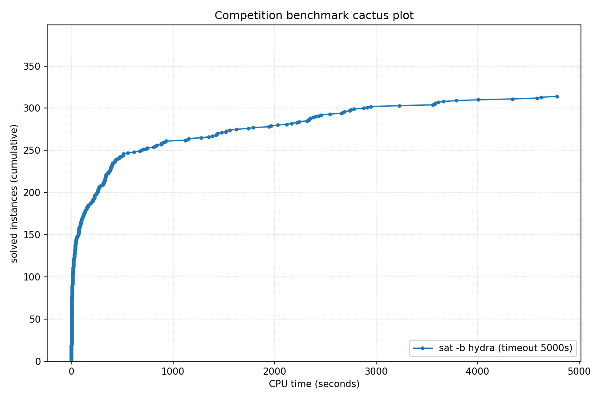

# Competition Benchmark Results (index=main_track_2026.jsonl, timeout=5000s, backend=hydra, parallel=10)

## Summary

| Result | Count | % |
|--------|-------|---|
| SAT | 132 | 33.8% |
| UNSAT | 182 | 46.5% |
| TIMEOUT | 77 | 19.7% |
| **Total** | 391 | 100% |

### Solver effort (mean (min-max))

| Group | N | Paths covered | Conflicts | Conf/s | Restarts | Rst/s |
|-------|---|---------------|-----------|--------|----------|-------|
| SAT | 132 | — | 5.3M (148-98.4M) | 12.1K (7-52.2K) | 161.0K (2-3.0M) | 407 (0-2.0K) |
| UNSAT | 182 | — | 6.4M (20-51.6M) | 20.8K (18-109.1K) | 189.1K (1-1.7M) | 642 (0-3.4K) |
| TIMEOUT | 77 | — | 39.7M (78.3K-226.4M) | 7.9K (16-45.3K) | 990.2K (4.8K-3.9M) | 198 (1-780) |
| Total | 391 | — | 13.8M (20-226.4M) | 14.7K (7-109.1K) | 365.6K (1-3.9M) | 455 (0-3.4K) |

## Cactus plot

## Per-problem results

| Problem | Result | Time | Paths | Total | Conf | Rst |
|---------|--------|------|-------|-------|------|-----|
| 8.normalised | SAT | 35.2768s | — | — | — | — |
| 10.normalised | SAT | 37.9499s | — | — | — | — |
| 18.normalised | SAT | 8.7109s | — | — | — | — |
| 3.normalised | SAT | 10.8737s | — | — | — | — |
| 1.normalised | SAT | 18.7167s | — | — | — | — |
| 2.normalised | SAT | 14.6076s | — | — | — | — |
| 13.normalised | SAT | 6.4338s | — | — | — | — |
| 11.normalised | SAT | 50.2896s | — | — | — | — |
| SC25_Timetable_C_395_E_47_Cl_27_D_7_T_50.normalised | SAT | 11.0331s | — | — | 99.8K | 3.1K |
| 14.normalised | SAT | 6.2905s | — | — | — | — |
| 17.normalised | SAT | 95.0129s | — | — | — | — |
| 20.normalised | SAT | 4.2076s | — | — | — | — |
| SC25_Timetable_C_393_E_45_Cl_26_D_7_T_50.normalised | SAT | 20.3553s | — | — | 172.8K | 5.7K |
| 5.normalised | SAT | 26.2047s | — | — | — | — |
| SC25_Timetable_C_481_E_49_Cl_32_D_7_T_58.normalised | SAT | 132.9641s | — | — | 1.3M | 45.6K |
| crusti_g2io_250_0.2_255_12.normalised | SAT | 224.3159s | — | — | 734.5K | 3.5K |
| SC25_Timetable_C_495_E_50_Cl_33_D_7_T_50.normalised | SAT | 1791.0301s | — | — | 7.3M | 219.8K |
| crusti_g2io_175_0.2_511_10.normalised | SAT | 38.4929s | — | — | 34.1K | 334 |
| crusti_g2io_250_0.2_255_24.normalised | SAT | 71.6536s | — | — | 107.0K | 1.3K |
| SC25_Timetable_C_498_E_46_Cl_34_D_7_T_50.normalised | TIMEOUT | 5000.3071s | — | — | 24.7M | 579.2K |
| SC25_Timetable_C_466_E_39_Cl_31_D_7_T_58.normalised | TIMEOUT | 5000.2808s | — | — | 72.4M | 1.7M |
| crusti_g2io_250_0.2_255_31.normalised | SAT | 8.7971s | — | — | 22.6K | 309 |
| SC25_Timetable_C_495_E_43_Cl_35_D_7_T_58.normalised | TIMEOUT | 5000.3311s | — | — | 69.8M | 1.6M |
| crusti_g2io_200_0.1_127_19.normalised | SAT | 42.0312s | — | — | 217.8K | 5.7K |
| crusti_g2io_250_0.2_255_18.normalised | SAT | 8.8654s | — | — | 19.9K | 327 |
| crusti_g2io_175_0.2_511_32.normalised | SAT | 6.0343s | — | — | 13.8K | 31 |
| SC25_Timetable_C_470_E_39_Cl_32_D_7_T_58.normalised | TIMEOUT | 5000.2967s | — | — | 72.1M | 1.7M |
| crusti_g2io_225_0.1_31_25.normalised | SAT | 27.7658s | — | — | 449.6K | 12.7K |
| SC25_Timetable_C_496_E_46_Cl_33_D_7_T_50.normalised | TIMEOUT | 5000.3511s | — | — | 26.9M | 587.4K |
| SC25_Timetable_C_475_E_39_Cl_33_D_7_T_58.normalised | TIMEOUT | 5000.371s | — | — | 74.1M | 1.8M |
| SC25_Timetable_C_496_E_48_Cl_33_D_7_T_50.normalised | TIMEOUT | 5000.4141s | — | — | 24.3M | 601.8K |
| SC25_Timetable_C_495_E_48_Cl_33_D_7_T_50.normalised | TIMEOUT | 5000.3759s | — | — | 22.3M | 613.1K |
| st_1391_70_12_1674.normalised | TIMEOUT | 5000.0748s | — | — | 54.5M | 177.8K |
| st_826_34_8_3910.normalised | TIMEOUT | 5000.0638s | — | — | 56.6M | 1.1M |
| lockchart-group3-L15-K29-p4d3j1.normalised | UNSAT | 2753.8034s | — | — | 24.2M | 785.9K |
| lockchart-group3-L13-K26-p4d3j1.normalised | UNSAT | 3663.8694s | — | — | 30.3M | 976.2K |
| st_890_86_9_572.normalised | TIMEOUT | 5000.0901s | — | — | 60.7M | 494.1K |
| st_1352_53_23_3737.normalised | TIMEOUT | 5000.0851s | — | — | 54.4M | 261.8K |
| lockchart-group3-L11-K23-p4d3j1.normalised | UNSAT | 2659.6388s | — | — | 23.9M | 749.0K |
| b20 | UNSAT | 5.5668s | — | — | 190.4K | 7.4K |
| lockchart-group1-L240-K345-p8d4j1.normalised | TIMEOUT | 5000.5794s | — | — | 2.9M | 19.5K |
| b20_1 | UNSAT | 3.9934s | — | — | 159.0K | 6.9K |
| b15 | UNSAT | 2.1721s | — | — | 63.2K | 2.7K |
| s15850 | UNSAT | 0.5898s | — | — | 21.4K | 1.3K |
| c7552 | UNSAT | 0.3246s | — | — | 13.9K | 1.1K |
| b21 | UNSAT | 5.8441s | — | — | 194.6K | 7.4K |
| b22_1 | UNSAT | 7.777s | — | — | 268.4K | 8.4K |
| s38417 | UNSAT | 0.9965s | — | — | 27.5K | 1.3K |
| c3540 | UNSAT | 0.5385s | — | — | 21.0K | 1.3K |
| c5315 | UNSAT | 0.4649s | — | — | 19.9K | 1.5K |
| lockchart-group2-rnd0.3-L19-K38-P8D4J1_1.normalised | TIMEOUT | 5000.0728s | — | — | 15.9M | 388.6K |
| lockchart-group1-L220-K317-p8d4j1.normalised | TIMEOUT | 5000.7998s | — | — | 3.6M | 21.0K |
| lockchart-group1-L190-K276-p8d4j1.normalised | TIMEOUT | 5000.2756s | — | — | 4.3M | 21.2K |
| lockchart-group3-L12-K24-p4d3j1.normalised | UNSAT | 4342.0454s | — | — | 35.0M | 1.1M |
| oski15a01b74s_opt | UNSAT | 903.2645s | — | — | 3.1M | 46.0K |
| b19_1 | UNSAT | 432.4453s | — | — | 5.8M | 139.5K |
| b19 | UNSAT | 489.174s | — | — | 6.0M | 131.0K |
| oski15a01b03s_opt | UNSAT | 386.9714s | — | — | 5.6M | 71.7K |
| oski15a01b64s_opt | UNSAT | 331.701s | — | — | 4.8M | 66.2K |
| oski15a01b02s_opt | UNSAT | 341.0838s | — | — | 4.5M | 60.8K |
| oski15a01b19s_opt | UNSAT | 335.1488s | — | — | 5.7M | 70.4K |
| oski15a01b77s_opt | UNSAT | 882.0685s | — | — | 2.3M | 36.8K |
| oski15a01b62s_opt | UNSAT | 373.2831s | — | — | 7.0M | 105.3K |
| oski15a01b15s_opt | UNSAT | 316.3773s | — | — | 6.3M | 86.1K |
| gm24sparrc | UNSAT | 4.6366s | — | — | 2.6K | 22 |
| lockchart-group3-L14-K27-p4d3j1.normalised | UNSAT | 3584.2363s | — | — | 30.4M | 1.0M |
| lockchart-group2-rnd0.3-L19-K38-P8D4J1_3 | TIMEOUT | 5000.0746s | — | — | 15.6M | 343.9K |
| gm16spctrc | UNSAT | 735.004s | — | — | 653.4K | 17.8K |
| lockchart-group2-rnd0.3-L19-K38-P8D4J1_2 | TIMEOUT | 5000.0582s | — | — | 15.7M | 325.2K |
| gm28sparrc | UNSAT | 10.9515s | — | — | 2.4K | 27 |
| gm32sparrc | UNSAT | 6.3842s | — | — | 2.8K | 31 |
| gm36sparrc | UNSAT | 3.7224s | — | — | 844 | 46 |
| lockchart-group1-L255-K366-p8d4j1.normalised | TIMEOUT | 5000.662s | — | — | 2.9M | 13.3K |
| gm20sparrc | UNSAT | 0.2137s | — | — | 68 | 12 |
| oski15a01b60s_opt | UNSAT | 339.5265s | — | — | 6.2M | 87.7K |
| oski15a01b40s_opt | UNSAT | 285.7434s | — | — | 4.5M | 61.4K |
| case10 | SAT | 435.238s | — | — | 9.5M | 217.4K |
| case12.normalised | UNSAT | 15.6955s | — | — | 577.4K | 15.3K |
| oski15a01b09s_opt | UNSAT | 407.7582s | — | — | 7.6M | 115.1K |
| oski15a01b52s_opt | UNSAT | 419.8905s | — | — | 9.0M | 122.3K |
| case18.normalised | UNSAT | 253.9178s | — | — | 1.6M | 60.7K |
| case7.normalised | SAT | 125.294s | — | — | 3.4M | 91.8K |
| case3 | UNSAT | 1430.4903s | — | — | 9.0M | 303.5K |
| case11.normalised | SAT | 828.361s | — | — | 7.8M | 191.6K |
| case2 | SAT | 29.3035s | — | — | 932.7K | 42.8K |
| case9 | SAT | 71.0039s | — | — | 2.1M | 59.0K |
| case19.normalised | SAT | 5.4132s | — | — | 784 | 224 |
| MVRoundRobin_n12_d10_v3 | UNSAT | 0.0229s | — | — | — | — |
| MVRoundRobin_n16_d10_v2 | UNSAT | 0.0444s | — | — | — | — |
| MVRoundRobin_n12_d10_v2 | UNSAT | 0.013s | — | — | — | — |
| RoundRobin_n17_d13 | UNSAT | 0.0027s | — | — | — | — |
| RoundRobin_n15_d13 | UNSAT | 0.0019s | — | — | — | — |
| RoundRobin_n18_d16 | UNSAT | 0.0036s | — | — | — | — |
| RoundRobin_n16_d14 | UNSAT | 0.0027s | — | — | — | — |
| RoundRobin_n16_d13 | UNSAT | 0.0022s | — | — | — | — |
| RoundRobin_n18_d15 | UNSAT | 0.0035s | — | — | — | — |
| MVRoundRobin_n20_d10_v2 | UNSAT | 0.1134s | — | — | — | — |
| MVRoundRobin_n12_d10_v4 | UNSAT | 0.0365s | — | — | — | — |
| MVRoundRobin_n20_d10_v3 | UNSAT | 0.1976s | — | — | — | — |
| clqcl_30_7_6.normalised | UNSAT | 0.0058s | — | — | — | — |
| clqcl_30_8_7.normalised | UNSAT | 0.0088s | — | — | — | — |
| clqcl_30_11_10.normalised | UNSAT | 0.0245s | — | — | — | — |
| clqcl_25_9_8.normalised | UNSAT | 0.0095s | — | — | — | — |
| clqcl_70_6_5.normalised | UNSAT | 0.0175s | — | — | — | — |
| clqcl_25_7_6.normalised | UNSAT | 0.0047s | — | — | — | — |
| clqcl_30_9_8.normalised | UNSAT | 0.0132s | — | — | — | — |
| clqcl_60_6_5.normalised | UNSAT | 0.0126s | — | — | — | — |
| gm16spwtcl | TIMEOUT | 5000.8046s | — | — | 679.2K | 8.5K |
| gm24spctbk | TIMEOUT | 5000.6636s | — | — | 480.0K | 17.2K |
| clqcl_45_6_5.normalised | UNSAT | 0.0071s | — | — | — | — |
| clqcl_30_10_9.normalised | UNSAT | 0.018s | — | — | — | — |
| case1.normalised | SAT | 1521.7736s | — | — | 9.7M | 296.0K |
| case6.normalised | SAT | 3792.9934s | — | — | 24.9M | 798.2K |
| gm32spctlf | TIMEOUT | 5002.1006s | — | — | 78.3K | 6.1K |
| gm16spwtrc | TIMEOUT | 5000.6335s | — | — | 1.4M | 48.2K |
| gm24spctrc | TIMEOUT | 5000.9761s | — | — | 362.1K | 19.5K |
| gm20spctrc | TIMEOUT | 5000.4903s | — | — | 738.7K | 22.3K |
| 16_16_default_mapped_ultra_and_and_dadda_mapped_bit28 | UNSAT | 425.9715s | — | — | 8.4M | 200.6K |
| case4 | TIMEOUT | 5000.0913s | — | — | 101.3M | 2.8M |
| 16_16_booth_wallace_mapped_and_default_origin_bit28 | UNSAT | 2034.4385s | — | — | 12.9M | 469.4K |
| 16_16_booth_dadda_origin_and_default_mapped_ultra_bit29 | UNSAT | 330.7154s | — | — | 7.4M | 184.2K |
| 16_16_default_mapped_ultra_and_and_dadda_origin_bit28 | UNSAT | 469.7603s | — | — | 9.6M | 238.2K |
| 16_16_booth_dadda_mapped_and_and_wallace_origin_bit28 | UNSAT | 2457.6397s | — | — | 16.1M | 571.5K |
| nla-digbench-scaling_dijkstra-u_valuebound1_transition | UNSAT | 31.4214s | — | — | — | — |
| cal182_cal182_transition | UNSAT | 3.9722s | — | — | 2.5K | 348 |
| bv_ILA_Piccolo_JALR_sanity_transition | UNSAT | 1.87s | — | — | 9.5K | 459 |
| bv_ILA_Piccolo_BEQ_sanity_transition | UNSAT | 1.6458s | — | — | 8.4K | 277 |
| nla-digbench-scaling_freire1_valuebound1_transition | UNSAT | 1.8272s | — | — | — | — |
| 16_16_booth_dadda_origin_and_and_dadda_origin_bit29 | UNSAT | 389.2503s | — | — | 8.1M | 187.5K |
| 16_16_booth_dadda_origin_and_and_dadda_origin_bit28 | UNSAT | 2879.5155s | — | — | 19.1M | 640.1K |
| veer_axi_yosyshq_appnote_123_veer_axi-p23_transition | UNSAT | 2.9602s | — | — | 3.0K | 538 |
| bv_rocket_1951_transition | UNSAT | 2.749s | — | — | 2.9K | 545 |
| x-epic_a19-p15_transition | UNSAT | 1.0968s | — | — | 20 | 1 |
| x-epic_a10-p53_transition | UNSAT | 1.8763s | — | — | 2.7K | 546 |
| 16_16_booth_wallace_origin_and_and_dadda_mapped_bit28 | UNSAT | 2437.4867s | — | — | 15.3M | 539.1K |
| arles_thres10_p20_r4514 | UNSAT | 0.0048s | — | — | — | — |
| arles_thres20_p10_r7508 | UNSAT | 0.0081s | — | — | — | — |
| arles_thres10_p10_r8180 | UNSAT | 0.003s | — | — | — | — |
| arles_thres20_p10_r7475 | UNSAT | 0.0076s | — | — | — | — |
| arles_thres10_p10_r8188 | UNSAT | 0.0036s | — | — | — | — |
| arles_thres20_p20_r4109 | UNSAT | 0.0093s | — | — | — | — |
| arles_thres10_p10_r8186 | UNSAT | 0.0031s | — | — | — | — |
| arles_thres20_p30_r2554 | UNSAT | 0.0029s | — | — | — | — |
| arles_thres10_p10_r8185 | UNSAT | 0.0031s | — | — | — | — |
| arles_thres10_p10_r8062 | UNSAT | 0.003s | — | — | — | — |
| arles_thres20_p10_r7533 | UNSAT | 0.0064s | — | — | — | — |
| arles_thres10_p10_r8184 | UNSAT | 0.0032s | — | — | — | — |
| 16_16_booth_dadda_mapped_and_booth_wallace_mapped | UNSAT | 2739.7592s | — | — | 19.1M | 690.6K |
| bp4_CB_FPBEQ_FPBLE.normalised | UNSAT | 98.1412s | — | — | 1.2M | 34.8K |
| nla-digbench-scaling_dijkstra-u_valuebound1_step | UNSAT | 212.059s | — | — | 63.2K | 2.6K |
| bp4_BC012_AM_IXA_LPI.normalised | UNSAT | 214.021s | — | — | 3.5M | 89.6K |
| 2018D_VexRiscv-regch0-20-p1_step | UNSAT | 117.4307s | — | — | 1.8M | 44.2K |
| 16_16_booth_dadda_mapped_and_and_wallace_mapped_bit28 | UNSAT | 2321.7163s | — | — | 14.8M | 541.8K |
| ramsey_3_6_19.normalised | TIMEOUT | 5000.0672s | — | — | 19.6M | 577.3K |
| ramsey_4_4_18.normalised | TIMEOUT | 5000.0583s | — | — | 32.9M | 678.3K |
| bp4_BC012_IXA_LPI_FPBLE.normalised | UNSAT | 555.6492s | — | — | 319.9K | 7.2K |
| bp4_CB_LP_FPBLE.normalised | UNSAT | 71.8078s | — | — | 927.2K | 32.5K |
| bp5.normalised | SAT | 260.118s | — | — | 600.7K | 11.5K |
| bp4_CSO_AM_IXA_LP.normalised | UNSAT | 91.9811s | — | — | 1.2M | 31.9K |
| 16_16_and_wallace_origin_and_default_mapped_ultra_bit27 | UNSAT | 2782.9555s | — | — | 18.7M | 722.7K |
| bp5_CSO.normalised | SAT | 477.0865s | — | — | 1.3M | 19.8K |
| bp4_BC012_AM_FPBEQ_ZR.normalised | SAT | 1279.9721s | — | — | 3.3M | 125.3K |
| bp4_BC012_TCO_CSO_LP_FPBEQ_ZR.normalised | SAT | 932.1553s | — | — | 1.9M | 77.0K |
| bp4_BC012_TCO_AM_IXA.normalised | UNSAT | 269.3017s | — | — | 4.4M | 109.1K |
| bp4_TCO_CB_LP.normalised | UNSAT | 90.2446s | — | — | 1.2M | 33.5K |
| oddball_43_5_tto_zp.normalised | SAT | 510.8275s | — | — | 8.5K | 139 |
| bp4_TCO_AM_IXA_FPBLE.normalised | UNSAT | 407.7992s | — | — | 6.6M | 169.6K |
| oddball_24_4_ttf.normalised | UNSAT | 212.2373s | — | — | 13.1M | 342.0K |
| bp4_CB_CSO_LP_FPBEQ_FPBLE.normalised | UNSAT | 269.5393s | — | — | 4.1M | 118.7K |
| oddball_13_5_ttf.normalised | UNSAT | 15.5972s | — | — | 1.3M | 45.6K |
| oddball_20_5_ttf.normalised | UNSAT | 1.6733s | — | — | 102.4K | 2.7K |
| bp4_BC012_AM_IXA_FPBLE.normalised | UNSAT | 385.7178s | — | — | 6.3M | 171.3K |
| oddball_20_4_ttf.normalised | UNSAT | 1.8437s | — | — | 152.6K | 4.4K |
| 16_16_booth_dadda_mapped_and_booth_wallace_origin | TIMEOUT | 5000.0496s | — | — | 26.9M | 1.0M |
| oddball_70_5_tto_zp.normalised | SAT | 1439.5225s | — | — | 3.2M | 128.3K |
| bp4_BC012_TCO_AM_FPBEQ_ZR.normalised | SAT | 2692.2921s | — | — | 10.7M | 365.2K |
| x-epic_a19-p16_step | UNSAT | 164.6505s (proof unchecked: no proof emitted) | — | — | 291.9K | 8.5K |
| oddball_44_5_tto_zp.normalised | SAT | 260.6441s | — | — | 3.7M | 124.0K |
| oddball_56_5_tto_zp.normalised | SAT | 338.6748s | — | — | 6.4M | 130.8K |
| oddball_47_5_tto_zp.normalised | SAT | 307.348s | — | — | 4.7M | 157.7K |
| 45-126477 | SAT | 76.7011s | — | — | 4.0M | 109.8K |
| qpr-bmp280-driver-5 | SAT | 2.1513s | — | — | 42.2K | 3.3K |
| ssp-0.46172681388173037 | SAT | 327.6427s | — | — | 2.9M | 123.5K |
| bp4_TCO_CSO_ZR.normalised | SAT | 4586.5513s | — | — | 21.2M | 646.1K |
| oddball_51_5_tto_zp.normalised | SAT | 810.184s | — | — | 1.4M | 35.5K |
| clqcl_40_6_5.normalised | UNSAT | 0.0069s | — | — | — | — |
| gensys-ukn006.shuffled-as.sat05-3846 | UNSAT | 226.7258s | — | — | 4.9M | 114.2K |
| hid-uns-enc-6-1-0-0-0-0-26462 | UNSAT | 98.1685s | — | — | 2.4M | 66.2K |
| bench_5078.smt2 | SAT | 151.4173s | — | — | 2.5M | 96.7K |
| oddball_26_4_ttf.normalised | UNSAT | 2334.1967s | — | — | 51.6M | 1.7M |
| x2_72.shuffled-as.sat03-1604 | UNSAT | 0.0027s | — | — | — | — |
| oddball_29_4_ttf.normalised | UNSAT | 2353.6728s | — | — | 50.5M | 1.6M |
| oddball_33_4_ttf.normalised | TIMEOUT | 5000.1136s | — | — | 115.0M | 3.7M |
| E02F20 | SAT | 14.3285s | — | — | 208.9K | 4.8K |
| squ_ali_s10x10_c39_abix_SAT-sc2017 | SAT | 15.7415s | — | — | 749.0K | 31.3K |
| oddball_54_5_tto_zp.normalised | SAT | 1388.4346s | — | — | 2.7M | 73.2K |
| oddball_79_5_tto_zp.normalised | SAT | 3229.849s | — | — | 7.8M | 233.9K |
| oddball_28_4_ttf.normalised | TIMEOUT | 5000.1479s | — | — | 119.1M | 3.9M |
| SCPC-900-27 | SAT | 512.4918s | — | — | 308.2K | 2.1K |
| mp1-bsat210-739 | UNSAT | 2121.5582s | — | — | 16.1M | 520.2K |
| multiplier_16bits__miter_19 | TIMEOUT | 5000.0415s | — | — | 30.0M | 1.1M |
| stone-width3chain-nmarkers-13_shuffled | UNSAT | 671.6594s | — | — | 6.5M | 159.5K |
| connm-ue-csp-sat-n1200-d-0.02-s405595518.shuffled-as.sat05-531 | SAT | 2543.9362s | — | — | 17.7M | 612.3K |
| post-cbmc-aes-d-r2-noholes | UNSAT | 69.1315s | — | — | 1.4M | 40.2K |
| cliquecoloring_n24_k6_c5 | UNSAT | 0.0025s | — | — | — | — |
| or_randxor_k3_n510_m510.sanitized | UNSAT | 1.7441s | — | — | 118.4K | 4.2K |
| two-trees-1023v.sanitized | TIMEOUT | 5000.07s | — | — | 48.6M | 1.5M |
| bphp_p51_h50.sanitized | TIMEOUT | 5000.1399s | — | — | 68.7M | 776.3K |
| VanDerWaerden_pd_2-3-25_606 | SAT | 3578.2491s | — | — | 35.2M | 747.4K |
| le450_15a.col.15 | TIMEOUT | 5000.1345s | — | — | 92.9M | 2.7M |
| 49-134444 | SAT | 4781.8646s | — | — | 98.4M | 3.0M |
| mp1-Nb6T27 | SAT | 135.7372s | — | — | 3.2M | 126.1K |
| 1-ZC-1024-K-117.sanitized | TIMEOUT | 5000.4095s | — | — | 12.5M | 500.5K |
| 19.normalised | SAT | 12.3242s | — | — | — | — |
| transport-transport-three-cities-sequential-14nodes-1000size-4degree-100mindistance-4trucks-14packages-2008seed.020-NOTKNOWN | SAT | 195.8713s | — | — | 281.1K | 3.8K |
| cfi-rigid-t2-0048-04-or_3_shuffle_all | SAT | 39.4303s | — | — | 373.5K | 12.4K |
| oski15a01b70s_opt | UNSAT | 315.7983s | — | — | 5.4M | 65.1K |
| hid-uns-enc-6-1-0-0-0-0-28258 | UNSAT | 48.205s | — | — | 1.4M | 37.0K |
| simon-r22-1.sanitized | SAT | 0.0206s | — | — | — | — |
| hwmcc10-timeframe-expansion-k45-pdtpmsgoodbakery-tseitin | UNSAT | 47.8465s | — | — | 776.9K | 44.9K |
| 1-ZC-512-K-60.sanitized | SAT | 396.4629s | — | — | 4.8M | 154.5K |
| sted1_0x0-637 | SAT | 1744.607s | — | — | 9.1M | 334.2K |
| 4g_5color_170_050_05 | SAT | 35.1553s | — | — | 130.9K | 5.3K |
| sum_of_3_cubes_94_bits_30 | TIMEOUT | 5000.8166s | — | — | 18.0M | 1.1M |
| 20180321_140833987_p_cnf_320_1120 | TIMEOUT | 5000.0468s | — | — | 33.4M | 853.1K |
| puzzle57_sat | TIMEOUT | 5000.1584s | — | — | 29.7M | 1.1M |
| newpol29-4 | UNSAT | 318.8171s | — | — | 284.0K | 13.9K |
| ssp-0.497665446947731 | SAT | 329.3286s | — | — | 2.2M | 96.2K |
| lockchart-group1-L235-K339-p8d4j1.normalised | TIMEOUT | 5000.7407s | — | — | 3.5M | 17.2K |
| mchess_20 | UNSAT | 0.001s | — | — | — | — |
| ncc_none_5047_6_3_3_3_0_435991723 | SAT | 27.8033s | — | — | 69.3K | 2.2K |
| floodit_4_n70_k10_m229 | SAT | 112.066s | — | — | 44.0K | 1.1K |
| LZMAFile_write_12 | UNSAT | 2.0057s | — | — | 174.1K | 4.2K |
| sat-bench-trig-taylor2 | UNSAT | 261.2413s | — | — | 380.7K | 18.4K |
| RoundRobin_n17_d14 | UNSAT | 0.003s | — | — | — | — |
| ezfact64_6.shuffled-as.sat05-453 | SAT | 31.8788s | — | — | 663.0K | 23.7K |
| mchess_17 | UNSAT | 0.0006s | — | — | — | — |
| ncc_none_3001_7_3_3_1_31_435991723 | SAT | 41.5436s | — | — | 80.7K | 1.8K |
| ecarev-110-1031-23-40-8-sc2018 | SAT | 230.6015s | — | — | 6.2M | 162.1K |
| gto_p50c314 | TIMEOUT | 5000.0799s | — | — | 76.4M | 2.3M |
| lec_mult_DvK_12x11.sanitized | UNSAT | 3611.2866s | — | — | 20.9M | 782.7K |
| crn_40_1521_s | TIMEOUT | 5000.1728s | — | — | 112.3M | 3.9M |
| mp1-blockpuzzle_5x10_s8_free3 | UNSAT | 4.1113s | — | — | 154.3K | 4.5K |
| slp-synthesis-aes-bottom22 | TIMEOUT | 5000.3618s | — | — | 34.3M | 1.5M |
| x2_64.shuffled-as.sat03-1603 | UNSAT | 0.0015s | — | — | — | — |
| satcoin-genesis-UNSAT-12300 | UNSAT | 505.5418s | — | — | 64.9K | 666 |
| urqh5x5.shuffled-as.sat03-1481.cnf.mis-127.debugged | TIMEOUT | 5000.0726s | — | — | 96.6M | 3.1M |
| peb-pyrofpyr-15-neq-3_shuffled | UNSAT | 164.4415s | — | — | 8.3M | 103.0K |
| bench_3098.smt2 | SAT | 10.1079s | — | — | 182.6K | 12.1K |
| homer12.shuffled | UNSAT | 18.3396s | — | — | 2.0M | 55.4K |
| oddball_80_5_tto_zp.normalised | SAT | 2220.2922s | — | — | 5.0M | 214.2K |
| 008-80-8 | SAT | 749.4978s | — | — | 4.1M | 175.6K |
| UNSAT_MS_opt_termes_p20.pddl_105 | TIMEOUT | 5000.4936s | — | — | 10.3M | 303.5K |
| UNSAT_MS_opt_snake_p17.pddl_61 | TIMEOUT | 5001.4629s | — | — | 1.2M | 4.8K |
| Steiner-729-112-bce | TIMEOUT | 5000.1464s | — | — | 33.2M | 877.5K |
| baseballcover12with25_and4positions | SAT | 248.143s | — | — | 1.8M | 55.9K |
| mdp-28-10-sat | SAT | 114.417s | — | — | 4.4M | 148.4K |
| Mycielski-11-hints-1 | UNSAT | 360.8469s | — | — | 3.6M | 85.5K |
| color-11-3.shuffled-as.sat05-445 | TIMEOUT | 5000.0779s | — | — | 49.5M | 834.3K |
| SCPC-500-7 | UNSAT | 32.0826s | — | — | 983.3K | 15.6K |
| bvsub_06991 | UNSAT | 6.223s | — | — | 167.3K | 3.0K |
| 005 | SAT | 687.3465s | — | — | 3.3M | 152.3K |
| cube-11-h14-sat | SAT | 1480.1468s | — | — | 984.9K | 32.5K |
| connm-ue-csp-sat-n1200-d-0.02-s383740539.sat05-534.reshuffled-07 | SAT | 152.5651s | — | — | 3.3M | 109.4K |
| sum_of_3_cubes_108_bits_52 | TIMEOUT | 5000.342s | — | — | 17.9M | 1.1M |
| rook-44-1-1 | UNSAT | 105.659s | — | — | 2.8M | 50.1K |
| bvurem_17.smt2 | UNSAT | 1520.8384s | — | — | 17.7M | 642.5K |
| 170224890 | SAT | 39.3182s | — | — | 1.4M | 27.0K |
| 1-ET-512-K-98.sanitized | TIMEOUT | 5001.0356s | — | — | 7.8M | 374.6K |
| Mycielski-10-hints-6 | TIMEOUT | 5000.2986s | — | — | 35.9M | 771.0K |
| shuffling-1-s1931574585-of-bench-sat04-328.used-as.sat04-449 | UNSAT | 4.6183s | — | — | 122.7K | 9.1K |
| aes_decry_2_rounds.debugged | UNSAT | 73.9555s | — | — | 1.3M | 45.8K |
| linvrinv5.shuffled-as.sat05-564 | UNSAT | 2169.092s | — | — | 18.4M | 655.8K |
| sncf_model_ixl_bmc_depth_15 | TIMEOUT | 5001.1189s | — | — | 5.3M | 52.1K |
| SGI_30_60_28_40_7-log.shuffled-as.sat03-127 | UNSAT | 4005.944s | — | — | 29.5M | 914.1K |
| posixpath_expanduser_14 | UNSAT | 8.8046s | — | — | 697.4K | 19.0K |
| queen12_12.col.12 | UNSAT | 19.295s | — | — | 1.8M | 37.7K |
| x9-12022.sat.sanitized | SAT | 2243.8802s | — | — | 16.2M | 533.1K |
| hcp_d14_14 | SAT | 615.0928s | — | — | 2.0M | 71.7K |
| grs-48-160 | UNSAT | 1122.1983s | — | — | 2.5M | 54.1K |
| aes_32_4_keyfind_1 | TIMEOUT | 5000.0467s | — | — | 27.7M | 1.1M |
| ssp-0.046166496845693274 | TIMEOUT | 5000.0472s | — | — | 5.3M | 298.3K |
| mp1-blockpuzzle_5x12_s6_free3 | UNSAT | 10.1391s | — | — | 309.3K | 12.1K |
| MVD_ADS_S11_7_7 | SAT | 0.5559s | — | — | 148 | 52 |
| oddball_22_5_ttf.normalised | UNSAT | 2.5103s | — | — | 135.5K | 4.2K |
| q_query_3_L200_coli.sat | UNSAT | 76.4902s | — | — | 410.8K | 12.4K |
| gt-025.shuffled-as.sat05-1306 | UNSAT | 0.0875s | — | — | 5.1K | 27 |
| si2-r001-m200-00 | SAT | 7.1964s | — | — | 60.7K | 2.8K |
| sted5_0x0-157 | SAT | 707.4325s | — | — | 2.6M | 99.7K |
| case13.normalised | SAT | 18.9383s | — | — | 274.5K | 12.5K |
| stable-400-0.1-11-98765432140011 | SAT | 123.1674s | — | — | 4.8M | 86.9K |
| x9-11067.sat.sanitized | SAT | 70.9882s | — | — | 1.9M | 51.6K |
| Karatsuba4477457x5308417 | SAT | 53.8239s | — | — | 986.9K | 47.5K |
| abw-T-dwt__592.mtx-w98 | SAT | 63.0322s | — | — | 81.1K | 1.3K |
| HCP-470-105 | SAT | 1622.789s | — | — | 23.1M | 742.8K |
| eq.atree.braun.13.unsat | UNSAT | 4624.9843s | — | — | 31.4M | 1.1M |
| constraints_16_0.4_1.sanitized | UNSAT | 52.6994s | — | — | 873.9K | 23.4K |
| FmlaImplyChain_3_7_7.sanitized | UNSAT | 839.0194s | — | — | 30.5M | 1.1M |
| rphp_p6_r540 | TIMEOUT | 5000.4952s | — | — | 37.8M | 224.8K |
| clauses-8.shuffled-as.sat05-1969 | SAT | 104.8264s | — | — | 1.4M | 60.5K |
| x9-11035.sat.sanitized | SAT | 4.462s | — | — | 136.1K | 5.8K |
| esawn_uw3.debugged | SAT | 14.1318s | — | — | — | — |
| mrpp_8x8#20_16 | SAT | 12.1883s | — | — | 557.4K | 21.6K |
| sgen1-unsat-103-100.cnf.mis-78.debugged | UNSAT | 176.5329s | — | — | 9.2M | 219.2K |
| hash_table_find_safety_size_21 | UNSAT | 93.1513s (proof unchecked: cake_lpr out of memory (heap cap; not a rejection)) | — | — | 13.2K | 147 |
| EDP3-16000 | TIMEOUT | 5000.3428s | — | — | 10.6M | 445.0K |
| or_randxor_k3_n590_m590.sanitized | UNSAT | 1.7248s | — | — | 119.6K | 4.4K |
| 31.smt2 | SAT | 35.0372s | — | — | 302.5K | 17.4K |
| strips-gripper-12t22.shuffled-as.sat05-1151 | UNSAT | 11.3715s | — | — | 426.5K | 13.8K |
| sted5_0x1e3-120 | SAT | 85.0962s | — | — | 1.9M | 72.2K |
| Kakuro-easy-138-ext.xml.hg_5 | SAT | 382.97s | — | — | 576.6K | 17.0K |
| floodit_7_n70_k10_m230 | SAT | 66.0843s | — | — | 25.0K | 1.1K |
| pyhala-braun-unsat-40-4-02.shuffled-as.sat05-459 | UNSAT | 41.7344s | — | — | 899.6K | 35.5K |
| 01-integer-programming-20-30-40 | SAT | 1557.8228s | — | — | 1.5M | 76.0K |
| 01-integer-programming-5-10-100 | TIMEOUT | 5000.1626s | — | — | 27.8M | 1.0M |
| stable-400-0.1-12-98765432140012 | SAT | 884.401s | — | — | 9.7M | 244.4K |
| md5_48_3 | SAT | 25.8369s | — | — | 474.3K | 32.9K |
| satcoin-genesis-UNSAT-6120 | UNSAT | 398.1514s | — | — | 87.6K | 1.8K |
| w19-8.0 | UNSAT | 145.001s | — | — | 3.6M | 109.4K |
| x9-12096.sat.sanitized | SAT | 1140.4353s | — | — | 8.6M | 288.6K |
| Folkman-185-152478531.sanitized | SAT | 399.5968s | — | — | 9.9M | 217.9K |
| oski15a01b38s_opt | UNSAT | 375.9009s | — | — | 6.0M | 73.6K |
| ex025_19 | UNSAT | 3558.515s | — | — | 19.7M | 586.3K |
| med30.shuffled | SAT | 0.2139s | — | — | 4.6K | 25 |
| shuffling-1-s1948244678-of-bench-sat04-301.used-as.sat04-476 | UNSAT | 87.0717s | — | — | 2.4M | 73.9K |
| abw-T-dwt__592.mtx-w102 | SAT | 350.0619s | — | — | 734.8K | 3.9K |
| SAT_instance_N=85 | TIMEOUT | 5000.9783s | — | — | 25.2M | 785.4K |
| gt-ordering-unsat-gt-045.sat05-1310.reshuffled-07 | UNSAT | 0.6588s | — | — | 26.8K | 297 |
| 59-131122 | SAT | 1965.9767s | — | — | 37.8M | 1.2M |
| sp5-26-19-bin-nons-tree-noid | TIMEOUT | 5000.045s | — | — | 44.9M | 1.5M |
| satcoin-genesis-SAT-16 | SAT | 17.6013s | — | — | 1.7K | 194 |
| LABS_n089_goal008-sc2013 | SAT | 2378.3s | — | — | 974.3K | 49.3K |
| mdp-32-12-sat | SAT | 922.8303s | — | — | 9.8M | 301.4K |
| ex095_8 | UNSAT | 2405.0928s | — | — | 11.8M | 360.8K |
| SAT_dat.k40.debugged | UNSAT | 156.3948s | — | — | 2.4M | 87.7K |
| safe-50-h49-unsat | TIMEOUT | 5000.8491s | — | — | 44.0M | 1.4M |
| 46-128972 | SAT | 2344.8994s | — | — | 48.2M | 1.5M |
| battleship-20-39-sat | SAT | 14.8585s | — | — | 587.3K | 10.6K |
| mm-2x3-8-8-sb.1.shuffled-as.sat03-1504.used-as.sat04-829 | UNSAT | 227.9651s | — | — | 5.7M | 152.9K |
| puzzle42_unsat | TIMEOUT | 5000.1523s | — | — | 21.7M | 873.2K |
| reconf10_22_queen20_3_8667 | SAT | 459.4962s | — | — | 2.7M | 62.5K |
| SE_PR_stb_588_138.apx_1 | SAT | 227.4573s | — | — | 5.2M | 133.2K |
| hantzsche_wendt_unit_83 | UNSAT | 1153.8321s | — | — | 4.8M | 175.8K |
| manthey_DimacsSorterHalf_35_9 | SAT | 185.8138s | — | — | 2.9M | 72.5K |
| asconhashv12_opt64_H8_M2-1yQCyA0j_m2_6.c | SAT | 2672.3052s | — | — | 18.4K | 38 |
| Q3inK12 | SAT | 1.4293s | — | — | 2.8K | 2 |
| Kakuro-easy-106-ext.xml.hg_6 | SAT | 245.5133s | — | — | 529.8K | 15.5K |
| full-bg-gb-9-ce | SAT | 1946.2635s | — | — | 14.0M | 423.0K |
| b04_s_unknown | SAT | 139.1434s | — | — | 415.6K | 13.4K |
| summle_X8651_steps8_I1-2-2-4-4-8-25-100 | SAT | 15.9153s | — | — | 115.7K | 8.5K |
| Break_14_60.xml | SAT | 18.6034s | — | — | 452.8K | 19.7K |
| gus-md5-15 | TIMEOUT | 5000.3475s | — | — | 3.7M | 114.0K |
| urqh1c5x5.shuffled-as.sat03-1468.cnf.mis-103.debugged | TIMEOUT | 5000.0633s | — | — | 83.0M | 2.7M |
| asconhashv12_opt64_H6_M2-4XKSMr_m1_3_U25.c | UNSAT | 1423.617s | — | — | 93.0K | 464 |
| linked_list_swap_contents_safety_unwind57 | UNSAT | 31.4008s | — | — | 8.8K | 262 |
| shuffling-2-s340247357-of-bench-sat04-361.used-as.sat04-638 | UNSAT | 2.0618s | — | — | 79.5K | 4.3K |
| IBM_FV_2004_rule_batch_1_31_2_SAT_dat.k95.debugged | UNSAT | 29.6516s | — | — | 614.4K | 20.6K |
| PRP_40_40 | SAT | 20.5356s | — | — | 370.6K | 11.4K |
| baseballcover13with25_and1positions | SAT | 41.7393s | — | — | 523.0K | 18.7K |
| at-least-two-sokoban-sequential-p145-microban-sequential.030-NOTKNOWN | UNSAT | 263.8347s | — | — | 936.7K | 10.6K |
| gus-md5-14-sc2009 | TIMEOUT | 5000.5726s | — | — | 3.6M | 90.5K |
| vlsat2_40896_6104639.dimacs | TIMEOUT | 5000.4448s | — | — | 43.6M | 135.2K |
| tseitingrid6x185_shuffled | UNSAT | 0.0241s | — | — | — | — |
| clauses-8.renamed-as.sat05-1964 | SAT | 120.187s | — | — | 2.4M | 82.2K |
| 5col160_15_6.shuffled | TIMEOUT | 5000.0489s | — | — | 31.3M | 972.6K |
| sgp_9-4-8.shuffled-as.sat05-2673 | TIMEOUT | 5000.3726s | — | — | 33.5M | 1.1M |
| Circuit_multiplier37 | SAT | 11.3336s | — | — | 297.3K | 17.1K |
| 48-134487 | TIMEOUT | 5000.5108s | — | — | 114.3M | 3.6M |
| ncc_none_12477_5_3_3_0_0_435991723 | UNSAT | 20.7155s (proof unchecked: no proof emitted) | — | — | 50.8K | 541 |
| battleship-19-19-unsat | TIMEOUT | 5000.1125s | — | — | 59.1M | 826.9K |
| post-cbmc-aes-ee-r2-noholes | UNSAT | 73.6105s | — | — | 1.5M | 44.7K |
| baseballcover11with22_and2positions | SAT | 197.517s | — | — | 577.3K | 18.9K |
| sin-mitern26 | UNSAT | 275.16s | — | — | 1.3M | 49.0K |
| rphp5_045_shuffled | UNSAT | 2947.9134s | — | — | 44.5M | 1.1M |
| GP_100_951_33 | SAT | 11.623s | — | — | — | — |
| sum_of_3_cubes_145_bits_74 | TIMEOUT | 5000.5971s | — | — | 15.2M | 965.4K |
| g2-T122.1.0 | UNSAT | 363.84s | — | — | 594.6K | 10.6K |
| oski15a01b42s_opt | UNSAT | 310.3049s | — | — | 5.5M | 76.3K |
| SC23_Timetable_C_476_E_50_Cl_32_D_6_T_50 | SAT | 47.9805s | — | — | 454.1K | 17.3K |
| pyhala-braun-sat-40-4-03.shuffled-as.sat03-1541 | SAT | 28.5824s | — | — | 599.9K | 24.3K |
| toughsat_factoring_895s | SAT | 91.7178s | — | — | 1.6M | 62.1K |
| vlsat2_21573_2289124.dimacs | SAT | 4.1025s | — | — | 54.8K | 460 |
| xor_op_n46_d3 | TIMEOUT | 5000.4274s | — | — | 226.4M | 1.9M |
| marg6x6.shuffled-as.sat03-1456.cnf.mis-119.debugged | TIMEOUT | 5000.0738s | — | — | 85.3M | 2.7M |
| rbsat-v760c43649g8 | SAT | 2915.6841s | — | — | 47.7M | 1.2M |
| ctl_4201_555_unsat_pre | UNSAT | 1352.3205s | — | — | 9.3M | 280.7K |
| worker_50_50_30_0.8 | TIMEOUT | 5000.1199s | — | — | 113.0M | 1.2M |
| custmulsb2x32o | TIMEOUT | 5000.0647s | — | — | 38.1M | 1.2M |
| 30_2 | TIMEOUT | 5000.0567s | — | — | 25.2M | 259.5K |
| b2005-p3-14x14c17h9-Ser8-0 | TIMEOUT | 5000.9771s | — | — | 3.2M | 105.8K |
| mp1-rubikcube220 | TIMEOUT | 5000.0414s | — | — | 24.3M | 858.7K |
