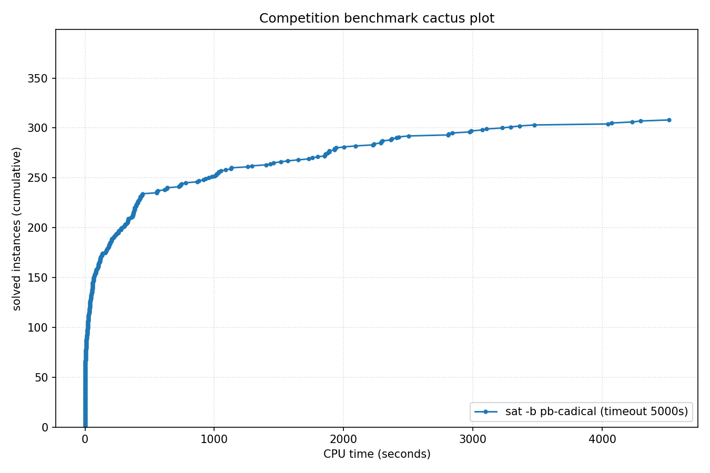

# Competition Benchmark Results (index=main_track_2026.jsonl, timeout=5000s, backend=pb-cadical, parallel=10)

## Summary

| Result | Count | % |
|--------|-------|---|
| SAT | 130 | 33.2% |
| UNSAT | 178 | 45.5% |
| TIMEOUT | 83 | 21.2% |
| **Total** | 391 | 100% |

### Solver effort (mean (min-max))

| Group | N | Paths covered | Conflicts | Conf/s | Restarts | Rst/s |
|-------|---|---------------|-----------|--------|----------|-------|
| SAT | 130 | — | 5.3M (0-98.4M) | 9.7K (0-42.0K) | 167.2K (0-3.0M) | 356 (0-2.3K) |
| UNSAT | 178 | — | 6.3M (0-53.3M) | — | 201.5K (0-1.7M) | — |
| TIMEOUT | 83 | — | 49.8M (84.4K-431.9M) | 10.0K (17-86.4K) | 1.3M (4.9K-10.4M) | 256 (1-2.1K) |
| Total | 391 | — | 15.9M (0-431.9M) | 9.8K (0-86.4K) | 435.2K (0-10.4M) | 317 (0-2.3K) |

## Cactus plot

## Per-problem results

| Problem | Result | Time | Paths | Total | Conf | Rst |
|---------|--------|------|-------|-------|------|-----|
| 14.normalised | SAT | 11.5303s | — | — | 0 | 0 |
| 13.normalised | SAT | 12.5119s | — | — | 0 | 0 |
| 18.normalised | SAT | 19.5786s | — | — | 0 | 0 |
| 20.normalised | SAT | 9.4549s | — | — | 0 | 0 |
| 3.normalised | SAT | 23.6411s | — | — | 0 | 0 |
| 2.normalised | SAT | 33.2751s | — | — | 0 | 0 |
| 1.normalised | SAT | 55.8705s | — | — | 0 | 0 |
| 5.normalised | SAT | 68.1079s | — | — | 0 | 0 |
| 8.normalised | SAT | 108.9663s | — | — | 0 | 0 |
| 11.normalised | SAT | 117.8755s | — | — | 0 | 0 |
| 10.normalised | SAT | 118.9354s | — | — | 0 | 0 |
| SC25_Timetable_C_395_E_47_Cl_27_D_7_T_50.normalised | SAT | 66.4808s | — | — | 444.6K | 16.6K |
| SC25_Timetable_C_393_E_45_Cl_26_D_7_T_50.normalised | SAT | 40.2854s | — | — | 294.2K | 8.5K |
| SC25_Timetable_C_481_E_49_Cl_32_D_7_T_58.normalised | SAT | 23.386s | — | — | 98.1K | 2.3K |
| 17.normalised | SAT | 192.908s | — | — | 0 | 0 |
| crusti_g2io_250_0.2_255_12.normalised | SAT | 34.4928s | — | — | 92.5K | 744 |
| SC25_Timetable_C_495_E_50_Cl_33_D_7_T_50.normalised | SAT | 1291.3698s | — | — | 7.3M | 219.8K |
| crusti_g2io_175_0.2_511_10.normalised | SAT | 24.9262s | — | — | 24.7K | 56 |
| crusti_g2io_250_0.2_255_24.normalised | SAT | 36.0288s | — | — | 105.1K | 1.7K |
| SC25_Timetable_C_498_E_46_Cl_34_D_7_T_50.normalised | TIMEOUT | 5000.1474s | — | — | 27.7M | 670.7K |
| SC25_Timetable_C_466_E_39_Cl_31_D_7_T_58.normalised | TIMEOUT | 5000.107s | — | — | 79.7M | 1.9M |
| SC25_Timetable_C_495_E_43_Cl_35_D_7_T_58.normalised | TIMEOUT | 5000.1298s | — | — | 76.2M | 1.8M |
| SC25_Timetable_C_470_E_39_Cl_32_D_7_T_58.normalised | TIMEOUT | 5000.1409s | — | — | 78.1M | 1.9M |
| crusti_g2io_200_0.1_127_19.normalised | SAT | 30.0651s | — | — | 174.4K | 2.0K |
| SC25_Timetable_C_496_E_46_Cl_33_D_7_T_50.normalised | TIMEOUT | 5000.1196s | — | — | 29.5M | 643.9K |
| crusti_g2io_250_0.2_255_18.normalised | SAT | 24.5562s | — | — | 24.3K | 108 |
| crusti_g2io_175_0.2_511_32.normalised | SAT | 26.6789s | — | — | 19.7K | 24 |
| crusti_g2io_250_0.2_255_31.normalised | SAT | 56.3869s | — | — | 247.7K | 5.6K |
| crusti_g2io_225_0.1_31_25.normalised | SAT | 48.0226s | — | — | 669.2K | 17.1K |
| SC25_Timetable_C_475_E_39_Cl_33_D_7_T_58.normalised | TIMEOUT | 5000.1325s | — | — | 81.0M | 2.0M |
| SC25_Timetable_C_496_E_48_Cl_33_D_7_T_50.normalised | TIMEOUT | 5000.136s | — | — | 27.8M | 671.8K |
| SC25_Timetable_C_495_E_48_Cl_33_D_7_T_50.normalised | TIMEOUT | 5000.1273s | — | — | 24.8M | 677.4K |
| st_1391_70_12_1674.normalised | TIMEOUT | 5000.0304s | — | — | 63.1M | 206.0K |
| st_826_34_8_3910.normalised | TIMEOUT | 5000.0237s | — | — | 64.1M | 1.2M |
| st_890_86_9_572.normalised | TIMEOUT | 5000.0401s | — | — | 66.9M | 545.1K |
| st_1352_53_23_3737.normalised | TIMEOUT | 5000.0244s | — | — | 60.0M | 291.0K |
| lockchart-group1-L240-K345-p8d4j1.normalised | TIMEOUT | 5001.4556s | — | — | 3.3M | 21.7K |
| lockchart-group2-rnd0.3-L19-K38-P8D4J1_1.normalised | TIMEOUT | 5000.0251s | — | — | 16.9M | 416.5K |
| lockchart-group1-L220-K317-p8d4j1.normalised | TIMEOUT | 5001.1296s | — | — | 4.0M | 21.1K |
| b20 | UNSAT | 5.7152s (CaDiCaL proof unverified) | — | — | 232.8K | 7.9K |
| b20_1 | UNSAT | 3.5076s (CaDiCaL proof unverified) | — | — | 142.3K | 4.5K |
| b15 | UNSAT | 1.4282s (CaDiCaL proof unverified) | — | — | 42.5K | 1.8K |
| s15850 | UNSAT | 0.2412s (CaDiCaL proof unverified) | — | — | 11.0K | 910 |
| b22_1 | UNSAT | 6.3108s (CaDiCaL proof unverified) | — | — | 211.5K | 7.3K |
| c7552 | UNSAT | 0.194s (CaDiCaL proof unverified) | — | — | 14.7K | 752 |
| lockchart-group1-L190-K276-p8d4j1.normalised | TIMEOUT | 5000.7551s | — | — | 4.7M | 26.4K |
| s38417 | UNSAT | 0.5053s (CaDiCaL proof unverified) | — | — | 14.5K | 868 |
| b21 | UNSAT | 5.5533s (CaDiCaL proof unverified) | — | — | 204.1K | 7.1K |
| c3540 | UNSAT | 0.5732s (CaDiCaL proof unverified) | — | — | 40.7K | 1.7K |
| c5315 | UNSAT | 0.1429s (CaDiCaL proof unverified) | — | — | 11.3K | 662 |
| b19 | UNSAT | 723.9501s (CaDiCaL proof unverified) | — | — | 10.3M | 360.8K |
| b19_1 | UNSAT | 737.3455s (CaDiCaL proof unverified) | — | — | 9.3M | 347.4K |
| oski15a01b74s_opt | UNSAT | 411.5599s (CaDiCaL proof unverified) | — | — | 3.1M | 46.0K |
| oski15a01b03s_opt | UNSAT | 428.6002s (CaDiCaL proof unverified) | — | — | 3.6M | 62.1K |
| oski15a01b02s_opt | UNSAT | 306.1545s (CaDiCaL proof unverified) | — | — | 2.4M | 36.1K |
| oski15a01b64s_opt | UNSAT | 378.835s (CaDiCaL proof unverified) | — | — | 2.2M | 32.4K |
| oski15a01b62s_opt | UNSAT | 394.5757s (CaDiCaL proof unverified) | — | — | 2.3M | 32.5K |
| oski15a01b19s_opt | UNSAT | 402.2287s (CaDiCaL proof unverified) | — | — | 2.7M | 33.2K |
| lockchart-group3-L15-K29-p4d3j1.normalised | UNSAT | 2236.4004s (proof unchecked: veripb timeout (5000s)) | — | — | 24.2M | 785.9K |
| oski15a01b15s_opt | UNSAT | 334.3391s (CaDiCaL proof unverified) | — | — | 2.3M | 28.8K |
| oski15a01b77s_opt | UNSAT | 384.8062s (CaDiCaL proof unverified) | — | — | 2.3M | 36.8K |
| oski15a01b40s_opt | UNSAT | 376.4499s (CaDiCaL proof unverified) | — | — | 2.5M | 31.0K |
| oski15a01b60s_opt | UNSAT | 370.3726s (CaDiCaL proof unverified) | — | — | 2.1M | 32.4K |
| oski15a01b52s_opt | UNSAT | 355.9366s (CaDiCaL proof unverified) | — | — | 2.2M | 37.6K |
| gm24sparrc | UNSAT | 6.5252s (CaDiCaL proof unverified) | — | — | 1.2K | 72 |
| oski15a01b09s_opt | UNSAT | 429.9183s (CaDiCaL proof unverified) | — | — | 2.4M | 35.3K |
| lockchart-group3-L14-K27-p4d3j1.normalised | UNSAT | 3074.6402s (CaDiCaL proof unverified) | — | — | 30.4M | 1.0M |
| lockchart-group3-L13-K26-p4d3j1.normalised | UNSAT | 3291.441s (proof unchecked: veripb timeout (5000s)) | — | — | 30.3M | 976.2K |
| gm16spctrc | UNSAT | 241.6487s (CaDiCaL proof unverified) | — | — | 653.4K | 17.8K |
| gm28sparrc | UNSAT | 1.4267s (CaDiCaL proof unverified) | — | — | 140 | 24 |
| gm32sparrc | UNSAT | 25.6753s (CaDiCaL proof unverified) | — | — | 1.2K | 27 |
| gm36sparrc | UNSAT | 4.1728s (CaDiCaL proof unverified) | — | — | 632 | 53 |
| lockchart-group3-L11-K23-p4d3j1.normalised | UNSAT | 2408.654s (proof unchecked: veripb timeout (5000s)) | — | — | 23.9M | 749.0K |
| gm20sparrc | UNSAT | 9.6832s (CaDiCaL proof unverified) | — | — | 2.2K | 29 |
| lockchart-group3-L12-K24-p4d3j1.normalised | UNSAT | 4045.1177s (proof unchecked: veripb timeout (5000s)) | — | — | 35.0M | 1.1M |
| lockchart-group1-L255-K366-p8d4j1.normalised | TIMEOUT | 5001.4876s | — | — | 3.3M | 16.5K |
| lockchart-group2-rnd0.3-L19-K38-P8D4J1_3 | TIMEOUT | 5000.0231s | — | — | 17.3M | 371.2K |
| case12.normalised | UNSAT | 13.3912s (CaDiCaL proof unverified) | — | — | 530.2K | 13.8K |
| lockchart-group2-rnd0.3-L19-K38-P8D4J1_2 | TIMEOUT | 5000.0273s | — | — | 16.9M | 347.9K |
| case10 | SAT | 81.6055s | — | — | 2.2M | 73.5K |
| case18.normalised | UNSAT | 439.3319s (CaDiCaL proof unverified) | — | — | 2.3M | 105.5K |
| case7.normalised | SAT | 101.739s | — | — | 2.6M | 84.9K |
| case3 | UNSAT | 932.7461s (CaDiCaL proof unverified) | — | — | 9.0M | 303.5K |
| case11.normalised | SAT | 328.2973s | — | — | 7.8M | 191.6K |
| case2 | SAT | 39.6866s | — | — | 946.1K | 49.4K |
| case9 | SAT | 51.7447s | — | — | 1.5M | 53.7K |
| case19.normalised | SAT | 5.6866s | — | — | 277 | 21 |
| MVRoundRobin_n12_d10_v3 | UNSAT | 0.0224s | — | — | — | — |
| MVRoundRobin_n16_d10_v2 | UNSAT | 0.0467s | — | — | — | — |
| MVRoundRobin_n12_d10_v2 | UNSAT | 0.0129s | — | — | — | — |
| RoundRobin_n17_d13 | UNSAT | 0.003s | — | — | — | — |
| RoundRobin_n15_d13 | UNSAT | 0.0023s | — | — | — | — |
| RoundRobin_n18_d16 | UNSAT | 0.0039s | — | — | — | — |
| RoundRobin_n16_d14 | UNSAT | 0.0028s | — | — | — | — |
| RoundRobin_n16_d13 | UNSAT | 0.0022s | — | — | — | — |
| RoundRobin_n18_d15 | UNSAT | 0.0036s | — | — | — | — |
| MVRoundRobin_n20_d10_v2 | UNSAT | 0.1332s | — | — | — | — |
| MVRoundRobin_n12_d10_v4 | UNSAT | 0.0368s | — | — | — | — |
| MVRoundRobin_n20_d10_v3 | UNSAT | 0.2073s | — | — | — | — |
| clqcl_30_7_6.normalised | UNSAT | 0.0062s | — | — | — | — |
| clqcl_30_8_7.normalised | UNSAT | 0.0095s | — | — | — | — |
| clqcl_30_11_10.normalised | UNSAT | 0.0222s | — | — | — | — |
| clqcl_25_9_8.normalised | UNSAT | 0.0098s | — | — | — | — |
| clqcl_70_6_5.normalised | UNSAT | 0.0163s | — | — | — | — |
| clqcl_25_7_6.normalised | UNSAT | 0.004s | — | — | — | — |
| clqcl_30_9_8.normalised | UNSAT | 0.0129s | — | — | — | — |
| clqcl_60_6_5.normalised | UNSAT | 0.0137s | — | — | — | — |
| case1.normalised | SAT | 1030.8249s | — | — | 9.7M | 296.0K |
| case6.normalised | SAT | 3362.2222s | — | — | 24.9M | 798.2K |
| clqcl_45_6_5.normalised | UNSAT | 0.0078s | — | — | — | — |
| gm16spwtcl | TIMEOUT | 5000.3467s | — | — | 754.1K | 14.4K |
| clqcl_30_10_9.normalised | UNSAT | 0.0173s | — | — | — | — |
| gm24spctbk | TIMEOUT | 5000.3137s | — | — | 559.7K | 17.2K |
| gm32spctlf | TIMEOUT | 5002.2718s | — | — | 84.4K | 6.1K |
| gm16spwtrc | TIMEOUT | 5000.2272s | — | — | 1.6M | 57.1K |
| gm24spctrc | TIMEOUT | 5000.3437s | — | — | 382.9K | 23.4K |
| gm20spctrc | TIMEOUT | 5000.2655s | — | — | 794.0K | 22.9K |
| 16_16_booth_wallace_mapped_and_default_origin_bit28 | UNSAT | 1514.8608s (CaDiCaL proof unverified) | — | — | 12.9M | 469.4K |
| 16_16_default_mapped_ultra_and_and_dadda_mapped_bit28 | UNSAT | 1130.8854s (CaDiCaL proof unverified) | — | — | 11.2M | 402.7K |
| 16_16_booth_dadda_mapped_and_and_wallace_origin_bit28 | UNSAT | 1929.9506s (CaDiCaL proof unverified) | — | — | 16.1M | 571.5K |
| 16_16_booth_dadda_origin_and_default_mapped_ultra_bit29 | UNSAT | 426.3945s (CaDiCaL proof unverified) | — | — | 6.5M | 231.6K |
| 16_16_default_mapped_ultra_and_and_dadda_origin_bit28 | UNSAT | 1036.99s (CaDiCaL proof unverified) | — | — | 11.1M | 402.2K |
| 16_16_booth_dadda_origin_and_and_dadda_origin_bit29 | UNSAT | 746.3353s (CaDiCaL proof unverified) | — | — | 8.6M | 303.7K |
| nla-digbench-scaling_dijkstra-u_valuebound1_transition | UNSAT | 1.3031s (CaDiCaL proof unverified) | — | — | 1 | 0 |
| cal182_cal182_transition | UNSAT | 0.7154s (CaDiCaL proof unverified) | — | — | 1 | 0 |
| bv_ILA_Piccolo_JALR_sanity_transition | UNSAT | 2.8599s (CaDiCaL proof unverified) | — | — | 5.7K | 95 |
| bv_ILA_Piccolo_BEQ_sanity_transition | UNSAT | 3.1437s (CaDiCaL proof unverified) | — | — | 5.7K | 84 |
| nla-digbench-scaling_freire1_valuebound1_transition | UNSAT | 0.4455s (CaDiCaL proof unverified) | — | — | 1 | 0 |
| case4 | TIMEOUT | 5000.0388s | — | — | 110.1M | 3.0M |
| 2018D_VexRiscv-regch0-20-p1_step | UNSAT | 37.954s (CaDiCaL proof unverified) | — | — | 587.3K | 24.8K |
| veer_axi_yosyshq_appnote_123_veer_axi-p23_transition | UNSAT | 2.9176s (CaDiCaL proof unverified) | — | — | 3 | 0 |
| x-epic_a19-p16_step | UNSAT | 66.7086s (CaDiCaL proof unverified) | — | — | 86.4K | 3.1K |
| bv_rocket_1951_transition | UNSAT | 3.1943s (CaDiCaL proof unverified) | — | — | 1 | 0 |
| x-epic_a19-p15_transition | UNSAT | 0.362s (CaDiCaL proof unverified) | — | — | 0 | 0 |
| x-epic_a10-p53_transition | UNSAT | 1.743s (CaDiCaL proof unverified) | — | — | 1 | 0 |
| arles_thres10_p20_r4514 | UNSAT | 0.0134s (CaDiCaL proof unverified) | — | — | 1 | 0 |
| arles_thres20_p10_r7508 | UNSAT | 0.0067s (CaDiCaL proof unverified) | — | — | 0 | 0 |
| arles_thres10_p10_r8180 | UNSAT | 0.0098s (CaDiCaL proof unverified) | — | — | 1 | 0 |
| arles_thres20_p10_r7475 | UNSAT | 0.0067s (CaDiCaL proof unverified) | — | — | 0 | 0 |
| arles_thres10_p10_r8188 | UNSAT | 0.0092s (CaDiCaL proof unverified) | — | — | 1 | 0 |
| arles_thres20_p20_r4109 | UNSAT | 0.0082s (CaDiCaL proof unverified) | — | — | 0 | 0 |
| arles_thres10_p10_r8186 | UNSAT | 0.0092s (CaDiCaL proof unverified) | — | — | 1 | 0 |
| arles_thres20_p30_r2554 | UNSAT | 0.0098s (CaDiCaL proof unverified) | — | — | 1 | 0 |
| arles_thres10_p10_r8185 | UNSAT | 0.0092s (CaDiCaL proof unverified) | — | — | 1 | 0 |
| arles_thres10_p10_r8062 | UNSAT | 0.0094s (CaDiCaL proof unverified) | — | — | 1 | 0 |
| arles_thres20_p10_r7533 | UNSAT | 0.0063s (CaDiCaL proof unverified) | — | — | 0 | 0 |
| arles_thres10_p10_r8184 | UNSAT | 0.0096s (CaDiCaL proof unverified) | — | — | 1 | 0 |
| 16_16_booth_dadda_origin_and_and_dadda_origin_bit28 | UNSAT | 2371.9949s (CaDiCaL proof unverified) | — | — | 19.1M | 640.1K |
| bp4_BC012_AM_IXA_LPI.normalised | UNSAT | 61.6973s (CaDiCaL proof unverified) | — | — | 478.8K | 13.7K |
| bp4_BC012_IXA_LPI_FPBLE.normalised | UNSAT | 35.0635s (CaDiCaL proof unverified) | — | — | 319.9K | 7.2K |
| 16_16_booth_wallace_origin_and_and_dadda_mapped_bit28 | UNSAT | 1943.6122s (CaDiCaL proof unverified) | — | — | 15.3M | 539.1K |
| nla-digbench-scaling_dijkstra-u_valuebound1_step | UNSAT | 369.0379s (CaDiCaL proof unverified) | — | — | 86.7K | 2.9K |
| bp4_CSO_AM_IXA_LP.normalised | UNSAT | 53.2194s (CaDiCaL proof unverified) | — | — | 293.4K | 7.8K |
| 16_16_booth_dadda_mapped_and_booth_wallace_mapped | UNSAT | 2226.273s (CaDiCaL proof unverified) | — | — | 19.1M | 690.6K |
| bp4_CB_LP_FPBLE.normalised | UNSAT | 335.2816s (CaDiCaL proof unverified) | — | — | 2.2M | 65.0K |
| bp4_BC012_TCO_CSO_LP_FPBEQ_ZR.normalised | SAT | 420.8215s | — | — | 1.9M | 77.0K |
| bp4_BC012_AM_FPBEQ_ZR.normalised | SAT | 779.9833s | — | — | 3.3M | 125.3K |
| bp4_BC012_TCO_AM_IXA.normalised | UNSAT | 160.0918s (CaDiCaL proof unverified) | — | — | 908.3K | 32.1K |
| ramsey_3_6_19.normalised | TIMEOUT | 5000.0372s | — | — | 21.1M | 625.7K |
| 16_16_booth_dadda_mapped_and_and_wallace_mapped_bit28 | UNSAT | 1851.6157s (CaDiCaL proof unverified) | — | — | 14.8M | 541.8K |
| bp4_CB_CSO_LP_FPBEQ_FPBLE.normalised | UNSAT | 137.0216s (CaDiCaL proof unverified) | — | — | 1.3M | 36.3K |
| ramsey_4_4_18.normalised | TIMEOUT | 5000.0196s | — | — | 35.8M | 743.0K |
| bp4_TCO_AM_IXA_FPBLE.normalised | UNSAT | 53.9894s (CaDiCaL proof unverified) | — | — | 437.2K | 14.9K |
| bp4_BC012_AM_IXA_FPBLE.normalised | UNSAT | 59.4369s (CaDiCaL proof unverified) | — | — | 436.9K | 15.3K |
| oddball_43_5_tto_zp.normalised | SAT | 10.9206s | — | — | 8.5K | 139 |
| 16_16_and_wallace_origin_and_default_mapped_ultra_bit27 | UNSAT | 2292.0611s (CaDiCaL proof unverified) | — | — | 18.7M | 722.7K |
| oddball_24_4_ttf.normalised | UNSAT | 311.2202s (CaDiCaL proof unverified) | — | — | 11.8M | 402.3K |
| bp5_CSO.normalised | SAT | 1128.4467s | — | — | 1.6M | 40.5K |
| bp5.normalised | SAT | 2287.2725s | — | — | 2.6M | 59.6K |
| oddball_13_5_ttf.normalised | UNSAT | 23.5955s (CaDiCaL proof unverified) | — | — | 1.3M | 49.6K |
| oddball_20_5_ttf.normalised | UNSAT | 1.6374s (CaDiCaL proof unverified) | — | — | 69.2K | 2.5K |
| oddball_70_5_tto_zp.normalised | SAT | 1019.3822s | — | — | 3.2M | 128.3K |
| oddball_20_4_ttf.normalised | UNSAT | 1.8108s (CaDiCaL proof unverified) | — | — | 110.8K | 3.3K |
| oddball_44_5_tto_zp.normalised | SAT | 174.0463s | — | — | 740.5K | 11.4K |
| oddball_47_5_tto_zp.normalised | SAT | 182.1457s | — | — | 854.4K | 15.5K |
| oddball_56_5_tto_zp.normalised | SAT | 445.5018s | — | — | 2.0M | 71.6K |
| bp4_TCO_CB_LP.normalised | UNSAT | 2094.0471s (CaDiCaL proof unverified) | — | — | 18.6M | 608.5K |
| bp4_BC012_TCO_AM_FPBEQ_ZR.normalised | SAT | 2364.5836s | — | — | 10.7M | 365.2K |
| oddball_51_5_tto_zp.normalised | SAT | 319.8353s | — | — | 1.4M | 35.5K |
| bp4_CB_FPBEQ_FPBLE.normalised | UNSAT | 4296.3734s (CaDiCaL proof unverified) | — | — | 43.0M | 1.2M |
| oddball_54_5_tto_zp.normalised | SAT | 878.7081s | — | — | 2.7M | 73.2K |
| qpr-bmp280-driver-5 | SAT | 0.2394s | — | — | 1.2K | 121 |
| oddball_79_5_tto_zp.normalised | SAT | 2810.2147s | — | — | 7.8M | 233.9K |
| 16_16_booth_dadda_mapped_and_booth_wallace_origin | TIMEOUT | 5000.018s | — | — | 28.8M | 1.1M |
| oddball_26_4_ttf.normalised | UNSAT | 1889.185s (CaDiCaL proof unverified) | — | — | 51.6M | 1.7M |
| clqcl_40_6_5.normalised | UNSAT | 0.0058s | — | — | — | — |
| bp4_TCO_CSO_ZR.normalised | SAT | 4516.4082s | — | — | 21.2M | 646.1K |
| gensys-ukn006.shuffled-as.sat05-3846 | UNSAT | 304.5854s (CaDiCaL proof unverified) | — | — | 4.8M | 141.6K |
| bench_5078.smt2 | SAT | 17.3666s | — | — | 282.7K | 15.3K |
| hid-uns-enc-6-1-0-0-0-0-26462 | UNSAT | 203.6207s (CaDiCaL proof unverified) | — | — | 3.8M | 126.0K |
| oddball_29_4_ttf.normalised | UNSAT | 1887.6504s (CaDiCaL proof unverified) | — | — | 50.5M | 1.6M |
| ssp-0.46172681388173037 | SAT | 1569.0622s | — | — | 6.0M | 331.2K |
| oddball_33_4_ttf.normalised | TIMEOUT | 5000.0434s | — | — | 118.6M | 3.8M |
| E02F20 | SAT | 40.3153s | — | — | 523.6K | 18.1K |
| squ_ali_s10x10_c39_abix_SAT-sc2017 | SAT | 12.9253s | — | — | 542.9K | 29.2K |
| SCPC-900-27 | SAT | 10.797s | — | — | 308.2K | 2.1K |
| oddball_28_4_ttf.normalised | TIMEOUT | 5000.0411s | — | — | 123.9M | 4.1M |
| mp1-bsat210-739 | UNSAT | 1431.6745s (CaDiCaL proof unverified) | — | — | 16.1M | 520.2K |
| 45-126477 | SAT | 2842.7503s | — | — | 68.3M | 2.2M |
| post-cbmc-aes-d-r2-noholes | UNSAT | 60.8381s (CaDiCaL proof unverified) | — | — | 895.3K | 54.6K |
| stone-width3chain-nmarkers-13_shuffled | UNSAT | 168.4926s (CaDiCaL proof unverified) | — | — | 6.5M | 159.5K |
| connm-ue-csp-sat-n1200-d-0.02-s405595518.shuffled-as.sat05-531 | SAT | 2004.574s | — | — | 17.7M | 612.3K |
| multiplier_16bits__miter_19 | TIMEOUT | 5000.0154s | — | — | 32.7M | 1.2M |
| two-trees-1023v.sanitized | TIMEOUT | 5000.0105s | — | — | 53.6M | 1.6M |
| cliquecoloring_n24_k6_c5 | UNSAT | 0.0024s | — | — | — | — |
| or_randxor_k3_n510_m510.sanitized | UNSAT | 1.313s (CaDiCaL proof unverified) | — | — | 82.4K | 1.7K |
| VanDerWaerden_pd_2-3-25_606 | SAT | 2985.542s | — | — | 35.2M | 747.4K |
| 19.normalised | SAT | 22.2031s | — | — | 0 | 0 |
| bphp_p51_h50.sanitized | TIMEOUT | 5000.0409s | — | — | 77.5M | 867.9K |
| 49-134444 | SAT | 4233.4115s | — | — | 98.4M | 3.0M |
| cfi-rigid-t2-0048-04-or_3_shuffle_all | SAT | 26.1638s | — | — | 56.0K | 2.2K |
| le450_15a.col.15 | TIMEOUT | 5000.065s | — | — | 103.3M | 2.9M |
| mp1-Nb6T27 | SAT | 20.935s | — | — | 357.2K | 20.6K |
| x2_72.shuffled-as.sat03-1604 | TIMEOUT | 5000.0215s | — | — | 159.9M | 5.4M |
| oski15a01b70s_opt | UNSAT | 374.7633s (CaDiCaL proof unverified) | — | — | 2.9M | 50.8K |
| transport-transport-three-cities-sequential-14nodes-1000size-4degree-100mindistance-4trucks-14packages-2008seed.020-NOTKNOWN | SAT | 959.6288s | — | — | 408.5K | 5.8K |
| sted1_0x0-637 | SAT | 1260.0583s | — | — | 9.1M | 334.2K |
| hid-uns-enc-6-1-0-0-0-0-28258 | UNSAT | 124.7587s (CaDiCaL proof unverified) | — | — | 2.6M | 87.1K |
| simon-r22-1.sanitized | SAT | 0.0083s | — | — | 0 | 0 |
| 1-ZC-1024-K-117.sanitized | TIMEOUT | 5000.9786s | — | — | 14.0M | 566.0K |
| hwmcc10-timeframe-expansion-k45-pdtpmsgoodbakery-tseitin | UNSAT | 77.127s (CaDiCaL proof unverified) | — | — | 833.6K | 53.9K |
| 1-ZC-512-K-60.sanitized | SAT | 368.8315s | — | — | 1.5M | 79.6K |
| sum_of_3_cubes_94_bits_30 | TIMEOUT | 5000.0866s | — | — | 19.3M | 1.2M |
| 4g_5color_170_050_05 | SAT | 331.6785s | — | — | 798.5K | 23.6K |
| newpol29-4 | UNSAT | 564.5724s (CaDiCaL proof unverified) | — | — | 442.1K | 19.7K |
| sat-bench-trig-taylor2 | UNSAT | 408.2562s (CaDiCaL proof unverified) | — | — | 434.0K | 21.4K |
| ssp-0.497665446947731 | SAT | 45.7105s | — | — | 294.8K | 28.6K |
| 20180321_140833987_p_cnf_320_1120 | TIMEOUT | 5000.0153s | — | — | 34.0M | 873.3K |
| puzzle57_sat | TIMEOUT | 5000.0454s | — | — | 30.8M | 1.1M |
| mchess_20 | UNSAT | 0.0007s | — | — | — | — |
| ncc_none_5047_6_3_3_3_0_435991723 | SAT | 58.3243s | — | — | 36.7K | 533 |
| floodit_4_n70_k10_m229 | SAT | 99.0409s | — | — | 20.6K | 1.9K |
| LZMAFile_write_12 | UNSAT | 13.7712s (CaDiCaL proof unverified) | — | — | 1.0M | 27.4K |
| lec_mult_DvK_12x11.sanitized | UNSAT | 3106.1271s (CaDiCaL proof unverified) | — | — | 20.9M | 782.7K |
| RoundRobin_n17_d14 | UNSAT | 0.0028s | — | — | — | — |
| ezfact64_6.shuffled-as.sat05-453 | SAT | 37.8579s | — | — | 443.9K | 12.1K |
| mchess_17 | UNSAT | 0.0005s | — | — | — | — |
| ncc_none_3001_7_3_3_1_31_435991723 | SAT | 75.1012s | — | — | 23.1K | 298 |
| ecarev-110-1031-23-40-8-sc2018 | SAT | 240.8043s | — | — | 4.6M | 156.1K |
| lockchart-group1-L235-K339-p8d4j1.normalised | TIMEOUT | 5001.3785s | — | — | 3.7M | 19.0K |
| gto_p50c314 | TIMEOUT | 5000.0177s | — | — | 82.2M | 2.5M |
| crn_40_1521_s | TIMEOUT | 5000.0605s | — | — | 121.2M | 4.1M |
| mp1-blockpuzzle_5x10_s8_free3 | UNSAT | 17.4158s (CaDiCaL proof unverified) | — | — | 465.3K | 16.5K |
| slp-synthesis-aes-bottom22 | TIMEOUT | 5000.0369s | — | — | 37.3M | 1.5M |
| satcoin-genesis-UNSAT-12300 | UNSAT | 1876.0578s (CaDiCaL proof unverified) | — | — | 733.8K | 34.6K |
| urqh5x5.shuffled-as.sat03-1481.cnf.mis-127.debugged | TIMEOUT | 5000.0174s | — | — | 104.4M | 3.4M |
| oddball_80_5_tto_zp.normalised | SAT | 1731.7427s | — | — | 5.0M | 214.2K |
| peb-pyrofpyr-15-neq-3_shuffled | UNSAT | 85.9434s (CaDiCaL proof unverified) | — | — | 3.8M | 138.6K |
| bench_3098.smt2 | SAT | 37.5819s | — | — | 612.8K | 30.8K |
| homer12.shuffled | UNSAT | 44.259s (CaDiCaL proof unverified) | — | — | 3.4M | 101.5K |
| 008-80-8 | SAT | 259.2547s | — | — | 4.1M | 175.6K |
| UNSAT_MS_opt_termes_p20.pddl_105 | TIMEOUT | 5000.1241s | — | — | 11.0M | 320.6K |
| baseballcover12with25_and4positions | SAT | 382.3015s | — | — | 1.7M | 60.2K |
| Mycielski-11-hints-1 | UNSAT | 277.0147s (CaDiCaL proof unverified) | — | — | 5.5M | 162.4K |
| UNSAT_MS_opt_snake_p17.pddl_61 | TIMEOUT | 5004.1637s | — | — | 1.3M | 4.9K |
| cube-11-h14-sat | SAT | 982.5946s | — | — | 984.9K | 32.5K |
| bvsub_06991 | UNSAT | 4.4328s (CaDiCaL proof unverified) | — | — | 3.7K | 3 |
| mdp-28-10-sat | SAT | 204.6415s | — | — | 5.1M | 209.7K |
| Steiner-729-112-bce | TIMEOUT | 5000.0472s | — | — | 35.8M | 935.4K |
| SCPC-500-7 | UNSAT | 45.1996s (CaDiCaL proof unverified) | — | — | 1.3M | 23.3K |
| 005 | SAT | 186.5874s | — | — | 3.3M | 152.3K |
| color-11-3.shuffled-as.sat05-445 | TIMEOUT | 5000.0262s | — | — | 53.0M | 897.0K |
| aes_decry_2_rounds.debugged | UNSAT | 57.2349s (CaDiCaL proof unverified) | — | — | 873.1K | 44.9K |
| bvurem_17.smt2 | UNSAT | 1014.7669s (CaDiCaL proof unverified) | — | — | 17.7M | 642.5K |
| rook-44-1-1 | UNSAT | 155.4532s (CaDiCaL proof unverified) | — | — | 1.3M | 32.9K |
| sum_of_3_cubes_108_bits_52 | TIMEOUT | 5000.1099s | — | — | 19.2M | 1.2M |
| 1-ET-512-K-98.sanitized | TIMEOUT | 5000.2861s | — | — | 8.4M | 398.0K |
| 170224890 | SAT | 88.306s | — | — | 1.3M | 25.1K |
| x2_64.shuffled-as.sat03-1603 | TIMEOUT | 5000.0213s | — | — | 157.9M | 6.2M |
| linvrinv5.shuffled-as.sat05-564 | UNSAT | 1648.1076s (CaDiCaL proof unverified) | — | — | 18.4M | 655.8K |
| shuffling-1-s1931574585-of-bench-sat04-328.used-as.sat04-449 | UNSAT | 8.8279s (CaDiCaL proof unverified) | — | — | 150.7K | 12.2K |
| Mycielski-10-hints-6 | TIMEOUT | 5000.1168s | — | — | 39.8M | 843.2K |
| sncf_model_ixl_bmc_depth_15 | TIMEOUT | 5001.6747s | — | — | 5.9M | 61.1K |
| SGI_30_60_28_40_7-log.shuffled-as.sat03-127 | UNSAT | 3474.3781s (CaDiCaL proof unverified) | — | — | 29.5M | 914.1K |
| hcp_d14_14 | SAT | 114.6799s | — | — | 2.0M | 71.7K |
| grs-48-160 | UNSAT | 632.8584s (CaDiCaL proof unverified) | — | — | 2.5M | 54.1K |
| queen12_12.col.12 | UNSAT | 2.1689s (CaDiCaL proof unverified) | — | — | 131.2K | 2.6K |
| x9-12022.sat.sanitized | SAT | 1757.453s | — | — | 16.2M | 533.1K |
| hash_table_find_safety_size_21 | UNSAT | 279.6959s (CaDiCaL proof unverified) | — | — | 12.3K | 45 |
| sted5_0x0-157 | SAT | 200.1238s | — | — | 2.6M | 99.7K |
| q_query_3_L200_coli.sat | UNSAT | 60.8455s (CaDiCaL proof unverified) | — | — | 539.4K | 17.5K |
| eq.atree.braun.13.unsat | UNSAT | 4074.0344s (CaDiCaL proof unverified) | — | — | 31.4M | 1.1M |
| mp1-blockpuzzle_5x12_s6_free3 | UNSAT | 104.987s (CaDiCaL proof unverified) | — | — | 2.4M | 86.6K |
| MVD_ADS_S11_7_7 | SAT | 0.517s | — | — | 84 | 11 |
| oddball_22_5_ttf.normalised | UNSAT | 16.4437s (CaDiCaL proof unverified) | — | — | 805.8K | 29.4K |
| HCP-470-105 | SAT | 1089.8355s | — | — | 23.1M | 742.8K |
| gt-025.shuffled-as.sat05-1306 | UNSAT | 0.0586s (CaDiCaL proof unverified) | — | — | 4.3K | 16 |
| si2-r001-m200-00 | SAT | 6.6802s | — | — | 68.4K | 2.9K |
| aes_32_4_keyfind_1 | TIMEOUT | 5000.0115s | — | — | 30.2M | 1.2M |
| case13.normalised | SAT | 31.1466s | — | — | 344.2K | 17.1K |
| ssp-0.046166496845693274 | TIMEOUT | 5000.0469s | — | — | 6.1M | 341.8K |
| stable-400-0.1-11-98765432140011 | SAT | 187.9221s | — | — | 4.3M | 102.3K |
| connm-ue-csp-sat-n1200-d-0.02-s383740539.sat05-534.reshuffled-07 | TIMEOUT | 5000.0145s | — | — | 42.5M | 1.3M |
| FmlaImplyChain_3_7_7.sanitized | UNSAT | 333.0777s (CaDiCaL proof unverified) | — | — | 30.5M | 1.1M |
| Karatsuba4477457x5308417 | SAT | 95.6545s | — | — | 1.5M | 82.7K |
| abw-T-dwt__592.mtx-w98 | SAT | 557.0977s | — | — | 587.2K | 3.0K |
| constraints_16_0.4_1.sanitized | UNSAT | 67.8881s (CaDiCaL proof unverified) | — | — | 909.6K | 29.7K |
| x9-11067.sat.sanitized | SAT | 916.126s | — | — | 11.3M | 386.2K |
| clauses-8.shuffled-as.sat05-1969 | SAT | 225.0516s | — | — | 1.9M | 94.3K |
| 01-integer-programming-20-30-40 | SAT | 1000.7561s | — | — | 1.5M | 76.0K |
| posixpath_expanduser_14 | UNSAT | 2814.2196s (CaDiCaL proof unverified) | — | — | 53.3M | 1.4M |
| esawn_uw3.debugged | SAT | 21.8208s | — | — | 0 | 0 |
| mrpp_8x8#20_16 | SAT | 6.867s | — | — | 266.1K | 16.1K |
| oski15a01b38s_opt | UNSAT | 372.0694s (CaDiCaL proof unverified) | — | — | 2.2M | 34.8K |
| x9-11035.sat.sanitized | SAT | 258.9067s | — | — | 4.7M | 160.6K |
| 31.smt2 | SAT | 52.5172s | — | — | 497.3K | 25.7K |
| or_randxor_k3_n590_m590.sanitized | UNSAT | 4.0677s (CaDiCaL proof unverified) | — | — | 255.8K | 5.4K |
| strips-gripper-12t22.shuffled-as.sat05-1151 | UNSAT | 19.8327s (CaDiCaL proof unverified) | — | — | 495.1K | 21.9K |
| rphp_p6_r540 | TIMEOUT | 5000.1391s | — | — | 41.3M | 243.2K |
| EDP3-16000 | TIMEOUT | 5000.1495s | — | — | 11.9M | 493.5K |
| floodit_7_n70_k10_m230 | SAT | 72.1798s | — | — | 14.1K | 1.4K |
| pyhala-braun-unsat-40-4-02.shuffled-as.sat05-459 | UNSAT | 82.7854s (CaDiCaL proof unverified) | — | — | 922.1K | 42.9K |
| sted5_0x1e3-120 | SAT | 220.3796s | — | — | 3.0M | 111.8K |
| sgen1-unsat-103-100.cnf.mis-78.debugged | UNSAT | 555.9432s (CaDiCaL proof unverified) | — | — | 19.5M | 699.0K |
| stable-400-0.1-12-98765432140012 | SAT | 383.1399s | — | — | 9.7M | 244.4K |
| Kakuro-easy-138-ext.xml.hg_5 | SAT | 737.6968s | — | — | 2.2M | 66.1K |
| md5_48_3 | SAT | 59.9436s | — | — | 858.3K | 66.7K |
| w19-8.0 | UNSAT | 130.9586s (CaDiCaL proof unverified) | — | — | 2.4M | 92.5K |
| x9-12096.sat.sanitized | SAT | 637.5257s | — | — | 8.6M | 288.6K |
| ex025_19 | UNSAT | 2975.1187s (CaDiCaL proof unverified) | — | — | 19.7M | 586.3K |
| 01-integer-programming-5-10-100 | TIMEOUT | 5000.0475s | — | — | 30.8M | 1.1M |
| 59-131122 | SAT | 1457.9052s | — | — | 37.8M | 1.2M |
| shuffling-1-s1948244678-of-bench-sat04-301.used-as.sat04-476 | UNSAT | 130.3278s (CaDiCaL proof unverified) | — | — | 2.5M | 99.1K |
| med30.shuffled | SAT | 7.9197s | — | — | 190.0K | 3.3K |
| Folkman-185-152478531.sanitized | SAT | 1928.023s | — | — | 20.3M | 622.0K |
| LABS_n089_goal008-sc2013 | SAT | 1855.9685s | — | — | 974.3K | 49.3K |
| SAT_instance_N=85 | TIMEOUT | 5000.0397s | — | — | 27.7M | 867.0K |
| gt-ordering-unsat-gt-045.sat05-1310.reshuffled-07 | UNSAT | 0.5778s (CaDiCaL proof unverified) | — | — | 24.5K | 178 |
| ex095_8 | UNSAT | 1860.3232s (CaDiCaL proof unverified) | — | — | 11.8M | 360.8K |
| asconhashv12_opt64_H8_M2-1yQCyA0j_m2_6.c | SAT | 120.895s | — | — | 824.9K | 115.7K |
| satcoin-genesis-SAT-16 | SAT | 20.767s | — | — | 9.7K | 370 |
| mdp-32-12-sat | SAT | 407.103s | — | — | 9.8M | 301.4K |
| sp5-26-19-bin-nons-tree-noid | TIMEOUT | 5000.018s | — | — | 49.2M | 1.6M |
| SAT_dat.k40.debugged | UNSAT | 390.5869s (CaDiCaL proof unverified) | — | — | 2.7M | 113.5K |
| 46-128972 | SAT | 1799.6511s | — | — | 48.2M | 1.5M |
| safe-50-h49-unsat | TIMEOUT | 5000.1511s | — | — | 49.3M | 1.6M |
| hantzsche_wendt_unit_83 | UNSAT | 617.8046s (CaDiCaL proof unverified) | — | — | 4.8M | 175.8K |
| battleship-20-39-sat | SAT | 9.3231s | — | — | 300.1K | 1.2K |
| mm-2x3-8-8-sb.1.shuffled-as.sat03-1504.used-as.sat04-829 | UNSAT | 263.1594s (CaDiCaL proof unverified) | — | — | 5.8M | 194.0K |
| puzzle42_unsat | TIMEOUT | 5000.0321s | — | — | 23.4M | 948.0K |
| SE_PR_stb_588_138.apx_1 | SAT | 43.9002s | — | — | 1.0M | 30.5K |
| satcoin-genesis-UNSAT-6120 | TIMEOUT | 5000.1043s | — | — | 2.3M | 85.8K |
| full-bg-gb-9-ce | SAT | 1402.132s | — | — | 14.0M | 423.0K |
| gus-md5-15 | TIMEOUT | 5000.0387s | — | — | 4.2M | 128.1K |
| manthey_DimacsSorterHalf_35_9 | SAT | 1053.0035s | — | — | 8.1M | 277.0K |
| Q3inK12 | SAT | 1.3563s | — | — | 1.8K | 12 |
| Kakuro-easy-106-ext.xml.hg_6 | SAT | 108.6962s | — | — | 293.2K | 8.3K |
| b04_s_unknown | SAT | 164.4824s | — | — | 324.2K | 16.9K |
| ncc_none_12477_5_3_3_0_0_435991723 | UNSAT | 39.8136s (CaDiCaL proof unverified) | — | — | 55.5K | 483 |
| summle_X8651_steps8_I1-2-2-4-4-8-25-100 | SAT | 8.7535s | — | — | 80.6K | 6.0K |
| Break_14_60.xml | SAT | 104.1149s | — | — | 2.7M | 26.0K |
| asconhashv12_opt64_H6_M2-4XKSMr_m1_3_U25.c | UNSAT | 233.5059s (CaDiCaL proof unverified) | — | — | 1.8M | 234.1K |
| abw-T-dwt__592.mtx-w102 | TIMEOUT | 5001.2615s | — | — | 5.8M | 33.7K |
| reconf10_22_queen20_3_8667 | SAT | 3226.3495s | — | — | 11.5M | 288.8K |
| urqh1c5x5.shuffled-as.sat03-1468.cnf.mis-103.debugged | TIMEOUT | 5000.0255s | — | — | 92.9M | 3.0M |
| shuffling-2-s340247357-of-bench-sat04-361.used-as.sat04-638 | UNSAT | 4.6876s (CaDiCaL proof unverified) | — | — | 149.8K | 6.4K |
| IBM_FV_2004_rule_batch_1_31_2_SAT_dat.k95.debugged | UNSAT | 32.665s (CaDiCaL proof unverified) | — | — | 489.0K | 24.6K |
| PRP_40_40 | SAT | 25.6244s | — | — | 477.8K | 20.1K |
| baseballcover13with25_and1positions | SAT | 46.1211s | — | — | 431.2K | 20.4K |
| linked_list_swap_contents_safety_unwind57 | UNSAT | 191.4575s (CaDiCaL proof unverified) | — | — | 101.5K | 815 |
| at-least-two-sokoban-sequential-p145-microban-sequential.030-NOTKNOWN | UNSAT | 2299.0581s (CaDiCaL proof unverified) | — | — | 253.5K | 3.0K |
| gus-md5-14-sc2009 | TIMEOUT | 5000.0403s | — | — | 4.1M | 105.3K |
| clauses-8.renamed-as.sat05-1964 | SAT | 183.5803s | — | — | 2.1M | 96.8K |
| vlsat2_40896_6104639.dimacs | TIMEOUT | 5000.7901s | — | — | 49.0M | 155.7K |
| post-cbmc-aes-ee-r2-noholes | UNSAT | 59.1304s (CaDiCaL proof unverified) | — | — | 885.5K | 41.2K |
| 5col160_15_6.shuffled | TIMEOUT | 5000.0216s | — | — | 35.2M | 1.1M |
| Circuit_multiplier37 | SAT | 8.6745s | — | — | 256.8K | 15.8K |
| sgp_9-4-8.shuffled-as.sat05-2673 | TIMEOUT | 5000.0854s | — | — | 37.7M | 1.3M |
| 48-134487 | TIMEOUT | 5000.2173s | — | — | 126.2M | 4.0M |
| oski15a01b42s_opt | UNSAT | 394.5837s (CaDiCaL proof unverified) | — | — | 2.8M | 51.6K |
| rphp5_045_shuffled | UNSAT | 2424.149s (CaDiCaL proof unverified) | — | — | 44.5M | 1.1M |
| sin-mitern26 | UNSAT | 440.1183s (CaDiCaL proof unverified) | — | — | 1.5M | 67.4K |
| baseballcover11with22_and2positions | SAT | 288.1571s | — | — | 468.7K | 20.9K |
| g2-T122.1.0 | UNSAT | 208.7498s (CaDiCaL proof unverified) | — | — | 178.2K | 7.6K |
| GP_100_951_33 | SAT | 17.6693s | — | — | 0 | 0 |
| battleship-19-19-unsat | TIMEOUT | 5000.073s | — | — | 63.9M | 912.3K |
| sum_of_3_cubes_145_bits_74 | TIMEOUT | 5000.1781s | — | — | 17.4M | 1.1M |
| SC23_Timetable_C_476_E_50_Cl_32_D_6_T_50 | SAT | 115.5021s | — | — | 837.3K | 45.1K |
| pyhala-braun-sat-40-4-03.shuffled-as.sat03-1541 | SAT | 11.0722s | — | — | 172.7K | 7.0K |
| rbsat-v760c43649g8 | SAT | 2504.1472s | — | — | 47.7M | 1.2M |
| toughsat_factoring_895s | SAT | 23.8479s | — | — | 485.5K | 24.4K |
| xor_op_n46_d3 | TIMEOUT | 5000.142s | — | — | 243.8M | 2.1M |
| vlsat2_21573_2289124.dimacs | SAT | 85.3813s | — | — | 1.2M | 2.1K |
| marg6x6.shuffled-as.sat03-1456.cnf.mis-119.debugged | TIMEOUT | 5000.0243s | — | — | 93.3M | 2.9M |
| tseitingrid6x185_shuffled | TIMEOUT | 5000.035s | — | — | 431.9M | 10.4M |
| ctl_4201_555_unsat_pre | UNSAT | 868.9018s (CaDiCaL proof unverified) | — | — | 9.3M | 280.7K |
| worker_50_50_30_0.8 | TIMEOUT | 5000.0342s | — | — | 121.7M | 1.3M |
| custmulsb2x32o | TIMEOUT | 5000.0205s | — | — | 39.8M | 1.3M |
| 30_2 | TIMEOUT | 5000.017s | — | — | 27.4M | 280.6K |
| b2005-p3-14x14c17h9-Ser8-0 | TIMEOUT | 5004.2347s | — | — | 3.4M | 106.3K |
| mp1-rubikcube220 | TIMEOUT | 5000.0179s | — | — | 26.4M | 927.5K |
